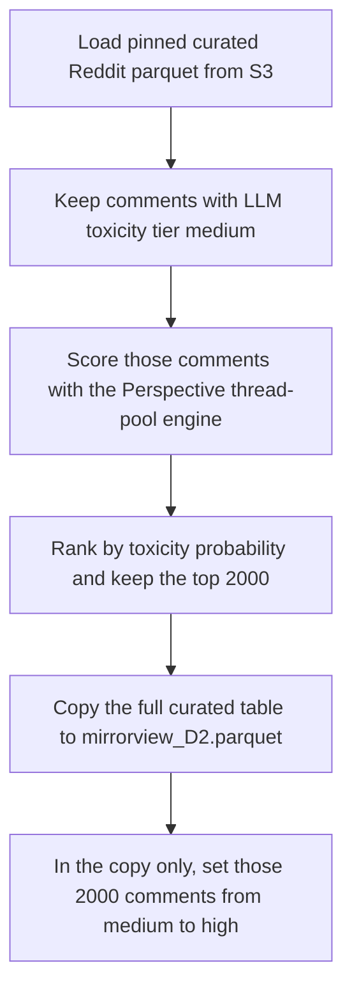

# Promote 2000 medium curated Reddit comments to high using Perspective scores

## Remember
- Exact file paths always
- Exact commands with expected output
- DRY, YAGNI, TDD, frequent commits
- Delegated tasks must be impossible to misread.

## Overview

Operators have a curated Reddit set of 43061 comments from the mixed-engine LLM campaign. 20727 of those comments have LLM toxicity tier medium. Operators score those medium comments with the Google Perspective API through the existing Perspective thread-pool engine. They rank the comments by toxicity probability, and they write a second curated file next to the original. In the second file, operators change the 2000 medium comments with the highest Perspective probabilities from medium to high. The original curated file stays unchanged.

## Happy flow

An operator runs one experiment command from a new folder under `experiments/`. The operator reads the pinned curated parquet from S3, and scores every comment whose LLM toxicity tier is medium. The operator writes the scores and the top 2000 ids in the experiment folder, and uploads a copy named `mirrorview_D2.parquet` into the same curated S3 folder.

## Approach

Operators treat the task as a one-off experiment, not a change to the product labeling pipeline. They reuse the existing Perspective thread-pool engine for scoring, and they do not change the product feature registry, the Reddit MirrorView filter file, or the original curated parquet.

Operators score the 20727 comments whose LLM toxicity tier is already medium. They do not send low or high comments to Perspective, because the second file only moves medium comments to high. They rank left and right comments together. The 2000 promotions are the highest Perspective scores among all medium comments, and they are not 2000 per stance.

Operators ignore Perspective's own low, medium, and high cutoffs. They keep the toxicity probability, and they use that probability only to rank comments.

If a run stops, the command resumes from comments that already have a saved score, so the same comment is not scored twice.

The pinned source file is `s3://mirrorview-experimental-artifacts/data_platform/data/reddit/reddit_3d8a2c41-9b17-4e6f-a5d0-8c1b2e4f6079/curated/2026_09_07-21:47:32/mirrorview.parquet`.

The new experiment folder is `experiments/reddit_curated_perspective_d2_2026_09_08/`.

The second curated file is written in the same S3 folder as the source file, at `s3://mirrorview-experimental-artifacts/data_platform/data/reddit/reddit_3d8a2c41-9b17-4e6f-a5d0-8c1b2e4f6079/curated/2026_09_07-21:47:32/mirrorview_D2.parquet`.

## Steps

### Step 1: Add the experiment folder and load the pinned curated file

Create `experiments/reddit_curated_perspective_d2_2026_09_08/` with a command that downloads the pinned curated parquet. The command checks that the file has 43061 rows and 20727 medium LLM-tier comments, and it does not write over that file.

### Step 2: Score medium comments with the Perspective thread-pool engine

Send the 20727 medium comments through the existing Perspective thread-pool engine. Save each comment's toxicity probability under the experiment folder. Ignore Perspective's tier. Resume from saved scores if the run is interrupted.

### Step 3: Write the D2 curated copy with 2000 promotions

Rank the scored medium comments by toxicity probability, highest first, and keep the top 2000. Copy the full original curated table to `mirrorview_D2.parquet` in the same S3 folder as `mirrorview.parquet`. In the copy only, set those 2000 comments' LLM toxicity tier from medium to high. Leave every other row and column unchanged. Write hashes and the new stance by toxicity counts into the experiment report.

## What "done" looks like

1. `experiments/reddit_curated_perspective_d2_2026_09_08/` exists with a runnable command, a short README, and a results report.
2. The original curated parquet is unchanged at its pinned S3 key and hash `1db34b0f6b5d4bab42e3a3a57306de0397e4478a3906f7aa75e9229bc58d804f`.
3. All 20727 medium comments have a saved Perspective toxicity probability.
4. Exactly 2000 of those comments are listed as promotions, chosen by highest probability. Ties at the cutoff keep the smaller `source_record_id` until the list has 2000 comments.
5. `mirrorview_D2.parquet` sits in the same curated S3 folder, has 43061 rows, and differs from the original only in those 2000 LLM toxicity tier values, which change from medium to high.
6. The product feature registry, `data_platform/curate/configs/reddit/mirrorview.yaml`, and the original curated metadata file are unchanged.
