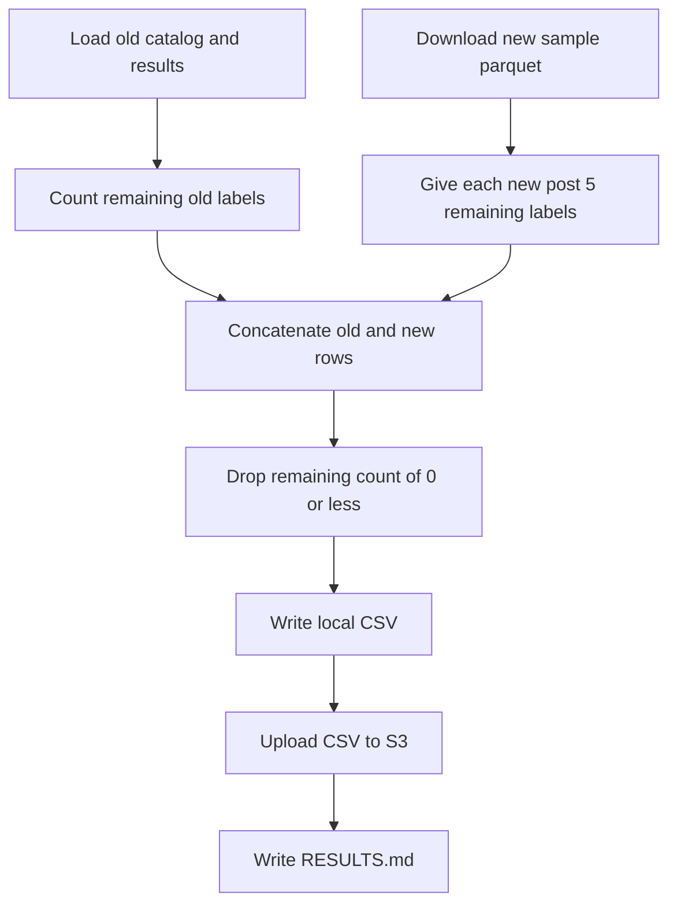

# Calculate remaining labels per stimulus post for the old catalog and the new sample

## Remember
- Exact file paths always
- Exact commands with expected output
- DRY, YAGNI, TDD, frequent commits
- Delegated tasks must be impossible to misread.

## Overview

Operators need 5 labels on every stimulus post for the next study round. The old catalog already has some labels from study phase 2 part 2. The new sample from pull request 267 has no labels yet. Operators write one table of remaining labels per post, and they drop posts that already have 5 or more labels. They upload that table to S3 and record totals in `RESULTS.md`.

## Happy flow

An operator runs one command from the repo root. The command loads the old catalog, the old results, and the new sample parquet. It computes remaining labels and writes a local CSV. It then uploads that CSV to S3 and writes `RESULTS.md`.

## Approach

Treat the work as a one-off experiment under `experiments/calculate_required_label_count_per_stimulus_post_2026_09_08/`. Load the old catalog and results through the shared data loader. Download the new sample from the filter experiment's parquet, and check that file's SHA-256 and row count. Put the number of required labels per post in `constants.py`. Do not add pytest. Do not change the old catalog, the results file, the new sample parquet, or product scripts.

## Decisions

- Create the experiment at `experiments/calculate_required_label_count_per_stimulus_post_2026_09_08/`. Put the number of required labels per post in `experiments/calculate_required_label_count_per_stimulus_post_2026_09_08/constants.py` and set it to 5.
- Old catalog is `shared/data/raw/study_phase_2_part_2/stimuli/flips.csv`, loaded as `STUDY_PHASE_2_PART_2_STIMULI`. The post id column is `post_primary_key`. The file has 10,000 unique ids.
- Old results are `shared/data/raw/study_phase_2_part_2/results/full.csv`, loaded as `STUDY_PHASE_2_PART_2_RESULTS_FULL`. Count how many times each catalog id appears in the `post_id` column. Empty `post_id` cells do not match. Do not filter by trial type, because a trial-type filter does not change the remaining counts for catalog ids.
- Remaining labels for an old post equal 5 minus that appearance count. Posts whose remaining count is 0 or less are dropped. On the current files, 8,889 old posts remain, and they need 27,528 labels. 1,111 old posts already have 5 or more labels and are dropped.
- New sample is `s3://mirrorview-experimental-artifacts/experiments/filter_posts_used_for_stimulus_dataset_2026_09_08/dataset.parquet`. The SHA-256 is `9788331f898aa27352dcdf32a962b5722aecc1da61a4638b7bbd77a404415ab9`. Expected row count is 10,200. The post id column is `record_id`. Every new post needs 5 labels, so the new batch needs 51,000 labels.
- Do not include study phase 2 part 1. Do not look up ids from the new sample in the old results file.
- If the same id appears in both batches, fail the run. The filter run dropped 0 previously used record ids, so no overlap is expected.
- Output columns are `id`, `number_of_times_to_label`, and `batch`. `batch` is `old` or `new`. Sort by `batch` with `old` first, then by `id`, so the CSV is stable.
- Upload to `s3://mirrorview-experimental-artifacts/experiments/calculate_required_label_count_per_stimulus_post_2026_09_08/required_label_count_per_stimulus_post.csv`. A second run must fail if the S3 key already exists.
- `run.py` is the caller. Load the old files through `shared/data/dataloader.py`. Reuse the download, cache, and hash check in `experiments/filter_posts_used_for_stimulus_dataset_2026_09_08/load_raw_candidate_dataset.py` for the new parquet, with this experiment's own SHA-256 and row count.
- Confirm the counts with the live command in Step 2. Do not add files under `tests/`. Do not add an experiment README in this work.

## Steps

### Step 1: Add the load, count, and upload command

Add the experiment modules and a `run.py` caller. Load both batches, compute remaining labels, write the local CSV, and upload it.

### Step 2: Run the command and write RESULTS.md

Run the command with AWS credentials. Confirm the local file and the S3 object, then commit `RESULTS.md` with the total remaining labels and the same total split by old and new.

## What "done" looks like

1. `experiments/calculate_required_label_count_per_stimulus_post_2026_09_08/` has `constants.py`, a runnable `run.py`, and the load, count, and write modules.
2. `constants.py` sets required labels per post to 5.
3. The CSV exists locally under that folder and at `s3://mirrorview-experimental-artifacts/experiments/calculate_required_label_count_per_stimulus_post_2026_09_08/required_label_count_per_stimulus_post.csv`.
4. The CSV has three columns, `id`, `number_of_times_to_label`, and `batch`, and every `number_of_times_to_label` value is greater than 0.
5. `RESULTS.md` records total remaining labels, remaining labels for the old batch, and remaining labels for the new batch.
6. On the current files, remaining labels total 78,528 overall, 27,528 old, and 51,000 new. The table has 19,089 rows, 8,889 old and 10,200 new.
7. The old catalog, the old results file, the new sample parquet, and product scripts are unchanged.
8. No pytest file was added or run.
