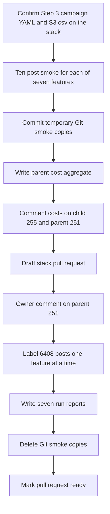

# Smoke seven Twitter LLM features, then label 6408 posts after owner sign-off

## Remember
- Exact file paths always
- Exact commands with expected output
- DRY, YAGNI, frequent commits
- Use only the approved smoke and runtime checks. Do not add or run automated tests.
- Delegated tasks must be impossible to misread.

## Overview

Operators need cost estimates for seven OpenAI features on the 2026-09-07 Twitter collection, then a pause for an owner comment on the parent issue, then labels for all 6,408 posts. This pull request holds documentation and run artifacts. Product Python stays unchanged.

## Happy flow

An operator runs a ten-post smoke for each feature on the primary campaign prefix, posts per-feature and aggregate cost, and leaves the stack pull request as a draft. After the owner comments on the parent issue, the same pull request labels all 6,408 posts, writes seven run reports, and deletes the temporary Git smoke copies.

## Approach

Run the existing Twitter smoke caller against the primary campaign smoke prefix. Do not add product code. Interrupt and resume only `is_news_or_opinion`. Keep the temporary Git copies until Phase B. Do not start the 6,408-post runs until the parent issue has an owner sign-off comment.

## Decisions

- Phase A runs in this round. Phase B stays in this same pull request and waits for an owner comment on [issue 251](https://github.com/METResearchGroup/mirrorView-task/issues/251). Merged child #254 is not permission for Phase B.
- Smoke Git copies live under `docs/plans/2026-09-08_twitter_llm_smoke_7c6e6a/reports/smoke/{feature}/`. Do not write into the 2026-09-07 epic plan folder or into `docs/plans/2026-09-07_generate_twitter_llm_features_e3c91a/`.
- Do not pass `--smoke-prefix`. Smoke objects go under each feature's primary `smoke/` prefix.
- Do not pass a new interrupt flag. Interrupt and resume runs only for `is_news_or_opinion`.
- Watcher `--once` is optional and prints markdown. It does not write to GitHub.
- Do not write the seven `*_run_report.md` files until Phase B.
- Do not add pytest. Do not commit parquet or csv label files.
- Changelog can wait until Phase B. A one-line Phase A note is optional.
- Stay on branch `cursor/epic-251-255-smoke-generate-seven-llm-8500`. Stack below is pull request 263.

## Locked identities

| Field | Value |
|-------|-------|
| Dataset id | `twitter_5901767a-e609-46fc-9a17-742516b548f2` |
| Preprocessed run | `2026_09_08-01:48:08` |
| Campaign id | `twitter_2026_09_08_014808_llm_features_v1` |
| Row count | 6408 posts |
| Model | `gpt-5.4-nano` on OpenAI Batch |
| Batch size | 2000 |

Feature order: `is_news_or_opinion`, `is_political`, `is_likely_spam`, `is_self_contained`, `is_structurally_complete`, `political_stance`, `llm_toxicity_tiered`.

## Steps

### Step 1: Confirm Step 3 tooling is on the stack

Read the smoke caller, campaign YAML, cost aggregate flag, and S3 csv on this GitHub stack branch. Stop if any of those files is missing, or if a production batch object already exists. See [steps/step1.md](steps/step1.md).

### Step 2: Run seven primary-prefix smokes and commit Git copies

Run `smoke_twitter_campaign.py` once per feature in YAML order, wait for each OpenAI Batch job, and commit the temporary Git copies. See [steps/step2.md](steps/step2.md).

### Step 3: Aggregate cost, post comments, verify S3, and open the draft pull request

Write `parent_cost_aggregate.json`, comment on issues 255 and 251, confirm smoke objects only on S3, and open the stacked pull request as a draft. See [steps/step3.md](steps/step3.md).

### Step 4: Label 6408 posts after parent owner sign-off

Do not start this step until issue 251 has an explicit owner comment signing off on Step 3, the seven smokes, and the aggregate cost. Then run production one feature at a time with batch size 2000. See [steps/step4.md](steps/step4.md).

### Step 5: Write run reports, delete Git smoke copies, and mark the pull request ready

Write seven permanent run reports, delete the temporary Git smoke copies, and mark the stack pull request ready. See [steps/step5.md](steps/step5.md).

## What "done" looks like

1. Seven ten-post smokes exist on the primary campaign prefix. Only `is_news_or_opinion` has `resume_evidence.json`. No `batches/part-*.parquet` object exists until Phase B.
2. Per-feature `estimated_full_run_usd_avg` and `estimated_full_run_usd_max` are commented on [issue 255](https://github.com/METResearchGroup/mirrorView-task/issues/255). The aggregate JSON is commented on [issue 251](https://github.com/METResearchGroup/mirrorView-task/issues/251) without editing that issue body. `full_run_row_count` is 6408.
3. The stack pull request stays draft through Phase A. Its body includes `Fixes #255` and `Part of #251`. It never uses a closing keyword on 251.
4. After owner sign-off, each feature has `final.parquet` with 6,408 unique `source_record_id` values.
5. Seven `reports/*_run_report.md` files remain in Git. Temporary Git smoke copies are gone. S3 smoke objects remain.
6. No product-code diff. No pytest added or run. Production did not start in Phase A.
