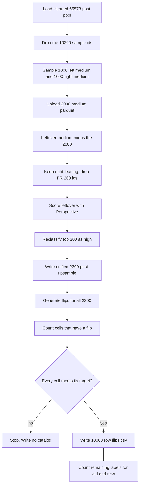

# Upsample medium posts, promote 300 leftover right-medium posts to high, and curate a 10,000 post catalog

## Remember
- Exact file paths always
- Exact commands with expected output
- DRY, YAGNI, TDD, frequent commits
- Delegated tasks must be impossible to misread.

## Overview

Issue 272 starts from the 10,200 post sample in pull request 267. Operators need 2,000 more unused medium toxicity posts, 1,000 left and 1,000 right. They then take the leftover medium posts and keep the right-leaning ones that are not in pull request 260. They score those posts with the Perspective API, and reclassify the 300 highest scores as high. The 2,000 medium posts and 300 right-high posts are one unified upsample of 2,300 posts. Operators generate flips for that unified set, then curate a 10,000 post catalog with 25 percent low, 50 percent medium, and 25 percent high toxicity and an even left and right split. They then count remaining labels for that catalog.

The cleaned pool has 1,062 right-leaning high toxicity posts, all already in the 10,200 post sample. Seven of those posts have no flip, so 1,055 remain. Adding 300 promoted right-high posts brings the cell to 1,355 if every new flip succeeds, which is enough for 1,250. The catalog command still stops if any cell is short.

## Happy flow

An operator samples 2,000 unused medium toxicity posts and writes them next to the 10,200 post sample. The operator then scores leftover right-medium posts with Perspective and reclassifies the top 300 as high. The operator writes one unified upsample of 2,300 posts, and generates flips for all 2,300 posts. Next, the operator counts posts that have both original text and a flip, and writes a 10,000 row catalog only if every cell meets its target. If the catalog is written, the operator counts remaining labels for the old catalog and the new catalog.

## Approach

Take the 2,000 medium upsample first, then build the Perspective candidate set from whatever medium posts remain. Do not reclassify a post that is already in the 10,200 post sample or in the 2,000 medium upsample, because those ids would then appear twice in the catalog pool. Reuse the load and cleanup from `experiments/filter_posts_used_for_stimulus_dataset_2026_09_08/`. Reuse the Perspective thread-pool path from `experiments/reddit_curated_perspective_v2_2026_09_08/`. Reuse `shared/flip_generation/generate_flips.py`. Reuse the remaining-label math from `experiments/calculate_required_label_count_per_stimulus_post_2026_09_08/`. Do not change product scripts. Do not add pytest. Do not overwrite the 10,200 post sample, the existing flips parquet, pull request 260 outputs, or the old remaining-label CSV.

## Decisions

- Create these folders:
  - `experiments/upsample_medium_toxicity_posts_2026_09_08/`
  - `experiments/upsample_right_leaning_high_toxicity_posts_2026_09_08/`
  - `experiments/generate_flips_for_upsampled_posts_2026_09_08/`
  - `experiments/curate_study_2_phase_3_stimuli/`
  - `experiments/calculate_v2_required_label_count_per_stimulus_post_2026_09_08/`
- The flips folder is `experiments/generate_flips_for_upsampled_posts_2026_09_08/`, not `experiments/generate_flips_for_upsampled_medium_toxicity_posts_2026_09_08/`. One folder generates flips for the 2,000 medium posts and the 300 promoted right-high posts.
- Combined source is `s3://mirrorview-experimental-artifacts/experiments/combine_data_into_stimulus_set_2026_09_08/dataset.parquet`, SHA-256 `f24ad1fd8c3709ffbbba9fb5dc953dcaee2f11ad8916ae21612b7f25cb5ca3f0`, 55,573 rows. The Reddit slice in that parquet already uses `mirrorview_v2.parquet` from pull request 260.
- Existing sample is `s3://mirrorview-experimental-artifacts/experiments/filter_posts_used_for_stimulus_dataset_2026_09_08/dataset.parquet`, SHA-256 `9788331f898aa27352dcdf32a962b5722aecc1da61a4638b7bbd77a404415ab9`, 10,200 rows.
- Existing flips are `s3://mirrorview-experimental-artifacts/experiments/generate_flips_2026_09_08/2026_09_08-20:31:31/flips.parquet`, SHA-256 `f3b791f226f8f69d3ddaf0737aab0a3aaf20ebb36d45a6d9b42dec8d1e148702`, 10,182 rows. Eighteen posts in the sample have no flip.
- Unused means a post that remains after the same cleanup as pull request 267, and whose id is not in the 10,200 post sample. After that filter, 15,203 left-medium posts and 3,865 right-medium posts remain. Sample 1,000 from each of those two leftover cells with seed 42, without replacement.
- Write the 2,000 medium posts to `s3://mirrorview-experimental-artifacts/experiments/filter_posts_used_for_stimulus_dataset_2026_09_08/upsample_2000_medium_toxicity_posts.parquet`. Issue 272 omitted the file extension. Use `.parquet` so the file matches `dataset.parquet` in the same folder. A second upload of that key must fail.
- Perspective candidates are cleaned medium posts whose id is not in the 10,200 sample, not in the 2,000 medium upsample, and whose `source_record_id` is not in `experiments/reddit_curated_perspective_v2_2026_09_08/outputs/promotion_source_record_ids.json`. Then keep `political_stance` equal to `right`. Expected leftover after dropping the 2,000 is 2,865 right-medium posts. Pull request 260 overlap in that leftover should be 0, because those 3,000 comments are already high in the combined parquet. Drop any match anyway. If fewer than 300 candidates remain, fail.
- Score every Perspective candidate with the product `is_toxic_tiered` thread-pool engine, batch size 64, concurrency 80. Keep `toxicity_prob`. Ignore Perspective's own tier. Resume from a local scores parquet. Rank by probability high to low, then by `record_id` low to high at a tie. Reclassify the top 300 as high. Do not change the 2,000 medium parquet.
- Write the 300 promoted rows to `s3://mirrorview-experimental-artifacts/experiments/upsample_right_leaning_high_toxicity_posts_2026_09_08/upsample_300_right_high_toxicity_posts.parquet`. Write the unified 2,300 post table, 2,000 medium plus 300 right-high, to `s3://mirrorview-experimental-artifacts/experiments/upsample_right_leaning_high_toxicity_posts_2026_09_08/unified_upsampled_posts.parquet`. A second upload of either key must fail. The unified table is the upsample used by flips, the catalog, and remaining-label v2.
- Generate flips only in `experiments/generate_flips_for_upsampled_posts_2026_09_08/`. Pin the unified parquet. Run a 10 post smoke under a `smoke` run id, then a full 2,300 post run with a new timestamp run id. Do not reuse the `smoke` run id for the full job.
- Write incremental parts under `s3://mirrorview-experimental-artifacts/experiments/generate_flips_for_upsampled_posts_2026_09_08/{run_id}/`. After the full run, also write the concatenated file to `s3://mirrorview-experimental-artifacts/experiments/generate_flips_2026_09_08/flips_unified_upsampled_posts.parquet`. A second upload of that named key must fail.
- Only posts with a successful flip may enter the catalog. After the existing 18 failures, the 10,200 post sample can supply these cells:

| political_stance | low | medium | high |
| ---------------- | --: | -----: | ---: |
| left | 1700 | 1697 | 1698 |
| right | 1696 | 2336 | 1055 |

- If all 300 new right-high flips succeed, right high becomes 1,355. Left medium becomes 1,697 plus 1,000, which is 2,697. Right medium becomes 2,336 plus 1,000, which is 3,336. The 300 promotions come from leftover after the 2,000, so they do not shrink the medium upsample.
- Catalog targets, with an even left and right split of 5,000 posts each:

| political_stance | low | medium | high | total |
| ---------------- | --: | -----: | ---: | ----: |
| left | 1250 | 2500 | 1250 | 5000 |
| right | 1250 | 2500 | 1250 | 5000 |
| total | 2500 | 5000 | 2500 | 10000 |

- If any cell is short of its target after the new flips land, the catalog command prints the available counts, exits non-zero, and writes no `flips.csv`. Do not start Step 5 until an owner comments on [issue 272](https://github.com/METResearchGroup/mirrorView-task/issues/272) with a new mix or a go-ahead.
- If every cell meets its target, write `experiments/curate_study_2_phase_3_stimuli/flips.csv` and upload it to `s3://mirrorview-experimental-artifacts/experiments/curate_study_2_phase_3_stimuli/flips.csv`. Use the same five columns as `shared/data/raw/study_phase_2_part_2/stimuli/flips.csv`. Map toxicity `low` to `sample_low_toxicity`, `medium` to `sample_middle_toxicity`, and `high` to `sample_high_toxicity`. Keep stance as `left` or `right`. Copy `record_id` into `post_primary_key`. Sample each cell with seed 42, without replacement. Sort by `post_primary_key`.
- Do not copy the new catalog into `shared/data/` or into the webapp. Do not add it to the dataset registry.
- Remaining-label v2 redoes pull request 271 with the new 10,000 row catalog as the new batch. Required labels per post stay at 5. The rater is still `prolific_id`. Do not include study phase 2 part 1. Do not look up new catalog ids in the old results file. If the same id appears in both batches, fail the run. Upload to `s3://mirrorview-experimental-artifacts/experiments/calculate_v2_required_label_count_per_stimulus_post_2026_09_08/required_label_count_per_stimulus_post.csv`. If the 10,000 row catalog is written, expected totals on the current old files are 8,899 old posts and 27,557 old labels, 10,000 new posts and 50,000 new labels, and 18,899 posts and 77,557 labels overall.
- Do not edit `experiments/filter_posts_used_for_stimulus_dataset_2026_09_08/README.md`, `experiments/calculate_required_label_count_per_stimulus_post_2026_09_08/README.md`, `experiments/reddit_curated_perspective_v2_2026_09_08/`, or `shared/flip_generation/`. Do not add files under `tests/`.
- Keep local parquet, CSV, cache, and Perspective score files out of git. Commit `README.md` and `RESULTS.md` in each experiment after that experiment's live run. Step 2 may also commit the 300 promotion ids as JSON.

## Steps

### Step 1: Sample 2,000 unused medium toxicity posts

Add `experiments/upsample_medium_toxicity_posts_2026_09_08/`. Load the pinned combined parquet and run the same cleanup as pull request 267. Drop ids from the 10,200 post sample, then sample 1,000 leftover left-medium posts and 1,000 leftover right-medium posts. Upload `upsample_2000_medium_toxicity_posts.parquet`. See [steps/step1.md](steps/step1.md).

### Step 2: Promote 300 leftover right-medium posts to high and write the unified upsample

Add `experiments/upsample_right_leaning_high_toxicity_posts_2026_09_08/`. Load the leftover medium posts after the 2,000 upsample, keep right-leaning rows, drop pull request 260 ids, score those rows with Perspective, reclassify the top 300 as high, and write the 300 row file plus the unified 2,300 post file. See [steps/step2.md](steps/step2.md).

### Step 3: Generate flips for the unified 2,300 posts

Add `experiments/generate_flips_for_upsampled_posts_2026_09_08/`. Pin the unified parquet from Step 2. Run a 10 post smoke, then generate flips for all 2,300 posts through the shared flip generator. Write the named concatenated parquet next to the existing flips experiment. See [steps/step3.md](steps/step3.md).

### Step 4: Count cells and write the 10,000 row catalog, or stop

Add `experiments/curate_study_2_phase_3_stimuli/`. Join the 10,200 post sample to its existing flips, and join the unified 2,300 posts to the new flips. Print the available counts for each stance by toxicity cell. If any cell is short of its target, exit non-zero and write no catalog. If every cell meets its target, sample the 10,000 row mix and write `flips.csv`. See [steps/step4.md](steps/step4.md).

### Step 5: Count remaining labels on the new catalog

Do not start this step until Step 4 has written the 10,000 row catalog. Add `experiments/calculate_v2_required_label_count_per_stimulus_post_2026_09_08/`. Count remaining labels for the old catalog and the new `flips.csv`, upload the CSV, and write `RESULTS.md`. See [steps/step5.md](steps/step5.md).

## What "done" looks like

1. `experiments/upsample_medium_toxicity_posts_2026_09_08/` has a README, a runnable `run.py`, and a `RESULTS.md` that records 1,000 left-medium posts and 1,000 right-medium posts. The parquet exists at `s3://mirrorview-experimental-artifacts/experiments/filter_posts_used_for_stimulus_dataset_2026_09_08/upsample_2000_medium_toxicity_posts.parquet`. None of those ids are in the 10,200 post sample.
2. `experiments/upsample_right_leaning_high_toxicity_posts_2026_09_08/` has a README, a runnable `run.py`, and a `RESULTS.md` that records 300 promotions, all right and all high. The 300 row parquet and the unified 2,300 post parquet exist on S3. The unified table has 2,000 medium posts and 300 right-high posts. None of the 2,300 ids are in the 10,200 post sample. None of the 300 ids are in the 2,000 medium parquet or in the pull request 260 promotion list.
3. `experiments/generate_flips_for_upsampled_posts_2026_09_08/` has a README, a runnable `run.py`, and a `RESULTS.md` that records smoke and full-run counts. Successful flips plus failures equal 2,300. The named parquet exists at `s3://mirrorview-experimental-artifacts/experiments/generate_flips_2026_09_08/flips_unified_upsampled_posts.parquet`.
4. The catalog command prints a stance by toxicity table of posts that have a flip. If any cell is still below its target, the command exits non-zero, `flips.csv` does not exist, and Step 5 has not run.
5. If every cell meets its target, `experiments/curate_study_2_phase_3_stimuli/flips.csv` has 10,000 rows, the catalog target counts, the five columns from the old catalog, and a copy on S3.
6. If the catalog exists, the v2 remaining-label CSV exists on S3, and `RESULTS.md` records 27,557 old labels and 50,000 new labels on the current old files.
7. The 10,200 post sample, the existing 10,182 row flips parquet, the old remaining-label CSV, pull request 260 files, `shared/data/raw/study_phase_2_part_2/`, product scripts, and `shared/flip_generation/` are unchanged. No pytest file was added or run.
