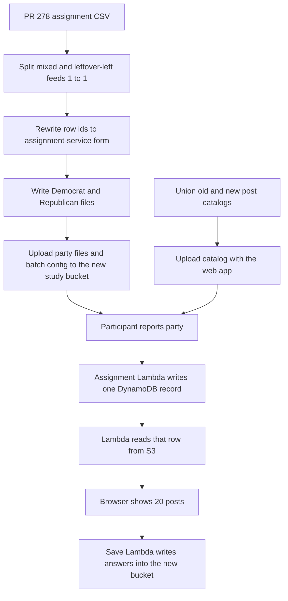

# Load the September 2026 study feeds into the assignment service and the new study bucket

## Remember
- Exact file paths always
- Exact commands with expected output
- DRY, YAGNI, TDD, frequent commits
- Delegated tasks must be impossible to misread.

## Overview

Pull request 278 wrote 3,879 twenty-post feeds. The rows have empty party fields and ids like `user-0001`, so the live assignment Lambda cannot look them up. Work in this repository converts that file, splits every feed kind 1 to 1 across Democrat and Republican rows, builds the post catalog the browser fetches, and creates the study bucket `jspsych-mirror-view-2026-09-09`. DynamoDB stays empty until a participant starts. The assignment-service repo only needs IAM read access on the new bucket, tracked in [study_participant_assignment_interface#17](https://github.com/METResearchGroup/study_participant_assignment_interface/issues/17).

## Happy flow

A participant opens the new study site, reports Democrat or Republican, and receives the next unused feed for that party. Their answers save into the new study bucket. A second visit with the same Prolific id returns the same feed.

## Approach

Convert the pull request 278 file in this repository. The running assignment Lambda already increments a counter, stores one user record, and reads the matching S3 row. New study iteration ids start at counter 0, so you do not seed feed rows into DynamoDB.

Split both feed kinds 1 to 1. Odd original user ids go to Democrats. Even original user ids go to Republicans. Each feed appears in one party file. 3,879 rows is odd, so Democrats get 1,940 rows and Republicans get 1,939. Mixed 10 and 10 feeds split 1,601 and 1,601. Leftover-left feeds split 339 and 338. In linked-fate, the participant still sees a right-leaning mirror next to each left original, so leftover-left rows still present both sides of text.

Create the September bucket with a one-off script in this repository, and leave the June bucket in Terraform. The same script points save-data writes at the new bucket. Assignment Lambda read access comes from [issue 17](https://github.com/METResearchGroup/study_participant_assignment_interface/issues/17), which adds the September ARN to the existing allowlist in that repo. Do not attach a second IAM policy from this repository onto `get_study_assignment-lambda`.

When a party's file has no unused rows, the next participant of that party gets an assignment error. `webapp/lambdas/lambda-get-post-assignments.mjs` sends `STUDY_ITERATION_ID` as `mirrorview_2026_09_09` even when the Prolific id is a manual test id, so a browser smoke run consumes a production assignment row. A CLI call may use `dev-mirrorview_2026_09_09` if you want a separate DynamoDB counter.

## Steps

### Step 1: Convert the pull request 278 file into party assignment files and a combined catalog

Read the pinned assignment CSV from experimental S3. Split odd original user ids to Democrats and even ids to Republicans. Rewrite each row id to the party, condition, and 1-based index the assignment Lambda generates at runtime. Write the two party files and a batch config that the running Lambda can parse. Build one catalog that contains every assigned post from the old June catalog and the new catalog, and fail if any assigned id is missing original text or mirror text. See [steps/step1.md](steps/step1.md).

### Step 2: Create the new study bucket and point save-data at it

With a one-off script, create `jspsych-mirror-view-2026-09-09`, turn on static website hosting and public read for the site, and leave the June bucket alone. Update the save-data Lambda environment and write policy so answers land in the new bucket. Skip Terraform apply in this repository for the new bucket name, because that apply would try to replace the June bucket. Assignment Lambda read access is [issue 17](https://github.com/METResearchGroup/study_participant_assignment_interface/issues/17), not this script. See [steps/step2.md](steps/step2.md).

### Step 3: Point this repo's web app at the new run

Add a job config for the September run. Copy those values into the hardcoded web app files, including study identity, the new catalog path, the new assignment batch location, and the save-data bucket. Upload new assignment-lookup Lambda code without an infra apply that would reset save-data to the June bucket. See [steps/step3.md](steps/step3.md).

### Step 4: Upload the batch, upload the site, and complete one manual run per party

Upload the converted assignment files and batch config into the new bucket. Upload the web app and catalog. After issue 17 is applied, open the site with a test Prolific id as Democrat and as Republican, confirm twenty trials load, confirm answers land in the new bucket, and confirm DynamoDB has one record per test id for `mirrorview_2026_09_09`. See [steps/step4.md](steps/step4.md).

## What "done" looks like

1. The pull request 278 feeds are partitioned 1 to 1 into Democrat and Republican assignment files, including leftover-left feeds, and each feed appears in one party file. The extra row goes to Democrats, 1,940 versus 1,939.
2. Row ids match the ids the assignment Lambda will generate when the counter for that party starts at 1.
3. The party files and the batch config exist in the new study bucket under a timestamped assignment prefix.
4. [Issue 17](https://github.com/METResearchGroup/study_participant_assignment_interface/issues/17) is applied, so the assignment Lambda can read the new bucket.
5. The browser catalog contains every assigned post id, with original text and mirror text.
6. The live site, the assignment lookup, and the save path all use the new bucket and study iteration `mirrorview_2026_09_09`.
7. DynamoDB has no preloaded feed rows. The first real participant creates the first user record and increments the party counter.
8. A manual Democrat run and a manual Republican run each complete and save.
9. The June study bucket and its data remain in place.
