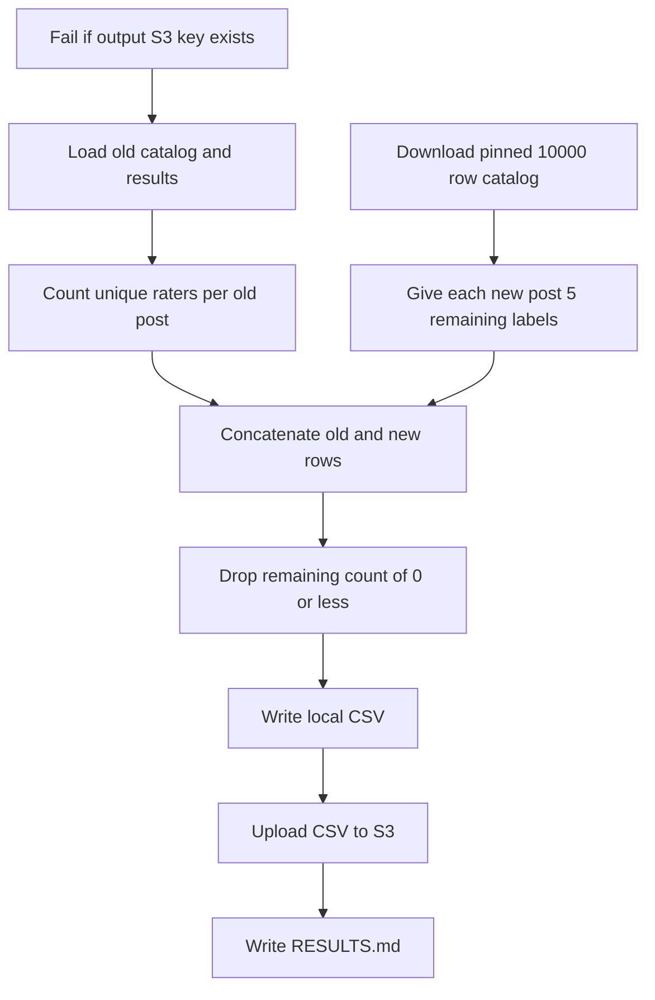

# Recalculate remaining labels for the old catalog and the pull request 273 catalog

## Remember
- Exact file paths always
- Exact commands with expected output
- DRY, YAGNI, TDD, frequent commits
- Delegated tasks must be impossible to misread.

## Overview

Issue 268 still needs remaining-label counts for the next study round. Pull request 271 counted the 10,200-post sample from pull request 267. Pull request 273 replaced that sample with a 10,000-post catalog. This experiment redoes pull request 271 against that catalog. The old catalog still uses unique Prolific raters. Every new catalog post needs 5 labels. Posts with 0 remaining labels are dropped.

## Happy flow

An operator runs one command. The command fails immediately if the output S3 key already exists. Otherwise it loads the old catalog, the old results, and the pinned 10,000-row catalog. It writes a local CSV, uploads that CSV once, and writes `RESULTS.md`.

## Approach

Treat this as a new dated experiment. Copy remaining-label math from `experiments/calculate_v2_required_label_count_per_stimulus_post_2026_09_08/` rather than importing it, so the v1 and v2 folders stay untouched. Fail before loading if the new S3 key exists. Do not add pytest. Do not overwrite the v1 CSV, the v2 CSV, or the 10,000-row catalog.

## Decisions

- Create `experiments/calculate_required_label_count_per_stimulus_post_2026_09_09/`. Set required labels per post to 5 in `constants.py`.
- Old catalog is `shared/data/raw/study_phase_2_part_2/stimuli/flips.csv`. Id column `post_primary_key`. 10,000 unique ids. Remaining labels equal 5 minus unique `prolific_id` values in `shared/data/raw/study_phase_2_part_2/results/full.csv`. Empty ids do not count. Two sessions by the same Prolific account count as one rater.
- New catalog is `s3://mirrorview-experimental-artifacts/experiments/curate_study_2_phase_3_stimuli/flips.csv`, SHA-256 `c90fdcf86e89e393f0de4cc34e1dc4e4bb2bd876405926ad654ff679f3ab4139`, 10,000 rows. Id column `post_primary_key`. Every new post gets 5 remaining labels. Do not look up new ids in the old results file.
- Do not include study phase 2 part 1. If the same id appears in both batches, fail the run.
- Output columns are `id`, `number_of_times_to_label`, and `batch`. Drop remaining counts of 0 or less. Sort by `batch` with `old` first, then by `id`.
- Upload to `s3://mirrorview-experimental-artifacts/experiments/calculate_required_label_count_per_stimulus_post_2026_09_09/required_label_count_per_stimulus_post.csv`. A second run must fail if that key exists, before any catalog download.
- On the current old files, remaining labels total 77,557 overall, 27,557 old on 8,899 posts, and 50,000 new on 10,000 posts. The table has 18,899 rows.
- Do not edit `experiments/calculate_required_label_count_per_stimulus_post_2026_09_08/`, `experiments/calculate_v2_required_label_count_per_stimulus_post_2026_09_08/`, `experiments/curate_study_2_phase_3_stimuli/`, or files under `tests/`.

## Steps

### Step 1: Add the load, count, and upload command

Add the experiment README, modules, and a `run.py` caller. Fail if the output key exists, load both batches, count remaining labels, write the local CSV, and upload it. See [steps/step1.md](steps/step1.md).

### Step 2: Run the command and write RESULTS.md

Run the command with AWS credentials. Confirm the local file and the S3 object, then commit `RESULTS.md`. See [steps/step2.md](steps/step2.md).

## What "done" looks like

1. `experiments/calculate_required_label_count_per_stimulus_post_2026_09_09/` has `README.md`, `constants.py`, a runnable `run.py`, and the load, count, and write modules.
2. `constants.py` sets required labels per post to 5.
3. The CSV exists locally under that folder and at `s3://mirrorview-experimental-artifacts/experiments/calculate_required_label_count_per_stimulus_post_2026_09_09/required_label_count_per_stimulus_post.csv`.
4. The CSV has columns `id`, `number_of_times_to_label`, and `batch`, and every remaining count is greater than 0.
5. `RESULTS.md` records total remaining labels and the same total split by old and new.
6. On the current files, remaining labels total 77,557 overall, 27,557 old, and 50,000 new. The table has 18,899 rows, 8,899 old and 10,000 new.
7. The v1 remaining-label CSV, the v2 remaining-label CSV, the 10,000-row catalog, the old catalog, and the old results file are unchanged.
8. No pytest file was added or run.
