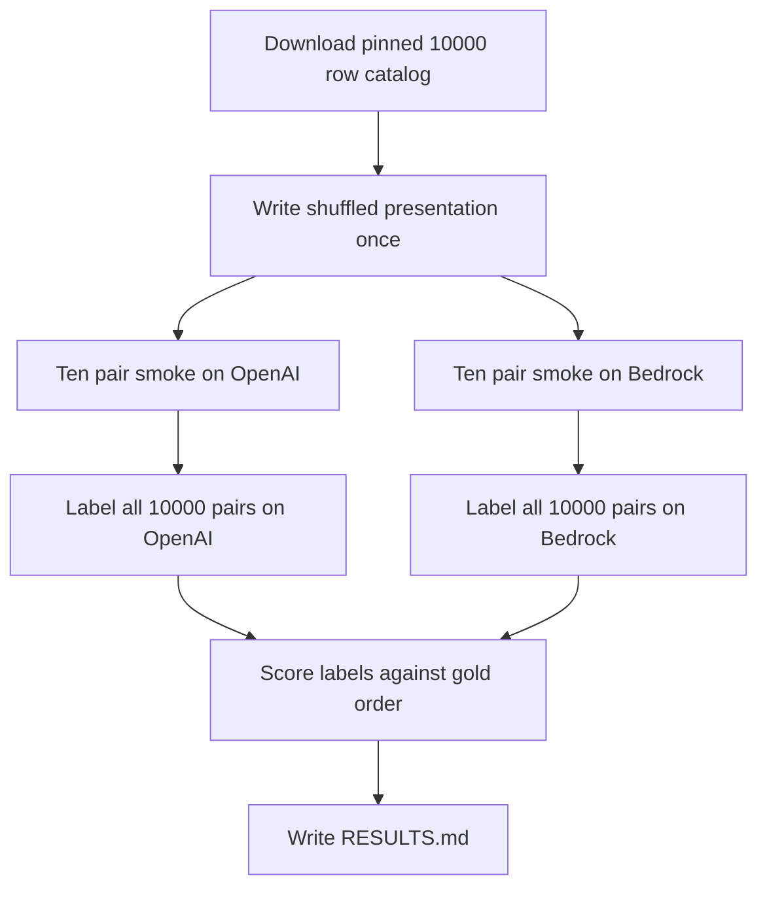

# Measure whether default OpenAI and Bedrock models can tell original posts from their mirrors

## Remember
- Exact file paths always
- Exact commands with expected output
- DRY, YAGNI, TDD, frequent commits
- Delegated tasks must be impossible to misread.

## Overview

Issue 280 asks whether original posts and their mirrors are separable by the default OpenAI model and the default Bedrock model. The input is the 10,000-row catalog from pull request 273. Each row has a human original post and an AI mirror. The catalog has 5,000 left posts and 5,000 right posts. Toxicity is 2,500 low, 5,000 medium, and 2,500 high. Operators need accuracy, precision, recall, and F1 for each model, and the same four scores inside each stance by toxicity cell.

## Happy flow

An operator writes one shuffled presentation of all 10,000 pairs, then sends that same presentation to OpenAI and to Bedrock. Each model returns which presented post is human, plus a one-sentence reason. When both engines have a final parquet, the operator scores those labels against the stored gold order and writes `RESULTS.md`.



## Approach

Put the work in a dated experiment folder, and reuse the OpenAI batch engine and the Bedrock Converse engine. Reuse the S3 parquet layout from campaign feature generation. Campaign feature generation writes part files, a manifest, a progress log, and a final parquet, and it resumes by skipping parts that already exist.

Do not reuse the mixed Reddit campaign runner. The Reddit runner retries Bedrock content-filter failures through OpenAI, and a mixed retry would put OpenAI labels into the Bedrock table.

Shuffle each pair once and store the gold presentation. Give both engines the same prompts. Do not add pytest. Do not change product feature code, flip generation, or the catalog.

## Decisions

- Create `experiments/test_separability_original_mirror_posts_2026_09_09/`. Required files are `README.md`, `constants.py`, `loader.py`, `run.py`, `openai_runner.py`, and `bedrock_runner.py`. `run.py` is the central runner that both engine runners call.
- Catalog is `s3://mirrorview-experimental-artifacts/experiments/curate_study_2_phase_3_stimuli/flips.csv`, SHA-256 `c90fdcf86e89e393f0de4cc34e1dc4e4bb2bd876405926ad654ff679f3ab4139`, 10,000 rows. A hash mismatch, a wrong row count, or duplicate `post_primary_key` values raise an error. Do not load `shared/data/raw/study_phase_2_part_2/stimuli/flips.csv`. The study phase 2 part 2 catalog has the same column names and 10,000 rows, but stance is 6,550 left and 3,450 right.
- Human text is `original_text`. AI text is `mirrored_text`. Stance is `sampled_stance` with values `left` and `right`. Toxicity is `sample_toxicity_type` with values `sample_low_toxicity`, `sample_middle_toxicity`, and `sample_high_toxicity`.
- Shuffle presentation order with seed 42. Store the gold order before any labeling, including which presented slot is human, the two texts in that order, the prompt text, stance, and toxicity. Upload that table to `s3://mirrorview-experimental-artifacts/experiments/test_separability_original_mirror_posts_2026_09_09/outputs/presentations.parquet`. The upload must fail if that key already exists, and it must fail before any model is called. Both engines load this file and do not shuffle again.
- The model output has two fields: which presented post is human, with values `first` or `second`, and `reason`, a single sentence. The prompt states that exactly one post is human and one is AI.
- OpenAI uses `gpt-5.4-nano`. Bedrock uses `us.amazon.nova-micro-v1:0` in `us-east-2`. Both model names are the product defaults in `lib/constants.py`.
- Store labels as parquet under `s3://mirrorview-experimental-artifacts/experiments/test_separability_original_mirror_posts_2026_09_09/outputs/labels/{openai,bedrock}/`, using the same objects as campaign feature generation: `batches/part-NNNNN.parquet`, `manifest.json`, `progress.jsonl`, `errors.jsonl`, and `final.parquet`. Local copies may exist under the same relative path in the experiment folder. Keep parquet out of git.
- Campaign part size is 2,000 rows, the campaign batch size in `data_platform/generate_features/platform_cli.py`. Ten thousand pairs become five parts, `part-00000` through `part-00004`. Resume by skipping parts already in the manifest. If `final.parquet` already exists for an engine, the command returns without labeling.
- OpenAI submits each 2,000-row part as one Batch API job. Bedrock labels each part with 8 concurrent Converse calls, the campaign thread count in `data_platform/generate_features/engines/bedrock_campaign.py`. The product Bedrock default allows 32 output tokens, which is enough for a short enum. A one-sentence reason needs more, so the experiment raises that limit to 256 tokens on its own Bedrock calls and does not change the product default.
- Do not send Bedrock content-filter failures to OpenAI. Record those ids in `errors.jsonl`. Score only rows that have a valid label. Report how many rows were scored and how many failed, overall and per cell.
- Positive class for precision, recall, and F1 is "the first presented post is human". If the scorer treated original as always human, precision would stay at 1 as long as the model sometimes picked original. Scoring the shuffled first slot keeps the positive class mixed, because shuffle assigns that slot to human on about half the rows. Accuracy is the share of pairs where the predicted slot matches the gold slot. Compute scores with scikit-learn, with zero division set to 0, the same way `experiments/finetune_qwen_model_2026_08_08/evaluate.py` does.
- Overall table rows are the two models. Columns are accuracy, precision, recall, and F1.
- Cell tables: one for OpenAI and one for Bedrock. Columns, in this order, are left+low, left+medium, left+high, right+low, right+medium, and right+high. Rows, in this order, are accuracy, recall, precision, and F1. Map `sample_low_toxicity` to low, `sample_middle_toxicity` to medium, and `sample_high_toxicity` to high.
- Smoke ten pairs per engine, the first ten ids in the presentation file after sorting by `post_primary_key`. Write smoke objects under each engine's `smoke/` prefix. Do not copy smoke rows into `final.parquet`. After both smokes write 10 labels, run the full 10,000-pair jobs.
- Do not edit `data_platform/`, `shared/flip_generation/`, `experiments/curate_study_2_phase_3_stimuli/`, or files under `tests/`. Do not overwrite the catalog S3 object. Do not add pytest.

## Steps

### Step 1: Add the experiment modules and write the shared presentation

Add the experiment README and modules. Download the pinned catalog, shuffle each original and mirror pair once, and upload the presentation parquet. Fail if that S3 key already exists. See [steps/step1.md](steps/step1.md).

### Step 2: Smoke ten pairs, then label all 10,000 pairs on both engines

Run a ten-pair smoke for OpenAI and for Bedrock. If each smoke writes 10 labels, label all 10,000 pairs on each engine into five parquet parts and a final parquet. See [steps/step2.md](steps/step2.md).

### Step 3: Score labels and write RESULTS.md

Join each engine's final parquet to the shared presentation. Write the overall table and the two cell tables into `experiments/test_separability_original_mirror_posts_2026_09_09/RESULTS.md`. See [steps/step3.md](steps/step3.md).

## What "done" looks like

1. `experiments/test_separability_original_mirror_posts_2026_09_09/` has `README.md`, `constants.py`, `loader.py`, `run.py`, `openai_runner.py`, and `bedrock_runner.py`.
2. The presentation parquet exists at `s3://mirrorview-experimental-artifacts/experiments/test_separability_original_mirror_posts_2026_09_09/outputs/presentations.parquet` and has 10,000 rows. A second upload of that key fails.
3. OpenAI smoke and Bedrock smoke each have 10 labels under that engine's `smoke/` prefix.
4. OpenAI labels exist at `s3://mirrorview-experimental-artifacts/experiments/test_separability_original_mirror_posts_2026_09_09/outputs/labels/openai/final.parquet`, with five part files of 2,000 rows. Bedrock labels exist at `s3://mirrorview-experimental-artifacts/experiments/test_separability_original_mirror_posts_2026_09_09/outputs/labels/bedrock/final.parquet`, with the same five part files.
5. `RESULTS.md` has one overall table for both models and two cell tables, OpenAI then Bedrock, with the column and row order listed in Decisions. Each table records how many rows were scored.
6. The catalog S3 object, product feature code, flip generation, and files under `tests/` are unchanged. No pytest file was added or run.

## Commands

Run these commands from the repo root. Export AWS keys from `LAB_AWS_ACCESS_KEY_ID` and `LAB_AWS_ACCESS_KEY_SECRET`. Set `OPENAI_API_KEY` before any OpenAI command.

```bash
export AWS_ACCESS_KEY_ID="$LAB_AWS_ACCESS_KEY_ID"
export AWS_SECRET_ACCESS_KEY="$LAB_AWS_ACCESS_KEY_SECRET"

PYTHONPATH=. uv run python experiments/test_separability_original_mirror_posts_2026_09_09/run.py --write-presentation
```

The command downloads the pinned catalog, writes 10,000 presentation rows, uploads the presentation parquet, and prints `wrote 10000 presentations`. A second run exits non-zero because the presentation key exists.

```bash
PYTHONPATH=. uv run python experiments/test_separability_original_mirror_posts_2026_09_09/run.py --engine openai --smoke
PYTHONPATH=. uv run python experiments/test_separability_original_mirror_posts_2026_09_09/run.py --engine bedrock --smoke
```

Each command writes 10 labels under that engine's `smoke/` prefix and prints `labeled 10 of 10`.

```bash
PYTHONPATH=. uv run python experiments/test_separability_original_mirror_posts_2026_09_09/run.py --engine openai
PYTHONPATH=. uv run python experiments/test_separability_original_mirror_posts_2026_09_09/run.py --engine bedrock
```

Each command writes `part-00000` through `part-00004` and `final.parquet`, and prints `labeled 10000`. If some rows were content-filtered, the printout is the scored count plus the failed count.

```bash
PYTHONPATH=. uv run python experiments/test_separability_original_mirror_posts_2026_09_09/run.py --score
```

The command prints the overall table and both cell tables, then writes `RESULTS.md`.
