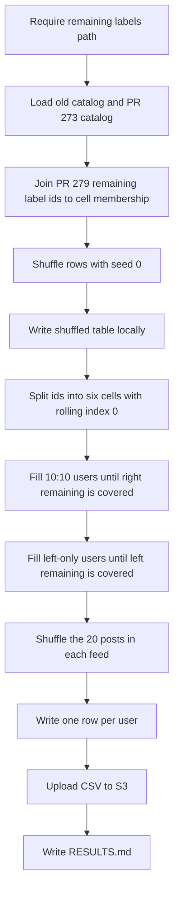

# Assign posts that still need labels to 20-post study feeds

## Remember
- Exact file paths always
- Exact commands with expected output
- DRY, YAGNI, TDD, frequent commits
- Delegated tasks must be impossible to misread.

## Overview

Issue 274 starts from the 10,000 post catalog in pull request 273 and the remaining labels CSV in pull request 279. Remaining labels total 77,557 across 8,899 old catalog posts and 10,000 new catalog posts. Left remaining is 45,542. Right remaining is 32,015. The new catalog is 25,000 left and 25,000 right. The leftover left skew comes from the old catalog.

Each user should see 20 posts. As many feeds as possible stay 10 left and 10 right. The rest are 20 left and 0 right, because only left posts still need labels after the 10:10 feeds have taken every remaining right label. On the pull request 279 file, 10:10 count is 3,202 and left-only count is 677. User count is 3,879 and post slots are 77,580. Extra labels are 23. Every remaining label is assigned.

## Happy flow

An operator passes the remaining labels file and runs one command from the repo root. The command joins remaining label ids to the old catalog and the pull request 273 catalog, and it shuffles the joined rows with seed 0. It writes the shuffled table locally. It fills 10:10 feeds first until remaining right labels are covered, then fills left-only feeds until remaining left labels are covered. After each feed has 20 posts, it shuffles the 20 posts in that feed. It writes one row per user in the study assignment batch layout, then uploads `study_user_assignments.csv` to S3.



## Approach

Keep 10:10 feeds for every user who can still take 10 right posts that need labels. Put leftover left remaining into left-only feeds, rather than 11:9 or 12:8 mixes. Cover every remaining label, so some cells get extra labels. Treat the work as one experiment under `experiments/generate_study_user_assignments_2026_09_08/`. Reuse the catalog download and S3 upload from `experiments/calculate_required_label_count_per_stimulus_post_2026_09_09/`. Do not change the catalogs, the remaining labels CSV, product scripts, or the assignment Lambda. Do not add pytest.

## Decisions

The 10:10 count, the left-only count, and the steal rule can be implemented more than one way, so pin them here.

- Create `experiments/generate_study_user_assignments_2026_09_08/`.
- Remaining labels are a required command-line path. If the operator omits the path, the command exits with an error that names `s3://mirrorview-experimental-artifacts/experiments/calculate_required_label_count_per_stimulus_post_2026_09_09/required_label_count_per_stimulus_post.csv`. The named URI is the file from pull request 279. When the operator passes that exact URI, check SHA-256 `188d627e8972d9b1ec5eb378814fd02fd588328df0a1ffc8603b0eba63d05c91`. When the operator passes any other local path or S3 URI, load it without that hash check.
- Remaining label columns are `id`, `number_of_times_to_label`, and `batch`. Fail if a column is missing, if an id repeats, or if any remaining count is less than 1. On the pull request 279 file, expected totals are 18,899 posts and 77,557 remaining labels. Old posts are 8,899 with 27,557 labels. New posts are 10,000 with 50,000 labels. Left remaining is 45,542. Right remaining is 32,015.
- Candidate posts are the remaining label ids. New ids join to the pull request 273 catalog at `s3://mirrorview-experimental-artifacts/experiments/curate_study_2_phase_3_stimuli/flips.csv`, SHA-256 `c90fdcf86e89e393f0de4cc34e1dc4e4bb2bd876405926ad654ff679f3ab4139`, 10,000 rows. Download that catalog with the same hash and row count check as `experiments/calculate_required_label_count_per_stimulus_post_2026_09_09/load.py`. Keep `post_primary_key`, `sampled_stance`, and `sample_toxicity_type`.
- Old remaining label ids join to `shared/data/raw/study_phase_2_part_2/stimuli/flips.csv`, loaded through `shared/data/dataloader.py`. Keep `post_primary_key`, `sampled_stance`, and `sample_toxicity_type`. Do not use the old catalog loader from the remaining labels experiment, because that loader returns only ids.
- Join each remaining label `id` to `post_primary_key` in the old catalog or the new catalog. Fail if an id is in neither catalog. Fail if an id is in both catalogs.
- Map cells from `sampled_stance` and `sample_toxicity_type`:
  - cell 1: left, `sample_low_toxicity`
  - cell 2: left, `sample_middle_toxicity`
  - cell 3: left, `sample_high_toxicity`
  - cell 4: right, `sample_low_toxicity`
  - cell 5: right, `sample_middle_toxicity`
  - cell 6: right, `sample_high_toxicity`
- Shuffle the joined rows with seed 0 before splitting by cell. Write `experiments/generate_study_user_assignments_2026_09_08/shuffled_stimuli.csv` locally. Keep the shuffled file out of git. After the split, each cell keeps the shuffled order and a rolling index that starts at 0.
- There are two feed kinds only. A 10:10 feed has 10 left posts and 10 right posts. A left-only feed has 20 left posts and 0 right posts. Do not write 11:9 or 12:8 feeds. Count 10:10 feeds as the ceiling of right remaining divided by 10. Count left-only feeds as the ceiling of leftover left remaining after those 10:10 feeds, divided by 20. Leftover left remaining equals left remaining minus 10 times the 10:10 count. On the pull request 279 file, 10:10 count is 3,202 and left-only count is 677. User count is 3,879. Post slots are 77,580. Extra labels are 23. Fill every 10:10 feed first, then every left-only feed. Do not write a partial user.
- Recipe 1 preferred counts, in cell order 1 through 6: 2, 5, 3, 2, 5, 3. Recipe 2 preferred counts: 3, 5, 2, 3, 5, 2. Odd 10:10 users use recipe 1 as the preferred split. Even 10:10 users use recipe 2. Left-only users use a doubled left half of the same recipes. Odd left-only users prefer 4, 10, 6 from cells 1, 2, 3. Even left-only users prefer 6, 10, 4 from cells 1, 2, 3. Preferred counts are a starting target, not a hard mix when remaining in a cell runs out.
- To take N posts from a cell, walk forward from the rolling index and wrap to 0 at the end of the list. Skip a post already in the current user's feed. Prefer a post whose remaining count is greater than 0. If the cell cannot fill N from posts that still need labels, take the shortfall from other cells in the same party that still need labels, in cell order. If the whole party has no remaining labels left, wrap and take posts whose remaining count is already 0, still on that party. If the party still cannot fill N, fail. After each assignment, subtract one from that post's remaining count. Remaining count may go below 0. Assignments that go below 0 are extra labels.
- A 10:10 feed never takes a right post in place of a left post, or a left post in place of a right post. Steal stays inside left cells 1 to 3, or inside right cells 4 to 6. A left-only feed never takes a right post. Toxicity may slip when a preferred cell is empty of remaining labels and another cell in the same party still has remaining labels. Party mix does not slip.
- After a feed has 20 posts, shuffle the 20 posts with a numpy generator whose seed is the user id. User ids start at 1. Write the shuffled order into `assigned_post_ids`.
- Output one row per user, matching the study assignment batch columns in `study_participant_assignment_interface` file `data/mirrorview/2026_04_03-09:36:03/democrat/training_assisted/assignments.csv`. Columns, in the following order: `id`, `assigned_post_ids`, `political_party`, `condition`, `created_at`. `id` is `user-0001` through `user-3879`. `assigned_post_ids` is a JSON list of 20 post ids. `political_party` is empty, because a feed is not tied to the participant's party. `condition` is `training_assisted`. `created_at` comes from `lib/timestamp_utils.py`. Sort by `id`. Users 1 through 3,202 are the 10:10 feeds. Users 3,203 through 3,879 are the left-only feeds. Do not upload this file to the study website assignment bucket.
- Upload to `s3://mirrorview-experimental-artifacts/experiments/generate_study_user_assignments_2026_09_08/study_user_assignments.csv`. Upload only if the key does not already exist, using the writer in `experiments/calculate_required_label_count_per_stimulus_post_2026_09_09/write.py`. A second run must raise `FileExistsError`.
- Live command, from the repo root:

```bash
export AWS_ACCESS_KEY_ID="$LAB_AWS_ACCESS_KEY_ID"
export AWS_SECRET_ACCESS_KEY="$LAB_AWS_ACCESS_KEY_SECRET"

PYTHONPATH=. uv run python experiments/generate_study_user_assignments_2026_09_08/run.py \
  --remaining-labels s3://mirrorview-experimental-artifacts/experiments/calculate_required_label_count_per_stimulus_post_2026_09_09/required_label_count_per_stimulus_post.csv
```

Expected stdout includes 10:10 count, left-only count, user count, assignment row count, assignment slot count, extra label count, unused remaining labels, the S3 URI, and the CSV SHA-256. A run with no remaining labels path exits non-zero and names the pull request 279 S3 URI.

- Write `experiments/generate_study_user_assignments_2026_09_08/README.md` in Step 1 with the algorithm, cell map, two feed kinds, preferred recipes, steal-within-party rule, wrap rule, extra label rule, in-feed shuffle, and stop rule. After the live run, add the final assignment row count, the 10:10 count, and the left-only count to that README.
- Do not edit `webapp/lambdas/lambda-get-post-assignments.mjs`, `shared/data/raw/study_phase_2_part_2/`, `experiments/curate_study_2_phase_3_stimuli/`, `experiments/calculate_v2_required_label_count_per_stimulus_post_2026_09_08/`, or `experiments/calculate_required_label_count_per_stimulus_post_2026_09_09/`. Do not add files under `tests/`.
- Keep local CSV and cache files out of git. Commit `README.md` and `RESULTS.md` after the live run. Add a `CHANGELOG.md` line with the live user count, the 10:10 count, the left-only count, and the extra label count.
- `RESULTS.md` records 10:10 count, left-only count, user count, assignment row count, assignment slots, extra label count, unused remaining labels by cell, SHA-256, and the S3 URI. On the pull request 279 file, unused remaining labels should be 0. Extra labels should be 23. Print a cell table of remaining labels versus assigned slots.

## Steps

### Step 1: Add the load, shuffle, assign, and upload command

Add the experiment README, modules, and a `run.py` caller. The command requires the remaining labels path, fills 10:10 feeds, then fills left-only feeds. It shuffles each feed and writes one row per user. It then uploads that file.

### Step 2: Run the command and write RESULTS.md

Run the live command in this plan with AWS credentials. Confirm the local file and the S3 object, then commit `RESULTS.md` with 10:10 count, left-only count, extra labels, unused remaining labels, and SHA-256. Add the assignment row count to the README and a `CHANGELOG.md` line.

## What "done" looks like

1. `experiments/generate_study_user_assignments_2026_09_08/` has `README.md`, a runnable `run.py`, and the load, assign, and write modules.
2. Running the command without a remaining labels path exits non-zero and names the pull request 279 S3 URI.
3. `experiments/generate_study_user_assignments_2026_09_08/shuffled_stimuli.csv` exists locally after a successful run and is gitignored.
4. `experiments/generate_study_user_assignments_2026_09_08/study_user_assignments.csv` exists locally and at `s3://mirrorview-experimental-artifacts/experiments/generate_study_user_assignments_2026_09_08/study_user_assignments.csv`.
5. The CSV has 3,879 rows, one per user. Each `assigned_post_ids` value is a JSON list of 20 post ids. Users 1 through 3,202 have 10 left posts and 10 right posts. Users 3,203 through 3,879 have 20 left posts and 0 right posts. No post appears twice in the same user's 20 posts.
6. Assignment slots total 77,580. Extra labels total 23. Unused remaining labels total 0. `RESULTS.md` records the 10:10 count, the left-only count, extra labels, and assigned slots by cell.
7. `README.md` describes the algorithm and records the final assignment row count, the 10:10 count, and the left-only count. `RESULTS.md` records user count, row count, extra labels, SHA-256, and the S3 URI.
8. The old catalog, the pull request 273 catalog, the pull request 279 remaining labels CSV, product scripts, and the assignment Lambda are unchanged. No pytest file was added or run.
