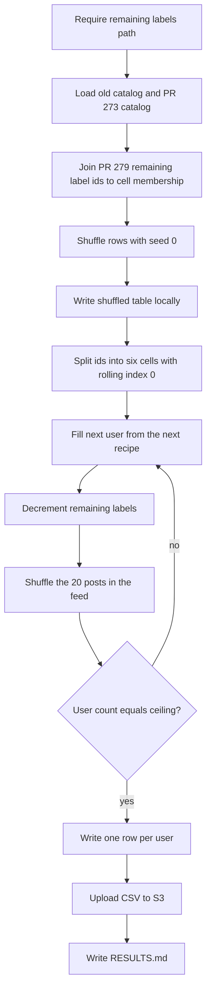

# Assign posts that still need labels to 20-post study feeds

## Remember
- Exact file paths always
- Exact commands with expected output
- DRY, YAGNI, TDD, frequent commits
- Delegated tasks must be impossible to misread.

## Overview

Issue 274 starts from the 10,000 post catalog in pull request 273 and the remaining labels CSV in pull request 279. Remaining labels total 77,557 across 8,899 old catalog posts and 10,000 new catalog posts. Each user should see 20 posts, and party is always 10 left and 10 right. Toxicity across a user on recipe 1 and a user on recipe 2 averages the 1:2:1 mix. Operators fill feeds from the six party and toxicity cells using two alternating recipes. User count is the ceiling of remaining labels divided by 20. On the pull request 279 file, user count is 3,878 and post slots are 77,560. Three slots are extra labels.

## Happy flow

Because the mix rules apply per feed, an operator passes the remaining labels file and runs one command from the repo root. The command joins remaining label ids to the old catalog and the pull request 273 catalog, and it shuffles the joined rows with seed 0. It writes the shuffled table locally. It then walks the six cells with a rolling index and the two recipes until 3,878 users are filled. After each feed has 20 posts, it shuffles the 20 posts in that feed. It writes one row per user in the study assignment batch layout, then uploads `study_user_assignments.csv` to S3.



## Approach

The work is one operator command, so keep it in `experiments/generate_study_user_assignments_2026_09_08/`. Reuse the catalog download and S3 upload from `experiments/calculate_required_label_count_per_stimulus_post_2026_09_09/`. Load the old catalog through `shared/data/dataloader.py`. Do not change the catalogs, the remaining labels CSV, product scripts, or the assignment Lambda. Do not add pytest.

## Decisions

The ceiling user count and the assignment row layout can be implemented more than one way, so pin them here.

- Create `experiments/generate_study_user_assignments_2026_09_08/`.
- Remaining labels are a required command-line path. If the operator omits the path, the command exits with an error that names `s3://mirrorview-experimental-artifacts/experiments/calculate_required_label_count_per_stimulus_post_2026_09_09/required_label_count_per_stimulus_post.csv`. The named URI is the file from pull request 279. When the operator passes that exact URI, check SHA-256 `188d627e8972d9b1ec5eb378814fd02fd588328df0a1ffc8603b0eba63d05c91`. When the operator passes any other local path or S3 URI, load it without that hash check.
- Remaining label columns are `id`, `number_of_times_to_label`, and `batch`. Fail if a column is missing, if an id repeats, or if any remaining count is less than 1. On the pull request 279 file, expected totals are 18,899 posts and 77,557 remaining labels. Old posts are 8,899 with 27,557 labels. New posts are 10,000 with 50,000 labels.
- Candidate posts are the remaining label ids. New ids join to the pull request 273 catalog at `s3://mirrorview-experimental-artifacts/experiments/curate_study_2_phase_3_stimuli/flips.csv`, SHA-256 `c90fdcf86e89e393f0de4cc34e1dc4e4bb2bd876405926ad654ff679f3ab4139`, 10,000 rows. Download that catalog with the same hash and row count check as `experiments/calculate_required_label_count_per_stimulus_post_2026_09_09/load.py`. Keep `post_primary_key`, `sampled_stance`, and `sample_toxicity_type`.
- Old remaining label ids join to `shared/data/raw/study_phase_2_part_2/stimuli/flips.csv`, loaded through `shared/data/dataloader.py`. Keep `post_primary_key`, `sampled_stance`, and `sample_toxicity_type`. Do not use the old catalog loader from the remaining labels experiment, because that loader returns only ids.
- Join each remaining label `id` to `post_primary_key` in the old catalog or the new catalog. Fail if an id is in neither catalog. Fail if an id is in both catalogs.
- Map cells from `sampled_stance` and `sample_toxicity_type`:
  - cell 1: left, `sample_low_toxicity`
  - cell 2: left, `sample_middle_toxicity`
  - cell 3: left, `sample_high_toxicity`
  - cell 4: right, `sample_low_toxicity`
  - cell 5: right, `sample_middle_toxicity`
  - cell 6: right, `sample_high_toxicity`
- Shuffle the joined rows with seed 0 before splitting by cell. Write `experiments/generate_study_user_assignments_2026_09_08/shuffled_stimuli.csv` locally. Keep the shuffled file out of git. After the split, each cell keeps the shuffled order and a rolling index that starts at 0.
- Recipe 1 takes the following counts, in cell order 1 through 6: 2, 5, 3, 2, 5, 3. Recipe 2 takes 3, 5, 2, 3, 5, 2. Both recipes sum to 20 posts, 10 left and 10 right. Recipe 1 is 4 low, 10 medium, and 6 high. Recipe 2 is 6 low, 10 medium, and 4 high. Odd user numbers use recipe 1. Even user numbers use recipe 2. Every written feed is 10:10. Do not use an 11:9 split.
- User count is the ceiling of remaining labels divided by 20. On the pull request 279 file, user count is 3,878 and post slots are 77,560. Three slots are extra labels. Fill that many complete 20-post feeds, then stop. Do not write a partial user.
- To take N posts from a cell, walk forward from the rolling index and wrap to 0 at the end of the list. Skip a post already in the current user's feed. Prefer a post whose remaining count is greater than 0. If the cell cannot fill N from posts that still need labels, wrap and take posts whose remaining count is already 0. The feed stays 10:10. If the cell still cannot fill N, fail. Collect N posts, then set the rolling index to the position after the last taken post. After each assignment, subtract one from that post's remaining count. Remaining count may go below 0. Assignments that go below 0 are extra labels.
- After a feed has 20 posts, shuffle the 20 posts with a numpy generator whose seed is the user id. User ids start at 1. Write the shuffled order into `assigned_post_ids`.
- Output one row per user, matching the study assignment batch columns in `study_participant_assignment_interface` file `data/mirrorview/2026_04_03-09:36:03/democrat/training_assisted/assignments.csv`. Columns, in the following order: `id`, `assigned_post_ids`, `political_party`, `condition`, `created_at`. `id` is `user-0001` through `user-3878`. `assigned_post_ids` is a JSON list of 20 post ids. `political_party` is empty, because a feed is not tied to the participant's party. `condition` is `training_assisted`. `created_at` comes from `lib/timestamp_utils.py`. Sort by `id`. Do not upload this file to the study website assignment bucket.
- Upload to `s3://mirrorview-experimental-artifacts/experiments/generate_study_user_assignments_2026_09_08/study_user_assignments.csv`. Upload only if the key does not already exist, using the writer in `experiments/calculate_required_label_count_per_stimulus_post_2026_09_09/write.py`. A second run must raise `FileExistsError`.
- Live command, from the repo root:

```bash
export AWS_ACCESS_KEY_ID="$LAB_AWS_ACCESS_KEY_ID"
export AWS_SECRET_ACCESS_KEY="$LAB_AWS_ACCESS_KEY_SECRET"

PYTHONPATH=. uv run python experiments/generate_study_user_assignments_2026_09_08/run.py \
  --remaining-labels s3://mirrorview-experimental-artifacts/experiments/calculate_required_label_count_per_stimulus_post_2026_09_09/required_label_count_per_stimulus_post.csv
```

Expected stdout includes user count, assignment row count, assignment slot count, extra label count, unused remaining labels, the S3 URI, and the CSV SHA-256. A run with no remaining labels path exits non-zero and names the pull request 279 S3 URI.

- Write `experiments/generate_study_user_assignments_2026_09_08/README.md` in Step 1 with the algorithm, cell map, recipes, wrap rule, ceiling user count, extra label rule, in-feed shuffle, and stop rule. After the live run, add the final assignment row count to that README.
- Do not edit `webapp/lambdas/lambda-get-post-assignments.mjs`, `shared/data/raw/study_phase_2_part_2/`, `experiments/curate_study_2_phase_3_stimuli/`, `experiments/calculate_v2_required_label_count_per_stimulus_post_2026_09_08/`, or `experiments/calculate_required_label_count_per_stimulus_post_2026_09_09/`. Do not add files under `tests/`.
- Keep local CSV and cache files out of git. Commit `README.md` and `RESULTS.md` after the live run. Add a `CHANGELOG.md` line with the live user count and the extra label count.
- `RESULTS.md` records user count, assignment row count, assignment slots, extra label count, unused remaining labels by cell if any remain, SHA-256, and the S3 URI. If a cell still has unused remaining labels after 3,878 users, because remaining in that cell exceeded the recipe slot count, print the unused counts in `RESULTS.md` and on stdout.

## Steps

### Step 1: Add the load, shuffle, assign, and upload command

Add the experiment README, modules, and a `run.py` caller. The command requires the remaining labels path and fills 3,878 users from the two recipes. It shuffles each feed and writes one row per user. It then uploads that file.

### Step 2: Run the command and write RESULTS.md

Run the live command in this plan with AWS credentials. Confirm the local file and the S3 object, then commit `RESULTS.md` with user count, assignment row count, extra labels, unused remaining labels, and SHA-256. Add the assignment row count to the README and a `CHANGELOG.md` line.

## What "done" looks like

1. `experiments/generate_study_user_assignments_2026_09_08/` has `README.md`, a runnable `run.py`, and the load, assign, and write modules.
2. Running the command without a remaining labels path exits non-zero and names the pull request 279 S3 URI.
3. `experiments/generate_study_user_assignments_2026_09_08/shuffled_stimuli.csv` exists locally after a successful run and is gitignored.
4. `experiments/generate_study_user_assignments_2026_09_08/study_user_assignments.csv` exists locally and at `s3://mirrorview-experimental-artifacts/experiments/generate_study_user_assignments_2026_09_08/study_user_assignments.csv`.
5. The CSV has 3,878 rows, one per user. Each `assigned_post_ids` value is a JSON list of 20 post ids. Party per feed is 10 left and 10 right. No post appears twice in the same user's 20 posts.
6. Assignment slots total 77,560. Extra labels total 3 when every remaining label is consumed. `RESULTS.md` records extra labels and any unused remaining labels by cell.
7. `README.md` describes the algorithm and records the final assignment row count. `RESULTS.md` records user count, row count, extra labels, SHA-256, and the S3 URI.
8. The old catalog, the pull request 273 catalog, the pull request 279 remaining labels CSV, product scripts, and the assignment Lambda are unchanged. No pytest file was added or run.
