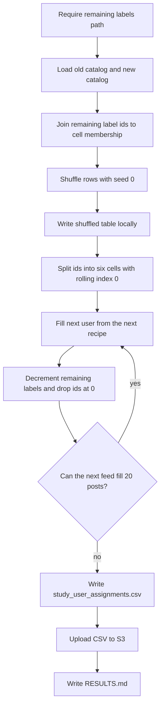

# Assign posts that still need labels to 20-post study feeds

## Remember
- Exact file paths always
- Exact commands with expected output
- DRY, YAGNI, TDD, frequent commits
- Delegated tasks must be impossible to misread.

## Overview

Issue 274 starts from pull request 273. Operators have a 10,000 post catalog and a CSV of remaining labels that also includes 8,899 old catalog posts. Each user should see 20 posts. Toxicity across a user on recipe 1 and a user on recipe 2 averages the 1:2:1 mix, and the party split is 10 left and 10 right. Operators fill each feed from the six party and toxicity cells using two alternating recipes. They stop when remaining labels cannot fill another complete 20-post feed.

## Happy flow

Because the mix rules apply per feed, an operator passes the remaining labels file and runs one command from the repo root. The command joins the remaining label rows to the old and new catalogs, and it shuffles the joined rows with seed 0. It writes the shuffled table locally. It then walks the six cells with a rolling index and the two recipes, and it subtracts one remaining label for each assigned post. It writes `study_user_assignments.csv` locally and uploads that file to S3.



## Approach

The work is one operator command, so keep it in `experiments/generate_study_user_assignments_2026_09_08/`. Reuse the new catalog download and S3 upload from `experiments/calculate_v2_required_label_count_per_stimulus_post_2026_09_08/`. Load the old catalog through `shared/data/dataloader.py`. Do not change the catalogs, the remaining labels CSV, product scripts, or the assignment Lambda. Do not add pytest.

## Decisions

The recipes and the stop rule can be implemented more than one way, so pin them here.

- Create `experiments/generate_study_user_assignments_2026_09_08/`.
- Remaining labels are a required command-line path. If the operator omits the path, the command exits with an error that names `s3://mirrorview-experimental-artifacts/experiments/calculate_v2_required_label_count_per_stimulus_post_2026_09_08/required_label_count_per_stimulus_post.csv`. The named URI is the file from pull request 273. When the operator passes that exact URI, check SHA-256 `188d627e8972d9b1ec5eb378814fd02fd588328df0a1ffc8603b0eba63d05c91`. When the operator passes any other local path or S3 URI, load it without that hash check.
- Remaining label columns are `id`, `number_of_times_to_label`, and `batch`. Fail if a column is missing, if an id repeats, or if any remaining count is less than 1.
- New catalog is `s3://mirrorview-experimental-artifacts/experiments/curate_study_2_phase_3_stimuli/flips.csv`, SHA-256 `c90fdcf86e89e393f0de4cc34e1dc4e4bb2bd876405926ad654ff679f3ab4139`, 10,000 rows. Download it with the same hash and row count check as `experiments/calculate_v2_required_label_count_per_stimulus_post_2026_09_08/load.py`. Keep `post_primary_key`, `sampled_stance`, and `sample_toxicity_type`.
- Old catalog is `shared/data/raw/study_phase_2_part_2/stimuli/flips.csv`, loaded through `shared/data/dataloader.py`. Keep `post_primary_key`, `sampled_stance`, and `sample_toxicity_type`. Do not use the old catalog loader from the v2 remaining labels experiment, because that loader returns only ids.
- Join each remaining label `id` to `post_primary_key` in the old catalog or the new catalog. Fail if an id is in neither catalog. Fail if an id is in both catalogs.
- Map cells from `sampled_stance` and `sample_toxicity_type`:
  - cell 1: left, `sample_low_toxicity`
  - cell 2: left, `sample_middle_toxicity`
  - cell 3: left, `sample_high_toxicity`
  - cell 4: right, `sample_low_toxicity`
  - cell 5: right, `sample_middle_toxicity`
  - cell 6: right, `sample_high_toxicity`
- Shuffle the joined rows with seed 0 before splitting by cell. Write `experiments/generate_study_user_assignments_2026_09_08/shuffled_stimuli.csv` locally. Keep the shuffled file out of git. After the split, each cell keeps the shuffled order and a rolling index that starts at 0.
- Recipe 1 takes the following counts, in cell order 1 through 6: 2, 5, 3, 2, 5, 3. Recipe 2 takes 3, 5, 2, 3, 5, 2. Both recipes sum to 20 posts, 10 left and 10 right. Recipe 1 is 4 low, 10 medium, and 6 high. Recipe 2 is 6 low, 10 medium, and 4 high. Odd user numbers use recipe 1. Even user numbers use recipe 2.
- To take N posts from a cell, walk forward from the rolling index and wrap to 0 at the end of the list. Skip a post whose remaining count is 0. Skip a post already in the current user's feed. Collect N posts, then set the rolling index to the position after the last taken post. After each assignment, subtract one from that post's remaining count. When the count hits 0, drop the post from remaining counts. Leave the id in the cell list so a later wrap can skip it.
- Stop when remaining counts are empty at the start of a user, or when the next feed cannot fill 20 posts. Do not write a partial user. If a cell is exactly one eligible post short of its recipe count, take one post from the cell with the same toxicity and the other party. Party then becomes 11:9 or 9:11. If a cell is more than one short, or a second replacement from the other party would move the split further than 11:9, stop. Toxicity counts stay as the recipe specified. Leftover remaining labels are expected when the operator passes the pull request 273 remaining labels URI, because 77,557 is not divisible by 20.
- Output columns, in the following order: `user_id`, `post_slot`, `post_id`, `cell`, `recipe`, `sampled_stance`, `sample_toxicity_type`, `batch`. `user_id` starts at 1. `post_slot` starts at 0 and follows the order filled from cells 1 through 6. `recipe` is 1 or 2. `cell` is `cell_1` through `cell_6`. Sort by `user_id`, then `post_slot`. Do not shuffle posts inside a user's feed.
- Upload to `s3://mirrorview-experimental-artifacts/experiments/generate_study_user_assignments_2026_09_08/study_user_assignments.csv`. Upload only if the key does not already exist, using the writer in `experiments/calculate_v2_required_label_count_per_stimulus_post_2026_09_08/write.py`. A second run must raise `FileExistsError`.
- Live command, from the repo root:

```bash
export AWS_ACCESS_KEY_ID="$LAB_AWS_ACCESS_KEY_ID"
export AWS_SECRET_ACCESS_KEY="$LAB_AWS_ACCESS_KEY_SECRET"

PYTHONPATH=. uv run python experiments/generate_study_user_assignments_2026_09_08/run.py \
  --remaining-labels s3://mirrorview-experimental-artifacts/experiments/calculate_v2_required_label_count_per_stimulus_post_2026_09_08/required_label_count_per_stimulus_post.csv
```

Expected stdout includes `user_count`, `assignment_rows`, `leftover_labels`, `s3_uri`, and `csv_sha256`. A run with no remaining labels path exits non-zero and names the v2 S3 URI.

- Write `experiments/generate_study_user_assignments_2026_09_08/README.md` in Step 1 with the algorithm, cell map, recipes, wrap rule, 11:9 rule, and stop rule. After the live run, add the final assignment row count to that README.
- Do not upload to the study website assignment bucket. Do not edit `webapp/lambdas/lambda-get-post-assignments.mjs`, `shared/data/raw/study_phase_2_part_2/`, `experiments/curate_study_2_phase_3_stimuli/`, or `experiments/calculate_v2_required_label_count_per_stimulus_post_2026_09_08/`. Do not add files under `tests/`.
- Keep local CSV and cache files out of git. Commit `README.md` and `RESULTS.md` after the live run. Add a `CHANGELOG.md` line with the live user count and leftover remaining labels.

## Steps

### Step 1: Add the load, shuffle, assign, and upload command

Add the experiment README, modules, and a `run.py` caller. The command requires the remaining labels path and fills users from the two recipes. It writes the local CSV and uploads that file.

### Step 2: Run the command and write RESULTS.md

Run the live command in this plan with AWS credentials. Confirm the local file and the S3 object, then commit `RESULTS.md` with user count, assignment row count, leftover remaining labels, and SHA-256. Add the assignment row count to the README and a `CHANGELOG.md` line.

## What "done" looks like

1. `experiments/generate_study_user_assignments_2026_09_08/` has `README.md`, a runnable `run.py`, and the load, assign, and write modules.
2. Running the command without a remaining labels path exits non-zero and names the v2 S3 URI.
3. `experiments/generate_study_user_assignments_2026_09_08/shuffled_stimuli.csv` exists locally after a successful run and is gitignored.
4. `experiments/generate_study_user_assignments_2026_09_08/study_user_assignments.csv` exists locally and at `s3://mirrorview-experimental-artifacts/experiments/generate_study_user_assignments_2026_09_08/study_user_assignments.csv`.
5. Each written user has exactly 20 posts. Party per user is 10:10, 11:9, or 9:11. No post appears twice in the same user's 20 posts.
6. Each assignment row subtracts one from that post's remaining count. A post whose input remaining count is 5 appears in 5 feeds. `RESULTS.md` records leftover remaining labels after the last complete feed.
7. `README.md` describes the algorithm and records the final assignment row count. `RESULTS.md` records user count, row count, leftover remaining labels, SHA-256, and the S3 URI.
8. The old catalog, the new catalog, the v2 remaining labels CSV, product scripts, and the assignment Lambda are unchanged. No pytest file was added or run.
