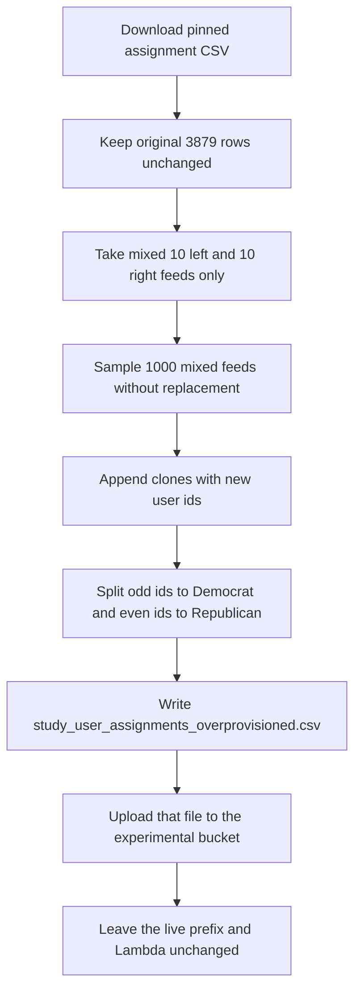

# Write an overprovisioned assignment CSV without replacing the live study files

## Remember
- Exact file paths always
- Exact commands with expected output
- DRY, YAGNI, TDD, frequent commits
- Delegated tasks must be impossible to misread.

## Overview

The assignment service assigns a feed when a participant starts, not when they finish. Pull request 283 loaded 3879 feeds, which is about the number of people you want to finish. If you recruit 3879 people, some never finish. You then run out of feeds before you have about 3800 completions. [Issue 287](https://github.com/METResearchGroup/mirrorView-task/issues/287) is that gap.

You can recruit about 4000 starters if you have unused assignment rows for dropouts. Adding 1000 extra mixed 10 left and 10 right feeds brings the total to 4879 rows, 2440 Democrat and 2439 Republican. 4879 is the agreed total.

Participants are still starting against the live prefix, so replacing the live assignment files would race with in-flight claims. You write a sibling file named `study_user_assignments_overprovisioned.csv` and upload the object to the experimental bucket. The live prefix, the lookup Lambda, the job YAML, and DynamoDB stay as they are.

## Happy flow

A new participant still claims the next unused party index on the live prefix. Dropouts still consume an index. The overprovisioned CSV is in the experimental bucket until you choose to load it later, after recruitment has settled.

An operator clones 1000 existing mixed feeds and appends them after the original 3879 rows. The operator then writes `study_user_assignments_overprovisioned.csv` locally and uploads it under the experiment prefix. Returning participants still read the old prefix from DynamoDB.



## Approach

Overprovision by adding unused assignment rows, because the assignment service spends one row at claim time. Clone 1000 existing mixed feeds. Do not build new posts, and do not replay remaining-label fills. Append the clones after the original 3879 rows so extras are used only after the original party rows are claimed.

The live prefix, DynamoDB counters, study iteration id, lookup Lambda, and job YAML stay unchanged. Nothing in this work is uploaded to `jspsych-mirror-view-2026-09-09`.

## Decisions

- The unit that must grow is the assignment CSV row count, not the stimulus post catalog. One CSV row is one starter. Completions can be lower than that count. Live rows today are 3879. Recruiting about 4000 starters requires at least 4000 rows. Adding 1000 extra mixed rows makes 4879 total, and 4879 is OK. Recruiting 4000 people still leaves spare rows.
- Create `experiments/upsample_mixed_study_feeds_2026_09_11/`. Do not edit `experiments/generate_study_user_assignments_2026_09_08/` or `experiments/load_study_assignments_2026_09_09/`. The README files in those folders are agent read-only. Import from them.
- Do not change the 10,000 row stimulus catalog, the old June catalog, or `img/flips_2026_09_09.csv`. Cloned feeds reuse posts that are already in the assigned catalog from pull request 283.
- Source file is `s3://mirrorview-experimental-artifacts/experiments/generate_study_user_assignments_2026_09_08/study_user_assignments.csv`, SHA-256 `e42f4dffbe55bed2c9d2c4dae6829de7508ffefef6564d095b3458d9599752ce`. Load it with `load_source_assignments` from `experiments/load_study_assignments_2026_09_09/load.py`. Copy all 3879 source rows unchanged. Do not rewrite their `assigned_post_ids` or `created_at`.
- Mixed feeds are the 3202 rows whose catalog stance split is 10 left and 10 right. Users 1 through 3202 are that mixed block on the pinned file. Leftover-left feeds are users 3203 through 3879. Sample only mixed feeds. Fail if a leftover-left feed is sampled. Fail if a sampled feed is not 10 left and 10 right.
- Sample 1000 mixed feeds without replacement with `numpy.random.Generator(numpy.random.PCG64(0))`. Fail if fewer than 1000 mixed feeds exist. The 1000 source user ids must be unique.
- Extra user ids are 3880 through 4879. Reuse `shuffle_feed` from `experiments/generate_study_user_assignments_2026_09_08/assign.py` so each clone keeps the same 20 posts and gets a new order seeded by the new user id. User 3880 is even, so Republican. User 3881 is odd, so Democrat. Extra Democrat count is 500. Extra Republican count is 500.
- Total feeds are 4879. Democrat rows are 2440. Republican rows are 2439. Leftover-left counts stay 339 Democrat and 338 Republican. Mixed counts become 2101 Democrat and 2101 Republican.
- Split with `split_by_party` and `rewrite_ids` from `experiments/load_study_assignments_2026_09_09/split.py`. Extras are at the end of each party file. Democrat extras are `democrat-training_assisted-1941` through `democrat-training_assisted-2440`. Republican extras are `republican-training_assisted-1940` through `republican-training_assisted-2439`. The first 1940 Democrat rows and the first 1939 Republican rows must match the live files at `s3://jspsych-mirror-view-2026-09-09/precomputed_assignments/2026_09_09-23:06:02/` when you compare them read-only.
- Stance checks use the assigned catalog from pull request 283. Load old rows with `load_old_catalog_rows` and new rows with `load_new_catalog_rows`. Fail if a cloned post id is missing original text or mirror text. Do not upload a new website catalog.
- Write the expanded source CSV locally as `experiments/upsample_mixed_study_feeds_2026_09_11/study_user_assignments_overprovisioned.csv`. If you also write party files for split checks, name them `assignments_overprovisioned.csv`. Upload only the source overprovisioned CSV.
- Upload the overprovisioned CSV to `s3://mirrorview-experimental-artifacts/experiments/upsample_mixed_study_feeds_2026_09_11/study_user_assignments_overprovisioned.csv` with `put_new`. A second upload of that key must raise `FileExistsError`. Do not write `study_user_assignments.csv` under this experiment prefix.
- Do not overwrite `s3://jspsych-mirror-view-2026-09-09/precomputed_assignments/2026_09_09-23:06:02/`. DynamoDB already stores that prefix on returning users. Do not upload a new timestamped prefix under `jspsych-mirror-view-2026-09-09`. Do not change `jobs/config/mirrorview_2026_09_09.yaml`. Do not change `webapp/lambdas/lambda-get-post-assignments.mjs`. Do not run `aws lambda update-function-code`. Do not run `terraform apply`. Do not reset DynamoDB tables `user_assignments` or `study_assignment_counter`. Do not run `get_study_assignment` against production or the `dev-mirrorview_2026_09_09` iteration as part of this work.
- Local `config.yaml` cell counts must be 2440 Democrat and 2439 Republican if you write that file for a parse check. `s3.bucket` may still name `jspsych-mirror-view-2026-09-09` as the future study bucket, but you do not upload `config.yaml` in this work. `name` stays `mirrorview_2026_09_09`. `input_posts_path` points at `experiments/upsample_mixed_study_feeds_2026_09_11/batch/catalog.csv`.
- Put pytest files under `experiments/upsample_mixed_study_feeds_2026_09_11/tests/`. Do not add files under the repo-root `tests/` folder. Tests use in-memory assignment rows and do not download S3. Tests must fail if a leftover-left feed is cloned. Tests must fail if sampling uses replacement. Tests must fail if the original 3879 rows change.
- Live command, from the repo root:

```bash
export AWS_ACCESS_KEY_ID="$LAB_AWS_ACCESS_KEY_ID"
export AWS_SECRET_ACCESS_KEY="$LAB_AWS_ACCESS_KEY_SECRET"

PYTHONPATH=. uv run python experiments/upsample_mixed_study_feeds_2026_09_11/run.py
```

Expected stdout includes `base_users=3879`, `mixed_source=3202`, `cloned_feeds=1000`, `user_count=4879`, `democrat_rows=2440`, `republican_rows=2439`, `assignment_slots=97580`, the experimental S3 URI ending in `study_user_assignments_overprovisioned.csv`, and `csv_sha256=`.

- Write `experiments/upsample_mixed_study_feeds_2026_09_11/README.md` in Step 1 with the clone count, the mixed-only rule, the append rule, the old-prefix rule, the overprovisioned filename, the pytest command, and the live command. After the live run, add the experimental S3 URI and the party row counts to that README. Do not add a production `batch_uri`.
- Keep local CSV and cache files out of git. Commit `README.md` and `RESULTS.md` after the live run. Add a `CHANGELOG.md` line with 4879 feeds, 2440 Democrat rows, 2439 Republican rows, and the overprovisioned S3 object. The changelog line must say the live prefix was not replaced.

## Steps

### Step 1: Add the command that writes 1000 extra mixed assignment rows

Add the experiment README, modules, pytest files, and a `run.py` caller. The command copies the original 3879 rows, clones 1000 mixed feeds, appends them as new assignment ids, splits by party, and writes a local overprovisioned CSV. Tests prove mixed-only sampling and original-row identity on in-memory tables before any S3 upload. See [steps/step1.md](steps/step1.md).

### Step 2: Generate the overprovisioned CSV and upload it beside the live files

Run the pytest command from Step 1, then run the live command. Confirm the first 3879 source rows match pull request 278, upload `study_user_assignments_overprovisioned.csv` to the experimental bucket, prove the live study prefix is unchanged, and commit `RESULTS.md`. See [steps/step2.md](steps/step2.md).

## What "done" looks like

1. `experiments/upsample_mixed_study_feeds_2026_09_11/` has `README.md`, a runnable `run.py`, the upsample, split, write, and upload modules, and pytest files under `tests/`.
2. The overprovisioned source CSV has 4879 assignment rows, which is enough to recruit about 4000 starters without running out. Users 1 through 3879 match pull request 278. Users 3880 through 4879 are extra mixed 10 left and 10 right feeds cloned from unique source user ids.
3. Democrat assignment rows are 2440. Republican assignment rows are 2439. Leftover-left counts stay 339 and 338. Extra mixed rows are 500 per party, at the end of each file.
4. The stimulus post catalog is unchanged. `s3://mirrorview-experimental-artifacts/experiments/upsample_mixed_study_feeds_2026_09_11/study_user_assignments_overprovisioned.csv` exists. The live prefix `2026_09_09-23:06:02` still exists and is unchanged.
5. `jobs/config/mirrorview_2026_09_09.yaml` and `webapp/lambdas/lambda-get-post-assignments.mjs` still point at `s3://jspsych-mirror-view-2026-09-09/precomputed_assignments/2026_09_09-23:06:02`. No new study-bucket prefix was uploaded.
6. `PYTHONPATH=. uv run pytest experiments/upsample_mixed_study_feeds_2026_09_11/tests -q` exits 0. DynamoDB counters are unchanged. The original generator, the load experiment, the catalogs, Terraform, and the assignment-service repo are unchanged. No files were added under the repo-root `tests/` folder.
