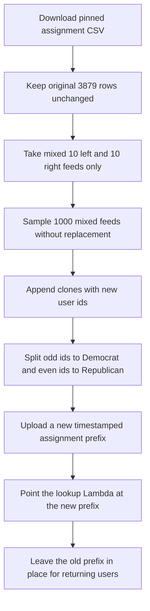

# Overprovision mixed study feeds so dropouts do not stop recruitment

## Remember
- Exact file paths always
- Exact commands with expected output
- DRY, YAGNI, TDD, frequent commits
- Delegated tasks must be impossible to misread.

## Overview

The September run assigns a feed when a participant starts, not when they finish. Pull request 283 loaded 3879 feeds, which is about the number of people you want to finish. If you recruit 3879 people and some never finish, you run out of feeds before you have about 3800 completions. [Issue 287](https://github.com/METResearchGroup/mirrorView-task/issues/287) is that gap. This work adds 1000 extra mixed 10 left and 10 right feeds so you can recruit about 4000 starters, and still have spare rows if more people start and drop. After the change there are 4879 feeds, 2440 Democrat and 2439 Republican, at a new S3 prefix. The live prefix and DynamoDB counters stay as they are.

## Happy flow

A new participant still claims the next unused party index. Dropouts still consume an index. With 4879 rows on disk, recruiting about 4000 people does not hit the end of the party file. An operator produces those extra rows by cloning 1000 existing mixed feeds, appending them to the party files, uploading a new timestamped prefix, and pointing the lookup Lambda at that prefix. Returning participants still read the old prefix from DynamoDB.



## Approach

Overprovision by adding unused assignment rows, because the assignment service spends one row at claim time. Clone 1000 existing mixed feeds rather than building new posts or replaying remaining-label fills. Append those clones after the original 3879 rows so extras are used only after the original party rows are claimed. Do not overwrite the live prefix. Do not reset DynamoDB counters. Do not change the study iteration id.

## Decisions

- The unit that must grow is the assignment CSV row count, not the stimulus post catalog. One CSV row is one starter. Completions can be lower than that count. Live rows today are 3879. Recruiting about 4000 starters requires at least 4000 rows. This plan adds 1000 extra mixed rows, for 4879 total, so 4000 recruits still leave spare rows.
- Create `experiments/upsample_mixed_study_feeds_2026_09_11/`. Do not edit `experiments/generate_study_user_assignments_2026_09_08/` or `experiments/load_study_assignments_2026_09_09/`. Those README files are agent read-only. Import from them.
- Do not change the 10,000 row stimulus catalog, the old June catalog, or `img/flips_2026_09_09.csv`. Cloned feeds reuse posts that are already in the assigned catalog from pull request 283.
- Source file is `s3://mirrorview-experimental-artifacts/experiments/generate_study_user_assignments_2026_09_08/study_user_assignments.csv`, SHA-256 `e42f4dffbe55bed2c9d2c4dae6829de7508ffefef6564d095b3458d9599752ce`. Load it with `load_source_assignments` from `experiments/load_study_assignments_2026_09_09/load.py`. Copy all 3879 source rows unchanged. Do not rewrite their `assigned_post_ids` or `created_at`.
- Mixed feeds are the 3202 rows whose catalog stance split is 10 left and 10 right. Users 1 through 3202 are that mixed block on the pinned file. Leftover-left feeds are users 3203 through 3879. Sample only mixed feeds. Fail if a leftover-left feed is sampled. Fail if a sampled feed is not 10 left and 10 right.
- Sample 1000 mixed feeds without replacement with `numpy.random.Generator(numpy.random.PCG64(0))`. Fail if fewer than 1000 mixed feeds exist. The 1000 source user ids must be unique.
- Extra user ids are 3880 through 4879. Reuse `shuffle_feed` from `experiments/generate_study_user_assignments_2026_09_08/assign.py` so each clone keeps the same 20 posts and gets a new order seeded by the new user id. User 3880 is even, so Republican. User 3881 is odd, so Democrat. Extra Democrat count is 500. Extra Republican count is 500.
- Total feeds are 4879. Democrat rows are 2440. Republican rows are 2439. Leftover-left counts stay 339 Democrat and 338 Republican. Mixed counts become 2101 Democrat and 2101 Republican.
- Split with `split_by_party` and `rewrite_ids` from `experiments/load_study_assignments_2026_09_09/split.py`. Extras are at the end of each party file. Democrat extras are `democrat-training_assisted-1941` through `democrat-training_assisted-2440`. Republican extras are `republican-training_assisted-1940` through `republican-training_assisted-2439`. The first 1940 Democrat rows and the first 1939 Republican rows must match the live files at `s3://jspsych-mirror-view-2026-09-09/precomputed_assignments/2026_09_09-23:06:02/`.
- Stance checks use the assigned catalog from pull request 283. Load old rows with `load_old_catalog_rows` and new rows with `load_new_catalog_rows`. Fail if a cloned post id is missing original text or mirror text. Do not upload a new website catalog.
- Upload the expanded source CSV to `s3://mirrorview-experimental-artifacts/experiments/upsample_mixed_study_feeds_2026_09_11/study_user_assignments.csv` with `put_new`. A second upload of that key must raise `FileExistsError`.
- Do not overwrite `s3://jspsych-mirror-view-2026-09-09/precomputed_assignments/2026_09_09-23:06:02/`. DynamoDB already stores that prefix on returning users. Upload a new timestamp from `lib/timestamp_utils.py` `get_current_timestamp`, using the same three keys as `experiments/load_study_assignments_2026_09_09/upload.py`.
- `config.yaml` cell counts must be 2440 Democrat and 2439 Republican. `s3.bucket` stays `jspsych-mirror-view-2026-09-09`. `s3.prefix` stays `precomputed_assignments`. `name` stays `mirrorview_2026_09_09`. `input_posts_path` points at `experiments/upsample_mixed_study_feeds_2026_09_11/batch/catalog.csv`.
- After upload, put the new `batch_uri` into `jobs/config/mirrorview_2026_09_09.yaml` and into `webapp/lambdas/lambda-get-post-assignments.mjs` `SEPTEMBER_BATCH_URI`. Zip that file as `index.mjs` and run `aws lambda update-function-code` for `jspsych-scroll-get-post-assignments`. Do not run `terraform apply`. Do not change `study.iteration_id`. Do not reset DynamoDB tables `user_assignments` or `study_assignment_counter`.
- Put pytest files under `experiments/upsample_mixed_study_feeds_2026_09_11/tests/`. Do not add files under the repo-root `tests/` folder. Tests use in-memory assignment rows and do not download S3. Tests must fail if a leftover-left feed is cloned. Tests must fail if sampling uses replacement. Tests must fail if the original 3879 rows change.
- Live command, from the repo root:

```bash
export AWS_ACCESS_KEY_ID="$LAB_AWS_ACCESS_KEY_ID"
export AWS_SECRET_ACCESS_KEY="$LAB_AWS_ACCESS_KEY_SECRET"

PYTHONPATH=. uv run python experiments/upsample_mixed_study_feeds_2026_09_11/run.py
```

Expected stdout includes `base_users=3879`, `mixed_source=3202`, `cloned_feeds=1000`, `user_count=4879`, `democrat_rows=2440`, `republican_rows=2439`, `assignment_slots=97580`, the experimental S3 URI, and `csv_sha256=`.

- Write `experiments/upsample_mixed_study_feeds_2026_09_11/README.md` in Step 1 with the clone count, the mixed-only rule, the append rule, the old-prefix rule, the pytest command, and the live command. After the live run, add the new `batch_uri` and the party row counts to that README.
- Keep local CSV and cache files out of git. Commit `README.md` and `RESULTS.md` after the live run. Add a `CHANGELOG.md` line with 4879 feeds, 2440 Democrat rows, 2439 Republican rows, and the new prefix.

## Steps

### Step 1: Add the command that writes 1000 extra mixed assignment rows

Add the experiment README, modules, pytest files, and a `run.py` caller. The command copies the original 3879 rows, clones 1000 mixed feeds, appends them as new assignment ids, splits by party, and writes a local batch tree. Tests prove mixed-only sampling and original-row identity on in-memory tables before any S3 upload. See [steps/step1.md](steps/step1.md).

### Step 2: Upload the new assignment prefix and point the lookup Lambda at it

Run the pytest command from Step 1, then run the live command. Confirm the first 3879 source rows match pull request 278, upload a new study-bucket prefix, update the job YAML and lookup Lambda, and prove a returning participant still receives the same 20 posts. See [steps/step2.md](steps/step2.md).

## What "done" looks like

1. `experiments/upsample_mixed_study_feeds_2026_09_11/` has `README.md`, a runnable `run.py`, the upsample, split, write, and upload modules, and pytest files under `tests/`.
2. The expanded source CSV has 4879 assignment rows, which is enough to recruit about 4000 starters without running out. Users 1 through 3879 match pull request 278. Users 3880 through 4879 are extra mixed 10 left and 10 right feeds cloned from unique source user ids.
3. Democrat assignment rows are 2440. Republican assignment rows are 2439. Leftover-left counts stay 339 and 338. Extra mixed rows are 500 per party, at the end of each file.
4. The stimulus post catalog is unchanged. `s3://mirrorview-experimental-artifacts/experiments/upsample_mixed_study_feeds_2026_09_11/study_user_assignments.csv` exists. The live prefix `2026_09_09-23:06:02` still exists and is unchanged.
5. A new `s3://jspsych-mirror-view-2026-09-09/precomputed_assignments/<timestamp>/` prefix holds `config.yaml` and the two party files. `jobs/config/mirrorview_2026_09_09.yaml` and `webapp/lambdas/lambda-get-post-assignments.mjs` point at that prefix. The lookup Lambda code is updated.
6. A returning September participant still receives the same assignment id and the same 20 posts. A new `dev-mirrorview_2026_09_09` participant receives 20 posts from the new files.
7. `PYTHONPATH=. uv run pytest experiments/upsample_mixed_study_feeds_2026_09_11/tests -q` exits 0. DynamoDB counters are unchanged except for the one new dev-iteration smoke user. The original generator, the load experiment, the catalogs, Terraform, and the assignment-service repo are unchanged. No files were added under the repo-root `tests/` folder.
