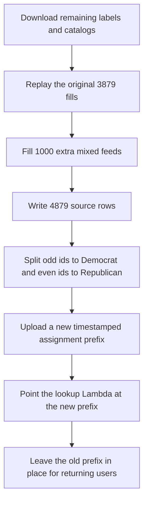

# Add 1000 extra study assignment rows so dropouts do not exhaust the September feeds

## Remember
- Exact file paths always
- Exact commands with expected output
- DRY, YAGNI, TDD, frequent commits
- Delegated tasks must be impossible to misread.

## Overview

[Issue 287](https://github.com/METResearchGroup/mirrorView-task/issues/287) asks for about 1000 extra assignment rows, because a participant who starts or claims the study still consumes a counter even if they never finish. The issue text says there are about 10,000 assigned feeds. That number is the 10,000 post catalog, not the feed count. Pull request 278 wrote 3879 feeds. Pull request 283 split those feeds into 1940 Democrat rows and 1939 Republican rows at `s3://jspsych-mirror-view-2026-09-09/precomputed_assignments/2026_09_09-23:06:02`. This plan adds 1000 mixed feeds on top of those 3879, for a total of 4879 feeds, 2440 Democrat and 2439 Republican.

## Happy flow

An operator runs one command that replays the original 3879 fills, then writes 1000 more feeds with 10 left posts and 10 right posts. The command splits the extra rows with the same odd and even party rule, and it keeps the original 1940 Democrat rows and 1939 Republican rows unchanged. It uploads a new timestamped prefix in the September study bucket, and it points the lookup Lambda at that prefix. Returning participants still read the old prefix from DynamoDB. New participants receive the next unused index from the new files.



## Approach

Treat extra rows as a dropout allowance, not as a second remaining-label pass. Keep the original 3879 feeds identical, and append 1000 mixed 10 left and 10 right feeds after them, so extras are consumed only after the original party rows are claimed. Reuse the September fill loop, the odd and even party split, and the timestamped upload. Do not overwrite the live prefix. Do not reset DynamoDB counters. Do not change the study iteration id.

## Decisions

The issue leaves the extra mix and the live file switch open, so pin them here.

- Create `experiments/expand_study_user_assignments_2026_09_11/`. Do not edit `experiments/generate_study_user_assignments_2026_09_08/` or `experiments/load_study_assignments_2026_09_09/`. Those README files are agent read-only. Import from them.
- Live feed count is 3879, not about 10,000. Add exactly 1000 extra feeds. Total feeds are 4879.
- Extra feeds are mixed 10 left and 10 right. Do not write leftover-left extras. Leftover-left existed only to cover remaining left labels. Remaining labels are already covered. Mixed extras keep both parties on the preferred study mix.
- Extra fills run after remaining labels are already 0 or below, so extras wrap. Toxicity may slip. Party mix does not slip. Every extra feed stays 10 left and 10 right.
- Replay the original fill, then continue the wrap. Import `_pool_state`, `_fill_kinds`, and `_fill_kind` from `experiments/generate_study_user_assignments_2026_09_08/assign.py`. Shuffle with seed 0. Fill 3202 mixed feeds, then 677 leftover-left feeds, then 1000 extra mixed feeds. Extra mixed feeds are a third block. Their 1-based index inside that block starts at 1, so the first extra feed prefers recipe 1.
- Extra user ids are 3880 through 4879. User 3880 is even, so Republican. User 3881 is odd, so Democrat. Extra Democrat count is 500. Extra Republican count is 500. Total Democrat rows are 2440. Total Republican rows are 2439. Leftover-left counts stay 339 Democrat and 338 Republican. Mixed counts become 2101 Democrat and 2101 Republican.
- Source columns stay `id`, `assigned_post_ids`, `political_party`, `condition`, `created_at`. Source ids stay `user-3880` through `user-4879` with four digits. Party ids stay `{party}-training_assisted-{index:04d}`. Democrat extras are `democrat-training_assisted-1941` through `democrat-training_assisted-2440`. Republican extras are `republican-training_assisted-1940` through `republican-training_assisted-2439`.
- Split with `split_by_party` and `rewrite_ids` from `experiments/load_study_assignments_2026_09_09/split.py`. Sort by original user id inside each party, so extras are at the end of each party file. The first 1940 Democrat `assigned_post_ids` values must match the live Democrat file. The first 1939 Republican `assigned_post_ids` values must match the live Republican file. Compare parsed JSON lists, not whole-row hashes, because `created_at` can differ.
- Pin the source file from pull request 278: `s3://mirrorview-experimental-artifacts/experiments/generate_study_user_assignments_2026_09_08/study_user_assignments.csv`, SHA-256 `e42f4dffbe55bed2c9d2c4dae6829de7508ffefef6564d095b3458d9599752ce`. After replay, the first 3879 `assigned_post_ids` lists must match that file.
- Remaining labels stay `s3://mirrorview-experimental-artifacts/experiments/calculate_required_label_count_per_stimulus_post_2026_09_09/required_label_count_per_stimulus_post.csv`, SHA-256 `188d627e8972d9b1ec5eb378814fd02fd588328df0a1ffc8603b0eba63d05c91`. New catalog stays `s3://mirrorview-experimental-artifacts/experiments/curate_study_2_phase_3_stimuli/flips.csv`, SHA-256 `c90fdcf86e89e393f0de4cc34e1dc4e4bb2bd876405926ad654ff679f3ab4139`. Load through `load_remaining_labels`, `load_old_catalog_with_cells`, `load_new_catalog_with_cells`, and `join_remaining_to_catalogs`.
- Extra posts must already exist in the assigned catalog from pull request 283. Fail if an extra post id is missing original text or mirror text. Do not upload a new website catalog. `img/flips_2026_09_09.csv` already has the 18899 posts.
- Upload the expanded source CSV to `s3://mirrorview-experimental-artifacts/experiments/expand_study_user_assignments_2026_09_11/study_user_assignments.csv` with `put_new`. A second upload of that key must raise `FileExistsError`.
- Do not overwrite `s3://jspsych-mirror-view-2026-09-09/precomputed_assignments/2026_09_09-23:06:02/`. DynamoDB already stores that prefix on returning users. Upload a new timestamp from `lib/timestamp_utils.py` `get_current_timestamp`, using the same three keys as `experiments/load_study_assignments_2026_09_09/upload.py`.
- `config.yaml` cell counts must be 2440 Democrat and 2439 Republican. `s3.bucket` stays `jspsych-mirror-view-2026-09-09`. `s3.prefix` stays `precomputed_assignments`. `name` stays `mirrorview_2026_09_09`. `input_posts_path` points at `experiments/expand_study_user_assignments_2026_09_11/batch/catalog.csv`.
- After upload, put the new `batch_uri` into `jobs/config/mirrorview_2026_09_09.yaml` and into `webapp/lambdas/lambda-get-post-assignments.mjs` `SEPTEMBER_BATCH_URI`. Zip that file as `index.mjs` and run `aws lambda update-function-code` for `jspsych-scroll-get-post-assignments`. Do not run `terraform apply`. Do not change `study.iteration_id`. Do not reset DynamoDB tables `user_assignments` or `study_assignment_counter`.
- Extra labels from the 1000 mixed feeds are 10000 left and 10000 right, which is 20000 extra slots. Original wrap extras were 23. If every one of the 4879 feeds were completed, extra labels would be 20023. Unused remaining labels stay 0.
- Put pytest files under `experiments/expand_study_user_assignments_2026_09_11/tests/`. Do not add files under the repo-root `tests/` folder. Tests use in-memory tables and do not download S3. Tests must fail if the first N feeds differ from `assign_feeds`. Tests must fail if an extra feed is not 10 left and 10 right. Tests must fail if extras are not at the end of each party list.
- Live command, from the repo root:

```bash
export AWS_ACCESS_KEY_ID="$LAB_AWS_ACCESS_KEY_ID"
export AWS_SECRET_ACCESS_KEY="$LAB_AWS_ACCESS_KEY_SECRET"

PYTHONPATH=. uv run python experiments/expand_study_user_assignments_2026_09_11/run.py \
  --remaining-labels s3://mirrorview-experimental-artifacts/experiments/calculate_required_label_count_per_stimulus_post_2026_09_09/required_label_count_per_stimulus_post.csv
```

Expected stdout includes `base_users=3879`, `extra_ten_ten=1000`, `user_count=4879`, `democrat_rows=2440`, `republican_rows=2439`, `extra_labels=20023`, `unused_remaining=0`, the experimental S3 URI, and `csv_sha256=`.

- Write `experiments/expand_study_user_assignments_2026_09_11/README.md` in Step 1 with the extra count, the mixed-only extra rule, the append rule, the old-prefix rule, the pytest command, and the live command. After the live run, add the new `batch_uri` and the party row counts to that README.
- Keep local CSV and cache files out of git. Commit `README.md` and `RESULTS.md` after the live run. Add a `CHANGELOG.md` line with 4879 feeds, 2440 Democrat rows, 2439 Republican rows, and the new prefix.

## Steps

### Step 1: Add the command that writes 1000 extra feeds

Add the experiment README, modules, pytest files, and a `run.py` caller. The command replays the original 3879 fills, appends 1000 mixed feeds, splits by party, and writes a local batch tree. Tests prove identity of the original feeds and the extra mix on in-memory tables before any S3 upload. See [steps/step1.md](steps/step1.md).

### Step 2: Upload the new assignment prefix and point the lookup Lambda at it

Run the pytest command from Step 1, then run the live command. Confirm the first 3879 source feeds match pull request 278, upload a new study-bucket prefix, update the job YAML and lookup Lambda, and prove a returning participant still receives the same 20 posts. See [steps/step2.md](steps/step2.md).

## What "done" looks like

1. `experiments/expand_study_user_assignments_2026_09_11/` has `README.md`, a runnable `run.py`, the assign, split, write, and upload modules, and pytest files under `tests/`.
2. The expanded source CSV has 4879 rows. Users 1 through 3879 match pull request 278 `assigned_post_ids`. Users 3880 through 4879 are 10 left and 10 right.
3. Democrat assignment rows are 2440. Republican assignment rows are 2439. Leftover-left counts stay 339 and 338. Extra mixed rows are 500 per party, at the end of each file.
4. `s3://mirrorview-experimental-artifacts/experiments/expand_study_user_assignments_2026_09_11/study_user_assignments.csv` exists. The live prefix `2026_09_09-23:06:02` still exists and is unchanged.
5. A new `s3://jspsych-mirror-view-2026-09-09/precomputed_assignments/<timestamp>/` prefix holds `config.yaml` and the two party files. `jobs/config/mirrorview_2026_09_09.yaml` and `webapp/lambdas/lambda-get-post-assignments.mjs` point at that prefix. The lookup Lambda code is updated.
6. A returning September participant still receives the same assignment id and the same 20 posts. A new `dev-mirrorview_2026_09_09` participant receives 20 posts from the new files.
7. `PYTHONPATH=. uv run pytest experiments/expand_study_user_assignments_2026_09_11/tests -q` exits 0. The original generator, the load experiment, the catalogs, the remaining labels CSV, Terraform, DynamoDB, and the assignment-service repo are unchanged. No files were added under the repo-root `tests/` folder.
