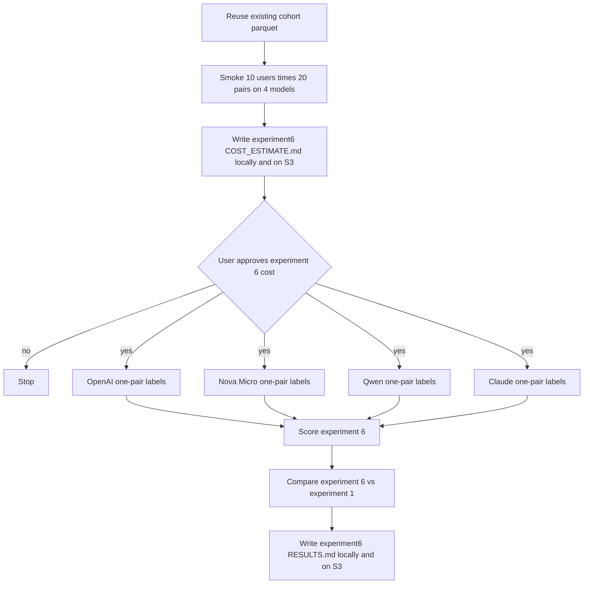

# Repeat experiment 1 with one post pair per prompt, then compare against the 20-pair labels

## Remember
- Exact file paths always
- Exact commands with expected output
- DRY, YAGNI, TDD, frequent commits
- Delegated tasks must be impossible to misread.

## Overview

Experiment 1 asked each model to score all 20 linked-fate pairs in one prompt. Humans on the September 2026 MirrorView site judged one pair at a time. Experiment 6 keeps the experiment 1 cohort, gold labels, pair order, models, and posts-only prompt. The only change is that each API call shows one pair and asks for a keep or remove on that pair. After labeling, compare experiment 6 to experiment 1 on the same people and the same pairs. The question is whether the batch-of-20 prompt was driving the remove-rate mismatch (Nova over-removing, Claude under-removing). No experiment 6 full run starts until a new smoke cost table is approved.

## Happy flow

An operator reuses the existing 998 unique cohort users. The operator smokes 10 users times 20 pairs on four models, writes a new cost table under the experiment 6 folder, and stops. After written approval, four Cursor Grok High subagents label the full cohort, one model each. A later command scores experiment 6 with the same tables as experiment 1, then writes a comparison against the existing experiment 1 `RESULTS.md` numbers. Derived files go to S3 at the matching local path.



## Approach

Do not rebuild the cohort, the gold labels, or the four model engines. Add a one-pair prompt and a pair-level labeling grain next to the existing shared runner. Each call is a fresh prompt with no chat history of the other 19 pairs. After 20 successful pair calls, stitch those answers into the same 20-length remove list that experiment 1 already stores, so scoring can reuse the experiment 1 tables. Compare on the intersection of users who scored in both experiments for that model. Treat experiment 6 as a process-match ablation of experiment 1, not as a new prompt-content variant.

## Decisions

- Reuse the live cohort already at `experiments/ai_simulation_responses_2026_09_11/shared/{cohort_users,cohort_trials}.parquet` and at the matching keys in bucket `mirrorview-experimental-artifacts`. Deduplicate by unique `prolific_id`, earliest session first, the same 998 people as experiments 1 through 5. Do not run `--write-cohort`. Do not download the September study bucket again. Do not edit the frozen experiment 1 through 5 prompts, labels, cost file, or `RESULTS.md` files.
- Experiment 6 prompt content matches experiment 1: post pairs only. No demographics. No reflection. Post 1 and Post 2 still follow the stored `pair_order` on that trial.
- Each API call contains exactly one pair. The user message does not say "pair N of 20" and does not show the other 19 pairs. The heading is always the single pair under review, so the model cannot infer a batch quota. Calls for the same user do not share conversation history.
- System text keeps the website instruction paragraph from `webapp/public/main.js` (the "We are developing a new social media platform" block and the political-mirror example). Replace only the experiment 1 closing lines that say the model will see all 20 pairs at once. The experiment 6 closing lines say the model will see one pair and must return a JSON object with `remove_pair_indexes` equal to `[]` (keep) or `[1]` (remove). Do not edit the experiment 1 through 4 system prompt string.
- Keep the same output field name, `remove_pair_indexes`. On a one-pair call, the only legal values are an empty list or `[1]`. Any other value, a duplicate, or a parse failure is a failed pair. After 20 successes, map a `[1]` on pair `k` onto the user-level list as study pair index `k` (1-indexed, same order as experiment 1). The scored row shape matches experiment 1: one user, a list of 1-indexed study pair numbers to remove.
- Campaign labeling grain is one row per user-pair. Record id is `{prolific_id}:{pair_index}`. Expected successful rows per model are 998 times 20, which is 19,960. OpenAI Batch part size stays `CAMPAIGN_BATCH_SIZE` (2000), so one model is 10 parts. Bedrock still uses `label_tasks_collecting_failures`, `max_tokens=256`, and concurrency 8. If any of a user's 20 pair calls fails, drop that user from scoring for that model. Do not impute keep. Print `labeled_pairs`, `failed_pairs`, `scored_users`, and `failed_users`.
- Models, folders, and engines stay exactly the experiment 1 set: `openai` = `gpt-5.4-nano` through `build_openai_engine`; `bedrock_micro_nova` = `us.amazon.nova-micro-v1:0`; `bedrock_qwen` = `qwen.qwen3-32b-v1:0`; `bedrock_claude` = `us.anthropic.claude-sonnet-4-6`. Do not call `build_bedrock_engine`. Do not call `generate_campaign_feature`.
- New folder `experiments/ai_simulation_responses_2026_09_11/experiment6/` with `README.md`, `SETUP.md`, `RESULTS.md`, `COST_ESTIMATE.md`, `APPROVAL.md`, and `outputs/{openai,bedrock_micro_nova,bedrock_qwen,bedrock_claude}/`. Parent `experiments/ai_simulation_responses_2026_09_11/README.md` is agent read-only. Leave it unchanged and tell the user it still names experiments 1 through 5 only.
- Dual-write derived files with `CampaignObjectStore.put_new` to bucket `mirrorview-experimental-artifacts`, object key equal to the repo-relative path. Do not upload to `jspsych-mirror-view-2026-09-09`. Do not overwrite `experiments/ai_simulation_responses_2026_09_11/COST_ESTIMATE.md` (that key already exists). The experiment 6 cost file is `experiments/ai_simulation_responses_2026_09_11/experiment6/COST_ESTIMATE.md`. A second upload of any new key raises `FileExistsError`.
- Smoke 10 unique cohort users, which is 200 pair calls per model, under `experiment6/outputs/{model}/smoke/`. Smoke must not copy rows into `final.parquet`. Cost scaling uses smoke-median tokens per pair call times 19,960 pair calls (998 users times 20). Low is 0.5 times median. High is 2 times median. Pricing rates stay the experiment 1 rates (OpenAI Batch 0.10 / 0.625, Nova 0.035 / 0.14, Qwen 0.15 / 0.60, Claude 3.00 / 15.00 per million tokens). Character-count back-of-envelope on one real user is about 4.8 times experiment 1 input, because the system prompt is sent 20 times. Experiment 1 Claude median was $9.02, so experiment 6 Claude is likely tens of dollars. The smoke table is authoritative. Stop after writing the cost file. Do not start full labeling in the same command.
- Full `--model` labeling requires `experiments/ai_simulation_responses_2026_09_11/experiment6/APPROVAL.md`. After written approval of the experiment 6 cost table, launch four Cursor Grok High subagents in parallel, one per model. They do not score. Scoring starts only when all four `experiment6/outputs/{model}/final.parquet` objects exist.
- Scoring reuses the experiment 1 metric definitions: scikit-learn `zero_division=0`, positive class remove, user-level means of per-user accuracy / precision / recall / F1, post-level pooled scores plus baseline remove rate, then party / toxicity / stance slices. Add one extra number that experiment 1 buried inside precision and recall: predicted remove rate (share of scored pairs the model removed). Do not add significance tests.
- Comparison against experiment 1 is required in the same `RESULTS.md`. For each model, restrict to users scored in both experiment 1 and experiment 6. Required compare rows: user-level F1, post-level F1, accuracy, precision, recall, predicted remove rate, and the human gold remove rate on that intersection. Also report the share of user-pairs where experiment 1 and experiment 6 agree, and within-user variance of per-pair correctness for both experiments. Do not rewrite experiment 1 `RESULTS.md`. Do not fold experiment 6 into experiment 5 error ranks.
- Git-only: Python, tests, `README.md`, `SETUP.md`. `COST_ESTIMATE.md` and `RESULTS.md` are committed after the live write, and they are also on S3. Parquet and campaign objects stay out of git. `CHANGELOG.md` waits until experiment 6 `RESULTS.md` exists.
- Pytest stays under `experiments/ai_simulation_responses_2026_09_11/shared/tests/` and must not call OpenAI, Bedrock, or S3. Cover one-pair rendering (no "20 pairs", no other pairs in the user message, pair_order preserved), legal `[]` / `[1]` expansion, stitch onto study indexes 1 to 20, all-or-nothing user drop when one pair fails, and the compare intersection. The usual "experiments skip pytest" line in `UNIT_TESTING_STANDARDS.md` does not apply.
- Do not edit `data_platform/`, `webapp/`, `scripts/export_study_results.py`, `lib/constants.py`, `shared/flip_generation/`, repo-root `tests/`, experiment 1 through 5 `RESULTS.md`, parent `COST_ESTIMATE.md`, or parent `README.md`. Do not add demographics, reflection, new models, or per-pair calls for experiments 2 through 4.

## Artifact paths

Bucket `mirrorview-experimental-artifacts`. Export `LAB_AWS_ACCESS_KEY_ID` and `LAB_AWS_ACCESS_KEY_SECRET` as `AWS_ACCESS_KEY_ID` and `AWS_SECRET_ACCESS_KEY` before any write.

| Local path | S3 URI |
| --- | --- |
| `experiments/ai_simulation_responses_2026_09_11/shared/cohort_users.parquet` | `s3://mirrorview-experimental-artifacts/experiments/ai_simulation_responses_2026_09_11/shared/cohort_users.parquet` (already exists, read only) |
| `experiments/ai_simulation_responses_2026_09_11/shared/cohort_trials.parquet` | `s3://mirrorview-experimental-artifacts/experiments/ai_simulation_responses_2026_09_11/shared/cohort_trials.parquet` (already exists, read only) |
| `experiments/ai_simulation_responses_2026_09_11/experiment6/COST_ESTIMATE.md` | `s3://mirrorview-experimental-artifacts/experiments/ai_simulation_responses_2026_09_11/experiment6/COST_ESTIMATE.md` |
| `experiments/ai_simulation_responses_2026_09_11/experiment6/outputs/{model}/smoke/` | `s3://mirrorview-experimental-artifacts/experiments/ai_simulation_responses_2026_09_11/experiment6/outputs/{model}/smoke/` |
| `experiments/ai_simulation_responses_2026_09_11/experiment6/outputs/{model}/` campaign objects including `final.parquet` | `s3://mirrorview-experimental-artifacts/experiments/ai_simulation_responses_2026_09_11/experiment6/outputs/{model}/` |
| `experiments/ai_simulation_responses_2026_09_11/experiment6/RESULTS.md` | `s3://mirrorview-experimental-artifacts/experiments/ai_simulation_responses_2026_09_11/experiment6/RESULTS.md` |

`{model}` is `openai`, `bedrock_micro_nova`, `bedrock_qwen`, or `bedrock_claude`. Experiment 1 labels stay at `experiment1/outputs/{model}/final.parquet` and are read, not rewritten.

## Steps

### Step 1: Add the one-pair prompt, pair-level runner, stitch, tests, and experiment 6 folder

Add the experiment 6 folder and a one-pair system prompt next to the frozen 20-pair prompt. Teach the shared runner to emit 20 independent tasks per user, persist pair-level campaign rows, and stitch 20 successes into the experiment 1 user-level remove list. Pytest covers rendering, legal indexes, stitch, and the failed-pair user drop. Do not call OpenAI or Bedrock.

### Step 2: Smoke 10 users times 20 pairs and write the experiment 6 cost table

Run a 200-call smoke per model. Write `experiment6/COST_ESTIMATE.md` locally and on S3, and print one filled one-pair prompt into `experiment6/SETUP.md`. Stop for approval. Do not label the full cohort.

### Step 3: Label the full cohort, one model per Cursor Grok High subagent

After explicit approval of the experiment 6 cost table, run four parallel Cursor Grok High subagents. Each subagent labels one model into `experiment6/outputs/{model}/`. They do not score.

### Step 4: Score experiment 6 and compare it to experiment 1

Join experiment 6 labels to the cohort gold labels. Write the experiment 1-style metric tables, plus the intersection comparison against existing experiment 1 `final.parquet` files, into `experiment6/RESULTS.md`. Upload that file to the matching S3 key. Do not modify experiment 1 `RESULTS.md`.

## What "done" looks like

1. `experiments/ai_simulation_responses_2026_09_11/experiment6/` exists with README, SETUP, and shared-runner wiring for `--experiment 6`. The frozen experiment 1 through 5 artifacts are unchanged.
2. Step 2 smoked 10 users (200 pair calls) on four models under `experiment6/outputs/{model}/smoke/`, wrote `experiment6/COST_ESTIMATE.md` locally and on S3, and did not write full-run `final.parquet`.
3. After approval, each of the four models has `s3://mirrorview-experimental-artifacts/experiments/ai_simulation_responses_2026_09_11/experiment6/outputs/{model}/final.parquet`. Smoke prefixes stay separate.
4. `experiment6/RESULTS.md` exists locally and on S3 with user-level, post-level, party, toxicity, and stance tables, predicted remove rate, and a comparison against experiment 1 on the per-model user intersection.
5. Experiment 1 predicted remove rates remain the baseline for that comparison (OpenAI about 0.52, Nova about 0.90, Qwen about 0.33, Claude about 0.09, humans 0.306).
6. `PYTHONPATH=. uv run pytest experiments/ai_simulation_responses_2026_09_11/shared/tests -q` exits 0. Product engines, the website, the September study bucket, and experiment 1 through 5 S3 objects are unchanged.

## Commands

Run from the repo root. Export AWS keys from `LAB_AWS_ACCESS_KEY_ID` and `LAB_AWS_ACCESS_KEY_SECRET`. Set `OPENAI_API_KEY` before any OpenAI command.

```bash
export AWS_ACCESS_KEY_ID="$LAB_AWS_ACCESS_KEY_ID"
export AWS_SECRET_ACCESS_KEY="$LAB_AWS_ACCESS_KEY_SECRET"

PYTHONPATH=. uv run pytest experiments/ai_simulation_responses_2026_09_11/shared/tests -q
```

Expected: exit 0.

```bash
PYTHONPATH=. uv run python experiments/ai_simulation_responses_2026_09_11/experiment6/run.py --smoke
PYTHONPATH=. uv run python experiments/ai_simulation_responses_2026_09_11/experiment6/run.py --estimate-cost
```

Each smoke writes 200 pair labels (10 users times 20) under each model's `experiment6/outputs/{model}/smoke/` prefix on S3, with a gitignored local cache at that same relative path, and prints `labeled_pairs=` and `failed_pairs=`. `--estimate-cost` writes `experiment6/COST_ESTIMATE.md` locally and on S3, prints `cost_s3_uri=`, and does not start full labeling.

After written approval of that cost table:

```bash
PYTHONPATH=. uv run python experiments/ai_simulation_responses_2026_09_11/experiment6/run.py --model openai
PYTHONPATH=. uv run python experiments/ai_simulation_responses_2026_09_11/experiment6/run.py --model bedrock_micro_nova
PYTHONPATH=. uv run python experiments/ai_simulation_responses_2026_09_11/experiment6/run.py --model bedrock_qwen
PYTHONPATH=. uv run python experiments/ai_simulation_responses_2026_09_11/experiment6/run.py --model bedrock_claude
```

Each label command prints `labeled_pairs`, `failed_pairs`, `scored_users`, and `failed_users`, plus `final_uri=`. A second run on a model whose `final.parquet` exists prints `final exists` and returns without labeling.

```bash
PYTHONPATH=. uv run python experiments/ai_simulation_responses_2026_09_11/experiment6/run.py --score
```

Expected: writes `experiment6/RESULTS.md` locally and on S3, prints `results_s3_uri=`, and includes both the experiment 6 tables and the experiment 1 comparison.
