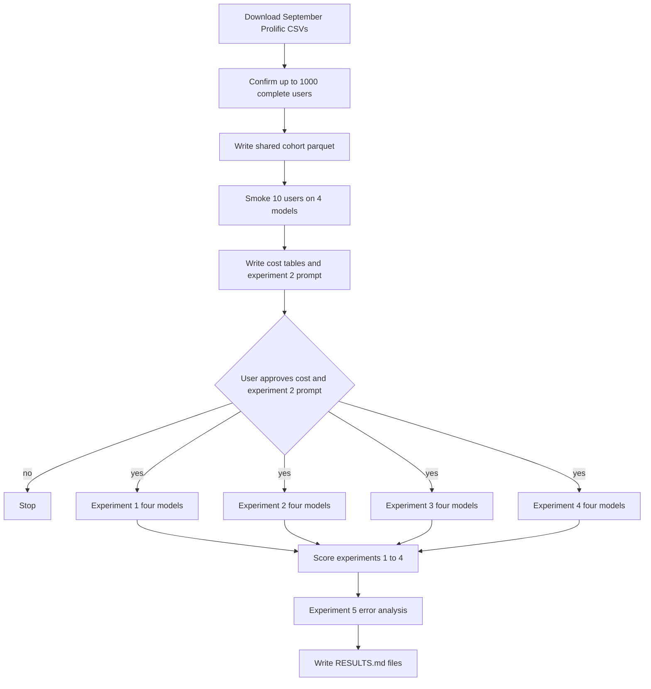

# Predict September 2026 keep/remove choices with four prompt variants and four models

## Remember
- Exact file paths always
- Exact commands with expected output
- DRY, YAGNI, TDD, frequent commits
- Delegated tasks must be impossible to misread.

## Overview

Issue 290 asks whether language models can match the keep/remove choices that September 2026 MirrorView participants made on 20 linked-fate post pairs. The live study is `mirrorview_2026_09_09` in bucket `jspsych-mirror-view-2026-09-09`. The work lives under `experiments/ai_simulation_responses_2026_09_11/`. Four prompt variants share one cohort and one runner. They also share one output schema. A fifth folder only scores errors on those labels. No full model run starts until a smoke cost table is approved. Experiment 2 also waits on prompt-template approval.

## Happy flow

An operator downloads Prolific CSVs from the September bucket. The operator then confirms up to 1,000 complete participants in earliest-upload order and writes one shared cohort. Next the operator smokes 10 users on four models, writes a cost table, and stops. After approval, four parallel Cursor Grok High subagents label the full cohort for experiments 1 through 4. A later command ranks posts and users with the highest error rates from those labels.



## Approach

Reuse the OpenAI Batch engine and the Bedrock Converse helpers that the original-versus-mirror separability experiment already uses. Do not copy those engines four times. One shared runner takes an experiment number and a model name. Experiments 1 through 4 only change the extra context block in the user prompt. Keep gold labels and predictions as separate parquet objects. Treat the four prompt variants as prompt ablations on the same people, not as a causal test of demographics or reflection. Report user-level means and post-level scores separately, because those two aggregations are not the same number. Simplicity and persona notes are in `reviews.md`.

## Decisions

- Create `experiments/ai_simulation_responses_2026_09_11/` with `shared/` plus `experiment1` through `experiment5`. Shared code lives in `shared/`. Each experiment folder has `README.md`, `SETUP.md`, `RESULTS.md`, and `outputs/{openai,bedrock_micro_nova,bedrock_qwen,bedrock_claude}/`. Experiment 5 has no model outputs.
- Parent `experiments/ai_simulation_responses_2026_09_11/README.md` is two sentences that name issue 290 and point at each experiment folder. Each experiment README is one or two sentences for the ablation question, then a redirect to that folder's `SETUP.md` and `RESULTS.md`. Start every README with the agent read-only banner from `experiments/filter_posts_used_for_stimulus_dataset_2026_09_08/README.md`.
- Do not use `shared/data/raw/study_phase_2_part_2/`. The September run is not in the registry yet. Download from `s3://jspsych-mirror-view-2026-09-09/data/prolific/` using the list, download, and filter helpers in `scripts/export_study_results.py`, with `--since-date 2026-09-09`. Keep the S3 filename epoch on every user. Do not sort by assignment-sheet `created_at`.
- A complete user has exactly 20 Phase 1 rows with `evaluation_mode` equal to `linked_fate` and `decision` in `{keep, remove}`, plus a non-empty `phase1_pair_reflection_text` and a 1 to 7 `phase1_pair_influence_rating`. Sort unique `prolific_id` values by the earliest matching `data_<epoch_ms>_*.csv` filename, then take the first 1,000. If fewer than 1,000 complete users exist, take all of them and record the count. The issue's "1,000 rows" means 1,000 participants, not 1,000 trial rows. `scripts/export_study_results.py` currently expects 190 files, so the live count may be under 1,000.
- Write `cohort_users.parquet` and `cohort_trials.parquet` once with `CampaignObjectStore.put_new` to `s3://mirrorview-experimental-artifacts/experiments/ai_simulation_responses_2026_09_11/shared/`. A second upload of either key must raise `FileExistsError` before any model is called. Local copies may exist under `experiments/ai_simulation_responses_2026_09_11/shared/` and must stay out of git.
- Pair presentation follows the stored `pair_order` on that trial, so Post 1 and Post 2 match what that participant saw. Do not reshuffle. If `pair_order` is missing or is not a two-item list of `original` and `mirror`, drop the user from the cohort and count the drop. Pair numbers are 1-indexed in the order of those 20 trials after sorting by `trial_index`.
- Gold label is 1 when `decision` is `remove` and 0 when `decision` is `keep`. The model returns a list of 1-indexed pair numbers to remove. Expand that list into 20 binary predictions. An empty list means keep all 20. A duplicate index, a value outside 1 to 20, or a parse failure sends the user to `errors.jsonl` and excludes that user from scoring for that model.
- Shared Pydantic output schema: one field, a list of integers named `remove_pair_indexes`. Persist a row model with `source_record_id`, `label_timestamp`, and that list. `source_record_id` is `prolific_id`.
- Instruction text is the training_assisted copy in `webapp/public/main.js` (the paragraph that starts "We are developing a new social media platform" and the political-mirror example). The task change from the website is that the model sees all 20 pairs at once and returns remove indexes instead of clicking Allow Both or Remove Both on each trial. State in every `SETUP.md` that humans judged one pair at a time and the model sees the full set in one prompt. Do not spend 20 calls per user to make the model judge one pair at a time.
- Experiment 1 user prompt is only the 20 pairs. Experiment 2 prepends every exported demographic and attitude field that is non-empty for that user. Experiment 3 prepends the exact reflection question from `webapp/public/main.js` plus the written answer and the 1 to 7 influence rating. Experiment 4 concatenates the experiment 2 block, then the experiment 3 block, then the pairs. Language, employment, and social-media items are collected in `webapp/public/post_surveys.js` but are not in `columnsToKeep` in `webapp/public/main.js`, so they are unavailable. Do not invent them.
- Demographic fields to render when present, with the survey wording as the label: `age`, `gender`, `education`, `political_affiliation`, `party_lean`, `party_group`, `political_ideology`, `political_follow`, `rep_id`, `dem_id`, `attitude_reduce_abortion`, `attitude_citizenship_undocumented`, `attitude_restrict_guns`, `attitude_regulate_environment`, `attitude_raise_wealth_taxes`, `attitude_expand_medicaid`. Likert items keep the 1 to 7 anchors from `webapp/public/post_surveys.js`. Attitude sliders are 0 to 100.
- Experiment 2 prompt template must be printed by `--print-experiment-2-prompt` and written into `experiments/ai_simulation_responses_2026_09_11/experiment2/SETUP.md` before any experiment 2 model call. Full labeling of experiment 2 waits on explicit approval of that template.
- Models, in output-folder order:
  - `openai`: OpenAI Batch, `gpt-5.4-nano` (`DEFAULT_LLM_MODEL`), through `build_openai_engine`
  - `bedrock_micro_nova`: Bedrock Converse, `us.amazon.nova-micro-v1:0`, through `label_tasks_collecting_failures`
  - `bedrock_qwen`: Bedrock Converse, `qwen.qwen3-32b-v1:0` from `experiments/predict_keep_remove_2026_07_01/models/llm_finetuning/api_baselines/constants.py`
  - `bedrock_claude`: Bedrock Converse, `us.anthropic.claude-sonnet-4-6` (`DEFAULT_BEDROCK_SONNET_MODEL`), the flips model
- Do not call `build_bedrock_engine` for Qwen or Claude, because that factory hardcodes Nova Micro. Do not call `generate_campaign_feature`, because the Reddit campaign retries Bedrock content-filter failures through OpenAI. Raise Bedrock `max_tokens` to 256 on this experiment's Converse calls only, the same override the separability experiment used. Concurrency for Bedrock is `BEDROCK_CAMPAIGN_MAX_CONCURRENCY` (8). OpenAI Batch part size is `CAMPAIGN_BATCH_SIZE` (2000), so 1,000 users become one part per model.
- Label layout matches campaign feature generation, under `s3://mirrorview-experimental-artifacts/experiments/ai_simulation_responses_2026_09_11/experiment{N}/outputs/{model}/`: `batches/part-NNNNN.parquet`, `manifest.json`, `progress.jsonl`, `errors.jsonl`, `final.parquet`, plus `active_openai_batch.json` or `active_bedrock_job.json` while a job is open. Smoke writes under that model's `smoke/` prefix and must not copy rows into `final.parquet`. Resume by skipping parts already in the manifest. If `final.parquet` exists, the command returns without labeling.
- Pricing constants for the cost table, in USD per million tokens. OpenAI Batch: 0.10 input, 0.625 output, from `data_platform/generate_features/campaign_cost_report.py`. Nova Micro on-demand: 0.035 input, 0.14 output, from the same file. Qwen3 32B on-demand in `us-east-2`: 0.15 input, 0.60 output, from the Bedrock price list. Claude Sonnet 4.6 on-demand: 3.00 input, 15.00 output, from the Bedrock Marketplace listing. Record those source URLs in `COST_ESTIMATE.md`. Smoke 10 users (or the full cohort if smaller) on all four models using the experiment 1 prompt. Estimate experiments 2 to 4 by scaling experiment 1 mean input tokens by the ratio of rendered prompt character counts. Keep output tokens at the experiment 1 smoke mean. Median cost is smoke-median tokens times user count times the rates. Low is 0.5 times median. High is 2 times median. Experiment 5 is 0. Stop after writing the tables. Do not start full labeling in the same command.
- Cost table columns, exactly: model, estimated tokens in, estimated tokens out, median estimated cost, low/high estimated cost. One section per experiment 1 to 4, then a total section. Write `experiments/ai_simulation_responses_2026_09_11/COST_ESTIMATE.md` and print it to stdout.
- Scoring uses scikit-learn with `zero_division=0`, matching `experiments/finetune_qwen_model_2026_08_08/evaluate.py`. Positive class is remove. User-level scores are precision, recall, F1, and accuracy on that user's 20 pairs, then the mean of those user scores. Post-level scores are the same four metrics on all user-pair rows pooled, plus the baseline remove rate. Party tables repeat user-level scores inside `party_group` `democrat` and `republican`. Toxicity tables repeat post-level scores inside `sample_low_toxicity`, `sample_middle_toxicity`, and `sample_high_toxicity`. Stance tables repeat post-level scores inside `sampled_stance` `left` and `right`. Each table names the scored-row count and the error-row count. Do not add significance tests.
- Experiment 5 uses existing labels and existing post and user fields only. Rank posts by false-negative rate across models and experiments 1 to 4 (model said keep, gold is remove) and take the top 75. Rank posts by false-positive rate (model said remove, gold is keep) and take the top 75. The issue's second clause repeats the false-negative wording. Complementary errors are the useful split, so use 75 false negatives and 75 false positives. Compare toxicity and stance shares in that set of 150 against the rest of the cohort posts. Rank users by mean user-level F1 across models and experiments 1 to 4, lowest first, and take 100. Describe those users with `party_group`, `political_ideology`, `age`, `education`, and mean gold remove rate. Within-user variance is the variance of per-pair correctness on experiment 1. Report summary statistics of that variance across users, one row per model. Across-model variance is the standard deviation of the four models' experiment 1 remove predictions on each user-pair. Report summary statistics of those standard deviations.
- After cost approval, launch four Cursor Grok High subagents in parallel, one per experiment 1 to 4. Each subagent runs all four models for its experiment and does not score. Scoring is Step 4. Experiment 5 starts only when all 16 `final.parquet` objects exist. Do not implement a plugin registry, a prompt-strategy interface, or a second schema.
- Pytest lives under `experiments/ai_simulation_responses_2026_09_11/shared/tests/` and must not call OpenAI, Bedrock, or S3. Cover cohort completeness, pair-order rendering, 1-indexed expansion, and the metric tables. The usual "experiments skip pytest" line in `UNIT_TESTING_STANDARDS.md` does not apply, because a 0-based index bug would invalidate every score.
- Do not edit `data_platform/`, `webapp/`, `scripts/export_study_results.py`, `lib/constants.py`, `shared/flip_generation/`, or files under repo-root `tests/`. Do not upload to the study website bucket. `CHANGELOG.md` waits until a live full run has `RESULTS.md` files.

## Steps

### Step 1: Add the shared cohort, prompts, schema, runner, and tests

Add the folder layout and confirm the September cohort. Implement prompt rendering, the output schema, the four model runners, and the scorer. Upload the cohort parquet. Do not call OpenAI or Bedrock. See [steps/step1.md](steps/step1.md).

### Step 2: Smoke 10 users, write the cost table, and print the experiment 2 prompt

Run a 10-user smoke on all four models with the experiment 1 prompt. Scale token estimates to experiments 2 to 4. Write `COST_ESTIMATE.md` and print the experiment 2 template with one filled example. Stop for approval. See [steps/step2.md](steps/step2.md).

### Step 3: Label the full cohort for experiments 1 through 4

After explicit approval of the cost table and the experiment 2 template, run four parallel Cursor Grok High subagents. Each subagent labels all four models for one experiment into campaign parquet parts. See [steps/step3.md](steps/step3.md).

### Step 4: Score experiments 1 through 4

Join each `final.parquet` to the cohort gold labels. Write the user-level, post-level, party, toxicity, and stance tables into each experiment's `RESULTS.md`. See [steps/step4.md](steps/step4.md).

### Step 5: Analyze error-rate ranks and prediction variance

Read the 16 final parquets. Write the 75 plus 75 post lists, the 100-user list, within-user variance, and across-model variance into `experiments/ai_simulation_responses_2026_09_11/experiment5/RESULTS.md`. See [steps/step5.md](steps/step5.md).

## What "done" looks like

1. `experiments/ai_simulation_responses_2026_09_11/` has `shared/`, five experiment folders, parent `README.md`, and `COST_ESTIMATE.md` after Step 2.
2. Cohort parquet exists on S3 and has at most 1,000 users, each with 20 gold pairs, stored pair order, and a reflection. A second cohort upload fails.
3. Step 2 wrote a cost table in the issue's column layout, smoked 10 users (or fewer) on four models, and printed the experiment 2 prompt. Full labeling did not run in Step 2.
4. After approval, each of experiments 1 to 4 has four `final.parquet` files, one per model, plus smoke objects that are separate from those finals.
5. Each of experiments 1 to 4 has `RESULTS.md` with user-level means, post-level scores including baseline remove rate, party tables, toxicity tables, and stance tables.
6. Experiment 5 `RESULTS.md` has the 150-post error set, the 100-user set, within-user variance, and across-model variance, using only existing fields.
7. `PYTHONPATH=. uv run pytest experiments/ai_simulation_responses_2026_09_11/shared/tests -q` exits 0. Product engines, the website, and the September study bucket objects are unchanged.

## Commands

Run from the repo root. Export AWS keys from `LAB_AWS_ACCESS_KEY_ID` and `LAB_AWS_ACCESS_KEY_SECRET`. Set `OPENAI_API_KEY` before any OpenAI command.

```bash
export AWS_ACCESS_KEY_ID="$LAB_AWS_ACCESS_KEY_ID"
export AWS_SECRET_ACCESS_KEY="$LAB_AWS_ACCESS_KEY_SECRET"

PYTHONPATH=. uv run pytest experiments/ai_simulation_responses_2026_09_11/shared/tests -q
```

Expected: exit 0.

```bash
PYTHONPATH=. uv run python experiments/ai_simulation_responses_2026_09_11/shared/run.py --write-cohort
```

Expected stdout includes `user_count=` (at most 1000), `trial_rows=` (20 times user count), the two S3 URIs, and both SHA-256 values. A second run exits non-zero because the cohort keys exist.

```bash
PYTHONPATH=. uv run python experiments/ai_simulation_responses_2026_09_11/shared/run.py --smoke
PYTHONPATH=. uv run python experiments/ai_simulation_responses_2026_09_11/shared/run.py --print-experiment-2-prompt
PYTHONPATH=. uv run python experiments/ai_simulation_responses_2026_09_11/shared/run.py --estimate-cost
```

Each smoke writes 10 labels (or the cohort size if smaller) under each model's `experiment1/outputs/{model}/smoke/` prefix and prints `labeled N of N`. `--estimate-cost` writes `COST_ESTIMATE.md` and prints the four experiment sections plus the total. `--print-experiment-2-prompt` prints the template and one filled user. Full labeling must not start.

After written approval of the cost table and the experiment 2 prompt, one subagent per experiment runs the four `--model` commands. Scoring is a later command.

```bash
PYTHONPATH=. uv run python experiments/ai_simulation_responses_2026_09_11/experiment1/run.py --model openai
PYTHONPATH=. uv run python experiments/ai_simulation_responses_2026_09_11/experiment1/run.py --model bedrock_micro_nova
PYTHONPATH=. uv run python experiments/ai_simulation_responses_2026_09_11/experiment1/run.py --model bedrock_qwen
PYTHONPATH=. uv run python experiments/ai_simulation_responses_2026_09_11/experiment1/run.py --model bedrock_claude
```

Replace `experiment1` with `experiment2`, `experiment3`, or `experiment4`. Each label command prints `labeled N` or a scored-count plus failed-count line.

```bash
PYTHONPATH=. uv run python experiments/ai_simulation_responses_2026_09_11/experiment1/run.py --score
```

Replace `experiment1` the same way. `--score` writes that experiment's `RESULTS.md`.

```bash
PYTHONPATH=. uv run python experiments/ai_simulation_responses_2026_09_11/experiment5/run.py --analyze-errors
```

Expected: writes `experiment5/RESULTS.md` and prints the 75, 75, and 100 counts.
