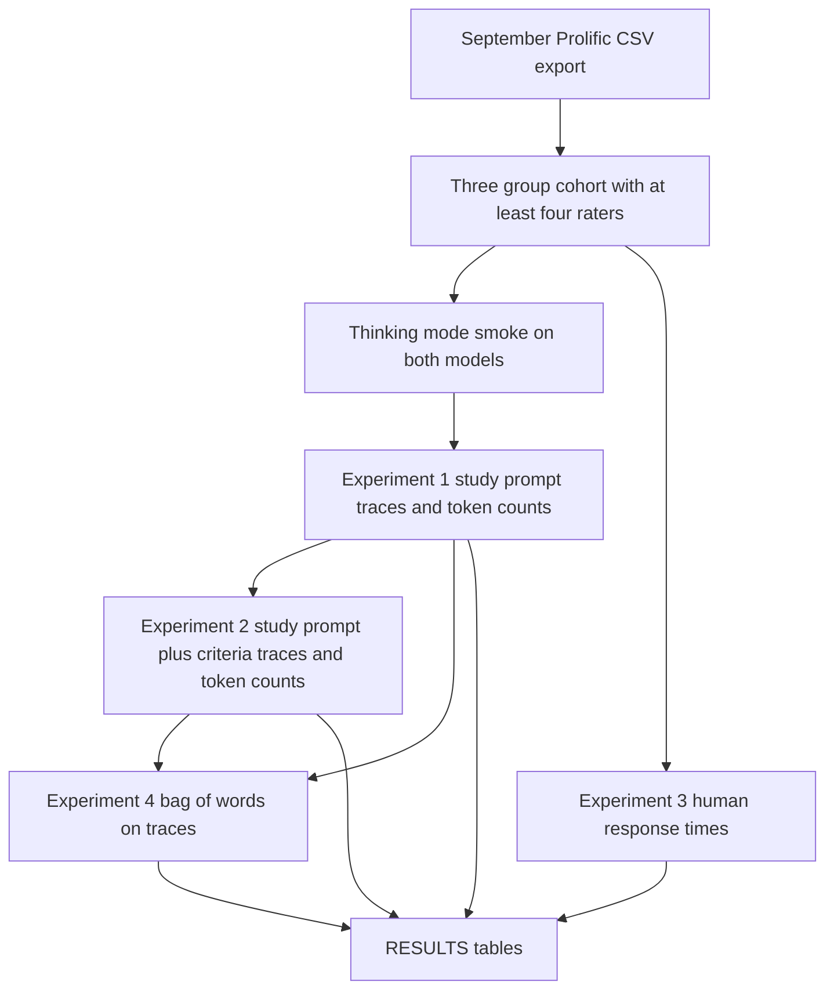

# Count reasoning tokens on split versus unanimous moderation posts

## Remember
- Exact file paths always
- Exact commands with expected output
- DRY, YAGNI, TDD, frequent commits
- Delegated tasks must be impossible to misread.

## Overview

[Issue 294](https://github.com/METResearchGroup/mirrorView-task/issues/294) asks whether language models spend more thinking on boundary keep or remove cases than on clear ones. Lee and Lai (2025), [Implicit Bias-Like Patterns in Reasoning Models](https://www.alphaxiv.org/abs/2503.11572), count reasoning tokens when a pairing matches a common association and when it conflicts with that association. Use that token count on linked-fate moderation pairs. Posts where raters disagree are the boundary cases. Posts where every rater keeps or every rater removes are the clear cases.

The analysis set is the latest September 2026 study export. Do not load labels from the registered Phase 2 Part 2 CSV. The cohort command aggregates linked-fate keep or remove ratings per post after one rating per worker and post. Posts need at least four raters. Posts then fall into three groups:

- split labels, only the vote patterns 2 keep and 2 remove, 3 keep and 2 remove, or 2 keep and 3 remove
- unanimous keep
- unanimous remove

Other disagreements, such as 4 keep and 1 remove, stay out of the analysis set.

You confirmed the group sizes are large enough to proceed. On the 2026-09-15 export of 3,075 Prolific files, the eligible set is 2,200 split posts, 2,256 unanimous keep posts, and 208 unanimous remove posts. The group sizes can grow as new files land. The cohort command records the export timestamp and file count in the results file.

Put the experiment under `experiments/reasoning_during_moderation_2026_09_15/`. Experiment 1 uses the study prompt and counts thinking-block tokens for two models on the three groups. Experiment 2 repeats that run after inserting the keep and remove criteria from `experiments/llm_prompt_engineering_2026_08_05/KEEP_REMOVE_FEATURES.md`. Experiment 3 reports human response times on the same posts. Experiment 4 is a bag-of-words reading of the stored traces. In experiment 4, score traces for uncertainty, revision, and tension, and compare experiment 1 with experiment 2.

Accuracy, F1, and other label-match scores are out of scope. Split posts have no single gold label. The measured outcome is thinking length.

## Happy flow

An operator builds one pinned three-group cohort from the latest September export and runs a thinking-mode smoke on both models. The operator then runs two prompt arms, a human time table, and a bag-of-words trace table. Traces and tables land in the experiment folder and in the experimental S3 bucket.



## Approach

Each eligible post gets one completion per model per prompt arm. Run every eligible post. Do not downsample after the count confirmation. The study instruction text comes from the linked-fate pages in `webapp/public/main.js`, and it includes the line that there are no right or wrong answers. The trial closing line is `Allow or Remove?`. Participants saw one pair at a time, so the prompt is that website text plus one pair. Do not copy the twenty-pair JSON prompt from pull request 292. Shuffle Post 1 and Post 2 per post with a deterministic seed, and store that order on the cohort. Reuse the same order for both models and both prompt arms.

Qwen 3.5 4B is in thinking mode by default. DeepSeek-R1-Distill-Qwen-7B needs thinking forced on, and its model card says to put all instructions in the user message. Token counts are the generated token ids inside the thinking span. Do not decode the thinking text and tokenize it again. Store the full traces for experiment 4.

The human time table reads `response_time_ms` from linked-fate moderation trials. The `rt` column is empty on those rows. The times have a long right tail, so the table reports mean, median, and quartiles at the trial level and at the post-mean level.

The bag-of-words script tokenizes traces with the same letter-token rules as `experiments/unanimous_vs_majority_labels_2026_08_08/src/bow_tokens.py`, then scores a confirmed marker list for uncertainty, revision, and tension. Compare experiment 2 with experiment 1 on the same posts to see whether the criteria list shortens thinking and reduces those markers.

GPU inference runs on Hugging Face Jobs. Local pytest covers cohort rules, prompt text, token counting, human time summaries, and bag-of-words scoring without downloading models. Large artifacts go to `s3://mirrorview-experimental-artifacts/experiments/reasoning_during_moderation_2026_09_15/`. The live study bucket is read-only.

## Steps

### Step 1: Pin the September three-group cohort

Export the latest Prolific CSVs, drop invalid workers, keep one rating per worker and post, require four or more raters, and assign the three groups. Shuffle Post 1 and Post 2 per post with a deterministic seed and store that order on the cohort. Print counts before any model run. Write the cohort under the experiment folder and upload it to the matching S3 prefix.

### Step 2: Lock the study prompt and smoke thinking mode

Add a shared prompt file that matches the website instruction text, renders one pair using the stored Post 1 / Post 2 order, and optionally inserts the criteria addendum imported from `experiments/llm_prompt_engineering_2026_08_05/prompt.py`. Add a Hugging Face runner that enables thinking on both models and counts thinking-block tokens from generated token ids. Smoke a few posts and fail if the thinking span is missing or the count is zero.

### Step 3: Run experiment 1

For each group and each model, generate one completion with the study prompt. Store traces and token counts. Write a six-row summary table. Do not score keep or remove accuracy.

### Step 4: Run experiment 2

Repeat experiment 1 with the criteria list inserted into the same prompt. Keep post ids, models, seeds, and Post 1 / Post 2 order matched to experiment 1 so the two arms can be compared.

### Step 5: Report human response times

On the same cohort, summarize `response_time_ms` for split, unanimous keep, and unanimous remove. Report trial-level and post-mean mean, median, and quartiles.

### Step 6: Read the traces with bag of words, then confirm results

Score stored traces from experiments 1 and 2 with the confirmed marker lists. Compare groups and compare the two prompt arms. Write `experiments/reasoning_during_moderation_2026_09_15/RESULTS.md` with the four experiment tables.

## What "done" looks like

1. `experiments/reasoning_during_moderation_2026_09_15/` has `README.md`, `SETUP.md`, `RESULTS.md`, shared cohort and runner code, and folders `experiment1/` through `experiment4/`.
2. The pinned cohort uses the September 2026 Prolific export, at least four unique raters, and only the three groups named in the issue. On the 2026-09-15 snapshot that is 2,200 split, 2,256 unanimous keep, and 208 unanimous remove.
3. The model prompt matches the linked-fate website instructions, including the line that there are no right or wrong answers. Post 1 and Post 2 are shuffled per post and reused across models and prompt arms. Experiment 2 adds the criteria addendum without rewriting the rest of the prompt.
4. Smoke tests on `Qwen/Qwen3.5-4B` and `deepseek-ai/DeepSeek-R1-Distill-Qwen-7B` show a non-empty thinking span and a thinking-token count greater than zero.
5. Experiments 1 and 2 each have a six-row token table, stored traces, and matching S3 objects. No F1 or accuracy table is written.
6. Experiment 3 has a human time table for the three groups. Experiment 4 has bag-of-words marker rates for both prompt arms and a comparison of thinking length with the criteria list and without it.
7. `PYTHONPATH=. uv run pytest experiments/reasoning_during_moderation_2026_09_15/shared/tests -q` exits 0. `webapp/`, `shared/data/registry.py`, registered study CSVs, and `s3://jspsych-mirror-view-2026-09-09/` are unchanged except for the read-only export.

## Commands

Cohort counts, after AWS keys are exported as in `AGENTS.md`:

```bash
export AWS_ACCESS_KEY_ID="$LAB_AWS_ACCESS_KEY_ID"
export AWS_SECRET_ACCESS_KEY="$LAB_AWS_ACCESS_KEY_SECRET"

PYTHONPATH=. uv run python experiments/reasoning_during_moderation_2026_09_15/shared/cohort.py --write-counts
```

Expected stdout includes `csv_files=3075`, `split=2200`, `unanimous_keep=2256`, `unanimous_remove=208`, and `eligible_posts=4664` when the export matches the 2026-09-15 snapshot. A later export may print larger counts. Fail if any of the three groups is empty.

Unit tests:

```bash
PYTHONPATH=. uv run pytest experiments/reasoning_during_moderation_2026_09_15/shared/tests -q
```

Expected stdout ends with `passed` and exit code 0.

Thinking-mode smoke, after `HF_TOKEN` is set:

```bash
PYTHONPATH=. uv run python experiments/reasoning_during_moderation_2026_09_15/experiment1/run.py --smoke --limit 3
```

Expected stdout includes `thinking_enabled=true` for both models, a thinking-token count greater than zero on each smoke post, and local smoke traces under `experiments/reasoning_during_moderation_2026_09_15/experiment1/smoke/`.
