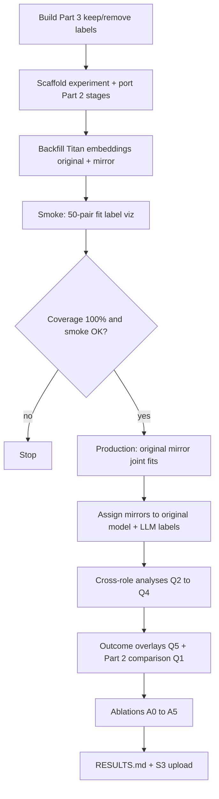

# Run BERTopic on Part 3 original and mirrored posts under `experiments/bertopic_original_mirror_part3_2026_09_24/`

## Remember
- Exact file paths always
- Exact commands with expected output
- DRY, YAGNI, TDD, frequent commits
- Delegated tasks must be impossible to misread.

## Overview

This plan extends the Part 2 BERTopic experiment in `experiments/bertopic_modeling_2026_08_05/` to Study Phase 2 Part 3. Part 3 has 18,899 stimulus posts with original and mirrored text in `shared/data/raw/study_phase_2_part_3/stimuli/flips.csv`. Its results file `shared/data/raw/study_phase_2_part_3/results/full.csv` has 131,175 rows, of which 79,500 are scored linked-fate ratings covering 18,866 rated posts. Part 2 fit topics on original text only, and it deferred mirror text to a later run.

Production settings match Part 2. Embeddings use Titan Text Embeddings V2 at 256 dimensions, L2-normalized, from the shared DynamoDB+S3 identity cache. Clustering uses UMAP with 15 neighbors, 5 components, min distance 0, cosine distance, and seed 42. HDBSCAN uses min cluster size 15 and eom extraction. Text preprocessing uses English stopwords and min document frequency 2. After clustering, you add post-hoc LLM topic labels with `gpt-5.4-nano` and Plotly overlays for topic, keep/remove, and unanimous decisions.

Because topics should reflect text structure, you fit them on text and embeddings only. Keep/remove labels, rater party, toxicity stratum, platform, and stance join after the fit as overlays. You use one fixed production configuration so Part 3 stays comparable to Part 2. Ablations run in separate runs and never overwrite production outputs.

Copy Part 2 stage scripts into the new experiment folder, and leave `experiments/bertopic_modeling_2026_08_05/` untouched. Upload artifacts to S3 bucket `mirrorview-experimental-artifacts` under prefix `experiments/bertopic_original_mirror_part3_2026_09_24/`.

**Prior Part 2 baseline:** Part 2 used 8,790 original docs, found 53 topics, and assigned 34% of docs to the noise cluster. It had no mirror run, no S3 upload, and no tests.

**Part 3 context:** A mirror is an LLM-generated stylistic twin that argues the opposite stance on the same topic (`docs/runbooks/WHAT_IS_MIRRORVIEW.md`). Raters saw both texts and made one pair-level keep/remove decision. The keep rate was 69.6%. 8,899 Part 3 catalog posts carry over from the Part 2 catalog; the other 10,000 are new. Overlapping posts have about 85% Titan cache coverage. New posts have 0% coverage for both roles, so you need to backfill about 20k embeddings.

## Happy flow

An operator builds the Part 3 keep/remove label table and scaffolds the experiment. The operator backfills Titan embeddings for both roles to 100% coverage, then smoke-tests on a fixed 50-pair sample. After coverage and smoke checks pass, the operator runs production fits for original, mirror, and joint corpora. The operator assigns mirrors with the original model, labels topics, runs cross-role and outcome analyses, runs ablations, writes `RESULTS.md`, and uploads outputs to S3.

## Approach

Because topic models should reflect text structure, you fit topics on post text and embeddings only. Keep/remove labels, rater party, toxicity stratum, platform, and stance join after clustering as overlays, matching Part 2.

You run three production topic models on the same fixed hyperparameters: original-only, mirror-only, and joint pooled original+mirror. You use the original model to assign mirror texts when you measure pair agreement in Q2. For Q1, you compare Part 3 original topics to Part 2 by assigning overlapping Part 3 posts to the saved Part 2 model. Ablations write to separate output subfolders, and they never replace production artifacts.

## Key questions

| Question | Analysis | What answers it |
| --- | --- | --- |
| Q1: What topics appear in Part 3 originals, and how do they compare to Part 2? | Fit on Part 3 originals; assign overlapping posts to the Part 2 original model; compare topic share tables | Whether Part 3 adds topics, shifts topic shares, or keeps Part 2 topics stable |
| Q2: Do mirrors stay on the same topic as their original? | Assign mirrors with the original model's transform; pair topic agreement rate is the primary metric; for separately fit original and mirror models, match topics one-to-one with Hungarian matching on topic centroid similarity on paired posts, then report adjusted Rand index (ARI) and normalized mutual information (NMI) | Whether mirror generation preserves topical framing or rewrites into different themes |
| Q3: Does the mirror generator leave a detectable signature? | Joint model on pooled texts; per-topic role share; flag stance- or style-dominated topics; pair co-assignment rate under the joint model. `experiments/test_separability_original_mirror_posts_2026_09_09/` found original and mirror texts near chance to tell apart (about 48%), so a role-dominated topic would be a notable finding | Whether clusters separate by role rather than substance |
| Q4: What vocabulary does the mirror change within a topic? | Within-topic class-based TF-IDF (c-TF-IDF) keyword contrast original vs mirror per topic | Which stance and style words shift when the generator flips position |
| Q5: Which topics are removed more often? | Post-level (pair-level) keep rate per topic; rater-party cuts at the rating level (keep rate per topic from democrat raters' ratings and republican raters' ratings computed separately); cluster-bootstrap confidence intervals by post for multiple ratings per post; Benjamini-Hochberg false discovery rate (FDR) correction across topics; facets limited to rater party, sampled stance, toxicity stratum, platform (report a topic-facet cell only when it has at least 30 posts) | Descriptive association between topic and moderation outcome (not causal) |

### Not answerable here

- Causal effect of topic on removal (topics are fit post hoc; outcomes are overlays)
- Separate keep/remove decisions for original vs mirror (decision is pair-level only)
- Per-text removal rates (only pair-level labels exist)

## Ablations

Each ablation writes to its own timestamped run under `experiments/bertopic_original_mirror_part3_2026_09_24/outputs/ablations/` and does not overwrite production outputs. A1, A2, A3, and A5 each change one setting from the production configuration. A4 is a design comparison, not a one-knob sensitivity test.

| Ablation | Question it protects |
| --- | --- |
| A0: Naive baselines (word-frequency grouping and K-Means k sweep per [HOW_TO_CLUSTER_TEXT.md](https://github.com/METResearchGroup/lab_wiki/blob/main/docs/manuals/methods/HOW_TO_CLUSTER_TEXT.md)) | Is BERTopic adding structure beyond trivial embedding partitions? |
| A1: UMAP seed stability (5 seeds; pairwise ARI and topic matching) | Are topic boundaries stable to stochastic reduction? |
| A2: HDBSCAN min cluster size 15 / 30 / 50 | Is min cluster size 15 still right at ~2x Part 2 corpus size? |
| A3: Titan 256-d vs local all-MiniLM-L6-v2 embeddings | Do conclusions depend on the Titan embedding choice? |
| A4: Design comparison: separate original and mirror vs joint pooled vs original-fit-then-assign-mirrors | Does fit strategy change Q2 and Q3 answers? |
| A5: Outlier reassignment off vs on | Does noise share and Q5 ranking change when low-density points are reassigned? |

## Steps

Exact commands, expected output, tests, and allowed/forbidden files for each step live in [`steps/`](./steps/) (`step1.md` to `step8.md`). Large arrays and saved models are S3-primary and gitignored; small tables and figures stay in git.

### Step 1: Build Part 3 keep/remove label table

Add `shared/data/transformed/study_phase_2_part_3/` reusing Part 2 modal-aggregation logic (ties go to remove). Register the dataset in `shared/data/registry.py`. Store rater count per post and keep rate per post. Do not bake in the minimum-rater filter from the Decisions table; apply it at analysis time. Add unit tests.

### Step 2: Scaffold experiment and port Part 2 pipeline

Create `experiments/bertopic_original_mirror_part3_2026_09_24/` with README (1-2 lines pointing to SETUP.md and RESULTS.md), SETUP.md, and a RESULTS.md stub. Copy Part 2 stage scripts from `experiments/bertopic_modeling_2026_08_05/src/` into `src/` with dataset and text role as inputs. Add unit tests for pure helpers.

### Step 3: Backfill and cache Titan embeddings

Populate `outputs/embeddings/original/` and `outputs/embeddings/mirror/` from the identity cache with optional Bedrock backfill. Stop if coverage is not 100% for all 18,899 stimulus posts (embed before dedupe so the cache stays reusable).

### Step 4: Smoke run and production fits

Apply the dedupe rule from the Decisions table before fitting. Run a fixed 50-pair smoke sample through cache, fit, LLM label, and viz stages. Then run production fits for original, mirror, and joint corpora. Assign mirrors to the original model, add post-hoc LLM labels, and write topic and overlay figures for each role and joint.

### Step 5: Cross-role analyses (Q2 to Q4)

Compute pair topic agreement (primary Q2 metric), ARI and NMI with Hungarian topic matching on paired posts, joint-model role shares, stance/style-dominated topic flags, and within-topic c-TF-IDF keyword contrasts. Write tables to `outputs/analyses/`.

### Step 6: Outcome overlays and Part 2 comparison (Q1 and Q5)

Join keep/remove labels and metadata overlays. Compute per-topic keep rates with cluster-bootstrap CIs by post, Benjamini-Hochberg FDR across topics, and rater-party cuts at the rating level. Compare Part 2 topic shares on overlapping posts. Extend viz with rater party, sampled stance, toxicity stratum, and platform facets; report a topic-facet cell only when it has at least 30 posts.

### Step 7: Ablations A0 to A5

Run naive baselines, seed sweep, min cluster size grid, embedding model swap, fit-design variants, and outlier-reassignment toggle. Record whether Q5 rankings move.

### Step 8: Write RESULTS.md and upload to S3

Summarize production counts, topic labels, Q1 to Q5 tables, and ablation sensitivity. Upload `outputs/` to `s3://mirrorview-experimental-artifacts/experiments/bertopic_original_mirror_part3_2026_09_24/`.

## What "done" looks like

1. `shared/data/transformed/study_phase_2_part_3/keep_remove_labels.csv` exists, is registered, tested, and exposes rater count and keep rate per post.
2. `experiments/bertopic_original_mirror_part3_2026_09_24/` contains README, SETUP.md, RESULTS.md, and ported `src/` stages with dataset and role inputs.
3. Titan embedding caches for original and mirror each cover all 18,899 stimulus posts.
4. Production timestamped runs exist for original, mirror, and joint fits plus mirror assignments from the original model.
5. LLM topic labels and viz overlays (topic, keep/remove, unanimous) exist for each production role.
6. Analysis artifacts for Q1 to Q5 live under `outputs/analyses/` with documented support thresholds.
7. Ablations A0 to A5 complete in isolated subfolders without overwriting production runs.
8. `RESULTS.md` records parameters, counts, and links to local paths and S3 prefixes.
9. `experiments/bertopic_modeling_2026_08_05/` is unchanged.

## Decisions (approved 2026-09-24)

| Topic | Decision |
| --- | --- |
| Dedupe 173 duplicate originals and 35 identical original-mirror pairs before fitting | Dedupe before fit |
| Minimum raters per post for Q5 outcome tables | 3 raters, applied at analysis time |
| Include local all-MiniLM-L6-v2 embedding ablation (A3) | Yes |
| Fit corpus vs outcome analysis corpus | Fit on all deduplicated stimuli; analyze keep/remove outcomes on rated posts only |
