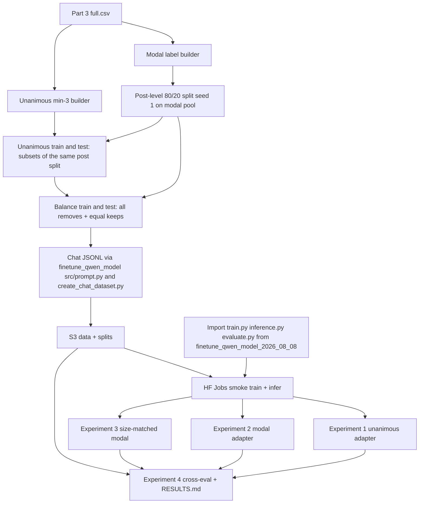

# LoRA fine-tune Qwen3.5 4B on Phase 2 Part 3 keep/remove labels (unanimous and modal)

## Remember
- Exact file paths always
- Exact commands with expected output
- DRY, YAGNI, TDD, frequent commits
- Delegated tasks must be impossible to misread.

## Overview
Fine-tune `Qwen/Qwen3.5-4B` with LoRA on Study Phase 2 Part 3 keep/remove labels: unanimous-only posts (at least three raters, all agree) and modal posts (majority vote, ties become remove). Reuse the August 2026 Qwen fine-tune stack and the thin-wrapper pattern from `experiments/larger_finetune_qwen_model_2026_08_08/`. Part 2 baselines (reference only, different base model): unanimous min-3 remove-F1 0.74 to 0.97 after 3 epochs; modal remove-F1 0.72 to 0.70 after 1 epoch. Part 3 raw export: `shared/data/raw/study_phase_2_part_3/results/full.csv` and `shared/data/raw/study_phase_2_part_3/stimuli/flips.csv`. Filters: linked-fate evaluation, decision is keep or remove, one rating per worker and post (moderation-trial rows with a post id). These yield about 79,500 scored trial rows across roughly 18,866 posts. No Part 3 label builders or registry entries exist yet. New work lives under `experiments/finetune_lora_phase2_part3_2026_09_24/` with post-level leakage-safe splits, Hugging Face Jobs, and S3 prefix `s3://mirrorview-experimental-artifacts/experiments/finetune_lora_phase2_part3_2026_09_24/`.

Verified Part 3 label pools (pre-balance, pre-split):
| Pool | Posts | Keep | Remove |
| --- | ---: | ---: | ---: |
| Modal | 18,866 | 13,604 | 5,262 |
| Unanimous min-3 | 4,889 | 4,411 | 478 |

Expected approximate balanced training sizes after Step 2 (exact counts print when split scripts run): unanimous train about 764 rows (382 remove + 382 keep); modal train about 8,418 rows. Risk: unanimous remove count is small (478 total); unanimous test will have roughly 96 removes, so report 95% confidence intervals for F1 (bootstrap over test posts, seed 1).

**Out of scope:** QLoRA; hyperparameter sweeps; prompt ablations; editing Part 2 confirmed data or results; changing Part 2 label outputs (Step 1 moves shared logic but keeps Part 2 CSVs byte-identical).

## Happy flow
An operator builds Part 3 modal and unanimous label CSVs in the shared data layer, confirms post-level splits and chat JSONL for three training sets and two balanced test sets, smoke-tests Hugging Face Jobs on `Qwen/Qwen3.5-4B` with thinking disabled, trains three adapters (unanimous, full modal, size-matched modal), runs zero-shot baseline and all adapters on both test sets, and writes a cross-evaluation matrix to `RESULTS.md`.



## Approach
Import from `experiments/finetune_qwen_model_2026_08_08/src/prompt.py`, `src/build_splits.py`, `src/create_chat_dataset.py`, `src/parse_prediction.py`, `train.py`, `inference.py`, and `evaluate.py` instead of copying bodies. Add only Part 3 label builders, post-level split logic, a Hugging Face Jobs launcher, and experiment wrappers. Part 3 builders reuse aggregation logic in `shared/data/transformed/study_phase_2_part_2/transform.py` and `shared/data/transformed/study_phase_2_part_2/transform_keep_remove_labels_unanimous_min3.py` by extracting it into `shared/data/transformed/keep_remove_aggregation.py` (Step 1; Part 2 outputs stay byte-identical, verified by re-running Part 2 builders). Assign train and test once at the post level on the modal label pool (stratified by modal label, seed 1, 80/20); derive unanimous train and test as subsets of those post ids. Balance training sets: all removes plus equal sampled keeps (seed 1). Balance test sets: all test-split removes plus equal sampled test-split keeps (seed 1, same rule as Part 2). Experiment 3 draws from Experiment 2 modal training posts, keeps 1:1 balance, and matches Experiment 1 balanced unanimous training row count exactly (same removes and keeps), seed 1.

## Proposed file structure
```text
experiments/finetune_lora_phase2_part3_2026_09_24/
  README.md
  SETUP.md
  RESULTS.md
  shared/
    build_splits.py
    create_chat_dataset.py
    launch_hf_jobs.py
    run_config.py
    tests/
  experiment1_unanimous/
    config.yaml
    data/
    preds/
    adapters/
  experiment2_modal/
    config.yaml
    data/
    preds/
    adapters/
  experiment3_modal_size_matched/
    config.yaml
    data/
    preds/
    adapters/
  experiment4_cross_eval/
    score_all.py          # cross-eval scoring and RESULTS.md writer
    preds/
    scores/
  tests/

shared/data/transformed/
  keep_remove_aggregation.py   # extracted Part 2 aggregation logic (new)

shared/data/transformed/study_phase_2_part_3/
  transform.py
  transform_keep_remove_labels_unanimous_min3.py
  keep_remove_labels.csv
  keep_remove_labels_unanimous_min3.csv
  tests/

shared/data/registry.py
  (two new transformed dataset entries for Part 3 modal and unanimous-min3 CSVs)
```

## Proposed experiment setup
| Arm | Training labels | Training rows (after balance) | Epochs | Inference targets |
| --- | --- | --- | --- | --- |
| Experiment 1 | Unanimous min-3 (Part 3) | All Part 3 removes in unanimous train split plus equal sampled keeps | 3 | Balanced unanimous test and balanced modal test |
| Experiment 2 | Modal (Part 3) | All Part 3 removes in modal train split plus equal sampled keeps | 1 | Balanced unanimous test and balanced modal test |
| Experiment 3 | Modal (Part 3), size-matched | Drawn from Experiment 2 modal training posts; 1:1 balance; same remove and keep counts as Experiment 1 (about 764 rows) | 3 (same as Experiment 1, so only the label rule differs) | Balanced unanimous test and balanced modal test |
| Experiment 4 | None (scoring only) | Zero-shot base model plus all three adapters | n/a | Cross matrix on both test sets |

| Held constant | Value |
| --- | --- |
| Base model | `Qwen/Qwen3.5-4B`, thinking disabled |
| LoRA | rank 16, alpha 32, dropout 0.05, attention and MLP targets |
| Optimizer schedule | learning rate 2e-4, cosine with about 4% warmup, assistant-only loss |
| Batch | per-device 1, gradient accumulation 8, max sequence length 2048 |
| Split seed | 1 |
| Prompt | `experiments/finetune_qwen_model_2026_08_08/src/prompt.py` |
| Positive metric class | remove |
| Metrics | remove-F1 (with 95% bootstrap CI over test posts, seed 1), precision, recall, accuracy, invalid rate; invalid generations scored as wrong |
| S3 prefix | `s3://mirrorview-experimental-artifacts/experiments/finetune_lora_phase2_part3_2026_09_24/` |

## Steps

### Step 1: Build Part 3 modal and unanimous label sets in the shared data layer
Extract `shared/data/transformed/keep_remove_aggregation.py` from Part 2 builders and update Part 2 to import it (byte-identical outputs). Add Part 3 builders under `shared/data/transformed/study_phase_2_part_3/`, register CSVs, add tests, print counts.

### Step 2: Confirm post-level splits and chat datasets for all training and test sets
Add split and chat builders under `experiments/finetune_lora_phase2_part3_2026_09_24/shared/` following `experiments/finetune_qwen_model_2026_08_08/src/build_splits.py` and `src/create_chat_dataset.py` (prompt from `src/prompt.py`): post-level 80/20 split (seed 1), unanimous subsets, balanced train and test sets per rules above. Write README and SETUP, sync to S3.

### Step 3: Add Hugging Face Jobs launcher and run a smoke job
Add a Hugging Face Jobs launcher under `experiments/finetune_lora_phase2_part3_2026_09_24/shared/`, reusing `experiments/finetune_qwen_model_2026_08_08/train.py` and `inference.py` and the jobs pattern from `experiments/reasoning_during_moderation_2026_09_15/shared/`. Smoke tiny train plus infer on `Qwen/Qwen3.5-4B` with thinking disabled; parsed output must be `keep` or `remove` only.

### Step 4: Experiment 1 train unanimous adapter and infer on both test sets
Train on the Experiment 1 unanimous training chat file for 3 epochs via Hugging Face Jobs, then run adapter inference on both balanced test chat files. Store adapters and prediction CSVs locally and on S3.

### Step 5: Experiment 2 train modal adapter and infer on both test sets
Same as Step 4 on Experiment 2 with the full balanced modal training set and 1 epoch.

### Step 6: Experiment 3 train size-matched modal adapter and infer on both test sets
Subsample Experiment 2 modal training posts to match Experiment 1 balanced unanimous training counts exactly (same number of removes and keeps, 1:1 balance, seed 1), train 3 epochs to match Experiment 1 step count, infer on both balanced test sets.

### Step 7: Experiment 4 zero-shot baseline, score all predictions, write RESULTS.md
Run zero-shot base-model inference on both balanced test sets. Score all predictions with `experiments/finetune_qwen_model_2026_08_08/evaluate.py`, add a 95% bootstrap CI over test posts for F1 in `experiments/finetune_lora_phase2_part3_2026_09_24/experiment4_cross_eval/score_all.py` (the August evaluator has no CI), and write the cross-evaluation matrix to `RESULTS.md`.

## What "done" looks like
1. Part 3 label CSVs, builders, tests, and registry entries exist; Part 2 transforms byte-identical.
2. Experiment folder has README, SETUP, RESULTS, shared code, four experiment arms, and passing tests.
3. One post-level split manifest (seed 1); no test post id in any training chat file.
4. Three adapters plus zero-shot baseline scored on both balanced test sets; artifacts on S3.
5. `RESULTS.md` has the 4-by-2 cross-evaluation matrix, invalid rates, F1 confidence intervals, and split counts.
6. Combined pytest for shared data and experiment tests exits 0; Part 2 experiment results stay untouched.

## Open questions for approval
- **Pool Part 2 and Part 3 or Part 3 only?** Default: Part 3 only (matches proposed design; keeps Part 3 stimuli and raters isolated).
- **Filter attention-check failures?** Default: keep all rows (matches Part 2 shared transforms; about 77% pass rate in Part 3 export).
- **Base model: `Qwen/Qwen3.5-4B` vs `Qwen/Qwen3-4B-Instruct-2507`?** Default: `Qwen/Qwen3.5-4B` per `AGENTS.md` (Part 2 numbers stay reference-only, not comparable head-to-head).
- **Compute: Hugging Face Jobs vs SageMaker?** Default: Hugging Face Jobs per `AGENTS.md` (replace the SageMaker launcher pattern from the August 2026 experiment for this run).
- **Keep Experiment 3 size-matched ablation?** Default: yes (same rows and epochs as Experiment 1, so it separates label rule from training set size).

## Commands
Part 3 label builders (after Step 1 lands):
```bash
PYTHONPATH=. uv run python shared/data/transformed/study_phase_2_part_3/transform.py
PYTHONPATH=. uv run python shared/data/transformed/study_phase_2_part_3/transform_keep_remove_labels_unanimous_min3.py
```

Expected: `Wrote .../keep_remove_labels.csv`, `rows=<modal_post_count>`, keep and remove counts; same for unanimous file. Modal 18,866 posts (13,604 keep, 5,262 remove); unanimous min-3 4,889 posts (4,411 keep, 478 remove).

Confirm splits and chat datasets (after Step 2 lands):
```bash
PYTHONPATH=. uv run python experiments/finetune_lora_phase2_part3_2026_09_24/shared/build_splits.py --force
PYTHONPATH=. uv run python experiments/finetune_lora_phase2_part3_2026_09_24/shared/create_chat_dataset.py --force
```

Expected: split counts, balanced rows (unanimous train about 764, modal about 8,418), data paths under `experiment1_unanimous/data/` through `experiment3_modal_size_matched/data/`, shared test files for Experiment 4.

Upload confirmed data to S3:
```bash
export AWS_ACCESS_KEY_ID="$LAB_AWS_ACCESS_KEY_ID"
export AWS_SECRET_ACCESS_KEY="$LAB_AWS_ACCESS_KEY_SECRET"

aws s3 sync experiments/finetune_lora_phase2_part3_2026_09_24/ \
  s3://mirrorview-experimental-artifacts/experiments/finetune_lora_phase2_part3_2026_09_24/ \
  --exclude "preds/*" --exclude "adapters/*"
```

Expected: sync summary listing `data/` and split manifest objects under the prefix.

Hugging Face Jobs smoke (after Step 3 lands, `HF_TOKEN` set):
```bash
PYTHONPATH=. uv run python experiments/finetune_lora_phase2_part3_2026_09_24/shared/launch_hf_jobs.py \
  --mode smoke --limit 5 --dry-run

PYTHONPATH=. uv run python experiments/finetune_lora_phase2_part3_2026_09_24/shared/launch_hf_jobs.py \
  --mode smoke --limit 5 --wait
```

Expected: dry-run prints job spec; live smoke yields only `keep` or `remove` parses.

Unit tests:
```bash
PYTHONPATH=. uv run pytest shared/data/transformed/study_phase_2_part_3/tests experiments/finetune_lora_phase2_part3_2026_09_24/tests -q
```

Expected: stdout ends with `passed`, exit code 0.

Train and infer (representative; repeat for experiments 2 and 3 after approval):
```bash
PYTHONPATH=. uv run python experiments/finetune_lora_phase2_part3_2026_09_24/shared/launch_hf_jobs.py \
  --mode train --experiment experiment1_unanimous --run-id part3_uni_001 --wait

PYTHONPATH=. uv run python experiments/finetune_lora_phase2_part3_2026_09_24/shared/launch_hf_jobs.py \
  --mode infer_adapter --experiment experiment1_unanimous --run-id part3_uni_001 \
  --test-set unanimous --wait

PYTHONPATH=. uv run python experiments/finetune_lora_phase2_part3_2026_09_24/shared/launch_hf_jobs.py \
  --mode infer_adapter --experiment experiment1_unanimous --run-id part3_uni_001 \
  --test-set modal --wait
```

Expected: completed job ids, adapter under `experiment1_unanimous/adapters/part3_uni_001/`, prediction CSVs under `experiment1_unanimous/preds/` and S3 mirrors.

Write results (after Step 7 lands):
```bash
PYTHONPATH=. uv run --extra finetune-qwen-2026-08-08 python \
  experiments/finetune_lora_phase2_part3_2026_09_24/experiment4_cross_eval/score_all.py \
  --write-results experiments/finetune_lora_phase2_part3_2026_09_24/RESULTS.md
```

Expected: `RESULTS.md` with 4-by-2 matrix, invalid rates, F1 95% CIs, split counts.
