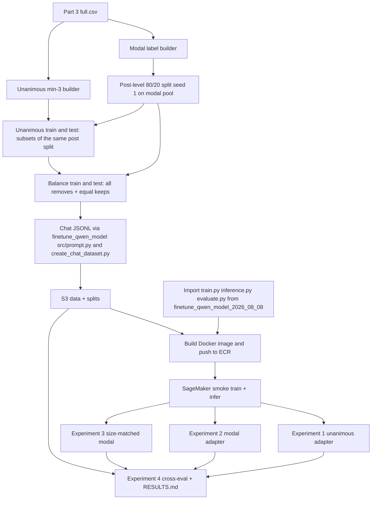

# LoRA fine-tune Qwen3.5 4B on Phase 2 Part 3 keep/remove labels (unanimous and modal)

## Remember
- Exact file paths always
- Exact commands with expected output
- DRY, YAGNI, TDD, frequent commits
- Delegated tasks must be impossible to misread.

## Overview
LoRA fine-tune `Qwen/Qwen3.5-4B` on Study Phase 2 Part 3 keep/remove labels: unanimous-only posts (at least three raters, all agree) and modal posts (majority vote; ties become remove). Reuse the August 2026 Qwen fine-tune stack and the thin-wrapper pattern from `experiments/larger_finetune_qwen_model_2026_08_08/`. Part 2 baselines are reference only because the base model differs. Input is `shared/data/raw/study_phase_2_part_3/results/full.csv`. No Part 3 label builders or registry entries exist yet. New work goes under `experiments/finetune_lora_phase2_part3_2026_09_24/` with post-level leakage-safe splits, SageMaker training and inference (same pattern as the August 2026 experiment), and S3 prefix `s3://mirrorview-experimental-artifacts/experiments/finetune_lora_phase2_part3_2026_09_24/`.

Verified Part 3 label pools (pre-balance, pre-split; worker-post dedupe on, conflicts dropped, earliest row per pair by original CSV row order):
| Pool | Posts | Keep | Remove |
| --- | ---: | ---: | ---: |
| Modal | 18,862 | 13,629 | 5,233 |
| Unanimous min-3 | 4,988 | 4,497 | 491 |

After Step 2, expected balanced training sizes are approximate (exact counts print when split scripts run): unanimous train about 808 rows (404 remove + 404 keep); modal train about 8,372 rows; Experiment 3 matches Experiment 1. Balanced test sets: unanimous about 174 rows; modal about 2,094 rows. Risk: unanimous remove count is small (491 total), so unanimous test has roughly 87 removes before keep sampling; report 95% confidence intervals for F1 (bootstrap over test posts, 1000 resamples, seed 1).

**Out of scope:** QLoRA; hyperparameter sweeps; prompt ablations; editing Part 2 confirmed data or results; changing Part 2 label outputs (Step 1 moves shared logic but keeps Part 2 CSVs byte-identical).

## Happy flow
An operator builds Part 3 modal and unanimous label CSVs in the shared data layer, confirms post-level splits and chat JSONL for three training sets and two balanced test sets, builds and pushes a SageMaker Docker image, smoke-tests train and infer on `Qwen/Qwen3.5-4B` with thinking disabled, trains three adapters (unanimous, full modal, size-matched modal), runs the zero-shot baseline and all adapters on both test sets, and writes a cross-evaluation matrix to `RESULTS.md`.



## Approach
Import from `experiments/finetune_qwen_model_2026_08_08/` (prompt, split builders, chat dataset, train, inference, evaluate) instead of copying bodies. Add Part 3 label builders, post-level split logic, and a SageMaker wrapper that mirrors `experiments/larger_finetune_qwen_model_2026_08_08/`. In Step 1, extract shared aggregation into `shared/data/transformed/keep_remove_aggregation.py` so Part 2 CSVs stay byte-identical with dedupe off and Part 3 builders enable worker-post dedupe. Assign train and test once at post level on the modal pool (stratified by modal label, seed 1, 80/20); unanimous sets are subsets of those post ids. Balance train and test with all removes plus equal sampled keeps (seed 1). Experiment 3 subsamples Experiment 2 modal training posts to match Experiment 1 row counts (seed 1). Store adapters on S3 only, not in git.

## Proposed file structure
```text
experiments/finetune_lora_phase2_part3_2026_09_24/
  __init__.py
  README.md
  SETUP.md
  RESULTS.md
  Dockerfile
  entrypoint.sh
  launch_sagemaker.py
  data/
    split_manifest.csv
    test_unanimous.csv
    test_modal.csv
    chat_test_unanimous.jsonl
    chat_test_modal.jsonl
  shared/
    __init__.py
    run_config.py
    build_splits.py
    create_chat_dataset.py
  experiment1_unanimous/
    data/{train.csv, chat_train.jsonl}
    preds/{test_unanimous.csv, test_modal.csv}
  experiment2_modal/                    # same data/ and preds/ layout
  experiment3_modal_size_matched/       # same data/ and preds/ layout
  experiment4_cross_eval/
    score_all.py
    preds/{test_unanimous.csv, test_modal.csv}
    scores/cross_eval.csv
  tests/
    test_build_splits.py
    test_create_chat_dataset.py
    test_run_config.py
    test_launch_sagemaker_config.py
    test_score_all.py

shared/data/transformed/
  keep_remove_aggregation.py

shared/data/transformed/study_phase_2_part_2/
  transform.py
  transform_keep_remove_labels_unanimous_min3.py

shared/data/transformed/study_phase_2_part_3/
  __init__.py
  transform.py
  transform_keep_remove_labels_unanimous_min3.py
  keep_remove_labels.csv
  keep_remove_labels_unanimous_min3.csv
  tests/
    __init__.py
    conftest.py
    test_transform.py
    test_transform_unanimous_min3.py

shared/data/registry.py

experiments/finetune_qwen_model_2026_08_08/
  train.py
  inference.py
  infra/main.tf
```

S3 mirrors local paths under the experiment prefix; `adapters/<run_id>/` stays on S3 only.

## Proposed experiment setup
| Arm | Training labels | Training rows (after balance) | Epochs | Inference targets |
| --- | --- | --- | --- | --- |
| Experiment 1 | Unanimous min-3 (Part 3) | All Part 3 removes in unanimous train split plus equal sampled keeps | 3 | Balanced unanimous test and balanced modal test |
| Experiment 2 | Modal (Part 3) | All Part 3 removes in modal train split plus equal sampled keeps | 1 | Balanced unanimous test and balanced modal test |
| Experiment 3 | Modal (Part 3), size-matched | Drawn from Experiment 2 modal training posts; 1:1 balance; same remove and keep counts as Experiment 1 (about 808 rows) | 3 (same as Experiment 1, so only the label rule differs) | Balanced unanimous test and balanced modal test |
| Experiment 4 | None (scoring only) | Zero-shot base model plus all three adapters | n/a | Cross matrix on both test sets |

| Held constant | Value |
| --- | --- |
| Base model | `Qwen/Qwen3.5-4B`, thinking disabled in chat template (train and infer render identically) |
| LoRA | rank 16, alpha 32, dropout 0.05, attention and MLP targets |
| Optimizer schedule | learning rate 2e-4, cosine with about 4% warmup, assistant-only loss |
| Batch | per-device 1, gradient accumulation 8, max sequence length 2048 |
| Split seed | 1 |
| Prompt | `experiments/finetune_qwen_model_2026_08_08/src/prompt.py` |
| Positive metric class | remove |
| Metrics | remove-F1 (with 95% bootstrap CI over test posts, 1000 resamples, seed 1), precision, recall, accuracy, invalid rate; invalid generations scored as wrong |
| Compute | SageMaker, region us-east-2, instance ml.g5.xlarge, execution role from Terraform output mapped to `SAGEMAKER_ROLE_ARN`, ECR image `mirrorview-finetune-lora-phase2-part3` |
| S3 prefix | `s3://mirrorview-experimental-artifacts/experiments/finetune_lora_phase2_part3_2026_09_24/` |

## Steps

### Step 1: Build Part 3 modal and unanimous label sets in the shared data layer
Extract `keep_remove_aggregation.py`, update Part 2 imports for byte-identical outputs, add Part 3 builders, registry entries, and tests.

### Step 2: Confirm post-level splits and chat datasets for all training and test sets
Add split and chat builders under `shared/`, write README and SETUP, sync confirmed data to S3.

### Step 3: SageMaker wrapper, Docker image, Terraform, and smoke job
Add `run_config.py`, `launch_sagemaker.py`, `Dockerfile`, and `entrypoint.sh` (mirror the larger-finetune wrapper). Extend prior-package train and inference with optional chat-template kwargs. Add the S3 prefix and ECR repo to prior-package Terraform. Build and push the image, then run a smoke job (2 train steps, 5 infer rows).

### Step 4: Experiment 1 train unanimous adapter and infer on both test sets
Train 3 epochs via SageMaker (`part3_uni_001`); infer both test sets in one job. Artifacts on S3.

### Step 5: Experiment 2 train modal adapter and infer on both test sets
Full balanced modal train, 1 epoch (`part3_modal_001`); infer both test sets.

### Step 6: Experiment 3 train size-matched modal adapter and infer on both test sets
Subsample to Experiment 1 counts, train 3 epochs (`part3_modal_sm_001`); infer both test sets.

### Step 7: Experiment 4 zero-shot baseline, score all predictions, write RESULTS.md
Zero-shot infer (`part3_zeroshot_001`), score all preds with bootstrap F1 CI, write cross-eval matrix to `RESULTS.md`.

## Step files
- `steps/step1.md`: Build Part 3 label sets (shared data layer)
- `steps/step2.md`: Confirm splits and chat datasets; write README.md, SETUP.md; sync data to S3
- `steps/step3.md`: SageMaker wrapper (run_config, launch_sagemaker, Dockerfile, entrypoint, infra, prior-code kwarg), build+push image, smoke job
- `steps/step4.md`: Experiment 1: train unanimous adapter, infer both test sets
- `steps/step5.md`: Experiment 2: train modal adapter, infer both test sets
- `steps/step6.md`: Experiment 3: train size-matched modal adapter, infer both test sets
- `steps/step7.md`: Experiment 4: zero-shot baseline infer, score_all, write RESULTS.md

## What "done" looks like
1. Part 3 label CSVs, builders, tests, and registry entries exist; Part 2 transforms byte-identical.
2. SageMaker wrapper, Dockerfile, entrypoint, four experiment arms, and passing tests in the experiment folder.
3. One post-level `split_manifest.csv` (seed 1), and no test post id appears in any training chat file.
4. Three adapters plus zero-shot baseline scored on both balanced test sets; artifacts on S3.
5. `RESULTS.md` has the 4-by-2 cross-eval matrix with F1 CIs, invalid rates, and split counts.
6. Combined pytest exits 0; Part 2 experiment results stay untouched.

## Decisions
- **Scope:** Part 3 only; keep attention-check failures; modal ties become remove; unanimous requires at least three raters who all agree.
- **Base model:** `Qwen/Qwen3.5-4B` with thinking disabled in the chat template for both training and inference.
- **Compute:** SageMaker (region us-east-2, ml.g5.xlarge, ECR image, entrypoint modes train | infer_baseline | infer_adapter), same pattern as the August 2026 experiment.
- **Experiment 3:** Keep the size-matched ablation (same row counts and 3 epochs as Experiment 1, so only the label rule differs).

## Commands
Part 3 label builders (after Step 1):
```bash
PYTHONPATH=. uv run python shared/data/transformed/study_phase_2_part_3/transform.py
PYTHONPATH=. uv run python shared/data/transformed/study_phase_2_part_3/transform_keep_remove_labels_unanimous_min3.py
```

Expected: modal 18,862 posts; unanimous min-3 4,988 posts (counts match table above).

Confirm splits (after Step 2):
```bash
PYTHONPATH=. uv run python experiments/finetune_lora_phase2_part3_2026_09_24/shared/build_splits.py --force
PYTHONPATH=. uv run python experiments/finetune_lora_phase2_part3_2026_09_24/shared/create_chat_dataset.py --force
```

Expected: unanimous train about 808, modal about 8,372.

Upload data to S3 (Step 2; export AWS creds per AGENTS.md):
```bash
export AWS_ACCESS_KEY_ID="$LAB_AWS_ACCESS_KEY_ID"
export AWS_SECRET_ACCESS_KEY="$LAB_AWS_ACCESS_KEY_SECRET"

for dir in data experiment1_unanimous/data experiment2_modal/data experiment3_modal_size_matched/data; do
  aws s3 sync "experiments/finetune_lora_phase2_part3_2026_09_24/${dir}/" \
    "s3://mirrorview-experimental-artifacts/experiments/finetune_lora_phase2_part3_2026_09_24/${dir}/" \
    --region us-east-2
done
```

Terraform and Docker (after Step 3):
```bash
cd experiments/finetune_qwen_model_2026_08_08/infra && terraform apply
export SAGEMAKER_ROLE_ARN="$(terraform output -raw sagemaker_execution_role_arn)"

cd /workspace
docker build -t mirrorview-finetune-lora-phase2-part3 \
  -f experiments/finetune_lora_phase2_part3_2026_09_24/Dockerfile .
# tag and push to ECR repo mirrorview-finetune-lora-phase2-part3 in us-east-2
```

SageMaker smoke (after Step 3):
```bash
PYTHONPATH=. uv run --extra finetune-qwen-2026-08-08 python \
  experiments/finetune_lora_phase2_part3_2026_09_24/launch_sagemaker.py \
  --mode train --experiment experiment1_unanimous --run-id part3_smoke_001 --smoke --dry-run

PYTHONPATH=. uv run --extra finetune-qwen-2026-08-08 python \
  experiments/finetune_lora_phase2_part3_2026_09_24/launch_sagemaker.py \
  --mode train --experiment experiment1_unanimous --run-id part3_smoke_001 --smoke --wait

PYTHONPATH=. uv run --extra finetune-qwen-2026-08-08 python \
  experiments/finetune_lora_phase2_part3_2026_09_24/launch_sagemaker.py \
  --mode infer_adapter --experiment experiment1_unanimous --run-id part3_smoke_001 --smoke --wait
```

Expected: dry-run prints job config; live smoke train completes 2 steps; live smoke infer writes 5 rows per test set with only `keep` or `remove` parses.

Unit tests:
```bash
PYTHONPATH=. uv run pytest shared/data/transformed/study_phase_2_part_3/tests \
  experiments/finetune_lora_phase2_part3_2026_09_24/tests -q
PYTHONPATH=. uv run pytest experiments/finetune_qwen_model_2026_08_08/tests -q
```

Train and infer (repeat for experiments 2 and 3 with matching run ids):
```bash
PYTHONPATH=. uv run --extra finetune-qwen-2026-08-08 python \
  experiments/finetune_lora_phase2_part3_2026_09_24/launch_sagemaker.py \
  --mode train --experiment experiment1_unanimous --run-id part3_uni_001 --wait

PYTHONPATH=. uv run --extra finetune-qwen-2026-08-08 python \
  experiments/finetune_lora_phase2_part3_2026_09_24/launch_sagemaker.py \
  --mode infer_adapter --experiment experiment1_unanimous --run-id part3_uni_001 --wait
```

Sync predictions back from S3:
```bash
aws s3 sync \
  s3://mirrorview-experimental-artifacts/experiments/finetune_lora_phase2_part3_2026_09_24/experiment1_unanimous/preds/ \
  experiments/finetune_lora_phase2_part3_2026_09_24/experiment1_unanimous/preds/
```

Write results (after Step 7):
```bash
PYTHONPATH=. uv run --extra finetune-qwen-2026-08-08 python \
  experiments/finetune_lora_phase2_part3_2026_09_24/experiment4_cross_eval/score_all.py \
  --write-results experiments/finetune_lora_phase2_part3_2026_09_24/RESULTS.md
```

Expected: `RESULTS.md` with 4-by-2 matrix, invalid rates, F1 95% CIs, split counts.
