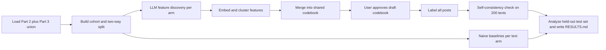

# Generate LLM features for Phase 2, Part 3 linked-fate moderation data

## Remember
- Exact file paths always
- Exact commands with expected output
- DRY, YAGNI, TDD, frequent commits
- Delegated tasks must be impossible to misread.

## Overview

The goal is a new experiment at `experiments/llm_feature_generation_phase_2_part_3_2026_09_24/` that discovers, normalizes, and operationalizes moderation features on the Part 2 plus Part 3 union (20,000 posts). The folder name predates the merged dataset. Load the union through `shared/data/dataloader.py` from S3. The pipeline runs separately on original text, mirrored text, and paired original plus mirror text. It follows the lab Discover, Normalize, Operationalize method in [HOW_TO_MINE_TEXT_FOR_FEATURES.md](https://github.com/METResearchGroup/lab_wiki/blob/main/docs/manuals/methods/HOW_TO_MINE_TEXT_FOR_FEATURES.md) and [HOW_TO_CLUSTER_TEXT.md](https://github.com/METResearchGroup/lab_wiki/blob/main/docs/manuals/methods/HOW_TO_CLUSTER_TEXT.md). Copy and adapt Part 2 reference code from `experiments/create_llm_features_2026_08_05/src/` (`llm_generate_features.py`, `generate_embeddings.py`, `cluster_embeddings.py`, `generate_labels_for_embeddings.py`, `prompts.py`, `schemas.py`, `paths.py`), and copy mixed-batch prompt patterns from `experiments/llm_based_feature_generation_2026_07_31/prompts.py`, `schemas.py`, and `stage1.py`. Do not add cross-experiment imports. Upload artifacts to `s3://mirrorview-experimental-artifacts/experiments/llm_feature_generation_phase_2_part_3_2026_09_24/` with the same prefix as the local folder.

A 50/50 post-level discovery versus held-out split prevents double dipping. Stratify the split by modal keep/remove label, sampled stance, toxicity bucket, and Part 2 catalog membership. Run feature mining only on discovery posts, and reserve the held-out half as the test set for every Q1 through Q7 analysis. After you approve the codebook, label all 20,000 posts with original and mirrored text coded separately (40,000 labeling requests via the OpenAI Batch API). Use discovery-half labels only for description, Part 2 catalog overlap description on posts in the Part 2 catalog, and downstream reuse. Run every hypothesis test and model comparison for Q1 through Q7 on the held-out half only. Commit the post-ID lists to fix the Part 2 reproducibility gap, because the sampled subset CSV was never committed.

Part 2 (`experiments/llm_based_feature_generation_2026_07_31/`, `experiments/create_llm_features_2026_08_05/`) used mixed-contrast batches (10 keep plus 10 remove) and a two-stage theme synthesis that produced 132 themes. Per `experiments/llm_based_feature_generation_2026_07_31/RESULTS.md`, rhetorical form (profanity, dehumanization, ridicule, us-vs-them, conspiracy) predicted remove better than policy topic, while argument and evidence predicted keep. Because Part 2 passed original and mirror jointly with no separate arms, Part 3 adds the three-arm comparison that Part 2 could not run.

The merged export (Part 2 plus Part 3 union, `docs/runbooks/HISTORY_OF_STUDY.md`) has 20,000 posts (1,101 appear only in Part 2), 103,060 scored linked-fate labels (79,500 from Part 3 plus 23,560 from Part 2), modal keep rate 75.7%, and every post has 3 or more labels. Three-group eligible posts number 10,761 (split 5,217, unanimous keep 5,126, unanimous remove 418). Post texts are identical across collections. No participant appears in both collections. Both collections use the same linked-fate task and training_assisted condition. The Part 2 catalog contains 10,000 posts; flag `in_part2_catalog` for membership in that catalog.

## Happy flow

An engineer builds the post-level cohort and a reproducible two-way split (discovery and held-out test), runs naive baselines and the three-arm LLM discovery pipeline on the discovery half, merges per-arm clusters into a human-approved codebook, labels all 20,000 posts with original and mirror coded separately, runs a self-consistency check on a 200-text sample, and writes `RESULTS.md` with tables that answer the seven research questions on the held-out half only.



## Approach

Run naive baselines first. Compute document-frequency unigrams and bigrams by keep versus remove, and run K-Means on Titan post embeddings with a k sweep. Then run the LLM batch feature generation pipeline with mixed-contrast batches as the primary design and single-class batches as an ablation.

Embed generated features with Titan (`shared/embeddings/bedrock.py`), cluster with HDBSCAN as the primary method and K-Means as a comparison, and name clusters with an LLM. Run three random seeds and report cluster stability within and across text arms. Merge per-arm clusters into one shared codebook. By default, do not merge features. Merge two features only after side-by-side review of example posts and a human confirms the match. Record confirmed merges in a committed synonym list file under the experiment folder, and present the draft codebook for human review before labeling starts.

Use `gpt-6-luna` (API model id `gpt-6-luna`) for every LLM step: feature generation, cluster naming, codebook merge support, Part 2 theme mapping support, and labeling. Set reasoning effort to none on every call, because GPT-6 Luna defaults to medium and you must record the setting in run metadata. Part 2 used `gpt-5.4-nano`, so Part 2 versus Part 3 theme differences mix a model change with a data change, and the Q1 replication result must state that. Smoke test one batch per text arm before any production run. The smoke test must confirm that LiteLLM directly (model `openai/gpt-6-luna`) accepts the model id and the no-reasoning setting, and that run metadata shows zero reasoning tokens. Do not start production until the user approves. Do not run a model ablation; keep the model fixed.

## Steps

### Step 1: Build post-level cohort and discovery and held-out split

Build the union cohort from the merged registry export. Derive a `collection` column (`part2` or `part3`) from participant membership. Use modal keep/remove as the primary label and the stratification label for every post. Apply three-group labels (unanimous keep, split, unanimous remove) only to eligible posts, following the logic in `experiments/reasoning_during_moderation_2026_09_15/shared/cohort.py`. After you drop conflicting worker-post pairs and deduplicate to one row per worker per post, a post must have at least 4 raters to receive a three-group label. Split posts have a two-two, three-two, or two-three keep-remove vote split. Unanimous keep posts have only keep votes and at least 4 raters. Unanimous remove posts have only remove votes and at least 4 raters. Posts with fewer than 4 raters or any other vote pattern receive no three-group label. Split rule: the original 18,899 Part 3 posts keep their discovery or test half; the 1,101 Part-2-only posts split 50/50 among themselves with the same stratification columns and seed 42; no post changes halves. Apply a 50/50 discovery versus held-out split stratified by modal keep/remove label, sampled stance (left or right), sampling toxicity bucket (low, middle, or high), and `in_part2_catalog`. Reserve the held-out half as the test set for all Q1 through Q7 analyses. Upload the split to S3 and commit the post-ID lists under `experiments/llm_feature_generation_phase_2_part_3_2026_09_24/data/post_split/`. Participant filters: `all` (default), `attention_pass` (drop Part 3 attention-check failures; keep all Part 2 trials because Part 2 collected no attention check), and `part3_only` (Part 3 labels only).

### Step 2: Naive baselines per text arm

Rerun on the updated discovery half. On discovery posts only, compute document-frequency unigrams and bigrams separately for keep versus remove (not TF-IDF) in each text arm (original only, mirror only, paired). Embed posts with Titan and run K-Means with a k sweep (2 through 10) as a clustering baseline before any LLM-generated features. Store outputs under `outputs/original_only/baselines/`, `outputs/mirror_only/baselines/`, and `outputs/paired/baselines/`, and upload them to S3.

### Step 3: LLM batch feature generation (discovery half only)

Copy and adapt the reference files listed in the Overview into the new experiment `src/` folder. Production mixed discovery already ran on the original Part 3 discovery half with Part 3 majority labels; keep that run (discovery only proposes features; tests use union labels on held-out posts). About 12% of those discovery posts now have a different union majority label; document this label-drift caveat. Add a top-up mixed discovery run over new discovery posts only (about 550), with `batch_design=mixed_topup` in a new run directory per arm. In each text arm, run mixed-contrast batches (10 keep plus 10 remove) as the primary design, with single-class batches (500 keep, 500 remove, per `experiments/create_llm_features_2026_08_05/README.md`) as an ablation. Use `gpt-6-luna` with reasoning effort set to none on every call, and record the setting in run metadata. Cap at 8 keep plus 8 remove features per batch with evidence spans, matching Part 2 stage 1. Run one smoke batch per arm, and start production only after user approval. Finished discovery spend was about $0.83 (smoke plus production), with zero reasoning tokens.

### Step 4: Normalize features (embed, cluster, name)

Read both the main mixed discovery run and the top-up mixed run per arm when flattening features. Embed all generated feature texts with Titan (`shared/embeddings/bedrock.py`, 256 dimensions, L2-normalized). Cluster with HDBSCAN as the primary method and K-Means as a comparison. Ask `gpt-6-luna` (reasoning effort none) to name each cluster from a random sample of member features. Run three random seeds and report cluster overlap across seeds and across text arms. Store outputs under `outputs/original_only/normalize/`, `outputs/mirror_only/normalize/`, and `outputs/paired/normalize/` (each with a run timestamp subfolder).

### Step 5: Operationalize into a shared codebook

Merge per-arm cluster outputs into one shared codebook. Give each entry a short name, one-sentence definition, positive and negative examples, and the text arm where it was discovered. By default, do not merge features. Merge two features only after side-by-side review of example posts and a human confirms the match. Record every confirmed merge in a committed synonym list file under the experiment folder. Present the draft codebook for human review, and do not start labeling until the user approves.

### Step 6: Label all posts and run self-consistency check

Use the approved codebook to label every post's original text and mirrored text separately as present or absent per feature. Use the OpenAI Batch API (`v1/batch`) for production labeling (40,000 requests: 20,000 posts times 2 text surfaces) and for the 200-text self-consistency re-label. Keep a 20-text smoke as a direct call through `llm_client.py` to catch prompt bugs quickly. Batch code lives in `src/batch_client.py` (Step 6 owner). Use discovery-half labels only for description, Part 2 catalog overlap description, and downstream reuse. After labeling, report per-feature self-consistency (share of matching present/absent labels). Flag features below 90% self-consistency in `RESULTS.md`, and do not drop them from analysis.

### Step 7: Analyze and report

On held-out test-set posts only, answer the seven research questions below. To compare Phase 2, Part 3 features to Part 2 themes (`experiments/llm_based_feature_generation_2026_07_31/RESULTS.md`), map each codebook feature to the rank-1 nearest Part 2 theme from the two-stage theme synthesis in `experiments/llm_based_feature_generation_2026_07_31/outputs/2026_08_01-14:08:32.373981/` using Titan cosine similarity on name plus definition (report the similarity score for each match; no human confirmation step). For Part 2 theme replication, use Part 3 labels only (`participant_filter=part3_only`) on posts in the Part 2 catalog. Report which Part 2 themes replicate, which union features are new, and which Part 2 themes disappear. In `RESULTS.md`, state that the mapping is provisional and list the similarity score for each match. In the Q1 replication result, state that Part 2 used `gpt-5.4-nano` while Part 3 used `gpt-6-luna`, so theme differences mix a model change with a data change. Write `experiments/llm_feature_generation_phase_2_part_3_2026_09_24/RESULTS.md` with summary tables, and upload all artifacts to `s3://mirrorview-experimental-artifacts/experiments/llm_feature_generation_phase_2_part_3_2026_09_24/`.

## Key research questions

| Question | How answered | Text arms used |
| --- | --- | --- |
| Q1: What features separate keep versus remove in the union data, and do Part 2 themes replicate on Part 2 catalog posts using Part 3 labels only? | Build the codebook on the discovery half. Compute feature prevalence and keep-versus-remove tests on the test set only (union labels). Map each codebook feature to the rank-1 nearest Part 2 theme (Titan cosine similarity on name plus definition; score reported; mapping provisional, no human confirmation). For replication, restrict to posts in the Part 2 catalog with `participant_filter=part3_only` labels. State that Part 2 used `gpt-5.4-nano` and Part 3 used `gpt-6-luna`, so replication findings mix model and data changes | All three arms; paired arm for direct Part 2 replication |
| Q2: Which features are stance-invariant (present in both original and mirror) versus stance-specific (appear in only one side)? | Cross-tabulate per-post original versus mirror present/absent labels on test-set posts; classify features by concordance rate | Original only and mirror only (compare labeling outputs per post) |
| Q3: Does the mirror preserve the original's features (flip fidelity)? Report per-feature mismatch rates | Per feature, compute rate where original is present and mirror is absent (and vice versa) on test-set posts | Original only plus mirror only (paired comparison per post) |
| Q4: Which text's features best predict the linked-fate decision: original-only, mirror-only, or both (plus the difference)? | Fit logistic regression models on feature vectors on the test set; compare AUC and log loss across arms and a combined model | Original only, mirror only, paired (and derived difference features) |
| Q5: Do features explain disagreement (split versus unanimous posts)? | Compare feature prevalence across three-group labels (unanimous keep, split, unanimous remove) on eligible test-set posts only; report N per group | All three arms |
| Q6: Do Democrat and Republican moderators remove on different features, conditional on post stance? | Three-way interaction tables: moderator party x post stance x feature presence on remove-labeled trials | All three arms (trial-level rows from the session export) |
| Q7: Do features add predictive value beyond the sampling toxicity bucket and stance? | Nested logistic models with and without toxicity and stance covariates; compare AUC delta on test-set posts | All three arms |

## What is not answerable

- **Causal effects of features.** All analyses are observational. Feature presence correlates with decisions but does not establish causation.
- **Attitude change or persuasion.** The study does not measure whether moderation changed participant attitudes beyond the collected survey fields.
- **Per-text decisions.** Linked-fate means one keep/remove decision covers both original and mirror. You cannot infer separate moderation intent for each text, only separate feature presence.
- **Human-verified labels.** Without human validation, LLM labels are unverified against human judgment, so treat all feature findings as provisional. Human validation is deferred and can be added later without re-running the pipeline.

## Ablation axes

`gpt-6-luna` with reasoning effort none is fixed for all LLM steps. Do not run a model ablation.

| Axis | Values | Primary | Purpose |
| --- | --- | --- | --- |
| Text arm | original only, mirror only, paired original plus mirror | paired (Part 2 replication) | Which text surface drives feature discovery and prediction |
| Batch design | mixed-contrast (10 keep plus 10 remove), single-class (500 per label) | mixed-contrast | Contrastive signal versus class-homogeneous batches |
| Label definition | modal keep/remove (primary and stratification), unanimous-only subset (sensitivity), three-group unanimous keep / split / unanimous remove on eligible posts only (sensitivity; Q5 on eligible test-set posts with N per group) | modal keep/remove for discovery and primary analyses | Sensitivity of features to label strictness |
| Label source (cohort) | union (default), part3_only | union | Whether Part 2 trial labels enter prevalence and Q1 replication checks |
| Participant filter | all participants, attention-check passers only, part3_only | attention-check passers | Data quality versus sample size; Q1 replication uses part3_only on Part 2 catalog posts |
| Clustering | document-frequency unigram/bigram baseline, K-Means on post embeddings, HDBSCAN on feature embeddings | HDBSCAN on feature embeddings | Compare simple baselines before trusting LLM clusters |
| Random seeds | 3 seeds | 3 | Cluster stability within and across arms |

## Proposed experiment folder layout

```text
experiments/llm_feature_generation_phase_2_part_3_2026_09_24/
  README.md
  SETUP.md
  RESULTS.md
  src/                          # copied and adapted from create_llm_features_2026_08_05/src/
    batch_client.py             # Step 6: OpenAI Batch API labeling
  data/
    post_split/
      discovery_post_ids.csv    # committed to git
      test_post_ids.csv         # held-out posts for Q1 through Q7
      split_metadata.json
    feature_synonyms.csv        # committed merge decisions
  outputs/
    original_only/
      cohort/
      baselines/
      discovery/
      normalize/
      operationalize/
      analysis/
    mirror_only/
      (same stage folders)
    paired/
      (same stage folders)
    shared/
      codebook/                 # human-approved merged codebook
      label/                    # label shards (labels.jsonl) and label_matrix.parquet
      self_consistency/         # 200-text re-label and per-feature scores
  smoke_tests/
```

S3 mirror: `s3://mirrorview-experimental-artifacts/experiments/llm_feature_generation_phase_2_part_3_2026_09_24/` (same tree).

## Decisions

1. **Model.** Use `gpt-6-luna` for every LLM step (feature generation, cluster naming, codebook merge support, Part 2 theme mapping support, labeling). Set reasoning effort to none on every call, and record the setting in run metadata. Part 2 used `gpt-5.4-nano`, so Part 2 versus Part 3 theme differences mix a model change with a data change, and the Q1 replication result must state that. The smoke test must confirm that LiteLLM directly (model `openai/gpt-6-luna`) accepts the model id and the no-reasoning setting, and that run metadata shows zero reasoning tokens.
2. **Run timestamps.** All run folders use timestamp format `%Y-%m-%dT%H-%M-%S` (local time).
3. **No human coding for now.** Replace human agreement checks with a self-consistency check. Re-label 200 random texts a second time and flag features below 90% self-consistency in `RESULTS.md`.
4. **Label all posts.** Label all 20,000 posts with original and mirrored text coded separately via Batch API. Label shards live under `outputs/shared/label/<run_timestamp>/labels.jsonl`, and the assembled matrix is `outputs/shared/label_matrix.parquet`. Use discovery-half labels only for description, Part 2 catalog overlap description, and downstream reuse. Run every hypothesis test and model comparison for Q1 through Q7 on the held-out half only.
5. **Spend cap.** $25 maximum. Stop and report if you exceed it.

## Cost estimate

GPT-6 Luna pricing: $0.10 input / $0.01 cached input / $0.50 output per 1M tokens. Batch API labeling is 50% of standard. No reasoning tokens.

| Item | Estimate |
| --- | --- |
| Steps 1 through 5 (baselines, finished discovery, normalize, naming) | about $1 to $1.50 total, including the completed mixed discovery run (~$0.83) |
| Labeling (40,000 Batch requests, codebook prefix cacheable) | about $5 to $6 at Batch prices (~$11 at standard with caching) |
| Total proposed spend | about $7 under the $25 cap |
| Proposed spend cap | $25; stop and report if exceeded |

## What "done" looks like

- `experiments/llm_feature_generation_phase_2_part_3_2026_09_24/` exists with `README.md`, `SETUP.md`, and `RESULTS.md` per `AGENTS.md` conventions.
- Discovery and test post-ID lists are committed under `data/post_split/` and uploaded to S3.
- Smoke artifacts exist for one batch per text arm and were reviewed before production. Smoke confirms `gpt-6-luna`, reasoning effort none, and zero reasoning tokens in run metadata.
- Naive baselines, LLM discovery outputs (main mixed plus top-up), cluster stability reports (3 seeds), and the human-approved shared codebook are on S3 under the experiment prefix.
- All 20,000 posts are labeled (original and mirror separately). Label shards are in `outputs/shared/label/`; `outputs/shared/label_matrix.parquet` is assembled. Self-consistency scores are in `outputs/shared/self_consistency/`; features below 90% are flagged in `RESULTS.md`.
- `RESULTS.md` answers Q1 through Q7 on the held-out test set with tables, documents ablation results, states what is not answerable (including provisional LLM labels), and reports Part 2 replication on Part 2 catalog posts with Part 3 labels only (which Part 2 themes replicate, which features are new, which Part 2 themes disappear, and the `gpt-5.4-nano` versus `gpt-6-luna` model change).
- `uv run pytest` passes for any new tests added under the experiment.
