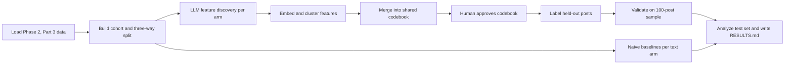

# Generate LLM features for Phase 2, Part 3 linked-fate moderation data

## Remember
- Exact file paths always
- Exact commands with expected output
- DRY, YAGNI, TDD, frequent commits
- Delegated tasks must be impossible to misread.

## Overview

Build a new experiment at `experiments/llm_feature_generation_phase_2_part_3_2026_09_24/` that discovers, normalizes, and operationalizes moderation features on the 18,899 Phase 2, Part 3 posts. The pipeline runs separately on original text, mirrored text, and paired original plus mirror text. It follows the lab Discover, Normalize, Operationalize method from [HOW_TO_MINE_TEXT_FOR_FEATURES.md](https://github.com/METResearchGroup/lab_wiki/blob/main/docs/manuals/methods/HOW_TO_MINE_TEXT_FOR_FEATURES.md) and [HOW_TO_CLUSTER_TEXT.md](https://github.com/METResearchGroup/lab_wiki/blob/main/docs/manuals/methods/HOW_TO_CLUSTER_TEXT.md), reusing Part 2 reference code by copying and adapting files from `experiments/create_llm_features_2026_08_05/src/` (`llm_generate_features.py`, `generate_embeddings.py`, `cluster_embeddings.py`, `generate_labels_for_embeddings.py`, `prompts.py`, `schemas.py`, `paths.py`) and mixed-batch prompt patterns from `experiments/llm_based_feature_generation_2026_07_31/prompts.py`, `schemas.py`, and `stage1.py`, with no cross-experiment imports. Artifacts upload to `s3://mirrorview-experimental-artifacts/experiments/llm_feature_generation_phase_2_part_3_2026_09_24/` with the same prefix as the local folder.

A 50/50 post-level discovery versus held-out split prevents double dipping. The split is stratified by modal keep/remove label, sampled stance, toxicity bucket, and Part 2 catalog overlap. Feature mining runs only on discovery posts. The held-out half is further split into a validation set (100 posts, human-coded for per-feature agreement only) and a test set (all remaining held-out posts, used for every Q1 through Q7 analysis). The committed post-ID lists fix the Part 2 reproducibility gap where the sampled subset CSV was not committed.

**Prior work.** Part 2 (`experiments/llm_based_feature_generation_2026_07_31/`, `experiments/create_llm_features_2026_08_05/`) used mixed-contrast batches (10 keep plus 10 remove) and a two-stage theme synthesis that produced 132 themes. Per `experiments/llm_based_feature_generation_2026_07_31/RESULTS.md`, rhetorical form (profanity, dehumanization, ridicule, us-vs-them, conspiracy) predicted remove better than policy topic, while argument and evidence predicted keep. Original and mirror were passed jointly with no separate arms. Phase 2, Part 3 (`shared/data/raw/study_phase_2_part_3/`, `docs/runbooks/HISTORY_OF_STUDY.md`) finished data collection in September 2026. Its catalog has 18,899 posts: 8,899 shared with the Part 2 June catalog and 10,000 new in Phase 2, Part 3. The export has 3,875 finishers, 79,500 scored linked-fate labels, ~69.6% keep rate, and linked-fate decisions that cover both texts in a pair.

## Happy flow

An engineer builds the post-level cohort and reproducible three-way split (discovery, validation, test), runs naive baselines and the three-arm LLM discovery pipeline on the discovery half, merges per-arm clusters into a human-approved codebook, labels held-out posts, validates features on the 100-post validation sample, and writes `RESULTS.md` with tables answering the seven research questions on the test set only.



## Approach

Run naive baselines first: document-frequency unigrams and bigrams by keep versus remove, and K-Means on Titan post embeddings with a k sweep. Then run the LLM batch feature generation pipeline with mixed-contrast batches as primary and single-class batches as ablation. Embed generated features with Titan (`shared/embeddings/bedrock.py`), cluster with HDBSCAN as primary and K-Means as comparison, and name clusters with an LLM. Run three random seeds and report cluster stability within and across text arms. Merge per-arm clusters into one shared codebook: default is not to merge; merge two features only after side-by-side review of example posts and a human confirms; record confirmed merges in a committed synonym list file under the experiment folder. Present the draft codebook for human review before any held-out labeling. Use `gpt-5.4-nano` for continuity with Part 2. Smoke test one batch per text arm before any production run; production requires explicit user approval.

## Steps

### Step 1: Build post-level cohort and discovery, validation, and test split

Aggregate Phase 2, Part 3 moderation trials from `shared/data/raw/study_phase_2_part_3/results/full.csv` joined to `shared/data/raw/study_phase_2_part_3/stimuli/flips.csv`. Label counts per post vary widely: 1,145 posts have 1 label, 1,755 have 2, and 15,966 have 3 or more (moderation-trial rows with phase equal to 1). Modal keep/remove is the primary label and the stratification label for every post. Three-group labels (unanimous keep, split, unanimous remove), following the logic in `experiments/reasoning_during_moderation_2026_09_15/shared/cohort.py`, apply only to eligible posts: after dropping conflicting worker-post pairs and deduplicating to one row per worker per post, a post must have at least 4 raters. Split posts have a two-two, three-two, or two-three keep-remove vote split. Unanimous keep posts have only keep votes and at least 4 raters. Unanimous remove posts have only remove votes and at least 4 raters. Posts with fewer than 4 raters or any other vote pattern receive no three-group label. Apply a 50/50 discovery versus held-out split stratified by modal keep/remove label, sampled stance (left or right), sampling toxicity bucket (low, middle, or high), and whether the post appears in the Part 2 June catalog (8,899 of 18,899). From the held-out half, reserve 100 posts as the validation set (random, stratified by modal label) and assign the remaining held-out posts to the test set. Write the split to S3 and commit the post-ID lists under `experiments/llm_feature_generation_phase_2_part_3_2026_09_24/data/post_split/`. Run the attention-check filter as an ablation: all participants versus attention-check passers only (77.2% pass rate in the Phase 2, Part 3 export).

### Step 2: Naive baselines per text arm

On discovery posts only, compute document-frequency unigrams and bigrams separately for keep versus remove (not TF-IDF), per text arm (original only, mirror only, paired). Also embed posts with Titan and run K-Means with a k sweep (2 through 10) as a clustering baseline before any LLM-generated features. Store outputs under `outputs/original_only/baselines/`, `outputs/mirror_only/baselines/`, and `outputs/paired/baselines/`, and upload to S3.

### Step 3: LLM batch feature generation (discovery half only)

Copy and adapt the reference files listed in the Overview into the new experiment `src/` folder. Per text arm, run mixed-contrast batches (10 keep plus 10 remove) as the primary design, with single-class batches (500 keep, 500 remove, per `experiments/create_llm_features_2026_08_05/README.md`) as an ablation. Use `gpt-5.4-nano`. Cap at 8 keep plus 8 remove features per batch with evidence spans, matching Part 2 stage 1. Smoke: one batch per arm; production only after user approval.

### Step 4: Normalize features (embed, cluster, name)

Embed all generated feature texts with Titan (`shared/embeddings/bedrock.py`, 256 dimensions, L2-normalized). Cluster with HDBSCAN as primary and K-Means as comparison. Ask an LLM to name each cluster from a random sample of member features. Run three random seeds; report cluster overlap across seeds and across text arms. Store under `outputs/original_only/normalize/`, `outputs/mirror_only/normalize/`, and `outputs/paired/normalize/` (each with a run timestamp subfolder).

### Step 5: Operationalize into a shared codebook

Merge per-arm cluster outputs into one shared codebook. Each entry gets a short name, one-sentence definition, positive and negative examples, and the text arm where it was discovered. Default is not to merge features. Merge two features only after side-by-side review of example posts and a human confirms the match. Record every confirmed merge in a committed synonym list file under the experiment folder. Present the draft codebook for human review; labeling does not start until the user approves.

### Step 6: Label held-out posts and validate with human coding

Use the approved codebook to have an LLM code every held-out post's original text and mirrored text separately as present or absent per feature. Human-code the 100-post validation set (both texts). Report per-feature Cohen's kappa between human and LLM labels on the validation set only. Drop features below kappa 0.6 before any test-set analysis. Label all held-out posts (validation plus test) so the validation sample is drawn from already-labeled data.

### Step 7: Analyze and report

On test-set posts only (held-out minus the 100 validation posts), answer the seven research questions below. To compare Phase 2, Part 3 features to Part 2 themes (`experiments/llm_based_feature_generation_2026_07_31/RESULTS.md`), map each Phase 2, Part 3 codebook feature to the closest Part 2 theme from the two-stage theme synthesis in `experiments/llm_based_feature_generation_2026_07_31/` using embedding similarity on name plus definition, then have a human confirm matches. Report which Part 2 themes replicate on the 8,899 overlapping posts, which Phase 2, Part 3 features are new, and which Part 2 themes disappear. Write `experiments/llm_feature_generation_phase_2_part_3_2026_09_24/RESULTS.md` with summary tables. Upload all artifacts to `s3://mirrorview-experimental-artifacts/experiments/llm_feature_generation_phase_2_part_3_2026_09_24/`.

## Key research questions

| Question | How answered | Text arms used |
| --- | --- | --- |
| Q1: What features separate keep versus remove in Phase 2, Part 3, and do Part 2 themes replicate (including on the 8,899 posts shared with Part 2)? | Build the codebook on the discovery half. Compute feature prevalence and keep-versus-remove tests on the test set only. Map each Phase 2, Part 3 codebook feature to the closest Part 2 theme (embedding similarity on name plus definition, human confirmation) and measure overlap on the shared post subset | All three arms; paired arm for direct Part 2 replication |
| Q2: Which features are stance-invariant (present in both original and mirror) versus stance-specific (appear in only one side)? | Cross-tabulate per-post original versus mirror present/absent labels on test-set posts; classify features by concordance rate | Original only and mirror only (compare labeling outputs per post) |
| Q3: Does the mirror preserve the original's features (flip fidelity)? Report per-feature mismatch rates | Per feature, compute rate where original is present and mirror is absent (and vice versa) on test-set posts | Original only plus mirror only (paired comparison per post) |
| Q4: Which text's features best predict the linked-fate decision: original-only, mirror-only, or both (plus the difference)? | Fit logistic regression models on feature vectors on the test set; compare AUC and log loss across arms and a combined model | Original only, mirror only, paired (and derived difference features) |
| Q5: Do features explain disagreement (split versus unanimous posts)? | Compare feature prevalence across three-group labels (unanimous keep, split, unanimous remove) on eligible test-set posts only; report N per group | All three arms |
| Q6: Do Democrat and Republican moderators remove on different features, conditional on post stance? | Three-way interaction tables: moderator party x post stance x feature presence on remove-labeled trials | All three arms (trial-level rows from the session export) |
| Q7: Do features add predictive value beyond the sampling toxicity bucket and stance? | Nested logistic models with and without toxicity and stance covariates; compare AUC delta on test-set posts | All three arms |

## What is not answerable

- **Causal effects of features.** All analyses are observational; feature presence correlates with decisions but does not establish causation.
- **Attitude change or persuasion.** Phase 2, Part 3 does not measure whether moderation changed participant attitudes beyond the collected survey fields.
- **Per-text decisions.** Linked-fate means one keep/remove decision covers both original and mirror; we cannot infer separate moderation intent for each text, only separate feature presence.

## Ablation axes

| Axis | Values | Primary | Purpose |
| --- | --- | --- | --- |
| Text arm | original only, mirror only, paired original plus mirror | paired (Part 2 replication) | Main ablation: which text surface drives feature discovery and prediction |
| Batch design | mixed-contrast (10 keep plus 10 remove), single-class (500 per label) | mixed-contrast | Contrastive signal versus class-homogeneous batches |
| Label definition | modal keep/remove (primary and stratification), unanimous-only subset (sensitivity), three-group unanimous keep / split / unanimous remove on eligible posts only (sensitivity; Q5 on eligible test-set posts with N per group) | modal keep/remove for discovery and primary analyses | Sensitivity of features to label strictness |
| Participant filter | all participants, attention-check passers only | attention-check passers | Data quality versus sample size |
| Clustering | document-frequency unigram/bigram baseline, K-Means on post embeddings, HDBSCAN on feature embeddings | HDBSCAN on feature embeddings | Baseline complexity ladder before trusting LLM clusters |
| Random seeds | 3 seeds | 3 | Cluster stability within and across arms |
| Discovery model | gpt-5.4-nano (Part 2 continuity), Qwen3.5-4B (repo default per `AGENTS.md`) | gpt-5.4-nano | Model choice tradeoff (see open questions) |

## Proposed experiment folder layout

```text
experiments/llm_feature_generation_phase_2_part_3_2026_09_24/
  README.md
  SETUP.md
  RESULTS.md
  src/                          # copied and adapted from create_llm_features_2026_08_05/src/
  data/
    post_split/
      discovery_post_ids.csv    # committed to git
      validation_post_ids.csv   # 100-post human coding sample
      test_post_ids.csv         # remaining held-out posts
      split_metadata.json
    feature_synonyms.csv        # committed merge decisions
  outputs/
    original_only/
      cohort/
      baselines/
      discovery/
      normalize/
      operationalize/
      label/
      analysis/
    mirror_only/
      (same stage folders)
    paired/
      (same stage folders)
    shared/
      codebook/                 # human-approved merged codebook
      validation/               # 100-post human coding results
  smoke_tests/
```

S3 mirror: `s3://mirrorview-experimental-artifacts/experiments/llm_feature_generation_phase_2_part_3_2026_09_24/` (same tree).

## Open questions for approval

1. **Discovery model.** Keep `gpt-5.4-nano` for Part 2 continuity, or run a parallel arm with Qwen3.5-4B per `AGENTS.md` defaults?
2. **Human coder.** Who codes the 100-post validation sample (both texts), and what instructions align with the codebook definitions?
3. **Labeling scope.** Label all 18,899 posts or only the held-out half (~9,450 posts) for the primary feature matrix? (Default: held-out half only; analyses on the test subset after validation.)
4. **API cost cap.** What maximum spend triggers stopping or downsampling before production batch counts are finalized?

## What "done" looks like

- `experiments/llm_feature_generation_phase_2_part_3_2026_09_24/` exists with `README.md`, `SETUP.md`, and `RESULTS.md` per `AGENTS.md` conventions.
- Discovery, validation, and test post-ID lists are committed under `data/post_split/` and uploaded to S3.
- Smoke artifacts exist for one batch per text arm and were reviewed before production.
- Naive baselines, LLM discovery outputs, cluster stability reports (3 seeds), and the human-approved shared codebook are on S3 under the experiment prefix.
- Held-out posts are labeled (original and mirror separately). Features below kappa 0.6 on the validation set are dropped before test-set analysis.
- `RESULTS.md` answers Q1 through Q7 on the test set with tables, documents ablation results, states what is not answerable, and notes Part 2 replication findings on the 8,899 shared posts (including which Part 2 themes replicate, which Phase 2, Part 3 features are new, and which Part 2 themes disappear).
- `uv run pytest` passes for any new tests added under the experiment.
