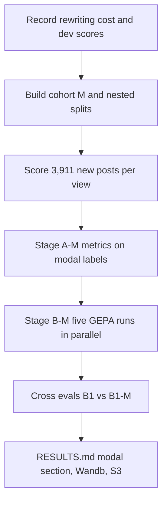

# Rerun the Jev and GEPA keep or remove experiment on modal labels for every post

## Remember
- Exact file paths always
- Exact commands with expected output
- DRY, YAGNI, TDD, frequent commits
- Delegated tasks must be impossible to misread.

## Overview

The first run in `experiments/predict_keep_remove_jev_gepa_2026_09_23/` used cohort A: posts with at least three raters and a clear majority, ties dropped (14,955 posts, 21.3% remove). This follow-up swaps in the modal label for every scored post, using the Phase 2 Part 2 rule in `shared/data/transformed/study_phase_2_part_2/transform.py`: no minimum rater count, and a tie becomes remove.

The modal cohort (cohort M) has 18,866 posts: 13,636 keep and 5,230 remove (27.7% remove). All counts use the same one-rating-per-participant dedupe as cohort A.

On the 14,955 cohort A posts, the modal label equals the cohort A label for every post. So the ablation does not relabel any existing post. It adds 3,911 posts:

| Added posts | Count | Remove share |
|---|---|---|
| 1 rater | 1,156 | 26% |
| 2 raters, no tie (both agree) | 1,192 | 16% |
| 2 raters, tied (becomes remove) | 604 | 100% |
| 4 or 6 raters, tied (becomes remove) | 959 | 100% |
| All added posts | 3,911 | 52% |

The added posts carry noisier labels (one or two raters) or labels set by the tie rule. In practice the ablation asks what happens when we train and evaluate on those posts.

## Key questions

1. How much do Jev baseline scores change when the label set includes low-rater and tied posts?
2. Does GEPA trained on modal labels beat GEPA trained on cohort A labels when both are scored on the same test posts?
3. How does Jev treat tied posts? Does its remove probability sit near 0.5 on posts the tie rule labels remove?
4. How much lower is F1 on 1-rater and 2-rater posts than on posts with 3 or more raters?

## Ablations

| ID | Stage | View | Setup | Compare with |
|---|---|---|---|---|
| A1-M | Jev baseline | Pair | Study prompt, modal labels | A1 |
| A2-M | Jev baseline | Original only | Study prompt, modal labels | A2 |
| A3-M | Jev baseline | Mirror only | Study prompt, modal labels | A3 |
| A4-M | Jev baseline | Pair | Study prompt plus human-mined criteria, modal labels | A4 |
| B1-M | Jev + GEPA | Pair | GPT-6 Luna, modal labels | B1 |
| B1-T-M | Jev + GEPA | Pair | gpt-5.6-terra, modal labels | B1-T |
| B2-M | Jev + GEPA | Original only | GPT-6 Luna, modal labels | B2 |
| B3-M | Jev + GEPA | Mirror only | GPT-6 Luna, modal labels | B3 |
| B4-M | Jev + GEPA | Pair | GPT-6 Luna, issue #299 scoring, modal labels | B4 |
| Cross | Eval only | Pair | B1 prompt on the cohort M test set; B1-M prompt on the cohort A test set | B1 vs B1-M |

Every GEPA setting (budget, caps, seed, batch size, rate limits, dev-F1 selection) matches the first run. Only the labels and the added posts change.

## Estimates

| Stage | Jev cost | Rewriting-model cost | Wall time |
|---|---|---|---|
| A-M (score 3,911 new posts per view, reuse the rest) | about $0.40 | $0 | about 10 min |
| B-M (5 GEPA runs plus cross evals) | about $5 | about $12 to $20 (caps $40) | about 2 to 3 h, parallel |
| Total | about $5.40 | about $12 to $20 | about 3 h (hard ceiling about $46) |

The Jev figures come from the measured Stage A cost per post. The rewriting-model range is the plan estimate from the first run, because that run did not record real rewriting spend. Step 1 fixes that gap.

## Happy flow

An operator builds cohort M and its splits, scores only the new posts with Jev, and recomputes Stage A metrics against modal labels. Then the operator runs the five GEPA optimizations on cohort M and the cross evals. Results land in a new modal-label section of `RESULTS.md`, in Wandb, and in S3.

## Approach

Reuse the first run's code with a cohort switch, not a copy. Jev scores do not depend on labels, so the 14,955 posts already scored keep their scores and only the 3,911 new posts get scored. Cohort A posts keep their split assignment, and only the new posts are assigned to splits. The cohort M test set then contains the cohort A test set, so both label sets can be scored on the same posts.

## Steps

### Step 1: Close the two logging gaps from the first run

Record rewriting-model token usage and dollar cost for each GEPA run. Save each candidate's dev F1 so the prompt choice can be checked without calling Jev again. Unit tests cover both. The first run's results stay unchanged.

### Step 2: Add a modal cohort option and build nested splits

Add a cohort option to the existing cohort and split code: majority (the default, unchanged) or modal (Part 2 tie rule, no rater minimum). Cohort A posts keep their split. The 3,911 new posts get test 20%, dev 10%, and pool 70%, stratified by label, stance, toxicity, and seed 20260924. Tests check the expected counts: 18,866 posts, 13,636 keep, 5,230 remove, and every cohort A post with its original split and label. Upload the frozen parquet to S3 and log it to Wandb.

### Step 3: Score the new posts and compute Stage A-M

Score the 3,911 new posts for the pair, original, mirror, and pair-plus-criteria views, with the same batch size, rate cap, and seeded batch order. Merge those scores with the existing cohort A scores and compute every Stage A metric against modal labels. Report subgroups: cohort A posts, 1-rater posts, 2-rater posts, and tied posts.

### Step 4: Run Stage B-M and the cross evals

Run B1-M, B1-T-M, B2-M, B3-M, and B4-M in parallel with the first run's settings, drawing the class-balanced GEPA sets from the cohort M pool. Pick each prompt on the cohort M dev set and read the cohort M test set once. Score B1's prompt on the cohort M test set and B1-M's prompt on the cohort A test set.

### Step 5: Write the modal-label results

Add a modal-label section to `experiments/predict_keep_remove_jev_gepa_2026_09_23/RESULTS.md`. It answers the four key questions, compares each ablation with its first-run pair, reports the new subgroups, and gives measured rewriting spend.

## What "done" looks like

1. The majority cohort and all first-run outputs are unchanged, and the existing tests still pass.
2. The cohort M splits parquet is on S3 and in Wandb, and its test set contains the cohort A test set.
3. A1-M to A4-M results exist with test metrics on the full cohort M test set and on each added-post subgroup.
4. B1-M, B1-T-M, B2-M, B3-M, and B4-M results exist with dev-selected prompts, a single test read, recorded rewriting cost, and saved per-candidate dev F1.
5. The cross evals report B1 vs B1-M F1 on both test sets.
6. `RESULTS.md` has the modal-label section with the four answers.

## Decisions for you

1. **Tie rule:** ties become remove, following Part 2 (recommended), or ties are dropped (cohort M would then have 17,303 posts, 21.2% remove).
2. **Jev scoring:** score only the 3,911 new posts and reuse the rest (recommended, about $0.40), or rescore all 18,866 posts so every batch mixes old and new posts (about $1.85).
3. **GEPA scope:** rerun all five GEPA ablations (recommended; matches "same experiment"), or only B1-M and B1-T-M to save about $3 and about an hour of parallel slots.
