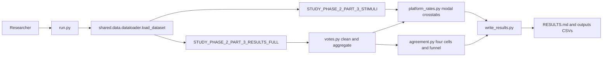

# Build Part 3 keep and remove descriptive stats for platform rates and unanimous versus majority cells

## Remember
- Exact file paths always
- Exact commands with expected output
- DRY, YAGNI, TDD, frequent commits
- Delegated tasks must be impossible to misread.

## Overview

Study Phase 2 Part 3 includes raw results and stimuli only. There is no transformed keep or remove label CSV. The experiment loads the registered Part 3 results full export and stimuli catalog, cleans duplicate worker votes, and reports two descriptive views on the same cleaned vote counts.

The first view matches the shipped Part 2 platform script. Keep and remove rates by platform (Bluesky, Reddit, Twitter) use modal labels per post. A post is keep when keep_count is greater than remove_count, otherwise remove, and ties become remove. The same view also includes a platform by toxicity proportion table. The second view matches the Part 2 four-cell cohort rules and reports unanimous_keep, majority_keep, majority_remove, and unanimous_remove among posts with at least three raters after dropping exact ties. Both views are descriptive only, so the plan includes no hypothesis tests and no confidence intervals.

Because both views read from the same cleaned counts, vote cleaning follows the reasoning experiment duplicate rule on the September export. The trial gate matches Part 2 build_cohort linked-fate keep or remove filtering. The experiment does not filter on attention check outcomes or phase values.

Out of scope: textual features, word clouds, stance tables, plots, S3 upload, new shared registry entries, edits to shared data or other experiments, and Part 2 scripts.

## Happy flow

From the repo root, a researcher runs one command. The script loads both registered Part 3 datasets through the shared loader, cleans votes once, and computes platform modal rates and four-cell agreement rates. It writes markdown tables and small CSV files under the experiment folder and prints the same tables to stdout.

## Approach

Split the pipeline into vote cleaning, platform modal crosstabs, and four-cell agreement because each module needs pytest coverage before `run.py` wires them together. Reuse the Part 2 compare script table shapes and the Part 2 build_cohort cell rules without porting analyses one through three. Keep all paths registry-driven. Store outputs in the experiment directory only.

## Steps

Step contracts, file allow and forbid lists, and pass or fail commands are in [`steps/`](./steps/).

### Step 1: Clean trials and count votes per post

[`steps/step1.md`](./steps/step1.md) implements the linked-fate trial gate, the duplicate worker vote rule from the reasoning experiment SETUP, and per-post keep and remove counts. Pytest covers the gate, dedupe, and aggregation. No RESULTS.md yet.

### Step 2: Platform keep and remove rates with toxicity crosstab

[`steps/step2.md`](./steps/step2.md) applies the Part 2 modal label rule, joins stimuli for toxicity, and builds the three platform crosstabs with four-decimal column proportions. Pytest uses a tiny fixture. The results writer is not required yet.

### Step 3: Four-cell rates, funnel, caller, and docs

[`steps/step3.md`](./steps/step3.md) assigns the four agreement cells, reports the funnel, wires `run.py` to write RESULTS.md and output CSVs, and adds README.md and SETUP.md. Pytest covers cell assignment and required markdown headers.

## What "done" looks like

1. `experiments/phase_2_part_3_keep_remove_descriptive_stats_2026_09_24/` exists with the locked file tree (`run.py`, `votes.py`, `platform_rates.py`, `agreement.py`, `write_results.py`, three test modules, README.md, SETUP.md, RESULTS.md).
2. Data loads only through `shared.data.dataloader.load_dataset` with `STUDY_PHASE_2_PART_3_RESULTS_FULL` and `STUDY_PHASE_2_PART_3_STIMULI`. No hardcoded CSV paths.
3. `PYTHONPATH=. uv run pytest experiments/phase_2_part_3_keep_remove_descriptive_stats_2026_09_24/tests -q` exits 0.
4. `PYTHONPATH=. uv run python experiments/phase_2_part_3_keep_remove_descriptive_stats_2026_09_24/run.py` exits 0 and regenerates RESULTS.md.
5. RESULTS.md contains a platform count table, a platform proportion table (column sums 1.0000 at four decimals), a platform-by-toxicity proportion table, a four-cell count table with shares of the filtered universe, and funnel counts.
6. Small CSV mirrors live under `experiments/phase_2_part_3_keep_remove_descriptive_stats_2026_09_24/outputs/` and stay in git.
7. SETUP.md states data requirements only, documents that attention checks and phase are not filtered, and quotes the duplicate vote rule.
8. No changes under `shared/data/`, other experiments, or Part 2 scripts.
