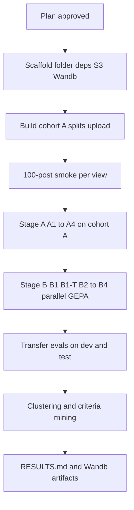

# Predict Phase 2 Part 3 keep or remove decisions with Jev and GEPA

## Remember
- Exact file paths always
- Exact commands with expected output
- DRY, YAGNI, TDD, frequent commits
- Delegated tasks must be impossible to misread.

## Overview

We predict keep or remove labels per post from the Phase 2 Part 3 linked-fate study. Jev is the baseline scorer. Jev plus GEPA is the optimizer. The experiment folder is `experiments/predict_keep_remove_jev_gepa_2026_09_23/`. Artifacts upload to `s3://mirrorview-experimental-artifacts/experiments/predict_keep_remove_jev_gepa_2026_09_23/`. Tracking uses the Wandb project [predict_keep_remove_jev_gepa_2026_09_23](https://wandb.ai/mind_technology_lab/predict_keep_remove_jev_gepa_2026_09_23).

On 2026-09-24 we confirmed AWS STS, S3 list, Wandb auth, Jev probe calls (9 batch-10 requests, 30 posts, seed 20260924), and OpenAI credentials for GEPA reflection. Data comes from the Phase 2 Part 3 results export (131,175 rows) and the stimuli file (18,899 posts). After deduplication and filtering to scored moderation trials, cohort A has 14,941 posts with majority labels and at least three raters, with ties dropped. Cohort B is the unanimous subset (4,889 posts).

**Gate:** plan approved on 2026-09-24. Next, expand the step files. Stage A Jev baselines run first, then Stage B GEPA, with no separate review gate between stages.

Stage A scores four Jev prompt arms on all of cohort A. Stage B runs five GEPA optimizations plus transfer evaluations. Analysis clusters errors and compares GEPA prompt criteria to human-mined criteria. Layout and technical detail are in [design.md](./design.md). Cost and time tables are in [estimates.md](./estimates.md).

## Key questions

1. How well does Jev with the exact study stimulus predict majority keep or remove, compared with trivial baselines?
2. How much does GEPA improve on the study seed on held-out test data, and what does that cost? Does the stronger reflection model (B1-T) beat Luna by enough on dev and test F1 to justify the higher reflection cost?
3. Which text carries the signal: pair view versus original only versus mirror only? Do single-text arms agree for the same pair?
4. Do errors concentrate by stance or toxicity?
5. Does Jev probability of remove track human disagreement and remove-vote share?
6. Do GEPA prompts transfer across text views?
7. What criteria did GEPA discover, and how do they compare with human-mined criteria?
8. What are latency p50, p90, and p99 per request and per post at batch size 10?

## Ablations

| ID | Stage | View | Prompt / reward | Notes |
|----|-------|------|-----------------|-------|
| A1 | Jev baseline | Pair | Study instruction | Primary baseline |
| A2 | Jev baseline | Original only | Study instruction (single-post edit) | |
| A3 | Jev baseline | Mirror only | Study instruction (single-post edit) | |
| A4 | Jev baseline | Pair | Study instruction + human-mined criteria addendum | Feature-injection ablation |
| B1 | Jev + GEPA | Pair | GEPA on A1 seed | Primary GEPA run; reflection model GPT-6 Luna |
| B1-T | Jev + GEPA | Pair | GEPA on A1 seed | Same as B1; reflection model GPT-5.6 Terra (stronger reflection ablation) |
| B2 | Jev + GEPA | Original only | GEPA on A2 seed | Reflection model GPT-6 Luna |
| B3 | Jev + GEPA | Mirror only | GEPA on A3 seed | Reflection model GPT-6 Luna |
| B4 | Jev + GEPA | Pair | GEPA on A1 seed with asymmetric reward from issue #299 | TP +1, FN -3, FP -1, TN +0.5; reflection model GPT-6 Luna |
| Transfer | Eval only | Cross-view | B1 prompt on original and mirror; B2 on mirror; B3 on original | No new optimization |

Post-hoc on A1 through A4 (no new Jev calls): dev-tuned threshold and subgroup metrics (stance, toxicity, unanimous versus split posts).

## Estimates

| Stage | Jev cost | Reflection cost | Wall time | Notes |
|-------|----------|-----------------|-----------|-------|
| A (A1 to A4) | ~$0.93 | $0 | ~20 min | Rate cap binds at 1,000 requests/min |
| B (5 runs + transfer) | ~$4.4 | ~$12 to $20 (caps $40) | ~2 to 3 h parallel | Reflection dominates |
| Total | ~$5.3 | ~$12 to $20 | ~3 h | Project cap ~$46 |

Re-check after 100-post smoke per view. Full token, latency, and per-ablation breakdown: [estimates.md](./estimates.md).

## Happy flow

An operator approves the plan, scaffolds the experiment folder, builds frozen labels and splits, runs Stage A Jev baselines, runs Stage B GEPA optimizations in parallel, and finishes with error clustering and criteria mining. Headline test metrics go into `RESULTS.md` and Wandb. Large files go to S3.

## Approach

We reuse the batched Jev scorer from the speedup experiment (batch 10, 1,000 requests per minute, resume, deadletter, latency logging) and the study-faithful prompt from the reasoning-during-moderation experiment. GEPA optimizes the per-post instruction text while post content stays in scorer state, so the seed matches what participants saw. The dev split picks the final GEPA candidate by F1 at threshold 0.5. The test split is read once for reporting.

## Steps

### Step 1: Scaffold the experiment folder, dependencies, and tracking

Create the experiment folder with README, SETUP, and RESULTS stubs. Add Jev SDK and GEPA optimizer dependencies to the project manifest. Copy S3 and Wandb helpers from the reasoning-during-moderation experiment shared folder.

### Step 2: Build labels and frozen splits from the Phase 2 Part 3 export

Dedupe to one rating per participant and post, aggregate majority labels with at least three raters (ties dropped), and build the unanimous subset. Stratify splits by label, stance, and toxicity (seed 20260924). Upload the frozen parquet to S3 and log it as a Wandb artifact. Cover with unit tests.

### Step 3: Build study-faithful prompt rendering for pair, original, and mirror views

Copy study instruction text from the reasoning-during-moderation shared prompt file. Render Post 1 and Post 2 with deterministic hash order. Document and test the single-post instruction diff for original-only and mirror-only arms.

### Step 4: Port the batched Jev scorer and run 100-post smoke per view

Copy batching, rate limiter, retries, deadletter, resume, latency, and pricing modules into shared. Unit-test the scorer with a stand-in API client. Run 100-post smoke per view and refresh cost estimates before full Stage A.

### Step 5: Run Stage A (A1 to A4) on cohort A

Score all 14,941 posts per ablation. Compute F1, accuracy, precision, recall, balanced accuracy, ROC-AUC, PR-AUC, trivial baselines, subgroup metrics, and Spearman correlation with remove-vote share. Log to Wandb and upload to S3. Write Stage A tables in `RESULTS.md`.

### Step 6: Build the GEPA adapter and optimize runner

Build the GEPA adapter and optimization runner (see design.md for interface detail). Connect the reflection model, dev-F1 candidate selection, and Wandb logging. Unit-test scoring, feedback fields, and budget caps. Run a tiny-budget smoke.

### Step 7: Run Stage B (B1, B1-T, B2 to B4 plus transfer evals)

Run five GEPA processes in parallel (200 requests per minute each, 1,000 total). Pick final prompts on dev. Report test once per ablation. Compare B1 versus B1-T on dev and test F1 and cost. Log candidates, per-iteration valset scores, and artifacts. Write Stage B tables in `RESULTS.md`.

### Step 8: Analysis

Cluster test-set errors from A1 and B1 (K-means baseline, then BERTopic; original and mirror separately). Mine GEPA final prompts into atomic criteria and compare with human-mined criteria. Answer the key questions in `RESULTS.md`.

## What "done" looks like

1. `experiments/predict_keep_remove_jev_gepa_2026_09_23/` has README, SETUP, RESULTS, shared modules with tests, `jev_baseline/`, `jev_gepa/`, and `analysis/` folders.
2. Frozen cohort A splits parquet is on S3 and in Wandb artifacts (test 20%, dev 10%, GEPA pool 70% with balanced train and val subsets).
3. Stage A A1 through A4 `results.json`, `labels.parquet`, and Wandb runs exist under `jev_baseline/` with headline test metrics and latency percentiles.
4. Stage B B1, B1-T, B2 through B4 GEPA run dirs, final prompts, dev-selected candidates, and single test read exist under `jev_gepa/` with transfer eval results.
5. `RESULTS.md` reports Stage A and B tables, subgroup metrics, trivial baselines, correlation with remove-vote share, clustering summary, and criteria comparison.
6. Shared unit tests pass (exact command in design.md).
7. Total spend stays within the ~$46 project cap after smoke re-check.

## Decisions (approved 2026-09-24)

1. **Reflection model (B1 to B4):** OpenAI GPT-6 Luna for the GEPA reflection step. Pricing (Standard, up to 272K input): $0.10 per 1M input, $0.01 cached input, $0.50 per 1M output. Source: https://developers.openai.com/api/docs/models/gpt-6-luna (checked 2026-09-24).
2. **B1-T ablation:** same as B1 (GEPA on pair view, A1 seed, default score) but reflection model OpenAI GPT-5.6 Terra. Pricing: $2.00 per 1M input, $12.00 per 1M output (source https://developers.openai.com/api/docs/pricing). Purpose: check whether a stronger reflection model yields better prompts than Luna; compare B1 versus B1-T on dev and test F1 and cost. Reflection cap $20 for B1-T; Luna runs capped at $5 each. Same Jev budget (9,000 metric calls per run), same splits, same seed.
3. **Parallelism:** five GEPA processes (B1, B1-T, B2, B3, B4); each capped at 200 Jev requests per minute so total stays within 1,000 per minute.
4. **Primary cohort:** majority with at least three raters, ties dropped.
5. **GEPA budget:** 9,000 metric calls per run.
6. **A4 and B4:** keep both ablations.
