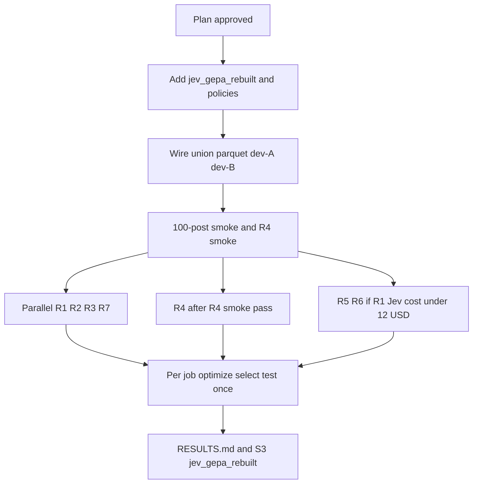

# Rebuild GEPA on the Part 2 plus Part 3 union cohort

## Remember
- Exact file paths always
- Exact commands with expected output
- DRY, YAGNI, TDD, frequent commits
- Delegated tasks must be impossible to misread.

## Overview

The first GEPA stage optimized the wrong text. It tuned the short per-post question while the full study stimulus stayed inside scorer state for Jev scoring, so prompts memorized training phrases, validation picks disagreed with dev picks, and a 9,000 post-scoring budget bought only about 29 iterations with 100% minibatch acceptance on summed soft scores. Test F1 gains over the Jev seed were small (best B1-T 0.564 vs A1 0.527 on the old cohort A).

This rebuild uses `experiments/predict_keep_remove_jev_gepa_2026_09_23/data/cohort_union_splits.parquet` (19,219 posts; test 3,841; dev 1,927; GEPA pool 13,451; balanced GEPA val 300 and train 2,000). It optimizes the study instruction as the GEPA component, keeps a fixed per-post question, and aligns optimization with dev-tuned F1 at natural prevalence. Dev-A is the first half of a stratified 50/50 dev split (seed 20260924) used to choose the classification threshold that maximizes F1. Dev-B is the second half used only to confirm that threshold on the same shortlisted candidates. The run spends budget on reflection, the GEPA step where a reflection language model reads minibatch mistakes and proposes a revised study instruction, using sampled validation scoring and larger minibatches. It enforces strict acceptance, meaning the child candidate must beat the parent on hard remove/keep labels by a fixed margin on the reflection minibatch, plus length and quoting guards, and it logs reflection cost and per-candidate dev scores. Production runs **R1, R2, R3, and R7** in parallel (200 Jev request starts/min per job); each job performs its own dev selection and one test read; **R4** follows R4 smoke; **R5/R6** are cost-gated. Artifacts go to `s3://mirrorview-experimental-artifacts/experiments/predict_keep_remove_jev_gepa_2026_09_23/jev_gepa_rebuilt/` with Wandb group `jev_gepa_rebuilt`. Beat **Stage A union** baselines on test F1: A1 pair **0.538** (test n=3,841), A3 mirror **0.528**, A2 original **0.514** (see `experiments/predict_keep_remove_jev_gepa_2026_09_23/RESULTS.md`).

Technical detail: [design.md](./design.md).

## Key questions

1. Does optimizing the participant study instruction beat Stage A union A1 pair test F1 (0.538) when the threshold is tuned on dev-A and confirmed on dev-B?
2. How many reflection iterations does a **30,000 post** GEPA budget yield under 25-post reflection minibatches, 100-post validation subsampling on accept only, and strict hard-label acceptance (child beats parent on label accuracy at threshold 0.5 by at least two posts on the 25-post minibatch) at about 20% to 30% accept rate?
3. Does label-certainty scoring (vote-share aware, R1) generalize better than majority-label probability with one-vote margins down-weighted (R2), and than the unweighted majority-label probability (R7)?
4. Does GPT-5.6 Terra reflection buy enough test F1 over GPT-6 Luna to justify cost (R3)?
5. Does a multi-component instruction (remove criteria, keep criteria, mirror note) outperform a single study block (R4)?
6. Do cheap single-text GEPA runs (R5/R6) match pair-view R1 on test?
7. Do guards (length cap, no post quoting, top-10 val-dev balanced-accuracy gap) reduce memorization without blocking real improvements?

## Ablations

| ID | View | Optimized components | Scoring / reflection | Notes |
|----|------|----------------------|----------------------|-------|
| R1 | Pair | Study instruction only | Primary label-certainty score; Luna reflection | Main rebuilt run |
| R2 | Pair | Study instruction only | Majority-label probability; weight 0.5 when margin is one vote | Same budget as R1 |
| R3 | Pair | Study instruction only | Same as R1; Terra reflection | Compare to R1 on dev-B and test |
| R4 | Pair | Study instruction + remove + keep + mirror note (round-robin) | Primary scoring; Luna | Only if multi-key GEPA smoke passes |
| R5 | Original only | Study instruction single-post variant | Luna; half post budget (15,000) | Run only if R1 measured optimize cost allows |
| R6 | Mirror only | Study instruction single-post variant | Luna; half post budget (15,000) | Run only if R1 measured optimize cost allows |
| R7 | Pair | Study instruction only | Plain majority-label probability (Stage B objective); Luna | Approved control for R1 vs R2; runs in parallel with R1 to R3 |

Stage A union pair baseline is not re-run; cite existing RESULTS.md tables.

**One-vote margins:** 49% of remove labels (1,980 of 4,009) and 28% of all posts (5,398 of 19,219) are decided by a single vote. R7 isolates whether R1 gains come from the new objective vs other rebuild changes.

## Estimates

Token and price assumptions: pair view about **494 input tokens per post** at the seed layout (study instruction now lives in the per-post instruction, so seed cost is unchanged; re-measure after prompt flip); about **800 tokens per post** average with a **4,000 character** instruction cap (up to about 1,170 at the cap); Jev **$0.042 / 1M** input; Luna **$0.10 / $0.50** per 1M in/out; Terra **$2 / $12** per 1M in/out; batch 10; **1,000** Jev request starts per minute shared across parallel jobs (**200** per GEPA job).

Per iteration (accepted child): score parent and child on a **25-post** reflection minibatch (**50 posts**), then score **100 posts** on validation only if the child passes acceptance. At **20% to 30%** acceptance that averages about **70 to 80 posts** per iteration.

| Item | R1 (primary) | R2 / R7 (if run) | R3 Terra | R5/R6 (half budget) | Notes |
|------|--------------|------------------|----------|------------------------|-------|
| Jev post budget | 30,000 | 30,000 each | 30,000 | 15,000 each | Adapter reports **posts scored**, not 10-post API requests |
| Expected reflection iterations | **375 to 430** | same as R1 | 375 to 430 | about half of R1 | 30k / 70 to 80 posts per iteration |
| Jev optimize USD | ~$1.00 | ~$1.00 | ~$1.00 | ~$0.50 | ~24M input tokens at ~800 tok/post |
| Dev top-10 selection USD | ~$0.65 | same | same | ~$0.35 | Top 10 accepted by val; tune threshold dev-A, confirm dev-B only |
| Test scoring USD | ~$0.15 | same | same | ~$0.08 | Single test read per ablation |
| Reflection USD | ~$1.10 (cap **$5**) | same Luna cap | ~$24 (cap **$40**) | ~$0.55 (cap $2.50) | ~400 Luna calls at ~12k in + 3k out (~$0.003/call); Terra ~$0.06/call |
| **Total per run** | **~$3** | **~$3** | **~$26** | **~$1.50** | R4 same Jev/reflection shape as R1; R7 approved |
| Wall time (one run) | **2 to 4.5 h** | same as R1 | similar Jev; reflection may bound | similar at half budget | Parallel runs share 1,000 req/min |

**Project spend (R1 to R7 if all run):** about **$43** typical; hard ceiling about **$60**.

Full formulas and guard constants: [design.md](./design.md). Re-check after 100-post smoke on union parquet.

## Happy flow

The operator approves this plan, adds rebuilt package code and tests under `experiments/predict_keep_remove_jev_gepa_2026_09_23/jev_gepa_rebuilt/`, wires union parquet and the dev-A/dev-B split, runs 100-post smoke and R4 multi-component smoke, then launches **R1, R2, R3, and R7** in parallel at **200** Jev request starts per minute per job (up to **1,000**/min shared). Each ablation job runs GEPA optimize, then its own dev-A/dev-B top-10 selection, then **one** test read. **R4** starts only after R4 smoke passes. **R5** and **R6** run at half post budget only if R1's confirmed dev-B F1 beats Stage A union A1 (0.538). The operator updates `RESULTS.md` and mirrors artifacts to S3.

## Approach

Flip the prompt contract so GEPA mutates the same study text participants saw while each Jev score call carries only post bodies and a fixed yes/no question. **GEPA budget unit:** one metric call equals one post scored by Jev, and the rebuilt scoring integration must report the number of posts scored (not the number of 10-post API batches) so budgets and logs stay in posts everywhere.

Because GEPA 0.1.4 only ships full-val as a preset, replace full 300-post val scoring with a custom validation evaluation policy that scores a 100-post subsample when a child passes acceptance. Replace soft-sum acceptance with hard-label accuracy plus margin on the reflection minibatch, and use a custom train minibatch sampler for error-focused examples. Score training examples with vote-share-aware certainty. **Select** by pre-ranking the top 10 accepted candidates on validation subsample score, tuning threshold on dev-A F1, and confirming on dev-B for those 10 only (scoring every accepted candidate on the full 1,927-post dev set would cost about 190,000 post scorings). Enforce length and quoting guards during optimization; apply val-dev balanced-accuracy gap when filtering the top 10 by validation score; log reflection tokens and per-candidate dev metrics. Reflection feedback uses vote splits, confident errors, and contrastive pairs because Part 2 and Part 3 moderation trials have no per-post free-text explanations.

## Steps

### Step 1: Scaffold rebuilt package and tracking

Add `experiments/predict_keep_remove_jev_gepa_2026_09_23/jev_gepa_rebuilt/` with README pointer, optimize and evaluate entrypoints, Wandb group `jev_gepa_rebuilt`, and S3 upload helper mirroring existing experiment shared code.

### Step 2: Prompt flip for study-instruction optimization

Split rendering so the seed candidate holds the study instruction text (and optional R4 sections) while state text is post-only; keep the fixed pair question string. Extend the Jev scoring integration for vote-share fields on instances, richer feedback fields, label-certainty scoring with an R2 switch, and **post-count** metric reporting.

### Step 3: GEPA policies (val subsample, acceptance, batch sampler)

Implement 100-post validation subsample policy (on accept only), hard-label acceptance with margin on 25-post minibatches, and error-focused train minibatch sampling (misclassifications, confident errors, vote splits, contrastive pairs index). Wire into the optimize entrypoint; document post-based budget accounting.

### Step 4: Candidate selection, guards, and logging

Split dev into dev-A and dev-B (sidecar `data/dev_ab_split.json`). Implement top-10-by-val preselection among accepted candidates, then drop any whose validation balanced accuracy at 0.5 exceeds dev-A balanced accuracy at 0.5 by more than **0.15**; tune threshold on dev-A F1 and confirm on dev-B for survivors. Proposal guards: **4,000 character** cap and train substring detector. Log reflection usage per call, acceptance log, stop reason, and per-candidate dev scores.

### Step 5: Smoke and cost re-estimate

Run 100-post Jev smoke on union pair layout; update tokens per post and iteration count table. Run GEPA smoke with a 120-post cap verifying at least one reject path.

### Step 6: Production runs and test evaluation

After Step 5 smokes pass, run **R1, R2, R3, and R7** in parallel at **200** Jev request starts/min per job; each run uses **30,000 post** budget, then dev selection and **one** test read. Run **R4** only after R4 round-robin smoke passes. Run **R5** and **R6** at **15,000 posts** only if R1's confirmed dev-B F1 beats Stage A union A1 (0.538).

### Step 7: Update RESULTS.md and analysis hooks

Add union GEPA tables (dev-A/B, test, reflection USD, iteration count, stop reason). Compare to Stage A union (A1 0.538, A3 0.528, A2 0.514); optional error clustering on R1 vs union baseline.

## What "done" looks like

1. `jev_gepa_rebuilt/` exists with tests passing (`PYTHONPATH=. uv run pytest experiments/predict_keep_remove_jev_gepa_2026_09_23/jev_gepa_rebuilt/tests/ -q`).
2. R1 completes with **350+** reflection iterations at 30,000 posts or documents stop reason; reflection USD and tokens are non-zero in artifacts.
3. Selected R1 prompt beats Stage A union A1 pair test F1 (**0.538**) with dev-A threshold and dev-B within 0.02 F1 of dev-A.
4. Each completed ablation (R1 to R4, R7 if run, R5/R6 if gated) has `outputs/<id>/` with test eval, selection artifacts, and S3 mirrors under `jev_gepa_rebuilt/`.
5. `RESULTS.md` includes rebuilt section with ablation table, iteration counts, and spend (project total within about **$60** ceiling).
6. No optimized instruction exceeds **4,000 characters** or contains long train post quotes in the final selected candidate.

## Decisions made

1. **R1 per-post score (primary):** label-certainty score from remove probability and vote-share remove fraction on each training instance (see design.md).
2. **R2 per-post score:** majority-label probability with half weight on one-vote margins (see design.md).
3. **Post budget:** **30,000** scored posts per full run (R1, R2, R3, R4, R7); about **375 to 430** reflection iterations; about **2 to 4.5 h** wall time; about **$3** per run at current token assumptions. R5 and R6 use **15,000** posts each.
4. **Acceptance:** custom hard-label criterion on the **25-post** reflection minibatch; child must get at least **+2** correct labels vs parent at threshold **0.5** (parent and child scored on the same minibatch, **50 posts** total).
5. **R4 multi-component:** run only if Step 5 R4 smoke shows round-robin updates across all four instruction keys.
6. **R5/R6:** run only if R1's selected prompt beats Stage A union A1 (test F1 0.538) on dev-B F1. The earlier $12 Jev-cost gate is retired because the current estimate is about $1 per run.
7. **Run order:** R1, R2, R3, and R7 in parallel after smokes; R4 after R4 smoke; R5/R6 gated on R1's dev-B F1; each ablation performs its own dev selection and a single test read.
8. **R7:** approved. It uses the first GEPA run's plain objective (probability of the majority label, no vote-margin weighting) with every other rebuilt setting. About $3, same wall time as R1, run in parallel with R1 to R3.
