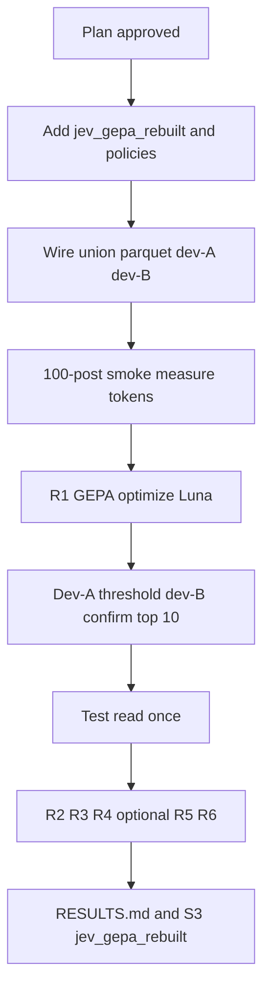

# Rebuild GEPA on the Part 2 plus Part 3 union cohort

## Remember
- Exact file paths always
- Exact commands with expected output
- DRY, YAGNI, TDD, frequent commits
- Delegated tasks must be impossible to misread.

## Overview

The first GEPA stage optimized the wrong text (the short per-post question) while the full study stimulus stayed inside scorer state, so prompts memorized training phrases, validation and dev disagreed, and a 9,000 post-scoring budget bought only about 29 iterations with 100% minibatch acceptance on summed soft scores. Test F1 gains over the Jev seed were small (best B1-T 0.564 vs A1 0.527 on the old cohort A).

This rebuild uses `experiments/predict_keep_remove_jev_gepa_2026_09_23/data/cohort_union_splits.parquet` (19,219 posts; test 3,841; dev 1,927; GEPA pool 13,451; balanced GEPA val 300 and train 2,000). It optimizes the **study instruction** as the GEPA component, keeps a fixed per-post question, aligns optimization with dev-tuned F1 at natural prevalence (dev-A tune, dev-B confirm), spends budget on reflection via sampled validation and larger minibatches, enforces strict acceptance and guards, and logs reflection cost and per-candidate dev scores. Artifacts go to `s3://mirrorview-experimental-artifacts/experiments/predict_keep_remove_jev_gepa_2026_09_23/jev_gepa_rebuilt/` with Wandb group `jev_gepa_rebuilt`. Beat **Stage A union** baselines on test F1: A1 pair **0.538** (test n=3,841), A3 mirror **0.528**, A2 original **0.514** (see `experiments/predict_keep_remove_jev_gepa_2026_09_23/RESULTS.md`).

Technical detail: [design.md](./design.md).

## Key questions

1. Does optimizing the participant study instruction beat Stage A union A1 pair test F1 (0.538) when threshold is tuned on dev-A and confirmed on dev-B?
2. How many reflection iterations does a **30,000 post** GEPA budget yield under 25-post reflection minibatches, 100-post validation subsampling on accept only, and strict hard-label acceptance at about 20% to 30% accept rate?
3. Does label-certainty scoring (vote-share aware) improve generalization vs plain gold-label probability scoring (R2)?
4. Does GPT-5.6 Terra reflection buy enough test F1 over GPT-6 Luna to justify cost (R3)?
5. Does a multi-component instruction (remove criteria, keep criteria, mirror note) outperform a single study block (R4)?
6. Do cheap single-text GEPA runs (R5/R6) match pair-view R1 on test?
7. Do guards (length cap, no post quoting, val-dev gap) reduce memorization without blocking real improvements?

## Ablations

| ID | View | Optimized components | Scoring / reflection | Notes |
|----|------|----------------------|----------------------|-------|
| R1 | Pair | Study instruction only | Primary label-certainty score; Luna reflection | Main rebuilt run |
| R2 | Pair | Study instruction only | Down-weight 3-2 vote splits (ablation) | Same budget as R1 |
| R3 | Pair | Study instruction only | Same as R1; Terra reflection | Compare to R1 on dev-B and test |
| R4 | Pair | Study instruction + remove + keep + mirror note (round-robin) | Primary scoring; Luna | Only if multi-key GEPA smoke passes |
| R5 | Original only | Study instruction single-post variant | Luna; half post budget (15,000) | Run only if R1 smoke cost allows |
| R6 | Mirror only | Study instruction single-post variant | Luna; half post budget (15,000) | Run only if R1 smoke cost allows |

Stage A union pair baseline is not re-run; cite existing RESULTS.md tables.

## Estimates

Token and price assumptions: pair view about **494 input tokens per post** at the seed layout (study instruction now lives in the per-post instruction, so seed cost is unchanged; re-measure after prompt flip); about **800 tokens per post** average with a **4,000 character** instruction cap (up to about 1,170 at the cap); Jev **$0.042 / 1M** input; Luna **$0.10 / $0.50** per 1M in/out; Terra **$2 / $12** per 1M in/out; batch 10; **1,000** Jev request starts per minute shared across parallel jobs (**200** per GEPA job).

Per iteration (accepted child): score parent and child on a **25-post** reflection minibatch (**50 posts**), then score **100 posts** on validation only if the child is accepted. At **20% to 30%** acceptance that averages about **70 to 80 posts** per iteration.

| Item | R1 (primary) | R3 Terra | R5/R6 (half budget) | Notes |
|------|--------------|----------|------------------------|-------|
| Jev post budget | 30,000 | 30,000 | 15,000 each | Adapter reports **posts scored**, not 10-post API requests |
| Expected reflection iterations | **375 to 430** | 375 to 430 | about half of R1 | 30k / 70 to 80 posts per iteration |
| Jev optimize USD | ~$1.00 | ~$1.00 | ~$0.50 | ~24M input tokens at ~800 tok/post |
| Dev top-10 selection USD | ~$0.65 | same | ~$0.35 | Top 10 accepted by val; tune threshold dev-A, confirm dev-B only |
| Test scoring USD | ~$0.15 | same | ~$0.08 | Single test read per ablation |
| Reflection USD | ~$1.10 (cap **$5**) | ~$24 (cap **$40**) | ~$0.55 (cap $2.50) | ~400 Luna calls at ~12k in + 3k out (~$0.003/call); Terra ~$0.06/call |
| **Total per run** | **~$3** | **~$26** | **~$1.50** | R2/R4 same Jev/reflection shape as R1 |
| Wall time (one run) | **2 to 4.5 h** | similar Jev; reflection may bound | similar at half budget | Parallel runs share 1,000 req/min |

**Project spend (all six ablations):** about **$40** if every run completes; hard ceiling about **$60**.

Full formulas and guard constants: [design.md](./design.md). Re-check after 100-post smoke on union parquet.

## Happy flow

Operator approves this plan, adds rebuilt package code and tests under `experiments/predict_keep_remove_jev_gepa_2026_09_23/jev_gepa_rebuilt/`, wires union parquet and dev-A/dev-B split, runs 100-post smoke, runs R1 (then R2 to R4 per table), evaluates test once per ablation, updates `RESULTS.md`.

## Approach

Flip the prompt contract so GEPA mutates the same study text participants saw while scorer state carries only post bodies and a fixed yes/no question. **GEPA budget unit:** one metric call equals one post scored by Jev, and the adapter must report the number of posts scored (not the number of 10-post API batches) so budgets and logs stay in posts everywhere.

Replace full 300-post val scoring with a custom validation evaluation policy (GEPA 0.1.4 provides only full-val as a preset; implement a 100-post subsample on accept). Replace soft-sum acceptance with hard-label accuracy plus margin on the reflection minibatch, and use a custom train minibatch sampler for error-focused examples. Score training examples with vote-share-aware certainty; **select** by pre-ranking the top 10 accepted candidates on validation subsample score, tuning threshold on dev-A F1, and confirming on dev-B for those 10 only (scoring every accepted candidate on the full 1,927-post dev set would cost about 190,000 post scorings). Enforce length, quoting, and val-dev gap guards; log reflection tokens and per-candidate dev metrics. Reflection feedback uses vote splits, confident errors, and contrastive pairs because Part 2 and Part 3 moderation trials have no per-post free-text explanations.

## Steps

### Step 1: Scaffold rebuilt package and tracking

Add `experiments/predict_keep_remove_jev_gepa_2026_09_23/jev_gepa_rebuilt/` with README pointer, optimize and evaluate entrypoints, Wandb group `jev_gepa_rebuilt`, and S3 upload helper mirroring existing experiment shared code.

### Step 2: Prompt and adapter flip for study-instruction optimization

Split rendering so the seed candidate holds the study instruction text (and optional R4 sections) while state text is post-only; keep the fixed pair question string. Extend the adapter for vote-share fields on instances, richer feedback fields, label-certainty scoring with an R2 switch, and **post-count** metric reporting.

### Step 3: GEPA policies (val subsample, acceptance, batch sampler)

Implement 100-post validation subsample policy (on accept only), hard-label acceptance with margin on 25-post minibatches (and optional 50-post acceptance batch), and error-focused train minibatch sampling (misclassifications, confident errors, vote splits, contrastive pairs index). Wire into the optimize runner; document post-based budget accounting.

### Step 4: Candidate selection, guards, and logging

Split dev into dev-A and dev-B; implement top-10-by-val preselection, tune-on-A, confirm-on-B for those candidates only. Add guards (**4,000 character** cap, train substring detector, val-dev gap). Log reflection usage and cost per call, per-candidate dev scores to JSONL and Wandb, and stop reason.

### Step 5: Smoke and cost re-estimate

Run 100-post Jev smoke on union pair layout; update tokens per post and iteration count table. Run GEPA smoke with a 120-post cap verifying at least one reject path.

### Step 6: Run R1, then ablations R2 to R6 per table

Execute R1 at **30,000 post** budget; run R2 and R3 in parallel where rate limits allow; run R4 after multi-component smoke; run R5/R6 at **15,000 posts** only if Step 5 shows marginal cost. Single test read per ablation.

### Step 7: Update RESULTS.md and analysis hooks

Add union GEPA tables (dev-A/B, test, reflection USD, iteration count, stop reason). Compare to Stage A union (A1 0.538, A3 0.528, A2 0.514); optional error clustering on R1 vs union baseline.

## What "done" looks like

1. `jev_gepa_rebuilt/` exists with tests passing (`PYTHONPATH=. uv run pytest experiments/predict_keep_remove_jev_gepa_2026_09_23/jev_gepa_rebuilt/tests/ -q`).
2. R1 completes with **350+** reflection iterations at 30,000 posts or documents stop reason; reflection USD and tokens are non-zero in artifacts.
3. Selected R1 prompt beats Stage A union A1 pair test F1 (**0.538**) with dev-A threshold and dev-B within 0.02 F1 of dev-A.
4. R2, R3, and R4 (if run) have `outputs/<id>/` with test eval, per-candidate dev score logs, and S3 mirrors under `jev_gepa_rebuilt/`.
5. `RESULTS.md` includes rebuilt section with ablation table, iteration counts, and spend (project total within about **$60** ceiling).
6. No optimized instruction exceeds **4,000 characters** or contains long train post quotes in the final selected candidate.

## Decisions for you

1. **Primary label-certainty formula:** vote-share match score (R1) vs down-weight 3-2 splits only in R2, or swap which is primary.
2. **Post budget for R1:** **30,000** (recommended, about **400** iterations, about **2 to 4.5 h**, ~$3/run) vs **60,000** (about **750 to 860** iterations, about **4 to 9 h**, ~$5 Jev plus reflection).
3. **Acceptance margin:** +2 correct labels on a 25-post minibatch vs larger 50-post batch with +4 margin (stricter, fewer accepts).
4. **R4 multi-component:** run only if Step 5 smoke shows stable round-robin updates, or skip to save time.
5. **R5/R6 single-text:** skip unless R1 total run cost stays under about **$4** and schedule allows two half-budget jobs (~$1.50 each).
