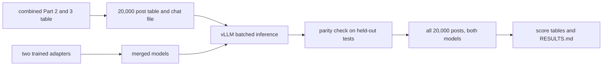

# Score both LoRA adapters on every combined Part 2 and Part 3 post with batched vLLM inference

## Remember
- Exact file paths always
- Exact commands with expected output
- DRY, YAGNI, TDD, frequent commits
- Delegated tasks must be impossible to misread.

## Overview

Run the trained unanimous adapter and the trained modal adapter on every post in the combined Part 2 and Part 3 table, and write the predictions and metric tables in a new section. Inference uses vLLM with batched requests and prefix caching, not the per-post Transformers loop used for the held-out tests. The held-out prediction files from Experiments 1 to 4 stay unchanged.

The unanimous adapter is the Experiment 1 run `part3_uni_001`. The modal adapter is the Experiment 2 run `part3_modal_001`. Each is the best model on its own held-out test. No new training.

## Data

The posts come from the combined results table merged into main, loaded by the shared dataloader under the registry name for the Part 2 and Part 3 union results. The table has 168,871 rows. The builder keeps linked-fate keep/remove trials, drops conflicting worker-post pairs, and keeps the earliest row per worker and post, leaving 100,606 trials. Those trials collapse to 20,000 posts, 15,196 keep and 4,804 remove by modal vote. That is every post with at least one keep/remove judgment, and it is the population for this run.

The builder reuses the trial filter and modal aggregation already used for the union label file, so the 20,000 posts, labels, and vote counts match that file exactly. It does not concatenate Part 2 and Part 3 again. For each post it records the modal label, the rater count, the remove-vote count, whether the post is in the unanimous label set, and whether the post was in training or held out.

## Happy flow

Build one chat file for all 20,000 posts, merge each adapter into the base model, and run both merged models through vLLM in one SageMaker job. Before the full run, the same job scores the held-out test files and compares the answers with the existing predictions. Then score both prediction files.

## Approach

Serve merged weights rather than a LoRA adapter at inference time. Qwen3.5 4B mixes standard attention layers with linear-attention layers, and the adapters target the attention and MLP projections. The repo has never served a LoRA adapter on that architecture in vLLM, and merging removes that risk. The merge reuses the PEFT load already in the August inference script, then saves one merged model per adapter.

Reuse the vLLM image and engine settings from `experiments/reasoning_during_moderation_2026_09_15/shared/runner.py`, which already loads Qwen3.5 4B in vLLM with prefix caching. The prompt is the same rubric for every post, so prefix caching reuses that shared part across requests. Decoding is greedy with the same 8-token cap and the same parser as the held-out runs, with thinking turned off. The job writes results in chunks and skips post IDs already written, so a stopped job can resume.

Keep this work in its own container and launcher, so the image and entry point that produced the held-out results stay as they are. The new image goes in the existing ECR repository under its own tag. The SageMaker role already covers that repository and the experiment S3 prefix, so no IAM change is needed.

## Proposed file structure

Local scripts and docs:

- `experiments/finetune_lora_phase2_part3_2026_09_24/experiment5_all_posts/README.md`
- `experiments/finetune_lora_phase2_part3_2026_09_24/experiment5_all_posts/SETUP.md`
- `experiments/finetune_lora_phase2_part3_2026_09_24/experiment5_all_posts/RESULTS.md`
- `experiments/finetune_lora_phase2_part3_2026_09_24/experiment5_all_posts/constants.py`
- `experiments/finetune_lora_phase2_part3_2026_09_24/experiment5_all_posts/build_all_posts.py`
- `experiments/finetune_lora_phase2_part3_2026_09_24/experiment5_all_posts/merge_adapter.py`
- `experiments/finetune_lora_phase2_part3_2026_09_24/experiment5_all_posts/vllm_infer.py`
- `experiments/finetune_lora_phase2_part3_2026_09_24/experiment5_all_posts/check_parity.py`
- `experiments/finetune_lora_phase2_part3_2026_09_24/experiment5_all_posts/score_all_posts.py`
- `experiments/finetune_lora_phase2_part3_2026_09_24/experiment5_all_posts/launch_sagemaker.py`
- `experiments/finetune_lora_phase2_part3_2026_09_24/experiment5_all_posts/Dockerfile`
- `experiments/finetune_lora_phase2_part3_2026_09_24/experiment5_all_posts/entrypoint.sh`
- `experiments/finetune_lora_phase2_part3_2026_09_24/experiment5_all_posts/tests/`

Local data, not committed:

- `experiment5_all_posts/data/all_posts.csv`
- `experiment5_all_posts/data/chat_all_posts.jsonl`
- `experiment5_all_posts/preds/unanimous_model/all_posts.csv`
- `experiment5_all_posts/preds/modal_model/all_posts.csv`
- `experiment5_all_posts/preds/unanimous_model/parity_test_unanimous.csv`
- `experiment5_all_posts/preds/modal_model/parity_test_modal.csv`

Committed score tables, with a narrow exception in `.gitignore` next to the existing cross-eval exception:

- `experiment5_all_posts/scores/parity.csv`
- `experiment5_all_posts/scores/overall.csv`
- `experiment5_all_posts/scores/by_remove_votes.csv`

S3, under the same bucket and experiment prefix as the finished runs:

- `s3://mirrorview-experimental-artifacts/experiments/finetune_lora_phase2_part3_2026_09_24/experiment5_all_posts/data/`
- `s3://mirrorview-experimental-artifacts/experiments/finetune_lora_phase2_part3_2026_09_24/experiment5_all_posts/merged_models/unanimous_model/`
- `s3://mirrorview-experimental-artifacts/experiments/finetune_lora_phase2_part3_2026_09_24/experiment5_all_posts/merged_models/modal_model/`
- `s3://mirrorview-experimental-artifacts/experiments/finetune_lora_phase2_part3_2026_09_24/experiment5_all_posts/preds/`
- `s3://mirrorview-experimental-artifacts/experiments/finetune_lora_phase2_part3_2026_09_24/experiment5_all_posts/scores/`

Container image:

- `517478598677.dkr.ecr.us-east-2.amazonaws.com/mirrorview-finetune-lora-phase2-part3:vllm-all-posts`

Adapters are read and not rewritten:

- `s3://mirrorview-experimental-artifacts/experiments/finetune_lora_phase2_part3_2026_09_24/experiment1_unanimous/adapters/part3_uni_001/`
- `s3://mirrorview-experimental-artifacts/experiments/finetune_lora_phase2_part3_2026_09_24/experiment2_modal/adapters/part3_modal_001/`

Files that stay unchanged:

- `experiments/finetune_lora_phase2_part3_2026_09_24/entrypoint.sh`
- `experiments/finetune_lora_phase2_part3_2026_09_24/Dockerfile`
- `experiments/finetune_lora_phase2_part3_2026_09_24/launch_sagemaker.py`
- `experiments/finetune_lora_phase2_part3_2026_09_24/RESULTS.md`
- every file under `experiment1_unanimous/preds/`, `experiment2_modal/preds/`, `experiment3_modal_size_matched/preds/`, and `experiment4_cross_eval/preds/`

## Steps

### Step 1: Build the 20,000-post table and chat file

Load the combined table with the shared dataloader, apply the same trial filter and modal aggregation as the union label builder, and add vote counts, the unanimous flag, and the train or held-out flag from `experiments/finetune_lora_phase2_part3_2026_09_24/data/split_manifest.csv`. Render the chat file with the prompt used for training. Tests check that the output has 20,000 rows, 15,196 keep and 4,804 remove, 14,884 posts with 5 raters, and labels identical to `shared/data/transformed/study_phase_2_part_2_and_3/keep_remove_labels.csv`. Sync the data folder to S3.

### Step 2: Merge each adapter into the base model

Load Qwen3.5 4B in bf16, apply each adapter, merge it into the base weights, and save the merged model with its tokenizer. Run the merge inside the new container on SageMaker, so the model is not downloaded to the local machine. Upload each merged model to its S3 folder. A check on 5 held-out posts must show the merged model giving the same answer as the adapter model loaded with PEFT.

### Step 3: Build the vLLM inference container

Build an image from the same vLLM base image used by the reasoning experiment, add the repo code, and push it under the tag `vllm-all-posts`. The inference script loads one merged model at a time, sends all prompts in batches with prefix caching on, decodes greedily with the 8-token cap, and parses answers with the existing parser. It writes in chunks, skips post IDs already written, and writes the same prediction columns as the held-out runs. A dry run must print the data, merged-model, and prediction S3 paths without starting a job.

### Step 4: Check parity against the held-out predictions

Run the modal merged model on the existing held-out modal test and the unanimous merged model on the existing held-out unanimous test. Compare those answers post by post with `experiment2_modal/preds/test_modal.csv` and `experiment1_unanimous/preds/test_unanimous.csv`. The gate is at least 98% agreement per file and remove-F1 within 0.01 of the held-out score, 0.7746 for the modal model and 0.9333 for the unanimous model. If either file misses the gate, stop and report the disagreements before the full run. Record throughput in posts per second from this run.

### Step 5: Run both models on all 20,000 posts

Run one SageMaker job on `ml.g5.xlarge` that scores all 20,000 posts with the unanimous merged model, then with the modal merged model. Use run IDs `part3_uni_all_001` and `part3_modal_all_001`. Each prediction file must have 20,000 rows. Sync only the two `all_posts.csv` files back to the local prediction folders.

### Step 6: Score and write the separate results section

For each model, write accuracy, precision, recall, and remove-F1 against the modal label for all posts, training posts, and held-out posts. Write the same four metrics against the unanimous label on the 5,715 posts in the unanimous set. Write the 5-rater table for both models, with one row for each remove-vote count from 0 to 5 and the post count in each row. Put the numbers and the prose in `experiment5_all_posts/RESULTS.md`, stating that the all-posts score includes posts the model trained on. Upload the score tables and the results file to the S3 scores folder.

## What "done" looks like

- `experiment5_all_posts/data/all_posts.csv` has 20,000 rows, and its labels match the union modal label file.
- Two merged models are on S3, one per adapter.
- `experiment5_all_posts/scores/parity.csv` shows both held-out files passing the gate.
- Two prediction files, one per model, each with 20,000 rows, are local and on S3.
- `experiment5_all_posts/scores/overall.csv` has, for both models, rows for all posts, training posts, held-out posts, and the unanimous subset.
- `experiment5_all_posts/scores/by_remove_votes.csv` has 12 rows: 2 models times remove-vote counts 0 through 5, restricted to posts with 5 raters. The six counts sum to 14,884 for each model.
- `experiment5_all_posts/RESULTS.md` reports those tables and the measured throughput.
- The held-out prediction files and the existing cross-eval `RESULTS.md` are unchanged.
- Pytest passes for the builder, parity check, and scorer.

## Decisions for approval

- Serve merged weights in vLLM instead of loading LoRA adapters in vLLM.
- Use the parity gate of 98% agreement and remove-F1 within 0.01.
- Keep SageMaker `ml.g5.xlarge`, which has a quota of one instance, rather than moving this run to Hugging Face Jobs.
