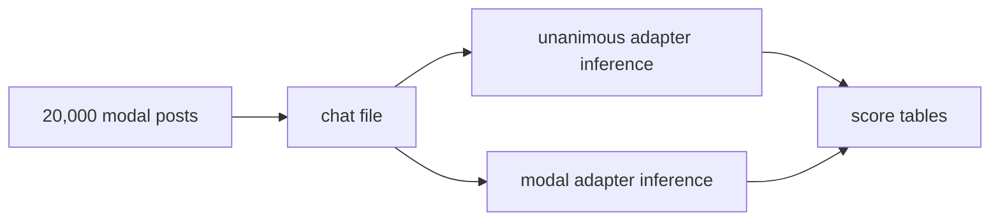

# Score both LoRA adapters on every modal post

## Remember
- Exact file paths always
- Exact commands with expected output
- DRY, YAGNI, TDD, frequent commits
- Delegated tasks must be impossible to misread.

## Overview

Run the already trained unanimous adapter and the already trained modal adapter on all 20,000 modal-labeled posts. Write predictions and metric tables in a new section, without replacing the held-out test predictions from Experiments 1 to 4.

The unanimous adapter is the Experiment 1 run `part3_uni_001`. The modal adapter is the Experiment 2 run `part3_modal_001`. Those two runs are the best model for each label type on the held-out tests. No new training.

## Happy flow

Build one chat file for every modal post, run one SageMaker inference job per adapter, then score both prediction files. The score tables include every post, the training posts alone, and the held-out posts alone. A second table keeps only posts with 5 raters and breaks metrics out by how many raters chose remove.

## Approach

Keep this work in a new folder so the existing prediction files stay as the held-out record. Reuse the August inference script, the existing prompt, and the two adapters already stored on S3. The current container only reads the two held-out test files, so inference on all posts needs a new container mode and a rebuilt image. The account allows one `ml.g5.xlarge` at a time, so the two jobs run one after the other. Each job is on the order of the earlier 2,090-row inference, scaled to 20,000 rows, which is about 5 hours of GPU time per model.

Posts the model trained on are included, because the request is a score for every post. The score file marks each post as training or held-out, using the existing split manifest, so a held-out number can still be reported separately.

## Proposed file structure

Local scripts and small outputs:

- `experiments/finetune_lora_phase2_part3_2026_09_24/experiment5_all_posts/README.md`
- `experiments/finetune_lora_phase2_part3_2026_09_24/experiment5_all_posts/SETUP.md`
- `experiments/finetune_lora_phase2_part3_2026_09_24/experiment5_all_posts/RESULTS.md`
- `experiments/finetune_lora_phase2_part3_2026_09_24/experiment5_all_posts/build_all_posts.py`
- `experiments/finetune_lora_phase2_part3_2026_09_24/experiment5_all_posts/score_all_posts.py`
- `experiments/finetune_lora_phase2_part3_2026_09_24/experiment5_all_posts/tests/test_build_all_posts.py`
- `experiments/finetune_lora_phase2_part3_2026_09_24/experiment5_all_posts/tests/test_score_all_posts.py`

Local data, not committed. The global csv ignore already covers the tables. The chat file is large and stays local plus S3.

- `experiments/finetune_lora_phase2_part3_2026_09_24/experiment5_all_posts/data/all_posts.csv`
- `experiments/finetune_lora_phase2_part3_2026_09_24/experiment5_all_posts/data/chat_all_posts.jsonl`
- `experiments/finetune_lora_phase2_part3_2026_09_24/experiment5_all_posts/preds/unanimous_model/all_posts.csv`
- `experiments/finetune_lora_phase2_part3_2026_09_24/experiment5_all_posts/preds/modal_model/all_posts.csv`
- `experiments/finetune_lora_phase2_part3_2026_09_24/experiment5_all_posts/scores/overall.csv`
- `experiments/finetune_lora_phase2_part3_2026_09_24/experiment5_all_posts/scores/by_remove_votes.csv`

S3, same bucket and experiment prefix as the finished runs:

- `s3://mirrorview-experimental-artifacts/experiments/finetune_lora_phase2_part3_2026_09_24/experiment5_all_posts/data/`
- `s3://mirrorview-experimental-artifacts/experiments/finetune_lora_phase2_part3_2026_09_24/experiment5_all_posts/preds/unanimous_model/`
- `s3://mirrorview-experimental-artifacts/experiments/finetune_lora_phase2_part3_2026_09_24/experiment5_all_posts/preds/modal_model/`
- `s3://mirrorview-experimental-artifacts/experiments/finetune_lora_phase2_part3_2026_09_24/experiment5_all_posts/scores/`

Adapters read, not rewritten:

- `s3://mirrorview-experimental-artifacts/experiments/finetune_lora_phase2_part3_2026_09_24/experiment1_unanimous/adapters/part3_uni_001/`
- `s3://mirrorview-experimental-artifacts/experiments/finetune_lora_phase2_part3_2026_09_24/experiment2_modal/adapters/part3_modal_001/`

Container change, then a new image in the existing repository `mirrorview-finetune-lora-phase2-part3`:

- `experiments/finetune_lora_phase2_part3_2026_09_24/entrypoint.sh`
- `experiments/finetune_lora_phase2_part3_2026_09_24/launch_sagemaker.py`

The cross-eval file `experiments/finetune_lora_phase2_part3_2026_09_24/RESULTS.md` stays as the held-out 4 by 2 record. The all-posts writeup is only `experiment5_all_posts/RESULTS.md`.

## Steps

### Step 1: Build the all-posts table and chat file

Build one row per modal post from the existing union label file, attach the remove-vote count and the rater count from the same trial filter used to build those labels, and mark train or test from `experiments/finetune_lora_phase2_part3_2026_09_24/data/split_manifest.csv`. Render the chat file with the same prompt the training jobs used. Expect 20,000 rows, including 14,884 rows with 5 raters. Sync the data folder to the experiment5 S3 prefix.

### Step 2: Add an all-posts inference mode and rebuild the image

Teach the container to read `chat_all_posts.jsonl` and write `all_posts.csv`, using an adapter channel. Do not change the paths used by the existing test inference. Rebuild and push the image. A dry run must show the experiment5 data prefix, the existing adapter prefix, and the experiment5 prediction prefix.

### Step 3: Run both adapters

Run the unanimous adapter as `part3_uni_all_001`, then the modal adapter as `part3_modal_all_001`. Each job writes 20,000 prediction rows, with no invalid generations expected. Sync only `all_posts.csv` back into the two local prediction folders.

### Step 4: Score and write the separate results section

Write overall accuracy, precision, recall, and remove-F1 for all posts, for training posts, and for held-out posts, once per model. Write the 5-rater table with rows 0 through 5 for both models. Put the prose in `experiment5_all_posts/RESULTS.md`. Upload the score tables and that file to the experiment5 S3 scores prefix.

## What "done" looks like

- Two prediction files exist locally and on S3, each with 20,000 rows, one per adapter.
- `experiment5_all_posts/scores/by_remove_votes.csv` has 12 rows: 2 models times remove-vote counts 0 through 5, restricted to posts with 5 raters.
- `experiment5_all_posts/scores/overall.csv` has rows for all posts, training posts, and held-out posts, for both models.
- `experiment5_all_posts/RESULTS.md` states those numbers and states that the all-posts score includes training posts.
- The existing files `experiment1_unanimous/preds/test_modal.csv` and `experiment2_modal/preds/test_modal.csv` are unchanged.
- Pytest for the new builder and scorer passes.

## Decisions still open

None that block the build. The population is all 20,000 modal posts. The two adapters are the ones named above. Training posts are scored and flagged, not dropped.
