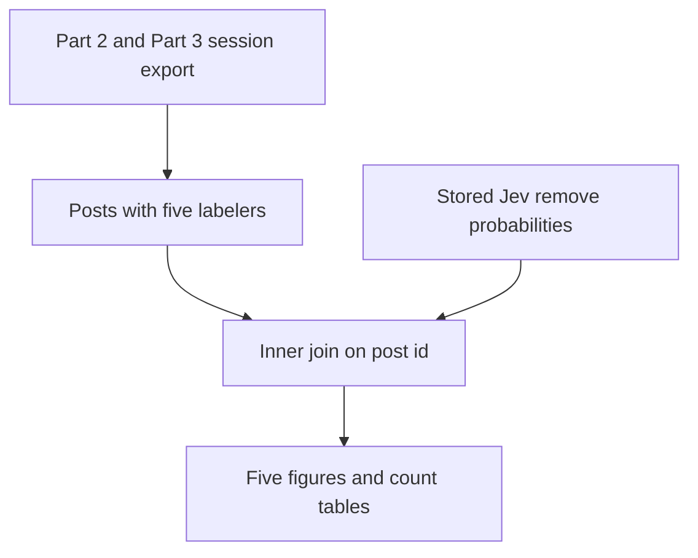

# Compare Jev remove probabilities with five-labeler human remove counts

## Remember
- Exact file paths always
- Exact commands with expected output
- DRY, YAGNI, TDD, frequent commits
- Delegated tasks must be impossible to misread.

## Overview

[Issue 312](https://github.com/METResearchGroup/mirrorView-task/issues/312) asks whether Jev's remove probability matches the number of human labelers who removed the post. Keep the comparison on posts with exactly five labelers. The Jev probability is the stored `p_remove` column in `s3://mirrorview-experimental-artifacts/experiments/predict_keep_remove_jev_gepa_2026_09_23/jev_baseline_union/A1_pair_study_prompt/labels.parquet`. The parquet file has 19,219 rows, and `p_remove` has no missing values. Join the two sets on `post_id`, and keep posts that appear in both.

The combined Part 2 and Part 3 session export, loaded as `STUDY_PHASE_2_PART_2_AND_3_RESULTS_FULL` through `shared/data/dataloader.py`, has no skip decision on moderation trials. Scored moderation decisions are `keep` and `remove` only. The human count is the number of `remove` votes, from 0 to 5.

On the current objects, one vote per person and post leaves 15,113 posts with five labelers. Every five-labeler post is in the Jev file. The remove-vote counts are 3,986, 4,592, 3,332, 1,929, 950, and 324 for 0 through 5 removes. The five Jev bins, from 0.0 to 0.2 up through 0.8 to 1.0, hold 1,479, 6,282, 3,774, 2,738, and 840 posts. The mean of human remove count minus Jev bin is -0.1946, so the Jev bin is higher than the human remove count on average.

## Happy flow

An operator runs one command from the repo root. The command counts remove votes, joins the stored Jev probabilities, and writes five figures plus the count tables. The command then uploads the figures and the count tables to the experimental bucket.

## Approach

Count labelers from the shared Part 2 and Part 3 results, and keep one vote per person per post. The one-vote rule matches the rater count already stored on the Jev file. Without the one-vote rule, duplicate person-and-post rows shrink the five-labeler set, and the inner join no longer covers every Jev row that has five raters.

Once the posts are joined, place each `p_remove` in one of five bins of width 0.2, starting at 0. Bin 0 is 0.0 up to but not including 0.2, and bin 0 matches 0 remove votes. The last bin includes 1.0. The difference score is the human remove count minus the Jev bin number. A post with 1 remove vote and Jev bin 0 has difference 1.

Put the experiment in `experiments/compare_jev_human_uncertainty_2026_09_25/`. Tests use small frames and do not download S3. The live command is the only step that downloads the two S3 objects. Upload the joined rows to `s3://mirrorview-experimental-artifacts/experiments/compare_jev_human_uncertainty_2026_09_25/`. Commit the figures and count tables so `RESULTS.md` can show them.

## Steps

### Step 1: Count remove votes for posts with five labelers

Build the five-labeler frame from the shared Part 2 and Part 3 loader. Keep moderation trials, keep one vote per person and post, and count `remove` votes. Tests cover the filter, the dedupe, and the five-labeler cut.

### Step 2: Join Jev probabilities and assign bins

Download the stored Jev label file, check the 19,219 rows and the missing-probability count, and inner-join it to the five-labeler frame. Assign the five probability bins and the difference score. Tests cover the bin edges and the join.

### Step 3: Write the five figures, the results file, and the S3 copies

Draw the human remove-count bars, the Jev probability histogram, the five Jev bins, the overlay of the human counts and the Jev bins, and the difference-score bars. Write `RESULTS.md` from the joined frame, upload the artifacts, and fail the command if a pinned count changes.

## What "done" looks like

1. `experiments/compare_jev_human_uncertainty_2026_09_25/` contains the command, the tests, `README.md`, `SETUP.md`, and `RESULTS.md`.
2. `RESULTS.md` shows the five figures and the pinned count tables from the overview.
3. The same figures, tables, and joined rows are at `s3://mirrorview-experimental-artifacts/experiments/compare_jev_human_uncertainty_2026_09_25/`.
4. `PYTHONPATH=. uv run pytest experiments/compare_jev_human_uncertainty_2026_09_25/tests -q` passes.
5. The live command prints `inner_join_posts=15113` and exits 0.
