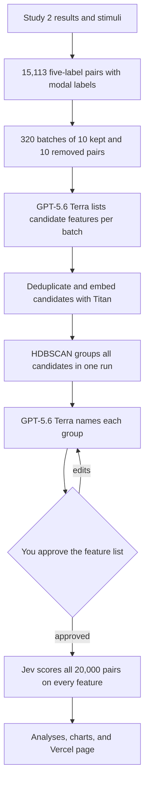

# Mine, name, and label LLM features on the 20,000 Study 2 post pairs

## Remember
- Exact file paths always
- Exact commands with expected output
- DRY, YAGNI, frequent commits
- Delegated tasks must be impossible to misread.

## Overview

[Issue 321](https://github.com/METResearchGroup/mirrorView-task/issues/321) asks which features of a Study 2 post pair go with a keep decision and which go with a remove decision. The method follows approach 3 in the lab's [text mining manual](https://github.com/METResearchGroup/lab_wiki/blob/main/docs/manuals/methods/HOW_TO_MINE_TEXT_FOR_FEATURES.md#approach-3-asking-an-llm-to-give-features). GPT-5.6 Terra reads batches of kept and removed pairs and lists candidate features in six categories. Amazon Titan embeddings and HDBSCAN group the candidates, and GPT-5.6 Terra names each group. Once you approve the named features, Jev scores every pair on every feature. The last step counts the top features within groups of pairs by lean, toxicity, and remove votes, and it publishes the tables on a Vercel page. The analyses are plain counts, with no statistical tests, no p-values, no feature shares across all pairs, and no rater party breakdown. The experiment has no unit or integration tests, and each step checks its own output counts instead.

The code and Markdown live in `experiments/study_2_llm_based_feature_extraction_2026_09_29/`. Every data file, figure, and table goes to `s3://mirrorview-experimental-artifacts/experiments/study_2_llm_based_feature_extraction_2026_09_29/`.

We measured these facts on 2026-09-29, before writing the plan:

- 15,113 pairs have exactly five labels once each person counts once per pair. By the modal label, 11,910 of them are keep and 3,203 are remove. Every one of the 15,113 pairs is in the 20,000-pair stimulus file.
- Because there are only 3,203 remove pairs, the pairs fill at most 320 mining batches of 10 kept and 10 removed pairs without showing any pair twice.
- GPT-5.6 Terra rejects a temperature of 0 and accepts only its default of 1, so this experiment sets the temperature to 1.
- GPT-5.6 Terra calls use the synchronous chat completions API. asyncio runs the calls, and a thread pool of 8 keeps at most 8 requests in flight. The OpenAI Batch API is not used. On 2026-09-29 it rejected a completion window of 1h and accepted only 24h.
- One Jev request with one pair and 60 feature questions returned in 0.13 seconds and used 2,654 input tokens.

## Main questions

1. What are the 10 most common features in pairs whose original post leans left, and in pairs whose original post leans right?
2. What are the 10 most common features at low, medium, and high toxicity of the original post?
3. For the five-label pairs with 0, 1, 2, 3, 4, or 5 remove votes, what are the 10 most common features in each group?

Issue questions 1 and 4, overall feature shares and rater party, are out of scope.

## Happy flow

An operator runs one command per step from the repository root. Each GPT-5.6 Terra or Jev step first runs a smoke test on 5 queries and writes a cost and time table, and the full run refuses to start until that table exists. After step 5, the operator shows you the named features and waits for your approval before any post is labeled.

## Approach

Each step downloads the previous step's file from S3 and uploads one new file, so you can rerun a step without repeating the steps before it. The experiment reuses these parts of the repository:

- a small OpenAI client in the experiment's `shared/llm.py`, which calls the synchronous chat completions API through asyncio and 8 threads
- the Titan helper in `shared/embeddings/bedrock.py`
- the HDBSCAN helpers in `shared/feature_discovery/llm_based/cluster.py`
- the five-label counts in `experiments/compare_jev_human_uncertainty_2026_09_25/human_counts.py`

The Jev client exists only on an unmerged branch, so step 6 writes a small Jev client inside the experiment. Each Jev command adds the Jev package when it runs, so `pyproject.toml` and `uv.lock` stay unchanged.

Before a GPT-5.6 Terra or Jev step runs in full, it sends 5 queries to the model. From those 5 queries it reports runtime, input tokens, output tokens, and price as a table with low, median, and high columns, where low is 20% below the median and high is 20% above it.

## Decisions to confirm

- Mining uses 320 batches and shows no pair twice, so 8,710 keep pairs never appear in a mining prompt. The other option reuses remove pairs until every keep pair appears once, which takes 1,191 batches and about 3.7 times the mining cost. The plan uses 320 batches.
- HDBSCAN in scikit-learn takes no random seed, and it returns the same clusters for the same input order. Seed 1 still fixes the batch shuffle in step 1 and the feature samples in step 5.
- Because a mirror post reverses the side that the original post attacks or praises, a target feature such as "criticizes Republicans" is true of one post in the pair and false of the other. The mining prompt and the Jev prompt say that each pair is an original post and its mirror, and they label the two texts as text 1 and text 2. They do not say which text is the original. Read the target features in the answer to question 1 as pair features, not as the lean of one post.
- Questions 1 and 2 use all 20,000 pairs in the stimulus file. Question 3 uses only the 15,113 five-label pairs, as the issue asks.
- Each top 10 list ranks features by a raw count within one group. The groups differ in size, so the page shows each group's pair count and does not compare counts across groups.
- The analyses read "topics" in the issue as all approved features. The mining prompt still asks for six categories, and the feature id keeps the category as a prefix. Clustering, naming, and the page do not group features by category.
- The pull requests contain only `.py` and `.md` files, with these exceptions that the issue or Vercel requires:
  - the experiment's `.gitignore`, which keeps local outputs out of git
  - the page template's HTML, CSS, and JavaScript files in step 7
  - the generated page in `public/`
  - one route in `vercel.json` and one allow line in `.vercelignore`

## Steps

### Step 1: Build the five-label cohort and the mining batches

Label each five-label pair keep or remove by its modal label, and attach the pair text, stance, and toxicity from the stimulus file. Shuffle with seed 1, and cut 320 batches of 10 kept and 10 removed pairs. Details are in [steps/step1.md](steps/step1.md).

### Step 2: Mine candidate features with GPT-5.6 Terra

Put each batch into the issue's prompt, and send the 320 prompts to GPT-5.6 Terra with structured output. At most 8 requests run at once. The smoke test on 5 batches writes the first estimate table. Details are in [steps/step2.md](steps/step2.md).

### Step 3: Deduplicate and embed the candidate features

Flatten the candidates, and merge exact duplicates within a category after lowercasing and dropping stopwords. Then embed one text per merged feature with Titan. Details are in [steps/step3.md](steps/step3.md).

### Step 4: Cluster the features in one run

Run HDBSCAN once on all of the Titan vectors, and drop the features that HDBSCAN marks as noise. Details are in [steps/step4.md](steps/step4.md).

### Step 5: Name each cluster and ask for your review

GPT-5.6 Terra reads a sample of up to 30 features from each cluster and returns a name and a one-sentence definition, using the same 8-thread runner as step 2. A name longer than eight words is kept. The step writes a review table with how many batches produced each feature, and then it stops for your feedback. Details are in [steps/step5.md](steps/step5.md).

### Step 6: Label every pair with Jev

Jev reads one pair per request and returns a probability for each approved feature. A probability of 0.7 or higher sets that feature's column to 1. Details are in [steps/step6.md](steps/step6.md).

### Step 7: Analyze the labels and publish the Vercel page

Count the 10 most common features in each lean, toxicity, and remove votes group. Draw the lean and toxicity charts with the evident-charts rules, and write one static page that Vercel serves at `/study-2-features`. Details are in [steps/step7.md](steps/step7.md).

## What "done" looks like

1. `experiments/study_2_llm_based_feature_extraction_2026_09_29/` has `README.md`, `SETUP.md`, `RESULTS.md`, the shared helpers, and the seven step folders.
2. `RESULTS.md` has the three estimate tables, the cohort and batch counts, the approved feature list, and the top 10 tables for the three questions.
3. The S3 prefix has the cohort, the batches, the candidate features, the embeddings, the clusters, the cluster names, the Jev probabilities, the 0 or 1 label table for 20,000 pairs, and the analysis tables.
4. The label table has one row per pair, with the post id, the original text, the mirror text, and one 0 or 1 column per approved feature.
5. The Vercel preview serves `/study-2-features` with two charts, the top 10 tables, and a feature table that you can search.
