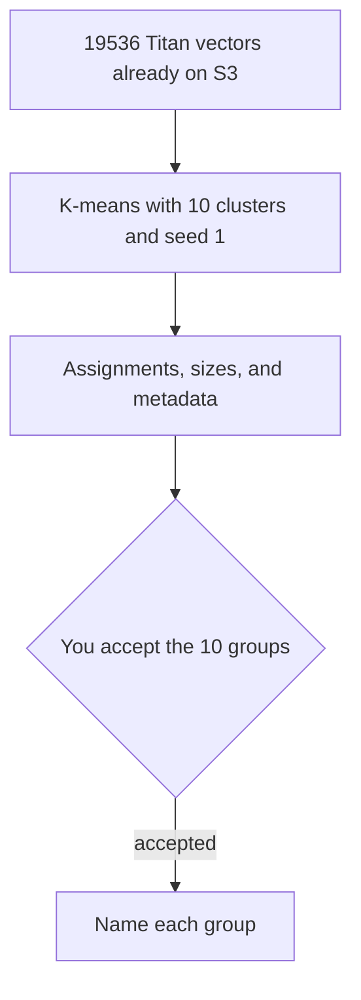

# Replace Study 2 feature clustering with 10 K-means groups

## Remember
- Exact file paths always
- Exact commands with expected output
- DRY, YAGNI, TDD, frequent commits
- Delegated tasks must be impossible to misread.

## Overview

Step 4 of Study 2 grouped 19,536 Titan vectors with HDBSCAN and returned 2 clusters: 18,340 features in one group, 8 healthcare phrases in the other, and 1,188 features left as noise. This plan replaces that grouping with K-means fixed at 10 clusters on the same vectors. Mining, deduplication, and the embeddings stay as they are. Cluster naming still waits for a later review.

The 10-way fit was measured on 2026-09-30, before this plan, with seed 1 and no scaling. Silhouette is about 0.03 for every cluster count from 2 through 15, so 10 is a chosen count. Inertia falls smoothly across that range, with no elbow.

## Happy flow

An operator reruns only the clustering command. The same 19,536 features receive one of 10 labels. The results file and the step 4 files on S3 are replaced. Naming does not run.

## Approach

Call the existing K-means fit in `shared/feature_discovery/llm_based/cluster.py` on the raw unit-length vectors. Do not scale the vectors, and do not edit that shared module. Every feature gets a cluster, including the 1,188 points HDBSCAN marked as noise. Number the groups by size, largest first.

## What 10 clusters look like

Sizes run from 1,416 to 3,166. Each row below is the phrases nearest the group center.

| Group | Features | Nearest phrases |
| --- | ---: | --- |
| 1 | 3,166 | Immigration, guns, war, deportation, policing |
| 2 | 2,389 | Opponents framed as fascists, evil, or traitors |
| 3 | 2,075 | All-caps slogans, exclamation marks, short condemnations |
| 4 | 2,052 | Elections, parties, and voter concerns |
| 5 | 1,811 | A quoted opposing claim followed by a rebuttal |
| 6 | 1,724 | Mockery and sarcasm aimed at opponents |
| 7 | 1,714 | Profanity and derogatory insults |
| 8 | 1,635 | Claims that leaders are corrupt, criminal, or incompetent |
| 9 | 1,554 | Arguments for or against a specific policy |
| 10 | 1,416 | Named leaders, parties, and elites as the target |

These 10 sizes sum to 19,536. The healthcare phrases that were their own HDBSCAN cluster fall inside the larger topic group. They do not remain a separate cluster of 8.

## Steps

### Step 1: Refit step 4 with 10 K-means clusters

Replace the HDBSCAN fit in the Study 2 clustering command with K-means, 10 clusters, seed 1, and 10 initializations. Rewrite the assignment file, the size file, and the metadata. Update the step 4 section of the experiment results with the printed line and the size table. Do not rerun mining or embeddings.

### Step 2: Point later naming at all 10 clusters

Adjust the Study 2 naming step so it names every cluster from this run. There is no noise set to skip. Do not run naming as part of this plan.

## What "done" looks like

1. The clustering command prints 10 clusters, 0 noise, and a feature count of 19,536.
2. The 10 sizes sum to 19,536, and every step 3 feature id appears once.
3. The experiment results show the 10 sizes and the center phrases above, or the phrases from the rerun if seed 1 reproduces them.
4. S3 holds the new assignment, size, and metadata files under the same step 4 prefix.
5. The cohort, the mining file, and the Titan files are unchanged.
6. Naming has not been run.

## Decisions to confirm

- The cluster count stays 10. It is not selected by silhouette.
- Seed 1 and no scaling stay fixed, so a rerun gives the same labels.
- Groups are numbered from the largest to the smallest.
- Former noise points stay in the labeled set.
