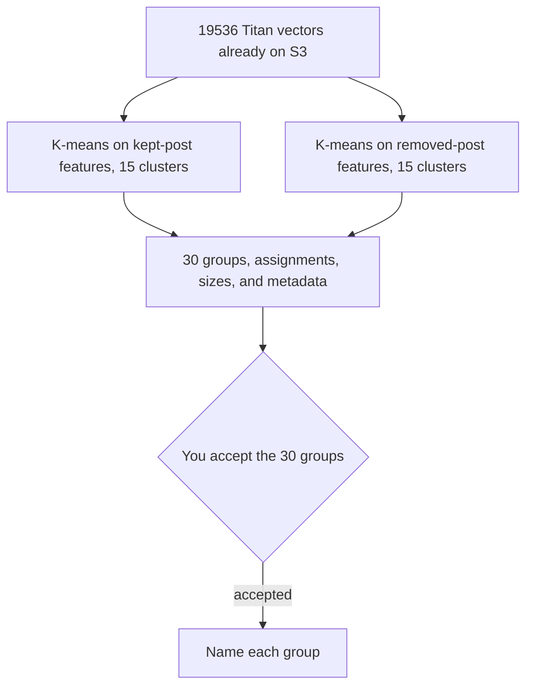

# Cluster kept-post features and removed-post features separately

## Remember
- Exact file paths always
- Exact commands with expected output
- DRY, YAGNI, TDD, frequent commits
- Delegated tasks must be impossible to misread.

## Overview

Step 4 of Study 2 grouped 19,536 Titan vectors with HDBSCAN and returned 2 clusters. This plan replaces that grouping with two K-means fits on the same vectors. One fit uses the features mined from kept posts. The other uses the features mined from removed posts. Each fit has 15 clusters, so the run produces 30 clusters. Mining, deduplication, and the embeddings stay as they are. Cluster naming still waits for a later review.

On 2026-09-30 the distinct features split as 9,517 kept-only, 10,002 removed-only, and 17 on both sides. A feature on both sides goes into both fits. A feature on one side goes into that side only.

## Happy flow

An operator reruns only the clustering command. Kept-post features receive one of 15 labels, and removed-post features receive one of 15 labels. The results file and the step 4 files on S3 are replaced. Naming does not run.

## Approach

Call the existing K-means fit in `shared/feature_discovery/llm_based/cluster.py` twice, once per side, on the raw unit-length vectors. Do not scale the vectors, and do not edit that shared module. Seed 1 and 10 initializations apply to both fits. Within each side, number groups from the largest to the smallest. There is no noise label. Every feature from step 3 is in at least one group.

## Steps

### Step 1: Refit step 4 as two 15-cluster K-means runs

Replace the HDBSCAN fit in the Study 2 clustering command with the two K-means fits. Rewrite the assignment file, the size file, and the metadata. Update the step 4 section of the experiment results with the printed line and a table of the 30 groups. Do not rerun mining or embeddings.

### Step 2: Point later naming at all 30 clusters

Adjust the Study 2 naming step so it names every kept-post group and every removed-post group. Each prompt receives the 50 member features closest to that group's center. A group with 50 or fewer members sends every member. Do not run naming as part of this plan.

## What "done" looks like

1. The clustering command prints 30 clusters and 0 noise, with the kept-post feature count and the removed-post feature count.
2. Each side has 15 groups. The sizes on a side sum to that side's feature count. The 17 features on both sides appear in one kept-post group and one removed-post group.
3. The experiment results list the 30 sizes and the phrases nearest each center.
4. S3 holds the new assignment, size, and metadata files under the same step 4 prefix.
5. The cohort, the mining file, and the Titan files are unchanged.
6. Naming has not been run.

## What the 30 groups look like

Measured on 2026-09-30 after the refit. Kept-post sizes run from 249 to 1,446. Removed-post sizes run from 205 to 1,124. The phrase is the feature nearest the group center.

| Cluster | Features | Nearest phrase |
| --- | ---: | --- |
| kept_000 | 1,446 | Concern about armed extremists, authoritarian government, or corporate influence |
| kept_001 | 1,031 | Criticism aimed at parties, politicians, ideologies, or institutions |
| kept_002 | 853 | Policy prescriptions or arguments about government action |
| kept_003 | 837 | Predictions about elections or partisan behavior |
| kept_004 | 686 | Substantive factual or quasi-factual claims about policy, law, or institutions |
| kept_005 | 678 | Occasional italicized emphasis and slogan-like phrasing |
| kept_006 | 648 | Rhetorical challenges to an opposing position |
| kept_007 | 551 | Abortion rights, gun control, and immigration policy |
| kept_008 | 524 | Longer explanatory passages and multi-sentence arguments |
| kept_009 | 498 | Political leaders, parties, institutions, and policies as targets |
| kept_010 | 448 | Contrastive framing with “but,” “while,” and “instead” |
| kept_011 | 406 | Named politicians, institutions, and policy terms |
| kept_012 | 361 | Occasional profanity embedded in argument rather than sustained insult |
| kept_013 | 318 | Elite-versus-public framing involving bureaucrats, billionaires, or party establishments |
| kept_014 | 249 | Persuasion through explanation and political argument |
| removed_000 | 1,124 | Mobilizing partisan hostility through alarmist framing |
| removed_001 | 1,092 | Culture-war claims about policing, transgender sports, abortion, and border enforcement |
| removed_002 | 1,011 | Provocative mockery intended to demean an opposing side |
| removed_003 | 917 | Opponents portrayed as stupid, fanatical, corrupt, or dangerous |
| removed_004 | 868 | All-caps commands, slogans, and repeated emphasis |
| removed_005 | 817 | Sweeping accusations of lying, corruption, criminality, or authoritarian takeover |
| removed_006 | 805 | Calls for exclusion, punishment, or removal of opponents |
| removed_007 | 590 | Broad partisan out-groups such as Republicans, Democrats, liberals, and MAGA supporters |
| removed_008 | 577 | Derogatory labels such as 'moron,' 'thugs,' and 'pigs' |
| removed_009 | 488 | Direct attacks on named politicians and their supporters |
| removed_010 | 482 | Short, slogan-like statements and blunt insults |
| removed_011 | 378 | Heavy profanity and vulgar insults |
| removed_012 | 355 | Direct second-person address with insults |
| removed_013 | 310 | Collective blame assigned to voters or broad partisan populations |
| removed_014 | 205 | Hostile venting and outrage |

## Decisions

- Each side uses 15 clusters. The count is chosen, not selected by silhouette.
- Seed 1 and no scaling stay fixed, so a rerun gives the same labels.
- Within a side, group 0 is the largest.
- The 17 features mined from both kept and removed posts are members of both fits.
