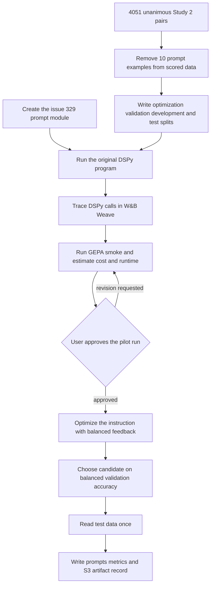

# Optimize the Study 2 few-shot moderation prompt with DSPy and GEPA

## Remember

- Exact file paths always
- Exact commands with expected output
- DRY, YAGNI, smoke verification, frequent commits
- Delegated tasks must be impossible to misread.

## Overview

[Issue 332](https://github.com/METResearchGroup/mirrorView-task/issues/332) asks us to optimize the few-shot keep or remove prompt from [issue 329](https://github.com/METResearchGroup/mirrorView-task/issues/329) with DSPy and GEPA. The experiment will use OpenAI GPT-5.6 Terra through Amazon Bedrock for task predictions and GEPA reflection. Source code and documentation will live under `/Users/mark/src/work/mirrorview-wt/experiments/dspy_gepa_optimization_2026_09_30/`. Generated splits, optimizer state, predictions, prompts, and metrics will live under `s3://mirrorview-experimental-artifacts/experiments/dspy_gepa_optimization_2026_09_30/`.

The registered `STUDY_2_KEEP_REMOVE_UNANIMOUS_LABELS` dataset currently has 4,051 unique pairs. Every pair has five labelers, and all five labels agree. The dataset contains 3,743 keep pairs and 308 remove pairs. The issue 329 prompt uses five keep pairs and five remove pairs from the same dataset as labeled examples. The experiment will exclude those 10 pairs from optimization and evaluation metrics, leaving 4,041 eligible pairs with 3,738 keep labels and 303 remove labels.

Issue 329 is still open, and `/Users/mark/src/work/mirrorview-wt/experiments/few_shot_llm_inference_2026_09_30/` does not exist on `main`. The implementation will create `/Users/mark/src/work/mirrorview-wt/experiments/few_shot_llm_inference_2026_09_30/shared/prompts.py` with the issue 329 baseline prompt. The DSPy experiment will import that prompt instead of waiting for issue 329 to land. Any later rebase conflict in that file will be resolved when the issue 329 work is merged.

[DSPy 3.4.0](https://github.com/stanfordnlp/dspy/releases/tag/3.4.0) is the proposed dependency because it includes the DSPy integration for [GEPA 0.1.4](https://github.com/gepa-ai/gepa/releases/tag/v0.1.4). The implementation will confirm those versions in `pyproject.toml` and `uv.lock`. A contract smoke test must confirm that DSPy's Bedrock provider can call `us.openai.gpt-5.6-terra` before the optimizer starts.

[W&B Weave's DSPy integration](https://docs.coreweave.com/products/wandb/weave/guides/integrations/dspy) will trace DSPy modules, signatures, optimizer calls, and evaluations in the `dspy_gepa_optimization_2026_09_30` project. Each trace will carry the experiment run ID, stage, model ID, seed, split hashes, candidate ID, and smoke or pilot mode so the W&B view can be reconciled with S3 artifacts.

## Happy flow

A researcher adds the issue 329 prompt module, validates the unanimous Study 2 dataset, and writes deterministic pilot splits to S3. The researcher confirms that W&B Weave receives a DSPy contract trace, then runs the original program and a small GEPA smoke test. The smoke report gives low, median, and high estimates for the pilot's cost and runtime. Work stops until the user approves the pilot. After approval, GEPA proposes instruction changes from reflection batches balanced by class and selects the candidate with the highest balanced validation accuracy. The researcher monitors traces while the optimizer runs, measures the selected candidate on development data at threshold 0.5, then reads the test set once and compares the original and optimized prompts on the same rows.



## Approach

Represent the moderation classifier as one DSPy prediction step with two post text inputs and two typed outputs: the remove decision and the model's reported remove probability. Keep the 10 issue 329 labeled examples fixed as demonstrations. Let GEPA edit the moderation instruction, while the inputs, demonstrations, and output contract remain fixed. The seed program and each candidate will use GPT-5.6 Terra for predictions. GPT-5.6 Terra will also write GEPA's reflections so issue 332 uses one model throughout the experiment.

Initialize Weave before constructing or running any DSPy module so automatic DSPy tracing covers baseline predictions, GEPA optimization, and evaluation. Use the explicit project path `mind_technology_lab/dspy_gepa_optimization_2026_09_30` on the default W&B host. Add explicit traced boundaries around setup, smoke, optimization, selection, and test evaluation. Read `WANDB_API_KEY` through the repository's environment loader, never from a command argument or committed file. The loader already registers `WANDB_API_KEY`, and the current environment resolves it successfully. The setup preflight will fail before the first paid model call if the key, Weave authentication, or trace upload is unavailable. Record the resulting W&B project and trace URLs in the local run summary and S3 configuration.

The 10 prompt examples create direct label leakage because they are rows in the unanimous dataset. A temporary audit script will match those examples to the registered data once and print their 10 post IDs. The implementation will copy those IDs into an `EXCLUDELIST_POST_IDS` constant, delete the temporary script, and exclude the constant's IDs whenever it loads experiment inputs. From the remaining 4,041 rows, select a deterministic 405-row pilot cohort with seed `20261001`, stratified by label and sampled stance. Split that cohort into 222 optimization rows, 61 GEPA validation rows, 61 development rows, and 61 test rows. Their proposed remove counts are 17, 5, 5, and 5. The setup command will write the exact ordered post IDs and a SHA-256 hash for the cohort and each split.

Ordinary random batches are a poor fit because remove labels are only 7.5% of the eligible data. A custom reflection sampler will draw one keep and one remove example per reflection batch from the optimization split. GEPA will score candidates on a fixed balanced subset of the GEPA validation split with all 5 remove rows and 5 deterministically sampled keep rows. Each metric result will use hard label correctness and plain feedback that names the gold label, predicted label, reported probability, and any contract failure. The pilot budget will allow 1,000 metric calls, require strict improvement, and use a fixed seed. The smoke run will use 30 metric calls and must produce at least one valid candidate before the pilot is approved.

GEPA's validation score will identify the highest-scoring candidate. The evaluation command will score that candidate on the complete development split. It will use remove as the positive class and 0.5 as the fixed threshold, then score the candidate on the test split once. The baseline will use the same threshold and test rows. `RESULTS.md` will report F1, accuracy, recall, and precision at 0.5.

The 10% budget makes this a pilot rather than a confirmatory experiment. With only five remove examples in development and five in test, each missed remove changes recall by 20 percentage points. The report will present those metrics as directional and retain the unused eligible rows for a later, larger run.

Candidate checks will reject a prompt that loses the required input or output contract, copies a 40-character span from an optimization post, or exceeds 125% of the seed instruction length. The optimizer will save every accepted prompt, score, call count, token count, and rejection reason. Those records will show which run produced the final prompt.

## Proposed file structure

```text
/Users/mark/src/work/mirrorview-wt/
  pyproject.toml
  uv.lock
  experiments/few_shot_llm_inference_2026_09_30/
    shared/
      __init__.py
      prompts.py
  experiments/dspy_gepa_optimization_2026_09_30/
    README.md
    SETUP.md
    RESULTS.md
    shared/
      __init__.py
      config.py
      data.py
      program.py
      metric.py
      evaluation.py
      artifacts.py
      telemetry.py
    src/
      step1_setup/
        main.py
      step2_optimize/
        main.py
      step3_evaluate/
        main.py
```

`README.md` will contain the experiment title and links to `SETUP.md` and `RESULTS.md`. `SETUP.md` will describe the required registered dataset, issue 329 artifacts, W&B authentication through AWS Secrets Manager and the environment loader, and the approved raw trace data policy. `RESULTS.md` will contain the final split audit, optimizer run summary, prompt comparison, metric tables, and W&B trace links.

The shared modules will separate data validation and splitting, the DSPy program, GEPA feedback, final evaluation, and S3 artifacts. Each stage will have one `main.py` entry point. The experiment will not add a test directory or test files. Smoke commands will verify the live contracts. Generated data and model outputs will remain out of Git.

The S3 layout will be as follows:

```text
s3://mirrorview-experimental-artifacts/experiments/dspy_gepa_optimization_2026_09_30/
  inputs/
    split_manifest.json
    optimization.parquet
    gepa_validation.parquet
    development.parquet
    test.parquet
  runs/
    RUN_ID/
      config.json
      telemetry.json
      baseline/
        predictions.parquet
        metrics.json
      optimization/
        optimizer_state/
        candidates.jsonl
        accepted_prompts/
        rejection_log.jsonl
        usage.json
      selection/
        candidate_metrics.jsonl
        selected_program.json
        optimized_prompt.txt
        development_predictions.parquet
        development_metrics.json
      test/
        baseline_predictions.parquet
        optimized_predictions.parquet
        metrics.json
```

## Core optimization loop

1. Add the issue 329 baseline prompt to `/Users/mark/src/work/mirrorview-wt/experiments/few_shot_llm_inference_2026_09_30/shared/prompts.py`.
2. Run a temporary audit script that resolves the 10 labeled examples to 10 post IDs. Copy the printed IDs into `EXCLUDELIST_POST_IDS`, then delete the script.
3. Load `STUDY_2_KEEP_REMOVE_UNANIMOUS_LABELS`, exclude `EXCLUDELIST_POST_IDS`, and fail unless the source and eligible row counts match. Build the four deterministic splits and write their IDs, counts, hashes, and source dataset metadata to S3.
4. Initialize W&B Weave for `mind_technology_lab/dspy_gepa_optimization_2026_09_30` on the default host, attach the run metadata, and upload one no-cost local trace followed by one paid DSPy contract trace. Stop if either trace is missing.
5. Build the seed DSPy program from the issue 329 instruction, fixed demonstrations, and typed output contract. Run the seed on a contract sample and on the development split.
6. Draw a reflection batch balanced by class from the optimization split. Run the current candidate, return hard correctness plus specific feedback, and ask GPT-5.6 Terra to propose a revised instruction.
7. Reject proposals that break the fixed contract, copy optimization text, exceed the length limit, or fail to beat the parent under strict improvement. Score accepted candidates on the fixed balanced GEPA validation set and save the optimizer state after each accepted candidate.
8. Run the 30-call smoke, reconcile W&B and local call counts, calculate low, median, and high cost and runtime estimates from measured input tokens, output tokens, latency, retry rate, and reflection count, then stop for user approval.
9. After approval, stop the pilot optimizer at 1,000 metric calls or a terminal provider error. Select the candidate with the highest balanced validation accuracy, using deterministic tie breaking.
10. Score the selected candidate on the complete development split at threshold 0.5 and record its F1.
11. Score the original program and selected program on the test split once. Write predictions, metrics, prompts, token usage, call counts, W&B trace references, and the complete run configuration to S3 and `RESULTS.md`.

## Required changes from the issue 329 inference experiment

- Replace the direct Bedrock classification loop with a single DSPy program so GEPA can inspect predictions and edit the instruction.
- Create issue 329's prompt module now, then keep its exact prompt, pair ordering, labeled examples, model ID, response fields, retry behavior, and S3 conventions.
- Add four deterministic data splits because prompt optimization needs independent validation, candidate selection, and test data. Issue 329 labels every row without a split.
- Exclude the 10 prompt examples from all metrics because their labels are present in the prompt.
- Add reflection and validation sampling balanced by class because only 303 of the 4,041 eligible pairs are remove examples.
- Add textual metric feedback because GEPA uses the feedback to decide how to revise the instruction.
- Add prompt guards, optimizer checkpoints, candidate selection at threshold 0.5, and one test evaluation.
- Add W&B Weave tracing before any DSPy call, plus run metadata and explicit stage boundaries that connect traces to S3 artifacts.
- Save the compiled DSPy program and a plain text optimized prompt so later inference can use the result without rerunning GEPA.

## Steps

### Step 1: Add the issue 329 prompt and confirm DSPy Bedrock access

Create `/Users/mark/src/work/mirrorview-wt/experiments/few_shot_llm_inference_2026_09_30/shared/prompts.py` with the issue 329 baseline prompt. Add DSPy, GEPA, and a current Weave release that supports current W&B API keys, load `WANDB_API_KEY` through `EnvVarsContainer`, initialize `mind_technology_lab/dspy_gepa_optimization_2026_09_30` on the default W&B host, and run one structured prediction plus one reflection call through the exact Bedrock model ID. The contract check must return a visible Weave trace URL.

Detailed implementation contract: [steps/step1.md](steps/step1.md)

### Step 2: Build and verify the experiment dataset

Create the experiment documentation and shared data module. Use a temporary script to resolve the 10 prompt examples, write the resulting IDs into `EXCLUDELIST_POST_IDS`, and delete the script. Build the four deterministic splits after applying that constant, verify their counts and hashes, and upload the split artifacts to the experiment's S3 prefix.

Detailed implementation contract: [steps/step2.md](steps/step2.md)

### Step 3: Build the seed DSPy program and GEPA metric

Build one typed DSPy classifier that reproduces the issue 329 task with fixed demonstrations. Add response validation, reflection sampling balanced by class, hard correctness scoring, specific feedback, and proposal checks. Verify the contracts through setup and live smoke commands without adding test files.

Detailed implementation contract: [steps/step3.md](steps/step3.md)

### Step 4: Run baseline and optimizer smoke tests

Run the original program on the development split and save its metrics. Run GEPA with a 30-call budget, confirm that the optimizer proposes and scores at least one valid candidate, verify checkpoint resume, and record measured token use. Reconcile W&B traces against local usage records, produce low, median, and high cost and runtime estimates for the pilot run, then stop and wait for explicit user approval.

Detailed implementation contract: [steps/step4.md](steps/step4.md)

### Step 5: Optimize and select one prompt

After user approval, run the pilot optimizer with deterministic sampling and checkpoints. Select one candidate by balanced validation accuracy, then score it on the complete development split at threshold 0.5.

Detailed implementation contract: [steps/step5.md](steps/step5.md)

### Step 6: Evaluate once and write the report

Evaluate the original and selected programs on the untouched test split once at threshold 0.5. Write the required metric tables, the original and optimized prompts, split audit, call counts, token usage, and run identifiers to `RESULTS.md`, then verify every referenced S3 object.

Detailed implementation contract: [steps/step6.md](steps/step6.md)

## Draft verification commands

```bash
PYTHONPATH=. uv run python experiments/dspy_gepa_optimization_2026_09_30/src/step1_setup/main.py
```

Expected output. The command reports 4,051 source rows, 10 excluded prompt examples, 4,041 eligible rows, a 405-row pilot cohort, and split sizes of 222, 61, 61, and 61. It prints one S3 manifest URI and exits zero.

```bash
PYTHONPATH=. uv run python experiments/dspy_gepa_optimization_2026_09_30/src/step2_optimize/main.py --smoke --max-metric-calls 30
```

Expected output. W&B authentication succeeds, the Bedrock contract checks pass, at least one candidate is scored, and the optimizer state is written to the smoke run folder. The command prints the W&B project and smoke trace URLs, reconciles 30 metric calls against local usage, prints low, median, and high cost and runtime estimates, then states that user approval is required before the pilot run.

```bash
PYTHONPATH=. uv run python experiments/dspy_gepa_optimization_2026_09_30/src/step3_evaluate/main.py --run-id RUN_ID
```

Expected output. The command reports one selected candidate, one baseline test result, one optimized test result, and the S3 URI for the completed run. Every metric uses threshold 0.5. A second run with the same run ID performs no new test calls.

## Preliminary pilot-run estimates

The estimate uses the current [Amazon Bedrock short-context Geo CRIS rate for GPT-5.6 Terra](https://docs.aws.amazon.com/bedrock/latest/userguide/model-card-openai-gpt-56-terra.html), which is $2.20 per million input tokens and $13.20 per million output tokens. The issue 329 seed prompt is 1,262 tokens before the post pair, and the measured median is 1,346 tokens after adding a unanimous Study 2 pair. The estimate covers 1,244 task metric calls: 1,000 GEPA calls, 61 development calls for the selected candidate, 61 baseline development calls, and 122 test calls for the baseline and selected candidate. It assumes no prompt cache discount. The smoke report will replace every token, latency, retry, and reflection assumption below with measured values.

| Estimate | Cost | Runtime | Main assumptions |
| --- | ---: | ---: | --- |
| Low | $6 | 10 minutes | Short outputs, about 5 reflections, 16 concurrent task calls, and few retries |
| Median | $9 | 30 minutes | About 100 output tokens per task call, about 8 reflections, and 8 concurrent task calls |
| High | $18 | 2 hours | Longer prompts and outputs, about 12 reflections, 4 concurrent task calls, and retry overhead |

The smoke itself should cost about $0.10 to $0.30 and take about 2 to 10 minutes. The values cover Bedrock usage and exclude any W&B account or trace-storage charges. They are planning ranges, not spending approval. The pilot run cannot start until the user reviews the measured smoke report and approves a cost and runtime range.

## What to monitor in W&B while the experiment runs

Open the Weave **Calls** view for `mind_technology_lab/dspy_gepa_optimization_2026_09_30`. Filter by the experiment run ID first, then by `mode`, `stage`, and `candidate_id`. The local command output and S3 run configuration will contain the same run ID and a direct project URL.

Before approving the pilot, review the 30-call smoke for the following:

1. Confirm that the setup, baseline, optimizer, reflection, metric, and checkpoint operations appear under the same run ID. Expand at least one task prediction and one GEPA reflection to confirm that child calls are nested under the correct stage.
2. Confirm that W&B and the local usage record agree on completed calls, errors, input tokens, output tokens, and retries. Investigate any missing completed call after the client flushes.
3. Inspect at least one correct keep prediction, one correct remove prediction, and each contract failure. The remove decision must agree with whether the reported remove probability is at least 0.5.
4. Compare median and slowest-call latency, token counts, and retry rate with the low, median, and high estimates. Use the measured values to approve or revise the $6, $9, and $18 pilot ranges.
5. Confirm that every trace has the model ID, split hash, post ID, stage, candidate ID, and smoke mode. Confirm that no API key, AWS credential, or other secret appears in inputs, outputs, or metadata.

During the approved 1,000-call pilot, keep track of these signals:

1. **Budget:** Watch cumulative task and reflection calls, input and output tokens, retries, and projected cost. Pause the run if projected cost exceeds the approved high estimate.
2. **Optimizer progress:** Compare balanced validation accuracy by candidate and iteration. Open prompt changes for accepted candidates and confirm that improvements are not caused by copied post text, dropped output requirements, or prompt growth beyond the 125% limit.
3. **Remove-class behavior:** Review false negatives for the remove class first, then false positives. Track whether the same rule or wording pattern causes repeated mistakes across candidates.
4. **Operational health:** Watch latency outliers, provider errors, malformed responses, missing probabilities, and retry clusters. Pause if the error rate exceeds 5% over the most recent 50 paid calls or if five consecutive proposals are rejected for the same reason.
5. **Trace coverage:** Compare W&B counts with the checkpoint and local usage file after each accepted candidate. Pause if more than 1% of completed pilot calls remain absent after the client flushes.

Do not inspect test inputs, labels, predictions, or metrics until the selected candidate and its development result have been written to the immutable run configuration. After test evaluation starts, W&B may be used to check upload health, but no prompt or candidate decision may change based on test traces. At completion, review the baseline and selected-candidate test traces only as supporting evidence for `RESULTS.md`.

## Confirmed W&B configuration

1. Use the `mind_technology_lab` entity and project name `dspy_gepa_optimization_2026_09_30`.
2. Use the default W&B host without a custom base URL.
3. Require `WANDB_API_KEY` from AWS Secrets Manager through the repository environment loader. `lib/load_env_vars.py` already registers the key, and the current environment resolves it without exposing its value. Do not log, print, or commit the key.
4. Allow raw post text, prompts, model outputs, and reflection outputs in traces. Continue to remove secrets and infrastructure credentials from trace inputs, outputs, and metadata.

## Decisions applied

1. Create the issue 329 prompt module in this work and accept that a later rebase may require conflict resolution.
2. Use GPT-5.6 Terra for both task predictions and GEPA reflection through Amazon Bedrock.
3. Keep the 10 issue 329 examples fixed as DSPy demonstrations, and let GEPA edit only the moderation instruction.
4. Exclude those 10 example pairs from every metric, select a deterministic 405-row pilot cohort, and split it into 222 optimization, 61 GEPA validation, 61 development, and 61 test rows.
5. Balance reflection batches by class and select the candidate with the highest balanced validation accuracy. Report development F1 under the natural label distribution without using it to select another candidate.
6. Use threshold 0.5 everywhere and treat remove as the positive class.
7. Add no test files. Use setup checks and live smoke runs for verification.
8. Start with a 30-call smoke budget, report measured low, median, and high estimates, and stop for approval before the 1,000-call pilot run.
9. Trace every DSPy stage to `mind_technology_lab/dspy_gepa_optimization_2026_09_30` on the default W&B host, include raw post text and prompts, and reconcile those traces with local and S3 usage records.

## What "done" looks like

1. `/Users/mark/src/work/mirrorview-wt/experiments/dspy_gepa_optimization_2026_09_30/` contains only Python and Markdown source files, while generated artifacts live under the matching S3 prefix.
2. The split manifest accounts for all 4,051 source rows. It identifies 10 excluded prompt examples, 4,041 eligible rows, and the deterministic 405-row pilot cohort, with no post ID shared across optimization, GEPA validation, development, or test data.
3. `/Users/mark/src/work/mirrorview-wt/experiments/few_shot_llm_inference_2026_09_30/shared/prompts.py` contains the issue 329 baseline prompt, and the DSPy experiment imports it.
4. The seed program contains the issue 329 instruction and exactly 10 fixed demonstrations. Its prediction contract requires a Boolean remove decision and a remove probability between zero and one.
5. The smoke run proves task prediction, reflection, candidate scoring, proposal rejection, checkpoint resume, S3 writes, and usage accounting through GPT-5.6 Terra. It ends with measured low, median, and high estimates and waits for user approval.
6. No pilot run starts without explicit approval after smoke. The approved pilot run saves each accepted candidate and rejection reason, stops at the 1,000-call budget, and selects one candidate at threshold 0.5 without reading test labels.
7. The test data is read once for the selected run. `RESULTS.md` compares the original and optimized prompts with F1, accuracy, recall, and precision at threshold 0.5.
8. The run folder contains the original prompt, optimized prompt, compiled DSPy program, split hashes, model settings, optimizer settings, call counts, token usage, predictions, and metrics needed to reproduce the report.
9. The W&B project contains searchable setup, baseline, optimizer, reflection, selection, and evaluation traces with the run metadata needed to match each call to its S3 artifact. The run fails before paid inference if telemetry cannot be initialized.
