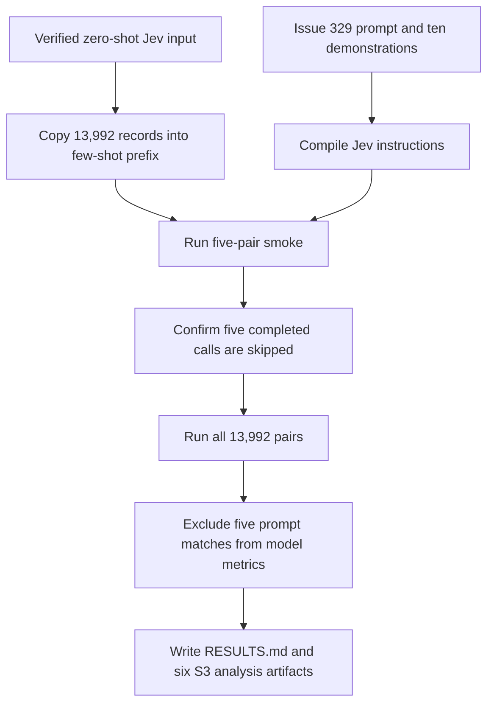

# Run few-shot Jev inference on the Study 2 dataset

## Remember

- Exact file paths always
- Exact commands with expected output
- DRY, YAGNI, TDD, frequent commits
- Delegated tasks must be impossible to misread.

## Overview

The approved design is in [proposal.md](proposal.md). [Issue 345](https://github.com/METResearchGroup/mirrorView-task/issues/345) will run Jev 1.13.0 on all 13,992 five-labeler Study 2 pairs with the exact ten-example prompt from [issue 329](https://github.com/METResearchGroup/mirrorView-task/issues/329). The experiment will store one remove probability and label per pair, then report F1, accuracy, recall, and precision for the all, unanimous, and split datasets.

The implementation will keep the root Jev package unchanged. It will parameterize the completed zero-shot Jev experiment around its existing configuration and request boundaries, then add a thin few-shot package with its prompt, adapter, commands, and documentation. Generated input, predictions, manifests, analysis tables, and usage records will stay under the few-shot Jev S3 prefix.

## Happy flow

A researcher copies the verified zero-shot Jev input into the few-shot prefix, confirms the prompt and request shape, and runs five pairs through Jev. After the smoke run resumes without repeating completed calls, the researcher scores every pair and produces the final analysis.

## Approach

The refactor will preserve every existing zero-shot command, S3 key, and stored manifest while making experiment-specific paths and prompt identity explicit. The few-shot package will call the shared runners and will not copy their setup, inference, or analysis logic.

The user confirmed that the work must add no unit test files. Each code step will use command-level TDD: an inline assertion, import check, or CLI smoke will first expose the missing behavior and will pass after implementation. The branch will add no `tests/` directory, `test_*.py` file, or checked-in smoke script.

The proposal's inference step is split into smoke and production steps because the measured smoke result is the correctness, cost, and runtime gate for the 13,992-call run.

## Steps

### Step 1: Parameterize the zero-shot Jev pipeline

Add one experiment configuration boundary and thread it through setup, storage, inference, and analysis. Preserve the existing zero-shot commands, old manifest parsing, S3 keys, and immutable analysis bytes.

### Step 2: Add the few-shot prompt and request adapter

Add the exact issue 329 prompt, the dedicated few-shot instruction transformation, and the thin experiment package. Confirm the source and transformed instruction digests before any live call.

### Step 3: Prepare the few-shot input

Copy the verified 13,992 input records without changing their bytes. Write a new manifest that points to the few-shot records key while preserving the source digest and dataset metadata.

### Step 4: Smoke the few-shot inference path

Run five pairs through Jev under a smoke run ID, then repeat the same run to confirm that all five completed pairs are skipped. Record measured token use, cost, and runtime before starting production inference.

### Step 5: Run full few-shot inference

Score every prepared pair under one production run ID and resume the same run until its final manifest is complete. Store exactly 13,992 unique predictions with no unresolved failures.

### Step 6: Analyze and report the production run

Calculate the human label and vote distributions over all rows, but exclude the five exact prompt matches from model metrics. Write the six immutable analysis artifacts and complete `RESULTS.md` with measured metrics, usage, cost, and runtime.

## What "done" looks like

1. Existing zero-shot Jev setup, inference, and analysis commands retain their current behavior and can read stored version 1 manifests.
2. The branch changes no file under `shared/models/jev/` and adds no dependency.
3. The few-shot source prompt is byte-identical to issue 329, and the compiled Jev instructions match the confirmed transformed digest.
4. The few-shot input contains 13,992 unique ordered post IDs, including 4,051 unanimous rows and 9,941 split rows, with the confirmed records digest.
5. The smoke run stores five predictions and no unresolved failures, and its second run makes no new Jev calls for those five post IDs.
6. The production run stores exactly one valid prediction for every prepared post ID under `jev_1_13_0/` and has no unresolved failures.
7. Human label counts, split-vote counts, and usage cover all 13,992 predictions. Model metrics cover 13,987 all rows, 4,046 unanimous rows, and 9,941 split rows.
8. `RESULTS.md` reports F1, accuracy, recall, precision, measured runtime, token totals, and cost for Jev 1.13.0.
9. The implementation adds no unit test file, test directory, or checked-in smoke script.
10. The implementation pull request contains only the files named by the approved step files, while this planning pull request contains only `proposal.md`, `plan.md`, and `steps/step1.md` through `steps/step6.md`.
