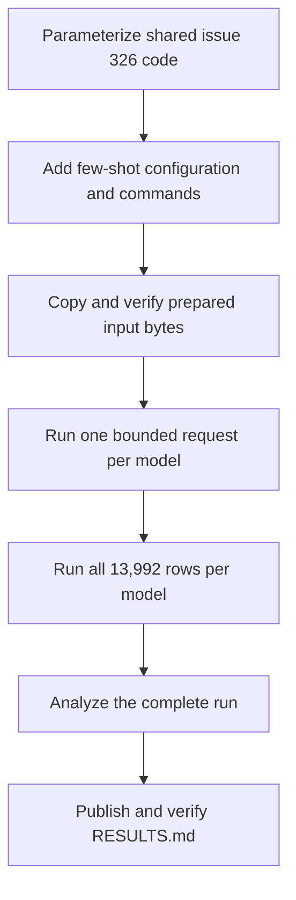

# Implement Study 2 few-shot keep or remove inference

## Remember

- Exact file paths always
- Exact commands with expected output
- DRY, YAGNI, TDD, frequent commits
- Delegated tasks must be impossible to misread.

## Overview

Implement [issue 329](https://github.com/METResearchGroup/mirrorView-task/issues/329) by adapting the completed issue 326 pipeline to an experiment configuration and injected prompt formatter. The few-shot package will contain the issue prompt, its configuration, documentation, and thin command entry points. Setup, inference, resume, storage, and analysis behavior will remain in the zero-shot package and serve both experiments.

The approved design is in [proposal.md](proposal.md). Its four confirmed decisions govern this plan. In particular, do not add unit tests. Verification uses import checks, contract checks in one-off Python commands, S3 checks, bounded live inference, and the complete experiment run.

## Happy flow

## Approach

Work from callers inward. First make the existing zero-shot entry points explicit wrappers around a zero-shot configuration, while preserving their command behavior and their ability to read existing manifests. Then add the few-shot callers and exact prompt. Run setup only after key isolation and byte-copy behavior are confirmed. Run bounded live inference for all four models before the complete 55,968-call run. Analyze only complete model folders, then publish the generated results and measured run information.

Each implementation step has one primary boundary and one focused commit. The execution step runs the three completed commands in order. Do not create files under any test directory. Do not run pytest. The TDD reminder above is satisfied here by writing the executable smoke contract before implementation and running it after implementation.

The proposal's first refactor step is split across Steps 1 through 4. Shared contracts come first, followed by setup, inference, and analysis callers in execution order. This keeps each intermediate commit importable and gives each caller its own smoke contract.

## Decisions carried into implementation

- Few-shot code imports reusable code from `experiments/zero_shot_llm_inference_2026_09_30/`. The zero-shot package never imports the few-shot package.
- The exact prompt text has SHA-256 `ca6f0df53ad3a39136d1d9794ea73cfb6f8171ff1b5eb22e0d45e3d92e164fe3`. The existing zero-shot prompt has SHA-256 `bbec6228173d04e0adafa871b6dc3751cbc1e8972f29cd49d45df7ca736a46ec`.
- Setup copies the verified zero-shot `records.jsonl` bytes without reserializing them. The new manifest points to the few-shot key and retains the source digest and counts.
- New prediction, failure, model-run, and analysis artifacts use few-shot schema versions. Stored model-run and analysis manifests include the experiment name, prompt name, and prompt digest. Older zero-shot manifests load with zero-shot defaults.
- All path builders, readers, writers, record validators, manifest validators, and resume checks receive the active experiment configuration. A run ID does not identify the experiment.
- The pipeline predicts all 13,992 rows for each model. Model metrics exclude the five confirmed prompt-demonstration matches. Descriptive human-label and split-vote tables use all input rows.
- The metric partitions contain 13,987 all rows, 4,046 unanimous rows, and 9,941 split rows. The original partitions remain 13,992, 4,051, and 9,941.
- `experiments/zero_shot_llm_inference_2026_09_30/src/step3_analysis/render.py` remains unchanged.
- The user's untracked `experiments/zero_shot_llm_inference_2026_09_30/REPORT.md` and `experiments/zero_shot_llm_inference_2026_09_30/probe_bedrock_models.py` remain unchanged.

## Steps

### Step 1: Add the shared experiment contracts

Add the experiment configuration, prompt formatter boundary, variant-aware storage paths, and backward-compatible manifest identity. Preserve the existing zero-shot commands and stored manifest behavior. See [steps/step1.md](steps/step1.md).

### Step 2: Add few-shot setup and copy the input

Add the exact few-shot prompt, configuration, documentation scaffold, and setup caller. Copy and verify the prepared input package in the few-shot S3 prefix. See [steps/step2.md](steps/step2.md).

### Step 3: Add and smoke the few-shot inference caller

Parameterize the reusable inference runner, add the thin few-shot caller, and run one live record through each model in a dedicated smoke run. See [steps/step3.md](steps/step3.md).

### Step 4: Add and verify the few-shot analysis caller

Parameterize the reusable analysis runner, apply the five metric-only exclusions, and verify the analysis contract without running the complete production experiment yet. See [steps/step4.md](steps/step4.md).

### Step 5: Run, analyze, and publish the experiment

Run all four model folders, analyze the completed run, publish `RESULTS.md`, and verify the repository and S3 outputs together. See [steps/step5.md](steps/step5.md).

## What done looks like

1. The existing zero-shot setup, inference, and analysis commands still import, show help, and read older zero-shot manifests.
2. The few-shot prompt matches issue 329 exactly and has the approved digest.
3. The few-shot input contains 13,992 records whose bytes and digest match the zero-shot input.
4. The production run ID `study2-few-shot-2026-10-01` has four complete model folders and 55,968 valid predictions with no unresolved failures.
5. Every stored few-shot run manifest identifies the few-shot experiment and prompt. Resume rejects a differing experiment or prompt identity.
6. Analysis writes five artifacts. `model_metrics.csv` has 12 data rows and uses sample counts 13,987, 4,046, and 9,941 for each model. The human-label and split-vote files still describe all 13,992 rows.
7. `experiments/few_shot_llm_inference_2026_09_30/RESULTS.md` records the run identity, generated tables, prompt identity, five exclusions, and measured runtime and token use. Cost is recorded only from a documented price source current on the run date; otherwise it is marked unavailable rather than estimated.
8. No unit-test file or test directory is added. The zero-shot renderer, zero-shot documentation, existing zero-shot S3 objects, and the user's untracked zero-shot files are unchanged.
