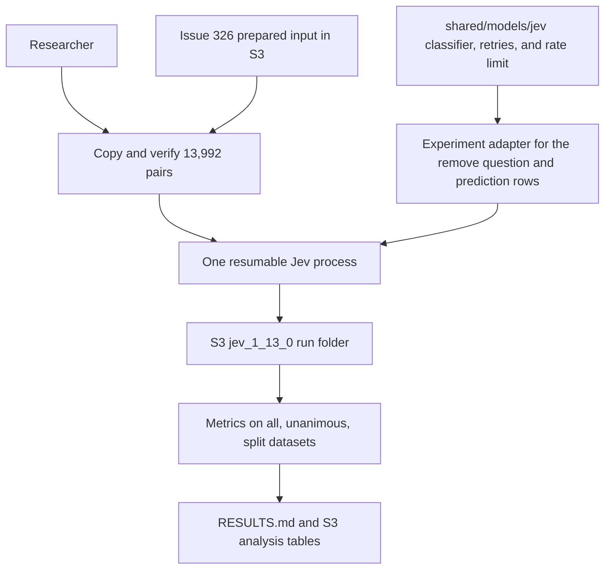

# Run zero-shot Jev keep or remove inference on the Study 2 dataset

## Remember

- Exact file paths always
- Exact commands with expected output
- DRY, YAGNI, TDD, frequent commits
- Delegated tasks must be impossible to misread.

## Overview

[Issue 330](https://github.com/METResearchGroup/mirrorView-task/issues/330) adds Jev as a zero-shot keep or remove classifier on the same 13,992 five-labeler Study 2 pairs that [issue 326](https://github.com/METResearchGroup/mirrorView-task/issues/326) scores with four Bedrock models. Jev returns a remove probability for each pair. The label is derived from that probability at 0.5, and Jev's predictions use issue 326's record format, so a reader can compare Jev with the Bedrock models post by post.

The work has two parts. A reusable Jev module goes in `shared/models/jev/`, built on LangChain's TypeSafe classifier. A thin experiment goes in `experiments/zero_shot_jev_inference_2026_10_01/`. The experiment reuses issue 326's prompt, schemas, storage helpers, prepared input, and metrics. Generated artifacts go under `s3://mirrorview-experimental-artifacts/experiments/zero_shot_jev_inference_2026_10_01/`. The approved design is in [proposal.md](proposal.md).

The plan assumes that issue 326's Step 1 files exist under `experiments/zero_shot_llm_inference_2026_09_30/shared/`, along with its prepared S3 input.

## Happy flow

A researcher copies issue 326's prepared input into this experiment's S3 prefix. They run a small Jev smoke sample, then start one resumable full Jev process. Once every pair has one valid prediction, the analysis command scores Jev against the human labels on the all, unanimous, and split datasets and writes `RESULTS.md`.

## Approach

Put Jev behavior that is not tied to one task in the root module, so later experiments can reuse it. Keep everything that depends on issue 326 or on this experiment's storage inside the experiment, because root `shared/` never imports from `experiments/`. The Jev run folder uses the same layout and prediction schema as an issue 326 model folder, so Step 5 can import issue 326's metric functions instead of copying them.

## Cost and runtime estimates

The full run sends 13,992 requests, one per pair, and the whole experiment should cost well under $1. Jev bills input at $0.042 per 1M tokens and does not bill output, so cost depends only on input tokens.

| Estimate | Input tokens per request | Total input tokens | Cost (USD) | Runtime (minutes) |
| --- | ---: | ---: | ---: | ---: |
| Low | 530 | 7.4M | $0.31 | 14 |
| Median | 700 | 9.8M | $0.41 | 16 |
| High | 1,000 | 14.0M | $0.59 | 29 |

The token estimates come from three measurements:

- The remove instructions are 1,501 characters, which is about 330 tokens.
- A Bedrock measurement in `experiments/match_lengths_original_mirrors_2026_06_19/ABLATIONS.md` puts the two posts at about 166 tokens together.
- Study 2's Jev labeling run used 4,616 input tokens per request for 30 questions, which leaves about 360 tokens beyond the instructions and posts. That figure is from `experiments/study_2_llm_based_feature_extraction_2026_09_29/RESULTS.md`.

The low estimate assumes the 360 extra tokens scale with the number of questions. The median assumes about half of them are a fixed cost per request. The high estimate assumes all of them are fixed, and it adds room for longer posts.

The runtime estimates follow from the scorer's limits:

- **Low:** the rate limit of 1,000 request starts per minute sets a floor of 14 minutes.
- **Median:** adds about 2 minutes for the 28 batches of 500, because each batch waits for its slowest request and its S3 writes. Study 2's Jev run, which had 8 workers and requests about 6 times larger, also hit this rate limit.
- **High:** assumes each request takes 1 second, so 8 workers handle 8 requests per second.

Step 4's smoke run replaces these estimates with measured values before the full run starts.

## Steps

### Step 1: Add the root Jev module

Create `shared/models/jev/` with Jev constants, the result schema, API key lookup and classifier construction, the request-start limiter, and the scorer. The scorer handles rate limiting, transient-error retries, the pinned-model check, and the missing-answer check. Add the pinned `langchain-typesafe` dependency to `pyproject.toml` and `uv.lock`. The step adds no test files and no mock checks. Step 4's smoke run is the first check of the scorer's live behavior.

### Step 2: Add the experiment adapter and prepare the input

Create the experiment's constants, its keep or remove request adapter, and S3 key builders. Add a setup command that copies issue 326's prepared records and manifest into this experiment's input prefix and rejects any SHA-256 mismatch.

### Step 3: Add resumable Jev inference

Build one inference command that scores pending pairs with a shared scorer across bounded worker threads. It writes immutable prediction, failure, and manifest objects under the Jev run folder and skips post IDs that already have valid predictions. The command follows the resume, limit, and batch rules of issue 326's Step 2 plan.

### Step 4: Smoke test and run full inference

Run a limited smoke sample under a smoke run ID to confirm that Jev echoes the pinned model and to measure tokens, latency, and cost. Then run the full 13,992-pair process under a production run ID and repeat until its manifest reports complete.

### Step 5: Analyze, write results, and verify

Join the Jev predictions to the prepared gold labels, then calculate F1, accuracy, recall, and precision on the all, unanimous, and split datasets using issue 326's metric functions. Generate `RESULTS.md`, keep `README.md` as a redirect, document data requirements in `SETUP.md`, and confirm that the pull request contains only `.py`, `.md`, `pyproject.toml`, and `uv.lock` changes.

## What "done" looks like

1. `shared/models/jev/` exposes a reusable Jev scorer and result schema with no imports from `experiments/`, and the branch adds no test files.
2. `pyproject.toml` and `uv.lock` pin `langchain-typesafe` to `0.0.1a3`.
3. The experiment's S3 input is a byte-identical copy of issue 326's prepared input, with 13,992 unique post IDs.
4. The production run folder `runs/RUN_ID/jev_1_13_0/` holds exactly one valid prediction for every prepared post ID and has no unresolved failures.
5. An interrupted run resumes without calling Jev again for completed post IDs or overwriting an existing object.
6. `RESULTS.md` reports Jev's F1, accuracy, recall, and precision for the all, unanimous, and split datasets, plus measured token use and cost.
7. The Study 2 feature extraction experiment is unchanged.
