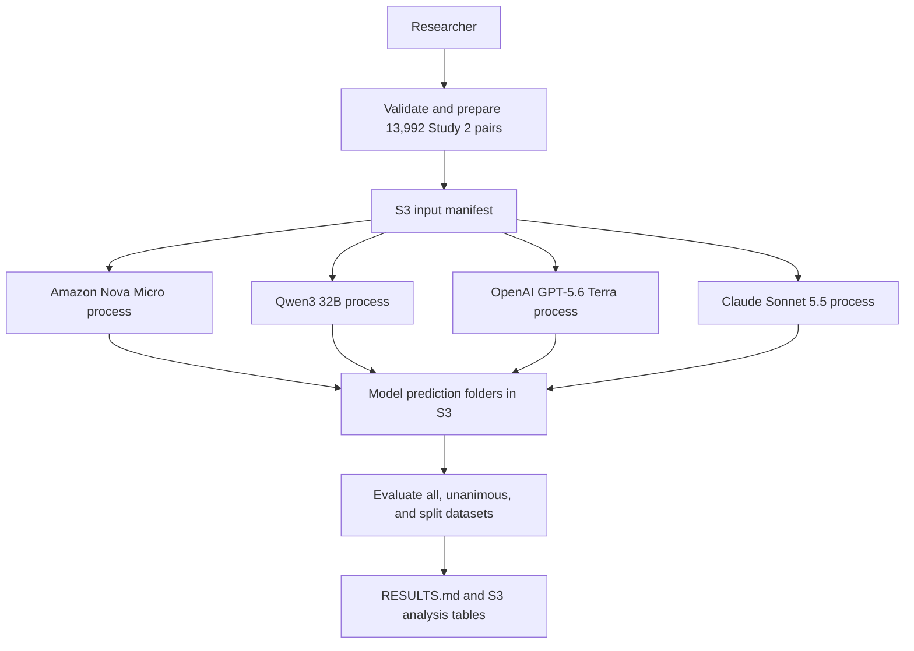

# Run zero-shot keep or remove inference across four Bedrock models

## Remember

- Exact file paths always
- Exact commands with expected output
- DRY, YAGNI, TDD, frequent commits
- Delegated tasks must be impossible to misread.

## Overview

[Issue 326](https://github.com/METResearchGroup/mirrorView-task/issues/326) requires zero-shot keep or remove predictions for every Study 2 post with exactly five labelers. The registered data has 13,992 eligible posts, including 4,051 unanimous posts and 9,941 posts with split votes.

The experiment will run Amazon Nova Micro, Qwen3 32B, OpenAI GPT-5.6 Terra, and Claude Sonnet 5.5 through the existing Bedrock Converse engine in `us-east-2`. Each prediction will include the model's remove label and remove probability. Source code and documentation will live under `/Users/mark/src/work/mirrorview-wt/experiments/zero_shot_llm_inference_2026_09_30/`, while generated inputs, predictions, failures, run metadata, and analysis tables will live under `s3://mirrorview-experimental-artifacts/experiments/zero_shot_llm_inference_2026_09_30/`.

Do not change the existing untracked `/Users/mark/src/work/mirrorview-wt/experiments/zero_shot_llm_inference_2026_09_30/REPORT.md` or `/Users/mark/src/work/mirrorview-wt/experiments/zero_shot_llm_inference_2026_09_30/probe_bedrock_models.py`. Replacing or incorporating either file requires separate approval.

## Happy flow

A researcher prepares and validates the five-labeler Study 2 input once, then starts one process for each model. Each process can resume after a failure. After all four model folders contain one valid prediction per post, the analysis command joins the predictions to the ground truth and calculates the required statistics and metrics. The command writes the final tables to `RESULTS.md`, while generated artifacts remain in S3.



## Approach

Reuse the registered Study 2 datasets, the exact prompt supplied in issue 326, and the Bedrock Converse engine. Build the experiment with direct contract checks, immutable S3 batch outputs, explicit run manifests, and safe resume behavior so a restarted model process does not repeat completed work.

Keep the Boolean label reported by the model as the classification output. Require the reported probability to be between zero and one, and require the label to agree with the probability at the 0.5 threshold. Treat remove as the positive class for F1, accuracy, recall, and precision.

## Planned artifact layout

The pull request will contain only Python and Markdown files under the experiment directory:

```text
/Users/mark/src/work/mirrorview-wt/experiments/zero_shot_llm_inference_2026_09_30/
  README.md
  SETUP.md
  RESULTS.md
  shared/
  src/
    step1_setup/
    step2_inference/
    step3_analysis/
```

Generated artifacts will use separate model folders in S3:

```text
s3://mirrorview-experimental-artifacts/experiments/zero_shot_llm_inference_2026_09_30/
  inputs/
  runs/
    RUN_ID/
      amazon_nova_micro/
      qwen3_32b/
      openai_gpt_5_6_terra/
      claude_sonnet_5_5/
  analysis/
    RUN_ID/
```

## Steps

### Step 1: Confirm data, prompt, schema, and model contracts

Implement the five-labeler filter, exact prompt rendering, deterministic post order, response validation, and four model definitions. Prepare one input manifest from the registered modal-label dataset, and verify that its post IDs equal the union of the registered unanimous and split subsets.

### Step 2: Add resumable inference and S3 storage

Build a small experiment layer over `/Users/mark/src/work/mirrorview-wt/data_platform/generate_features/engines/bedrock_engine.py`. Each model process will write only to its S3 folder. It will write immutable prediction and failure batches, record token usage and run settings, and skip post IDs already stored for the same run.

### Step 3: Verify each model and run inference

Run direct contract checks and a small smoke sample for each requested model ID before starting the four full processes. Run analysis for a model only after its manifest reports 13,992 unique predictions that pass schema validation, with no unresolved failures.

### Step 4: Calculate descriptive statistics and model metrics

Calculate keep and remove counts and proportions for the five-labeler universe, unanimous subset, and split subset. For each model and dataset, calculate F1, accuracy, recall, and precision with remove as the positive class, and report the split subset's counts and proportions for one, two, three, and four remove votes.

### Step 5: Write results and verify the experiment

Generate `RESULTS.md` from the stored artifacts. Keep `README.md` as a short redirect to `SETUP.md` and `RESULTS.md`, and document only data requirements in `SETUP.md`. Reproduce the analysis from S3, verify the totals and proportions directly, and confirm that the pull request contains only `.py` and `.md` files.

## Decisions to confirm

1. Use the model IDs from issue 326: `us.amazon.nova-micro-v1:0`, `qwen.qwen3-32b-v1:0`, `us.openai.gpt-5.6-terra`, and `us.anthropic.claude-sonnet-5-5`.
2. Require the remove probability to be between zero and one. Require the Boolean remove label to be true when the probability is at least 0.5 and false when it is below 0.5.
3. Preserve the two existing untracked experiment files named in the overview. Add the planned files beside them without changing their contents.

## What "done" looks like

1. `/Users/mark/src/work/mirrorview-wt/experiments/zero_shot_llm_inference_2026_09_30/` contains the documented setup, inference, and analysis code, plus `README.md`, `SETUP.md`, and `RESULTS.md`.
2. The prepared input contains exactly 13,992 unique Study 2 post IDs with five labelers. The unanimous and split subsets together contain every eligible ID, with no ID in both subsets.
3. The S3 run contains separate complete folders for `amazon_nova_micro`, `qwen3_32b`, `openai_gpt_5_6_terra`, and `claude_sonnet_5_5`. Each folder contains exactly one valid label and probability for every prepared post ID.
4. An interrupted model process can resume without calling Bedrock again for completed post IDs or overwriting an existing immutable batch.
5. `RESULTS.md` reports keep and remove counts and proportions for all three datasets. It also reports the one, two, three, and four remove-vote distribution for the split subset.
6. `RESULTS.md` has one metric table per evaluation dataset, with one row per model and columns for F1, accuracy, recall, and precision.
7. Direct verification commands cover data filtering, prompt rendering, schema validation, resume behavior, S3 key construction, metric calculations, and result rendering. All documented commands exit zero and produce the stated row counts, artifact paths, and table totals.
8. The pull request contains only `.py` and `.md` files. Generated data and model outputs remain under `s3://mirrorview-experimental-artifacts/experiments/zero_shot_llm_inference_2026_09_30/`.
