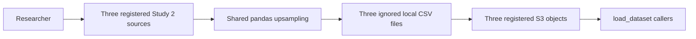

# Add balanced Study 2 keep/remove datasets

## Remember

- Exact file paths always
- Exact commands with expected output
- DRY, YAGNI, direct verification, frequent commits
- Delegated tasks must be impossible to misread.

## Overview

[Issue 338](https://github.com/METResearchGroup/mirrorView-task/issues/338) requires a shared pandas upsampling helper and three balanced Study 2 keep/remove datasets. The approved [proposal](proposal.md) fixes the seed, source rows, output schema, registry names, and S3 paths.

The implementation will add one shared helper, one Study 2 generation command, three registry entries, and documentation. The generated CSV files will remain outside Git and will be published to `s3://mirrorview-experimental-artifacts/shared/data/transformed/study_2/`.

## Happy flow

A researcher runs the Study 2 generation command. The command loads the all, unanimous, and split registered datasets, balances each table by its keep/remove class column, and writes three ignored CSV files at their registry paths. After direct checks confirm the local counts and schemas, the researcher uploads those files to S3 and confirms that the public data loader returns the expected balanced counts.

## Approach

Use the caller-first workflow with direct verification against the registered Study 2 data. Keep the shared helper independent of Study 2 and S3. The Study 2 command will loop over explicit source and output registry pairs. Reuse pandas and the existing data loading, registry, and path resolution code; do not add a dependency or another storage layer.

## Steps

### Step 1: Scaffold the shared helper and Study 2 caller

Create the new modules with imports, typed stubs, and one caller that shows the complete load, balance, and write path. Keep all behavior unimplemented in this commit. See [step 1](steps/step1.md).

### Step 2: Confirm contracts and register the outputs

Add the approved public signatures, failure behavior, mapping from each source to its output, local output paths, and three registry entries. Keep the helper and writer bodies stubbed in this commit. See [step 2](steps/step2.md).

### Step 3: Implement deterministic DataFrame upsampling

Implement the shared helper as the first dependency in the caller path. Run it against the three registered source datasets and confirm the exact balanced counts without writing files. See [step 3](steps/step3.md).

### Step 4: Implement the Study 2 dataset writer

Complete the load, upsample, resolve, and write caller without repeating the existing Study 2 filters. Generate the three local CSVs and verify their counts, schemas, source coverage, and ignored status. See [step 4](steps/step4.md).

### Step 5: Publish, document, and verify the datasets

Repeat the direct local checks, publish each file to its approved S3 key without replacing an existing object, reload all three registry entries, and record the result in the data README and changelog. See [step 5](steps/step5.md).

## What "done" looks like

1. `shared/utils/upsample.py` balances binary and multiclass DataFrames with replacement, uses seed `1` by default, preserves all columns, and leaves its input unchanged.
2. `shared/data/transformed/study_2/upsample_keep_remove_labels.py` loads exactly the three approved source datasets and writes exactly the three approved output paths.
3. `shared/data/registry.py` exposes the three approved output names as transformed Study 2 datasets.
4. Direct checks against the registered data confirm the helper and writer outputs without adding test files.
5. The S3 outputs contain 30,280, 7,486, and 14,562 rows. Each output has equal keep and remove counts and the same 13 columns as its source.
6. The public data loader downloads each published output, and the downloaded bytes match the generated local file.
7. Git contains only Python, Markdown, and plan files for this work. The generated CSV files remain ignored.
