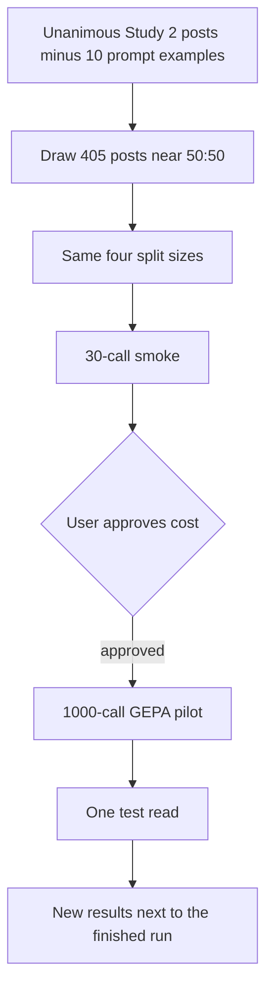

# Run the GEPA prompt ablation on a balanced keep and remove cohort

## Remember

- Exact file paths always
- Exact commands with expected output
- DRY, YAGNI, TDD, frequent commits
- Delegated tasks must be impossible to misread.

## Overview

The finished Study 2 GEPA run scored a 405-post cohort whose remove rate followed the unanimous data: 17 remove posts in optimization and 5 in each of the other splits. This ablation draws a new 405-post cohort from the same unanimous pool, with keep and remove as close to equal as the integer split sizes allow, and runs the same optimizer and the same test protocol. The finished run, its report, and its stored artifacts stay in place.

## Happy flow

A researcher builds a new balanced cohort, checks that each split has the original row count and a near-even class mix, then runs the same smoke, pilot, and one-time test sequence under a new storage prefix. The new report records both prompts' metrics on that balanced test split and cites the finished run as the comparison.



## Approach

Change the class mix of the 405 posts. Keep the prompt, the ten demonstrations, the model, the metric, the reflection batch, the selection rule, and the 1,000-call budget. Store the new run beside the finished one.

The cohort has 405 posts, so it cannot be 202.5 and 202.5. The planned mix is 203 keep and 202 remove:

| Split | Posts | Keep | Remove |
| --- | ---: | ---: | ---: |
| Optimization | 222 | 111 | 111 |
| GEPA validation | 61 | 31 | 30 |
| Development | 61 | 30 | 31 |
| Test | 61 | 31 | 30 |

Sampling stays inside the unanimous five-labeler posts, still drops the ten prompt examples, and still stratifies by political stance within each class. The draw uses a new seed so it is not a copy of the finished cohort. Overlap with that cohort is allowed. The pool has 303 eligible remove posts, which covers the 202 remove posts in this cohort.

The optimizer still reflects on one keep post and one remove post, still selects on five keep and five remove validation posts, and still locks the prompt before the test split is read. Development and test now contain about 30 remove posts, so one missed remove changes recall by about 3 percentage points rather than 20.

## Steps

### Step 1: Add the balanced cohort without touching the finished run

Add a sibling experiment that loads the same unanimous table, applies the same ten exclusions, and writes the four splits at the counts in the table above. Verify the counts, the class totals, and that no excluded prompt example appears.

### Step 2: Point the existing optimizer at the new splits

Reuse the finished experiment's prompt, program, and metric. Give the new run its own model settings record, storage prefix, and Weave project. Confirm the command refuses to read or write the finished run's stored objects.

### Step 3: Run smoke, then stop for cost approval

Run one 30-call smoke on the balanced development split. Report measured cost and runtime ranges. Do not start the 1,000-call pilot until that range is approved.

### Step 4: Run the pilot and read the test split once

After approval, run the 1,000-call pilot, lock one instruction with the existing selection rule, score it on the balanced development split, then score the original and selected instructions once on the balanced test split. Write the new report from those stored tables.

## What "done" looks like

1. The finished experiment directory and its S3 run remain unchanged.
2. A new experiment directory contains the balanced cohort builder, the run commands, and a results report.
3. The stored cohort has 405 posts, split 222, 61, 61, and 61, with 203 keep and 202 remove at the per-split counts above.
4. The ten prompt examples are absent from every split.
5. The pilot uses the same model, metric, reflection batch, selection rule, and 1,000-call budget as the finished run.
6. The new report has development and test metrics for the balanced split, and it identifies the finished run as the comparison.
7. A repeated test command makes no new provider calls.

## Proposed files

New code and report:

```text
experiments/dspy_gepa_balanced_labels_2026_10_02/
  README.md
  SETUP.md
  RESULTS.md
  shared/
    config.py
    data.py
    artifacts.py
  src/
    step1_setup/main.py
    step2_optimize/main.py
    step3_evaluate/main.py
```

Left unchanged and imported:

```text
experiments/few_shot_llm_inference_2026_09_30/shared/prompts.py
experiments/dspy_gepa_optimization_2026_09_30/
```

New stored objects:

```text
s3://mirrorview-experimental-artifacts/experiments/dspy_gepa_balanced_labels_2026_10_02/
  inputs/
  runs/
```
