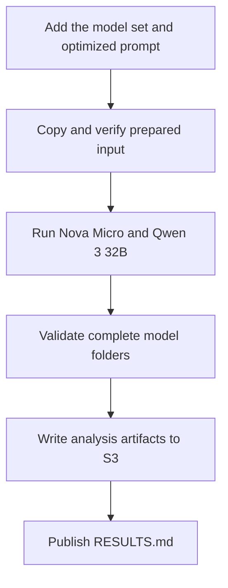

# Run the DSPy optimized few-shot prompt on Nova Micro and Qwen 3 32B

## Remember

- Exact file paths always
- Exact commands with expected output
- DRY, YAGNI, frequent commits
- Delegated tasks must be impossible to misread.

## Overview

The approved design is in [proposal.md](proposal.md). Implement [issue 351](https://github.com/METResearchGroup/mirrorView-task/issues/351) by extending the completed Study 2 inference pipeline to support a model set defined by each experiment. Add the exact optimized prompt under `shared/models/llm/`, and keep the new experiment package limited to configuration, documentation, and thin command entry points.

Researchers will run Amazon Nova Micro and Qwen 3 32B on all 13,992 prepared Study 2 pairs. The two processes will store 27,984 predictions in a new S3 prefix. Analysis will apply the five confirmed demonstration exclusions only to model metrics and will publish the same tables as the baseline few-shot experiment.

## Happy flow

A researcher prepares a byte-identical input package, runs the two approved Bedrock models in parallel, and analyzes both completed model folders. The analysis writes five immutable artifacts to S3, and the researcher records the run identity, measured usage, and generated tables in `RESULTS.md`.

## Approach

Keep one implementation of setup, inference, resume, storage, and analysis. Extend the existing experiment configuration so every command reads the same ordered model set, and preserve the current four-model behavior for the zero-shot and baseline few-shot experiments.

Work from the shared configuration toward the new callers. Confirm the existing commands after the shared change, then add the prompt and optimized experiment package before any S3 write or Bedrock request. Run limited live inference for both models before the complete run, and analyze only after both full model folders pass the existing identity and coverage checks.

Keep the proposal steps separate because they change different boundaries in order: shared configuration, new experiment files, prepared input, provider inference, and final analysis.

## Steps

### Step 1: Make the model set part of each experiment

Update the shared Study 2 configuration, inference, and analysis code so each experiment defines its ordered model folders. Keep all four current models in the zero-shot and baseline few-shot experiments, and reject inference or analysis outside the active experiment's model set. See [steps/step1.md](steps/step1.md).

### Step 2: Add the optimized prompt and experiment package

Add the exact issue 351 prompt under `shared/models/llm/`. Create the optimized experiment configuration, initial documentation, and thin setup, inference, and analysis entry points under `experiments/dspy_optimized_few_shot_llm_inference_2026_10_04/`. See [steps/step2.md](steps/step2.md).

### Step 3: Prepare the optimized experiment input

Copy the completed baseline few-shot input bytes into the new S3 prefix. Confirm the source and target digests, row counts, first post ID, and last post ID before inference. See [steps/step3.md](steps/step3.md).

### Step 4: Run Nova Micro and Qwen 3 32B

Run a limited smoke request through each model before starting the two complete, resumable inference processes. Require 13,992 valid predictions and no unresolved failures in each model folder. See [steps/step4.md](steps/step4.md).

### Step 5: Analyze and publish the completed run

Analyze the two complete model folders with the confirmed five-row metric exclusion. Write the five analysis artifacts to S3, update `RESULTS.md` with the generated tables and measured usage, and run the final repository and S3 consistency checks. See [steps/step5.md](steps/step5.md).

## What "done" looks like

1. The existing zero-shot and baseline few-shot commands retain their four-model behavior, and their import and CLI smoke checks pass.
2. The repository stores the exact issue 351 prompt under `shared/models/llm/prompt.py` with SHA-256 `6ebcd9bbb16ff39dbeba93fe832a601a589ce1d8233645aad5030b105df9af15`.
3. The optimized experiment allows only `amazon_nova_micro` and `qwen3_32b`.
4. The new S3 input contains the same 13,992 records and digest as the completed baseline few-shot input.
5. Each model folder contains 13,992 valid predictions and no unresolved failures, for 27,984 predictions in total.
6. Model metrics contain six rows and use 13,987 all rows, 4,046 unanimous rows, and 9,941 split rows. Human label and split-vote tables use all prepared rows.
7. The analysis prefix contains `label_counts.csv`, `split_remove_vote_counts.csv`, `model_metrics.csv`, `results_fragment.md`, and `analysis_manifest.json`.
8. `RESULTS.md` records the run ID, prompt digest, input digest, five excluded post IDs, measured runtime, token use, and the generated result tables.
9. Existing zero-shot, baseline few-shot, and DSPy optimization artifacts remain unchanged.
