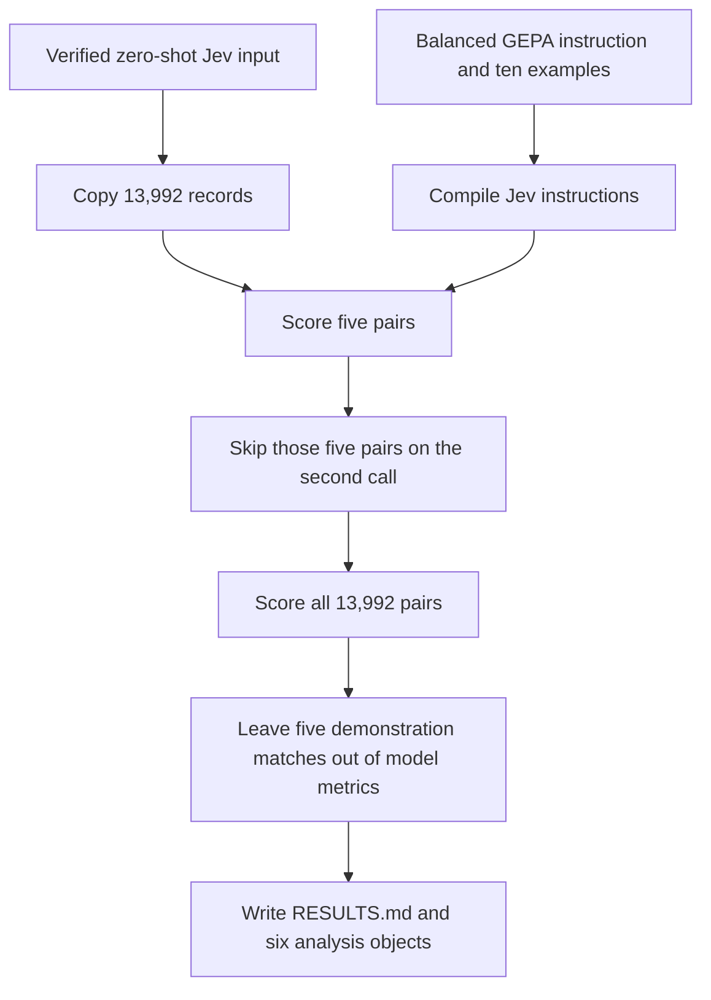

# Run few-shot Jev inference with the balanced GEPA instruction

## Remember

- Exact file paths always
- Exact commands with expected output
- DRY, YAGNI, TDD, frequent commits
- Delegated tasks must be impossible to misread.

## Overview

The approved design is in [proposal.md](proposal.md). [Issue 352](https://github.com/METResearchGroup/mirrorView-task/issues/352) scores the same 13,992 Study 2 pairs that have five labelers, using Jev 1.13.0 and the balanced GEPA instruction from [PR 339](https://github.com/METResearchGroup/mirrorView-task/pull/339). The ten labeled examples stay inside the Jev instructions. The report gives F1, accuracy, recall, and precision for all pairs, the unanimous pairs, and the split pairs.

Decisions 1 through 4 in the proposal are confirmed. The prompt restores the line that contains only a space before remove example 3, lives in a new experiment prefix, ends with `keep or remove`, and leaves only the five demonstration rows out of model metrics. The completed zero-shot and few-shot Jev packages stay in place. Generated input, predictions, and analysis stay under `s3://mirrorview-experimental-artifacts/experiments/few_shot_jev_optimized_prompt_2026_10_04/`.

## Happy flow

You copy the verified zero-shot Jev input into the new prefix, check the prompt digest, and score five pairs. After that smoke run skips the same five pairs on a second call, you score every pair and write the analysis.

## Approach

Reuse the runners that [PR 348](https://github.com/METResearchGroup/mirrorView-task/pull/348) already parameterized. Add the prompt constant, one experiment configuration, one compiler for the `keep or remove` ending, and three small command files. Leave the setup, scoring, and analysis logic in the existing runners.

You asked for no unit tests and no files under `tests/`. Each code step uses an inline check that fails before the code exists and passes after it. The branch adds no `tests/` directory, no `test_*.py` file, and no checked-in smoke script.

The proposal's scoring step is split into a smoke step and a production step. The measured five-row smoke result is the gate for the 13,992-call run.

## Steps

### Step 1: Add the shared prompt constant

Assemble the confirmed template in `shared/models/llm/prompt.py` and export it. Check the 6,290-byte digest before any experiment code exists. See [steps/step1.md](steps/step1.md).

### Step 2: Add the experiment compiler and configuration

Add the new experiment package, the compiler, the configuration, and the documentation. Check the compiled instruction digest. Do not add the three command files yet. See [steps/step2.md](steps/step2.md).

### Step 3: Copy the prepared input

Copy the verified 13,992 input records without changing their bytes. Write a manifest that points at the new records key and keeps the source digest and counts. See [steps/step3.md](steps/step3.md).

### Step 4: Smoke the scoring path

Score five pairs under a smoke run id, then repeat the command and confirm those five pairs are skipped. Record the measured tokens, cost, and runtime before the full run. See [steps/step4.md](steps/step4.md).

### Step 5: Score every pair

Score all 13,992 pairs under the production run id and resume until the manifest is complete. Store one valid prediction per post id and no unresolved failures. See [steps/step5.md](steps/step5.md).

### Step 6: Analyze and report the production run

Count human labels and usage on all 13,992 predictions. Leave the five demonstration matches out of model metrics. Write the six analysis objects and fill `RESULTS.md` with the measured scores. See [steps/step6.md](steps/step6.md).

## What "done" looks like

1. `shared/models/llm/prompt.py` holds the confirmed template, 6,290 UTF-8 bytes, SHA-256 `178535e42f301a17be4fdcee23cf4abb53f637365cfc1cb673326de9c471bf7f`.
2. The compiled instructions are 6,339 UTF-8 bytes, SHA-256 `1929e49a31c20488ff25a134d53d9e267d7214ca723575042ef6d7a19f23cb5e`.
3. The branch changes no file under `shared/models/jev/`, `experiments/zero_shot_jev_inference_2026_10_01/`, `experiments/few_shot_jev_inference_2026_10_01/`, or `experiments/dspy_gepa_balanced_labels_2026_10_02/`.
4. The copied input has 13,992 rows, 4,051 unanimous rows, and 9,941 split rows, with records SHA-256 `1dead1efcbc7f0023813bca357d845461ddbc87b93c50e9e73b4642977883395`.
5. The smoke run stores five predictions and no unresolved failures. The second smoke call makes no new Jev request for those five post ids.
6. The production run stores one valid prediction for every prepared post id under `jev_1_13_0/` and has no unresolved failures.
7. Human label counts and usage cover all 13,992 predictions. Model metrics cover 13,987 all rows, 4,046 unanimous rows, and 9,941 split rows.
8. `RESULTS.md` reports F1, accuracy, recall, precision, measured runtime, token totals, and cost for Jev 1.13.0.
9. The implementation adds no unit test file, no `tests/` directory, and no checked-in smoke script.
10. The implementation pull request contains only the files named by the step files. The planning pull request contains `proposal.md`, `plan.md`, and `steps/step1.md` through `steps/step6.md`.
