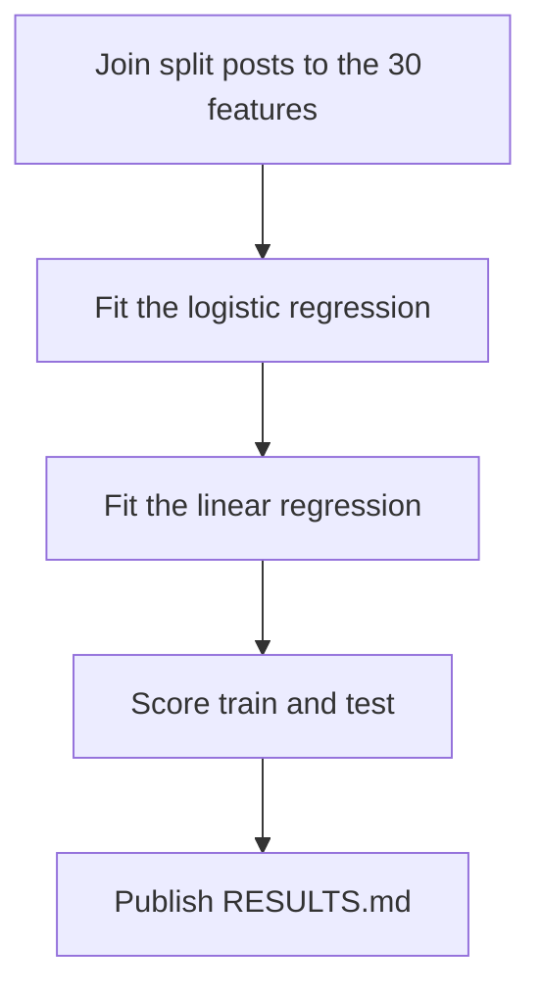

# Fit two regressions on the Study 2 LLM features

## Remember

- Exact file paths always
- Exact commands with expected output
- DRY, YAGNI, TDD, frequent commits
- Delegated tasks must be impossible to misread.

## Overview

The approved design is in [proposal.md](proposal.md). Implement [issue 358](https://github.com/METResearchGroup/mirrorView-task/issues/358) by fitting one logistic regression and one linear regression on the 30 binary Study 2 feature columns.

The posts are the existing split-label tables. Training uses the upsampled table after a 20 percent holdout of unique posts in each modal class. Testing uses the regular rows for those held-out posts. The logistic regression predicts the modal label. The linear regression predicts the remove share, and scored predictions are limited to 0 through 1.

`experiments/lora_finetuning_study2_2026_10_04/dataloader.py` now exists and says that package has no train and eval split. Do not import a split from it. Draw the holdout in this experiment, as the proposal specifies.

## Happy flow

A researcher builds the train and test frames, fits both regressions, and publishes the test metrics. The frames, fitted models, and score tables land in one S3 prefix, and `RESULTS.md` records the measured scores.

## Approach

Keep the feature experiment, the label registry, and the upsampler unchanged. Read their outputs. Put the new code only under the experiment folder named in the proposal, plus the tests beside it.

Preserve the registered CSV row order through the join and the fit. That order is what the October 8 prototype used, so the live scores can match it. Limit linear predictions when scoring, not while fitting. Report remove as the positive class, and put the constant-keep accuracy next to the logistic accuracy so the test accuracy is not read alone.

Keep the proposal's four steps. Each one has a caller, a failing test, then the implementation, then one live check.

## Steps

### Step 1: Join the split posts to the feature table

Create the experiment package, constants, and documentation. Draw the holdout, join the 30 feature columns, and upload the train frame, the test frame, and the split manifest. See [steps/step1.md](steps/step1.md).

### Step 2: Fit the logistic regression

Fit the modal-label logistic regression on the train frame and upload the saved estimator. See [steps/step2.md](steps/step2.md).

### Step 3: Fit the linear regression

Fit the remove-share linear regression on the same train frame and upload the saved estimator. See [steps/step3.md](steps/step3.md).

### Step 4: Score both models and write the tables

Score the train frame and the test frame, upload the prediction and metric files, and write `RESULTS.md`. See [steps/step4.md](steps/step4.md).

## What "done" looks like

1. The experiment package exists at `experiments/train_linear_model_on_llm_generated_features_2026_10_07/`, and its tests pass without S3.
2. The train frame has 11,663 rows, 5,825 keep and 5,838 remove, and 7,953 unique posts.
3. The test frame has 1,988 rows, 1,456 keep and 532 remove, and no post id shared with the train frame.
4. The logistic test scores, rounded to 4 decimals, are accuracy 0.6549, precision 0.4154, recall 0.7105, and F1 0.5243.
5. The linear test scores, rounded to 4 decimals on the limited predictions, are MAE 0.1624, RMSE 0.1907, and R^2 0.0497. Zero test predictions fall outside 0 to 1.
6. `RESULTS.md` includes those test scores and the constant-keep accuracy of 0.7324.
7. The new objects are under `s3://mirrorview-experimental-artifacts/experiments/train_linear_model_on_llm_generated_features_2026_10_07/`.
8. The feature experiment, `shared/data/registry.py`, and `shared/utils/upsample.py` are unchanged.
