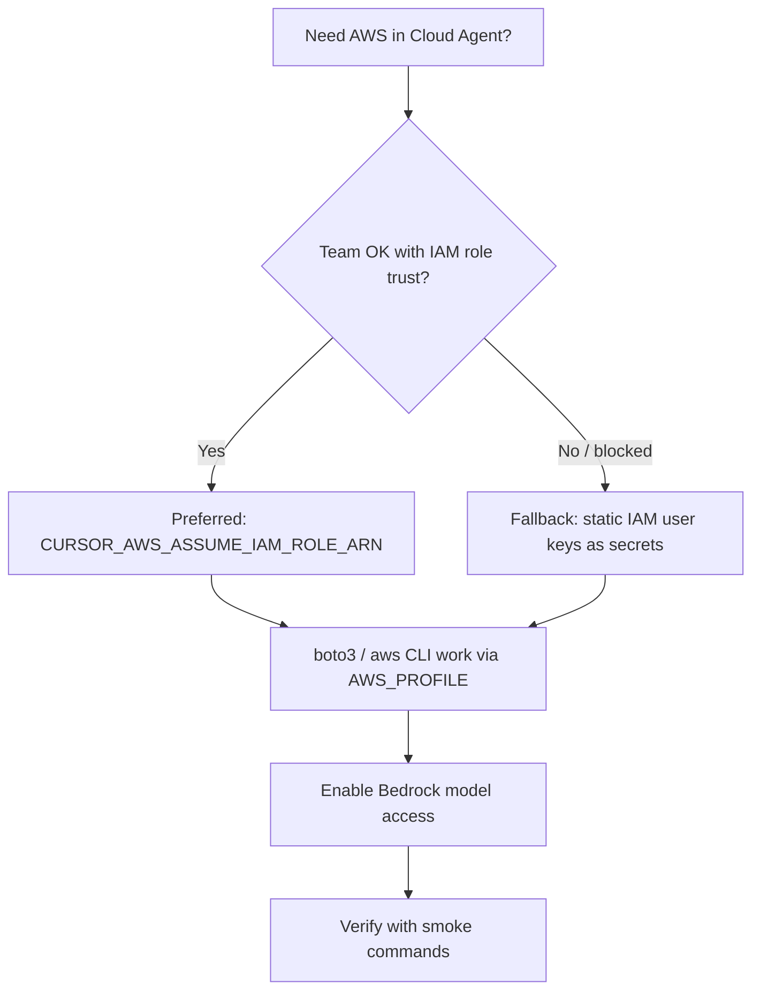

# Adding AWS / Bedrock credentials (Cloud Agents + local)

## TL;DR

MirrorView agents and ML scripts need **real AWS identity** — not just `SAGEMAKER_ROLE_ARN`.

**Preferred (Cloud Agents):** create a **broadly scoped IAM role**, trust Cursor’s role-assumer with your team External ID, then set secret `CURSOR_AWS_ASSUME_IAM_ROLE_ARN` to that role’s ARN.

**Fallback:** create an IAM user with the same broad policy, mint access keys, and inject `AWS_ACCESS_KEY_ID` + `AWS_SECRET_ACCESS_KEY` (+ optional `AWS_DEFAULT_REGION`) as Cursor **Runtime Secrets**.

**Intentional scope:** this runbook uses **broad** permissions (`PowerUserAccess` + Bedrock model enablement). Do **not** invent a least-privilege policy unless security review requires it. Research agents here call Bedrock, S3, DynamoDB, SageMaker, and deploy tooling; narrow scoping repeatedly blocks experiments.

---

## Why this exists

| What you already have | Why it is not enough |
| --- | --- |
| `SAGEMAKER_ROLE_ARN` | Execution role **for SageMaker jobs** to assume. The agent/laptop still needs its **own** credentials to call `sagemaker:CreateTrainingJob`, upload to S3, etc. |
| `OPENAI_API_KEY` / `WANDB_API_KEY` / … | Unrelated to AWS. |
| Empty boto3 chain | No keys, no profile, no IMDS → Bedrock Titan / Converse / S3 / DDB all fail. |

Repo consumers that need AWS:

| Surface | Typical APIs | Region constant |
| --- | --- | --- |
| Titan embeddings | `bedrock-runtime:InvokeModel` (`amazon.titan-embed-text-v2:0`) | Helper often `us-east-1`; prefer also enabling in `us-east-2` |
| LLM API baselines / flips | Bedrock Converse / invoke | `us-east-2` (`lib/constants.py` → `BEDROCK_REGION`) |
| Embedding cache | S3 + DynamoDB | `us-east-2` (bucket `jspsych-mirror-view-4`, etc.) |
| ModernBERT remote train | SageMaker + S3 | `us-east-2` |
| Study deploy / uploads | S3, Lambda, API Gateway (via Terraform / `aws` CLI) | `us-east-2` |

---

## Decision: which credential path?



| Path | Pros | Cons |
| --- | --- | --- |
| **A. Cursor assume-role** (recommended) | No long-lived keys in Cursor; STS refresh (~1h); standard for Cloud Agents | Needs team admin External ID + trust policy edit |
| **B. Static access keys** | Fast; works locally and in agents | Long-lived secrets; rotate manually; treat as Runtime Secrets |

Use **A** for Cloud Agents whenever possible. Use **B** for a laptop, CI, or if assume-role setup is blocked. You may configure **both** (role for agents, keys for local).

---

## Path A — Cursor IAM role (preferred for Cloud Agents)

Official docs: [Cloud Environment Setup → Using AWS IAM Roles](https://cursor.com/docs/cloud-agent/setup).

### 1. Create a broadly scoped IAM role (AWS console or CLI)

Suggested name: `cursor-cloud-agent-mirrorview` (any name is fine).

**Permissions (intentionally broad):**

Attach AWS managed policy:

- `arn:aws:iam::aws:policy/PowerUserAccess`

Optional extras if your org strips managed policies or you hit IAM edges:

- `arn:aws:iam::aws:policy/AmazonBedrockFullAccess` (redundant under PowerUser in most accounts, but harmless if attached)
- Keep **IAM user/role admin** out of scope unless you truly need the agent to create IAM entities; PowerUser already covers almost all service APIs this repo uses.

Do **not** replace PowerUser with a hand-written Bedrock-only policy for day-to-day research.

Trust policy is set in step 4 (must trust Cursor, not your laptop).

### 2. Add the role ARN as a Cursor secret

1. Open [Cursor Dashboard → Cloud Agents](https://cursor.com/dashboard?tab=cloud-agents) (Secrets / environment secrets).
2. Add a **Runtime Secret** (preferred) or team/user secret:

| Name | Value |
| --- | --- |
| `CURSOR_AWS_ASSUME_IAM_ROLE_ARN` | `arn:aws:iam::<ACCOUNT_ID>:role/cursor-cloud-agent-mirrorview` |

Scope it to the MirrorView environment if you use environment-scoped secrets.

### 3. Generate your team External ID (team admin)

1. Cursor Dashboard → **Settings → Advanced**.
2. Under AWS / External ID: if none shown, enter a placeholder in the AWS IAM Role ARN field, click **Validate & Save**, reload.
3. Copy the External ID (form `cursor-xxx-yyy-zzz`).

### 4. Trust policy on the IAM role

Replace the role’s trust policy with:

```json
{
  "Version": "2012-10-17",
  "Statement": [
    {
      "Sid": "AllowCursorAssume",
      "Effect": "Allow",
      "Principal": {
        "AWS": "arn:aws:iam::289469326074:role/roleAssumer"
      },
      "Action": "sts:AssumeRole",
      "Condition": {
        "StringEquals": {
          "sts:ExternalId": "cursor-xxx-yyy-zzz"
        }
      }
    }
  ]
}
```

Replace `cursor-xxx-yyy-zzz` with **your** team External ID. Do not invent a different Cursor account principal unless Cursor docs change.

### 5. What Cursor injects at runtime

When assume-role works, Cursor sets:

- `AWS_CONFIG_FILE` → Cursor-managed config
- `AWS_PROFILE=cursor-cloud-agent`
- `AWS_SDK_LOAD_CONFIG=1`

You do **not** need to export `AWS_ACCESS_KEY_ID` / `AWS_SECRET_ACCESS_KEY`. STS credentials expire ~1 hour; Cursor refreshes them when the agent wakes / near expiry.

**Note:** Assumed-role credentials become available from the **install/update** step onward, not during private base-image `FROM` pulls.

---

## Path B — Static IAM user access keys (fallback / local)

### 1. Create IAM user + broad policy

Suggested user: `mirrorview-dev-broad`.

Attach the same broad managed policy:

- `PowerUserAccess`

Create access keys (Console → IAM → Users → Security credentials → Create access key → “Command Line Interface”).

### 2. Inject into Cursor (Cloud Agents)

Add as **Runtime Secrets** (redacted from transcripts):

| Name | Required | Example |
| --- | --- | --- |
| `AWS_ACCESS_KEY_ID` | yes | `AKIA…` |
| `AWS_SECRET_ACCESS_KEY` | yes | `…` |
| `AWS_DEFAULT_REGION` | strongly recommended | `us-east-2` |
| `AWS_REGION` | optional duplicate | `us-east-2` |

Do **not** commit these to `.env`, `environment.json`, or the repo. Repo-root `.env` is for `OPENAI_API_KEY` / `GOOGLE_API_KEY` / `WANDB_API_KEY` only (`lib/load_env_vars.py`); AWS uses the standard boto3 chain.

### 3. Local laptop

```bash
aws configure
# or:
export AWS_ACCESS_KEY_ID=...
export AWS_SECRET_ACCESS_KEY=...
export AWS_DEFAULT_REGION=us-east-2
```

Verify: `aws sts get-caller-identity`.

---

## Bedrock model access (required even with broad IAM)

IAM allows the API call; **Bedrock still requires model access enabled** in the console (or via Model access APIs) per region.

Enable at least:

| Model | Model ID | Used for |
| --- | --- | --- |
| Titan Text Embeddings V2 | `amazon.titan-embed-text-v2:0` | Feature / post embeddings |
| Claude Sonnet (geo) | see `lib/constants.py` | Flips / truncation |
| Qwen / Mistral baselines | see `api_baselines` README | Zero-shot keep/remove |

Do this in **`us-east-2`** (primary) and **`us-east-1`** if you run the Titan helper that hardcodes `us-east-1` (`experiment_bedrock_embeddings.py`).

Quick check:

```bash
aws bedrock list-foundation-models --region us-east-2 \
  --query "modelSummaries[?contains(modelId, 'titan-embed')].modelId" \
  --output table

aws bedrock list-foundation-models --region us-east-1 \
  --query "modelSummaries[?contains(modelId, 'titan-embed')].modelId" \
  --output table
```

---

## Keep `SAGEMAKER_ROLE_ARN` (orthogonal)

Leave the existing Cursor secret `SAGEMAKER_ROLE_ARN` pointing at the SageMaker **execution** role (e.g. `modernbert-sagemaker-execution`). That role is assumed **by SageMaker**, not by Cursor.

After Path A or B works, the agent can:

1. Use its own creds to call SageMaker APIs.
2. Pass `SAGEMAKER_ROLE_ARN` into `CreateTrainingJob` as the job’s execution role.

---

## Verification checklist

Run inside a **new** Cloud Agent session after secrets are saved (existing sessions may not pick up new secrets until restart).

```bash
# Identity
aws sts get-caller-identity

# Bedrock runtime (Titan) — us-east-1 helper region
PYTHONPATH=. uv run python - <<'PY'
from experiments.simplified_predict_remove_2026_05_13.experiment_bedrock_embeddings import (
    create_embedding,
)
r = create_embedding("credential smoke test")
print("ok", r["model_id"], "dims", r["dimensions"], "len", len(r["embedding"]))
PY

# Bedrock listing — primary region
aws bedrock list-foundation-models --region us-east-2 --max-results 5

# S3 (study bucket; adjust if renamed)
aws s3 ls s3://jspsych-mirror-view-4/ --region us-east-2 | head
```

Success looks like: STS returns an ARN under your account; Titan returns a 256-d vector; no `NoCredentialsError` / `UnrecognizedClientException` / `AccessDeniedException`.

---

## Common failures

| Symptom | Fix |
| --- | --- |
| `Unable to locate credentials` / boto3 credentials `NONE` | Secrets not injected, or session started before secrets were added — start a **new** agent. Prefer Path A. |
| `AccessDenied` on `sts:AssumeRole` | Trust policy External ID mismatch, or wrong role ARN in `CURSOR_AWS_ASSUME_IAM_ROLE_ARN`. |
| `AccessDeniedException` on Bedrock invoke | Model access not enabled in that region, or SCP denying Bedrock. |
| SageMaker launch fails but STS works | Missing/wrong `SAGEMAKER_ROLE_ARN`, or execution role lacks S3/ECR — separate from agent identity. |
| Works locally, fails in agent | Local `~/.aws` not available in Cloud Agents; use Cursor secrets / assume-role. |
| Agent prints `[REDACTED]` for keys | Expected for Runtime Secrets — do not ask the agent to echo secrets. |

---

## Security notes (broad-by-design)

- **Broad is intentional** for this research repo so agents are not blocked on S3 vs Bedrock vs SageMaker permission gaps.
- Prefer Path A so keys are not long-lived inside Cursor.
- Use **Runtime Secrets** for static keys so values are redacted from transcripts and commits.
- Rotate static keys if leaked; revoke by deleting the access key or the IAM user.
- Do not paste secrets into chat, PR bodies, or `docs/`.
- Team follow-ups on Cloud Agents can act with the original user’s secrets — treat shared agent sessions like shared credentials ([Cursor dashboard settings](https://cursor.com/docs/cloud-agent/settings)).

---

## Related docs

- [AWS_DEPLOYMENT_GUIDE.md](./AWS_DEPLOYMENT_GUIDE.md) — Terraform / Lambda / S3 deploy
- [AGENTS.md](../../AGENTS.md) — Cloud-agent defaults (notes AWS often missing)
- Cursor: [Cloud Environment Setup](https://cursor.com/docs/cloud-agent/setup) · [Secrets & Network](https://cursor.com/docs/cloud-agent/security-network)
- Experiment blocked on Titan today: `experiments/human_readable_llm_error_analysis_2026_07_20/spec.md`
