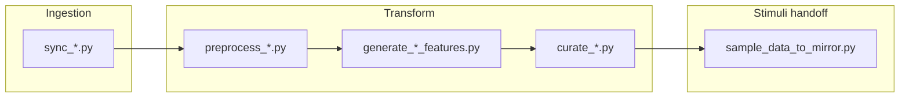
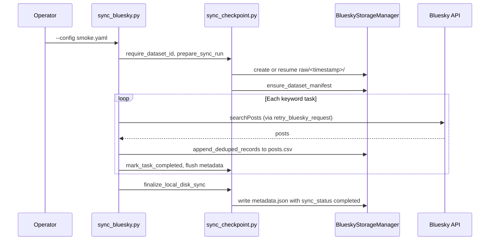
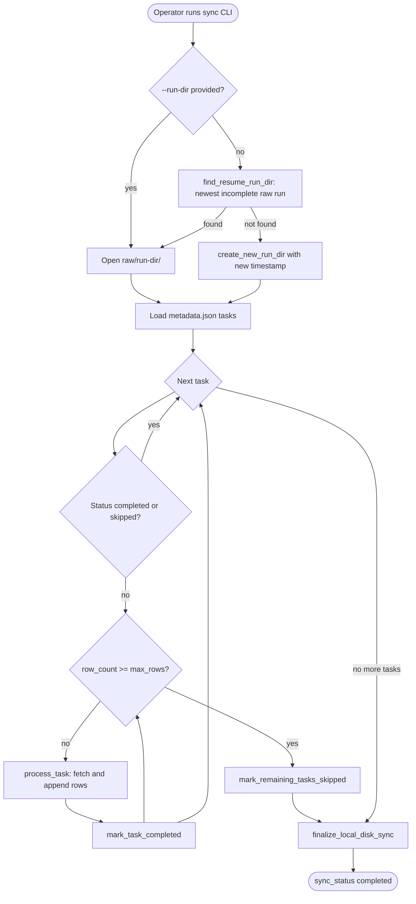

# Data ingestion pipeline architecture

The local data platform collects posts from Bluesky, Twitter/X, and Reddit for MirrorView. Each platform runs through sync, preprocessing, feature generation, and curation. The output is a curated CSV that feeds the stimuli sampling step in `experiments/scaled_mirrors_generation_2026_06_02/sample_data_to_mirror.py`.

All work stays on disk under `data_platform/data/`. The four stage CLIs are the operator path. AWS, S3, Athena, Glue, DynamoDB, and Prefect orchestration are out of scope for day to day runs.

## Related docs

- [How to run data ingestion](HOW_TO_RUN_DATA_INGESTION.md) for copy-paste commands and environment variables
- [data_platform/README.md](../../data_platform/README.md) for the module map and stage table
- [What is MirrorView?](WHAT_IS_MIRRORVIEW.md) for study goals and counterfactual mirrors
- [Setting up a new data collection run](SETTING_UP_A_NEW_DATA_COLLECTION_RUN.md) for study deployment after curated data exists
- [How to replace stimuli dataset](HOW_TO_REPLACE_STIMULI_DATASET.md) for promoting a new stimuli CSV into the webapp

## Overall pipeline



Each stage reads and writes under `data_platform/data/{platform}/{dataset_id}/`. Downstream CLIs take `--dataset-id`, which must match the value in the ingestion YAML.

## Local disk layout

The root for all datasets is `data_platform/data/`. One collection is one folder named `{platform}_{uuid}`.

```text
data_platform/data/
  bluesky/
    bluesky_<uuid>/
      dataset.json
      raw/
        <timestamp>/
          posts.csv
          metadata.json
      preprocessed/
        <timestamp>/
          posts.csv
          metadata.json
      features/
        <timestamp>/
          is_political.csv
          political_stance.csv
          ...
          metadata.json
      curated/
        <timestamp>/
          mirrorview.csv
          metadata.json
```

`dataset.json` at the dataset root records the platform, human-readable name, ingestion config path, and output format (csv or parquet). It is written on first sync by `ensure_dataset_manifest` in `data_platform/ingestion/sync_checkpoint.py`.

Raw, preprocessed, features, and curated stages use timestamped run directories. The timestamp format comes from `lib.timestamp_utils.get_current_timestamp` (for example `2026_08_16-14:30:00`).

Each new run of `generate_*_features.py` writes a new folder named `features/<timestamp>/`. Pass `--run-dir <timestamp>` to keep writing into that folder after an interrupt. When the script decides which posts still need labels, it reads labels from every feature folder, so a post that already has a label is not labeled again. For each feature, `metadata.json` records `model_id` and `prompt_hash`, so you can see when the model or the prompt changed. When the same post id appears in more than one feature folder, the curate step keeps the row with the latest `label_timestamp`.

Do not commit files under `data_platform/data/`.

## Dataset identity

A `dataset_id` has the form `{platform}_{uuid}` where platform is `bluesky`, `twitter`, or `reddit`, and the uuid is a lowercase RFC 4122 hex string with hyphens. Validation lives in `data_platform/utils/dataset.py`.

The ingestion YAML must set `dataset_id`. The sync script writes `dataset.json` and creates stage directories. Preprocess, feature, and curate entrypoints all require the same `--dataset-id` flag.

## Shared components

### StorageManager

`data_platform/utils/storage.py` defines `StorageManager` and platform subclasses (`BlueskyStorageManager`, `TwitterStorageManager`, `RedditStorageManager`). Each manager knows the platform, stage (`raw`, `preprocessed`, `features`, `curated`), Pydantic record model, and `dataset_id`.

Common operations include:

- `create_new_run_dir()` for a new timestamped folder
- `latest_run_dir()` to pick the newest run by directory name
- `write_records`, `append_records`, `load_records` for CSV or parquet
- `write_run_metadata` and `write_run_metadata_atomic` for `metadata.json`
- `append_deduped_records` with a `DedupeSession` during sync

### Checkpoint and resume during sync

Ingestion scripts in `data_platform/ingestion/` share helpers from `sync_checkpoint.py`. A sync run stores per-task progress in `raw/<timestamp>/metadata.json`. Each task (keyword, subreddit, or similar) has a status: `pending`, `in_progress`, `completed`, `failed`, or `skipped`.

On startup, `find_resume_run_dir` looks for the newest raw run whose `sync_status` is not `completed`. Pass `--run-dir <timestamp>` to pin a specific run. `run_checkpointed_sync` skips tasks already marked `completed` or `skipped`.

When all tasks finish, `finalize_local_disk_sync` sets `sync_status` from task states and flushes metadata to disk. `finalize_local_disk_sync` is the durability helper for a finished local sync.

Feature generation uses a separate checkpoint model in `data_platform/generate_features/metadata.py`. Progress is tracked per feature name in `features/<timestamp>/metadata.json`.

### metadata.json at each stage

| Stage | Path | Main fields |
|-------|------|-------------|
| Raw sync | `raw/<timestamp>/metadata.json` | `tasks`, `row_count`, `sync_status`, config snapshot |
| Preprocessed | `preprocessed/<timestamp>/metadata.json` | source raw runs, row counts, validation stats |
| Features | `features/<timestamp>/metadata.json` | per-feature status, batch counts, `model_id`, `prompt_hash`, source preprocessed runs |
| Curated | `curated/<timestamp>/metadata.json` | filter results, `files.export`, `source_preprocessed_runs` |

Curate writes export paths into metadata so `sample_data_to_mirror.py` can find the CSV without hardcoded timestamps.

## Pipeline stages

### 1. Sync (ingestion)

Entrypoints:

- `data_platform/ingestion/sync_bluesky.py`
- `data_platform/ingestion/sync_twitter.py`
- `data_platform/ingestion/sync_reddit.py`

Each script loads a YAML config from `data_platform/ingestion/configs/<platform>/`, validates `dataset_id`, and writes raw records under `raw/<timestamp>/`. Bluesky uses `init_bluesky_client` from `sync_clients.py`. Twitter and Reddit use their own clients and retry helpers.

### 2. Preprocess

Entrypoints:

- `data_platform/preprocessing/preprocess_bluesky.py`
- `data_platform/preprocessing/preprocess_twitter.py`
- `data_platform/preprocessing/preprocess_reddit.py`

Shared logic is in `data_platform/preprocessing/runner.py`. Preprocessing reads the latest complete raw run, or all raw runs per platform rules. It validates and cleans text, then deduplicates. Output goes to `preprocessed/<timestamp>/posts.csv`, or platform-specific filenames. `require_all_runs_complete` in `gate_checks.py` blocks preprocessing while a raw sync is still in progress.

### 3. Feature generation

Entrypoints:

- `data_platform/generate_features/generate_bluesky_features.py`
- `data_platform/generate_features/generate_twitter_features.py`
- `data_platform/generate_features/generate_reddit_features.py`

Orchestration lives in `generate_features.py` with batch engines under `generate_features/engines/`. The feature registry in `registry.py` lists labels such as `is_political`, `political_stance`, `is_likely_spam`, `is_news_or_opinion`, `is_self_contained`, `is_structurally_complete`, and `is_toxic_tiered`. Each feature writes `features/<timestamp>/{name}.csv`. Failed atomic batches may append to `features/<timestamp>/deadletter.jsonl`.

Feature generation needs `OPENAI_API_KEY` and `GOOGLE_API_KEY` in the repo-root `.env`.

### 4. Curate

Entrypoints:

- `data_platform/curate/curate_bluesky.py`
- `data_platform/curate/curate_twitter.py`
- `data_platform/curate/curate_reddit.py`

`data_platform/curate/runner.py` loads all preprocessed runs, joins them with feature CSVs via DuckDB (`consolidate.py`), applies YAML filter rules (`apply_rules.py`), and writes `curated/<timestamp>/mirrorview.csv`. MirrorView filter configs live under `data_platform/curate/configs/{platform}/mirrorview.yaml`.

### 5. Sample data to mirror

`experiments/scaled_mirrors_generation_2026_06_02/sample_data_to_mirror.py` discovers curated exports by globbing `data_platform/data/*/*/curated/*/metadata.json`. It reads each metadata file and loads the export CSV. It normalizes rows, deduplicates, and samples by toxicity tier and platform. Output goes to `concatenated_records/<timestamp>/records.csv` under the experiment folder.

## Platform differences

| Topic | Bluesky | Twitter/X | Reddit |
|-------|---------|-----------|--------|
| Sync module | `sync_bluesky.py` | `sync_twitter.py` | `sync_reddit.py` |
| Auth env vars | `BLUESKY_HANDLE`, `BLUESKY_PASSWORD` (optional; public API works without login) | `X_BEARER_TOKEN` (also `X_CONSUMER_KEY`, `X_SECRET_KEY` in some setups) | `REDDIT_CLIENT_ID`, `REDDIT_SECRET`, `REDDIT_USERNAME`, `REDDIT_PASSWORD` |
| Raw output | `raw/<timestamp>/posts.csv` | `raw/<timestamp>/posts.csv` | `raw/<timestamp>/` with `posts.csv` and `comments.csv` |
| Checkpoint unit | One task per keyword | One task per keyword | One task per subreddit |
| Preprocess module | `preprocess_bluesky.py` | `preprocess_twitter.py` | `preprocess_reddit.py` |
| Primary record id | `uri` | tweet id column per `platform_specific_columns` | composite reddit id |
| Feature CLI | `generate_bluesky_features.py` | `generate_twitter_features.py` | `generate_reddit_features.py` |
| Curate CLI | `curate_bluesky.py` | `curate_twitter.py` | `curate_reddit.py` |
| Curated export | `mirrorview.csv` | `mirrorview.csv` | `mirrorview.csv` |

## Bluesky smoke ingestion example

The smoke config at `data_platform/ingestion/configs/bluesky/smoke.yaml` collects about 100 posts across four keywords. It pins `dataset_id: bluesky_c0ffee00-0000-4000-8000-000000000100`.

Run each stage from the repository root with `PYTHONPATH=.`.

### Step 1: Sync

```bash
PYTHONPATH=. uv run python data_platform/ingestion/sync_bluesky.py \
  --config data_platform/ingestion/configs/bluesky/smoke.yaml
```

Files written:

- `data_platform/data/bluesky/bluesky_c0ffee00-0000-4000-8000-000000000100/dataset.json`
- `data_platform/data/bluesky/bluesky_c0ffee00-0000-4000-8000-000000000100/raw/<timestamp>/posts.csv`
- `data_platform/data/bluesky/bluesky_c0ffee00-0000-4000-8000-000000000100/raw/<timestamp>/metadata.json`

The sync script builds one checkpoint task per keyword (`climate change`, `gun control`, `abortion`, `immigration`). It stops when `max_rows: 100` is reached.

### Step 2: Preprocess

```bash
PYTHONPATH=. uv run python data_platform/preprocessing/preprocess_bluesky.py \
  --dataset-id bluesky_c0ffee00-0000-4000-8000-000000000100
```

Files written:

- `data_platform/data/bluesky/bluesky_c0ffee00-0000-4000-8000-000000000100/preprocessed/<timestamp>/posts.csv`
- `data_platform/data/bluesky/bluesky_c0ffee00-0000-4000-8000-000000000100/preprocessed/<timestamp>/metadata.json`

### Step 3: Features

```bash
PYTHONPATH=. uv run python data_platform/generate_features/generate_bluesky_features.py \
  --dataset-id bluesky_c0ffee00-0000-4000-8000-000000000100 --batch-size 64
```

Files written under `features/<timestamp>/`:

- `is_political.csv`, `political_stance.csv`, `is_likely_spam.csv`, and other registered features
- `metadata.json` (and optionally `deadletter.jsonl` if batches fail)

### Step 4: Curate

```bash
PYTHONPATH=. uv run python data_platform/curate/curate_bluesky.py \
  --dataset-id bluesky_c0ffee00-0000-4000-8000-000000000100 --config mirrorview.yaml
```

Files written:

- `data_platform/data/bluesky/bluesky_c0ffee00-0000-4000-8000-000000000100/curated/<timestamp>/mirrorview.csv`
- `data_platform/data/bluesky/bluesky_c0ffee00-0000-4000-8000-000000000100/curated/<timestamp>/metadata.json`

### Step 5: Handoff (after all three platforms)

Once Bluesky, Twitter, and Reddit each have a curated export:

```bash
PYTHONPATH=. uv run python experiments/scaled_mirrors_generation_2026_06_02/sample_data_to_mirror.py
```

The script globs `data_platform/data/*/*/curated/*/metadata.json` and writes `experiments/scaled_mirrors_generation_2026_06_02/concatenated_records/<timestamp>/records.csv`.

## Bluesky sync sequence



## Checkpoint resume flow



To resume a large Bluesky sync after interrupt:

```bash
PYTHONPATH=. uv run python data_platform/ingestion/sync_bluesky.py \
  --config data_platform/ingestion/configs/bluesky/mirrorview.yaml \
  --run-dir <timestamp>
```

The config keywords must match the tasks recorded in that run's metadata. `validate_tasks_for_resume` raises if they differ.

## Environment variables

Put secrets in the repo-root `.env` file. Ingestion-related variables:

```text
BLUESKY_HANDLE=
BLUESKY_PASSWORD=
X_BEARER_TOKEN=
REDDIT_CLIENT_ID=
REDDIT_SECRET=
REDDIT_USERNAME=
REDDIT_PASSWORD=
OPENAI_API_KEY=
GOOGLE_API_KEY=
```

Bluesky keyword search can run without `BLUESKY_HANDLE` and `BLUESKY_PASSWORD` by using the public API at `https://api.bsky.app`. Feature generation still requires the LLM keys.
