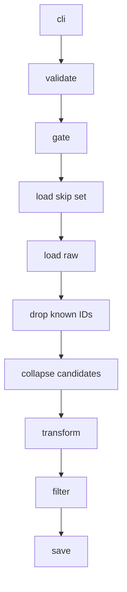

# How do we get posts for the stimulus dataset?

This runbook goes over how we get the posts that end up as part of our stimulus datasets.

## Overview

We have a 4-stage pipeline for getting records for the dataset.

1. **Ingestion**: Ingest records from APIs and other sources.
2. **Preprocessing**: Given the raw records, preprocess them (e.g., removing text that's too short, non-English text, etc.)
3. **Feature generation**: Given the preprocessed posts, generate features.
4. **Curation**: Given the preprocessed posts and the features, curate the subset that you want as part of your final stimulus dataset.

We use 3 separate data sources:

1. Bluesky
2. Twitter
3. Reddit (we use both `praw` as well as the Reddit PushShift dataset)

## Where does data live?

Data is stored in the following folder format:

```markdown
data_platform/data/{platform}/{dataset_id}/
  dataset.json
  raw/{timestamp}/          posts.csv or comments.csv + metadata.json
  preprocessed/{timestamp}/ same + metadata.json
  features/                 {feature}.csv + metadata.json [+ deadletter.jsonl]
  curated/{timestamp}/      mirrorview.csv + metadata.json
```

Each platform is an independent dataset under `data_platform/data/{platform}/{dataset_id}/`. `dataset_id` is `{bluesky|reddit|twitter}_{uuid}`.

## Stage 1: Ingestion

## Stage 2: Preprocessing

After ingestion finishes, you run preprocessing as a separate local CLI step. The code lives in `data_platform/preprocessing/`. Preprocessing does not call ingestion, and ingestion does not call preprocessing. You do not need environment variables or S3 for preprocessing. You read and write only on disk under `data_platform/data/{platform}/{dataset_id}/`.

Reddit preprocessing works on comments only, not posts. You can preprocess Reddit comments from any ingestion source, as long as the file matches the expected schema.

### Preprocessing inputs

1. A valid `dataset_id` in the form `{bluesky|twitter|reddit}_{uuid}` (see `validate_dataset_id` in `data_platform/utils/dataset.py`).
2. One or more completed raw run directories at `data_platform/data/{platform}/{dataset_id}/raw/{timestamp}/`.
3. A records file in each raw run directory you want to load.
   - Twitter uses `posts.csv` only. `TwitterStorageManager.load_records` always calls `pd.read_csv`.
   - Bluesky uses `posts.csv` or `posts.parquet`.
   - Reddit uses `comments.csv` or `comments.parquet`.
   - Bluesky and Reddit pick `csv` or `parquet` from `dataset.json` via `StorageManager` in `data_platform/utils/storage.py`.
4. `metadata.json` in every raw run directory. If `sync_status` is present, it must be `completed` (`require_all_runs_complete` in `data_platform/utils/gate_checks.py`).

You invoke preprocessing from the repo root:

```bash
PYTHONPATH=. uv run python data_platform/preprocessing/preprocess_bluesky.py \
  --dataset-id bluesky_<uuid>

PYTHONPATH=. uv run python data_platform/preprocessing/preprocess_twitter.py \
  --dataset-id twitter_<uuid>

PYTHONPATH=. uv run python data_platform/preprocessing/preprocess_reddit.py \
  --dataset-id reddit_<uuid>
```

In each `preprocess_*.py` file, you define a `PreprocessPlatformSpec` and call `preprocess_records` in `data_platform/preprocessing/runner.py`.

| Platform | Entrypoint | Spec constant | Storage manager | Sync model |
| --- | --- | --- | --- | --- |
| Bluesky | `data_platform/preprocessing/preprocess_bluesky.py` | `BLUESKY_SPEC` | `BlueskyStorageManager` | `SyncBlueskyPostModel` |
| Twitter | `data_platform/preprocessing/preprocess_twitter.py` | `TWITTER_SPEC` | `TwitterStorageManager` | `SyncTwitterPostModel` |
| Reddit | `data_platform/preprocessing/preprocess_reddit.py` | `REDDIT_SPEC` | `RedditStorageManager` | `SyncRedditCommentModel` |

Record schemas live in `data_platform/models/sync.py`.

**Bluesky post fields** (`SyncBlueskyPostModel`)

- `uri`, `url`, `author_handle`, `text`, `created_at`, `like_count`, `repost_count`, `reply_count`, `quote_count`

**Twitter post fields** (`SyncTwitterPostModel`)

- `tweet_id`, `text`, `author_id`, `username`, `created_at`, `like_count`, `retweet_count`, `reply_count`, `quote_count`, `url`, `keyword`, `sync_timestamp`

**Reddit comment fields** (`SyncRedditCommentModel`)

- `post_reddit_id`, `post_reddit_fullname`, `subreddit`, `comment_id`, `comment_fullname`, `parent_id`, `author`, `body`, `score`, `created_utc`, `permalink`, `depth`, `comment_rank`, `sync_timestamp`

ID and text column bindings are in `PlatformSpecificColumns` (`data_platform/utils/platform_specific_columns.py`).

| Platform | ID column | Text column | Records file key |
| --- | --- | --- | --- |
| Bluesky | `uri` | `text` | `posts` |
| Twitter | `tweet_id` | `text` | `posts` |
| Reddit | `comment_fullname` | `body` | `comments` |

### Preprocessing outputs

After each successful run, you get a new timestamped directory at `data_platform/data/{platform}/{dataset_id}/preprocessed/{timestamp}/`, even when zero rows pass the filters.

1. A records file with the same basename and format as raw (`posts.csv` / `posts.parquet` or `comments.csv` / `comments.parquet`).
2. `metadata.json` with at least these fields.
   - `dataset_id`
   - `source_raw_run` (last raw run path, relative to the dataset root)
   - `source_raw_runs` (all raw run directories scanned, not only runs that contributed rows)
   - `preprocess_timestamp` (the new run directory name)
   - `row_counts.input` (rows after dedupe, before filters)
   - `row_counts.output` (rows after filters)
   - `files` (map from records file key to filename, e.g. `"posts": "posts.csv"`)

You call `save_preprocessed` in `data_platform/preprocessing/runner.py` to write both files.

### (Preprocessing) Extra details of note



**Shared pipeline** (`data_platform/preprocessing/runner.py`)

`PreprocessPlatformSpec` fields:

- `platform`
- `storage_cls`
- `model_cls`
- `columns` (`PlatformSpecificColumns`)
- `text_validators`
- `row_validators` (optional; Reddit only)
- `text_transform` (optional; Twitter only)

Skip-set load is not a preprocess stage. You load all prior preprocessed IDs before creating the new run directory. You drop known IDs with pandas, and you collapse remaining IDs last-wins.

You use `load_raw_records` to read every raw run directory. You validate each row with the sync model, and you concatenate the results.

You call `apply_text_transform` before filtering when the spec defines a transform.

You call `filter_records` to keep rows whose text passes all text validators. When the spec defines row validators (Reddit only), you also require the `author` column to pass them.

You call `preprocess_records` to run:

- `validate_dataset_id` (validate)
- `require_all_runs_complete` (gate)
- load skip set
- `load_raw_records` (load raw)
- drop known IDs
- collapse candidates
- `apply_text_transform` (transform, when defined)
- `filter_records` (filter)
- `save_preprocessed` (save)

It prints how many rows were kept.

**Platform filters**

Each platform wires validators under `data_platform/preprocessing/validators/`. Bluesky and Twitter apply text validators only. Reddit applies text validators and row validators.

Bluesky text validators (`preprocess_bluesky.py`)

1. You reject rows that contain phone numbers (`check_if_not_phone`).
2. You keep rows with length 100 to 300 characters (`check_if_valid_post_length`).
3. You reject rows that contain URLs (`check_if_post_has_no_urls`).
4. You keep rows with English text (`check_if_text_english`).

Twitter text validators (`preprocess_twitter.py`)

1. You strip `t.co` links before filter and save (`strip_tco_links` in `twitter_validators.py`, wired as `text_transform` on `TWITTER_SPEC`).
2. You reject rows that contain phone numbers (`check_if_not_phone`).
3. You keep rows with length 50 to 280 characters (`check_if_valid_twitter_post_length`).
4. You reject rows with external URLs after `t.co` removal (`check_if_twitter_text_has_no_external_urls`).
5. You keep rows with English text (`check_if_text_english`).

Reddit comment text validators (`preprocess_reddit.py`)

1. You reject rows with removed or deleted bodies (`check_if_body_not_removed`).
2. You reject rows with `u/` and `r/` mentions (`check_if_no_reddit_mentions`).
3. You reject rows with markdown links and images (`check_if_no_markdown_links`).
4. You reject rows with direct URLs and bare domains (`check_if_no_direct_urls`).
5. You reject rows with common media host names (`check_if_no_media_hosts`).
6. You reject rows that contain phone numbers (`check_if_not_phone`).
7. You keep rows with English text (`check_if_text_english`).

Reddit row validators (`preprocess_reddit.py`)

1. You reject rows whose author is AutoModerator (`check_if_not_automoderator`).

You can re-run preprocessing on the same dataset safely. IDs from earlier preprocessed runs are skipped, and each run still creates a fresh timestamped output directory.

## Stage 3: Feature generation

## Stage 4: Curation
