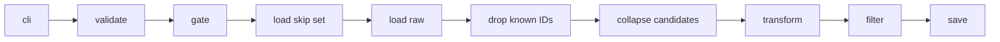

# How do we get posts for the stimulus dataset?

This runbook goes over how we get the posts that end up as part of our stimulus datasets.

## Overview

We have a 4-stage pipeline for getting records for the dataset.

1. **Ingestion**: Ingest records from APIs and other sources.
2. **Preprocessing**: Given the raw records, preprocess them (e.g., removing text that's too short, non-English text, etc.)
3. **Feature generation**: Given the preprocessed posts, generate features.
4. **Curation**: Given the preprocessed posts and the features, curate the subset that you want as part of your final stimulus dataset.

We use 3 separate data sources:

1. Bluesky
2. Twitter
3. Reddit (we use both `praw` as well as the Reddit PushShift dataset)

We also get data dumps from 2 sources:

1. Bluesky, from the lab data integrations interface project (see [this repo](https://github.com/METResearchGroup/lab_data_integrations_interface/tree/main/data_platform))
2. Reddit, from the pushshift data dump.

These data dumps live in `data_platform/ingestion/dumps`. They're intended to follow the same data models that the other ingestion models follow, for consistency.

## Where does data live?

Data is stored in the following folder format:

```markdown
data_platform/data/{platform}/{dataset_id}/
  dataset.json
  raw/{timestamp}/          posts.csv (Bluesky, Twitter) or comments.csv (Reddit) + metadata.json
  preprocessed/{timestamp}/ same + metadata.json
  features/                 {feature}.csv + metadata.json [+ deadletter.jsonl]
  curated/{timestamp}/      mirrorview.csv + metadata.json
```

Each platform is an independent dataset under `data_platform/data/{platform}/{dataset_id}/`. `dataset_id` is `{bluesky|reddit|twitter}_{uuid}`.

## Stage 1: Ingestion

Bluesky and Twitter ingest write `posts.csv` or `posts.parquet`. Reddit ingest writes `comments.csv` or `comments.parquet`. PRAW still opens subreddit listings (`hot`, `top`, or `new`) and walks each submission's comment forest, because comments only exist on a submission. Those submissions are fetch handles. New Reddit raw runs do not write `posts.csv` or `posts.parquet`. Older Reddit raw runs may still have unused leftover `posts.csv` files.

## Stage 2: Preprocessing

After ingestion finishes, you run preprocessing as a separate local CLI step. The code lives in `data_platform/preprocessing/`.

Reddit preprocessing works on comments only, not posts. You can preprocess Reddit comments from any ingestion source, as long as the file matches the expected schema.

### Preprocessing inputs

1. A valid `dataset_id` in the form `{bluesky|twitter|reddit}_{uuid}` (see `validate_dataset_id` in `data_platform/utils/dataset.py`).
2. One or more completed raw run directories at `data_platform/data/{platform}/{dataset_id}/raw/{timestamp}/`.
3. A records file in each raw run directory you want to load.
   - Twitter uses `posts.csv` only. `TwitterStorageManager.load_records` always calls `pd.read_csv`.
   - Bluesky uses `posts.csv` or `posts.parquet`.
   - Reddit uses `comments.csv` or `comments.parquet`.
   - Bluesky and Reddit pick `csv` or `parquet` from `dataset.json` via `StorageManager` in `data_platform/utils/storage.py`.
4. `metadata.json` in every raw run directory. If `sync_status` is present, it must be `completed` (`require_all_runs_complete` in `data_platform/utils/gate_checks.py`).

You run preprocessing from the repo root:

```bash
PYTHONPATH=. uv run python data_platform/preprocessing/preprocess_bluesky.py \
  --dataset-id bluesky_<uuid>

PYTHONPATH=. uv run python data_platform/preprocessing/preprocess_twitter.py \
  --dataset-id twitter_<uuid>

PYTHONPATH=. uv run python data_platform/preprocessing/preprocess_reddit.py \
  --dataset-id reddit_<uuid>
```

### Extra details

Loading the skip set is work you do before preprocess writes a new run directory, not a named preprocess stage. You load all prior preprocessed IDs first. You then drop known IDs with pandas, and you keep the last remaining row when an id appears more than once.



...

## Stage 3: Feature generation

## Stage 4: Curation

...

(For Reddit, asterisk this by saying we've got 2 sources, `praw` and then the Reddit PushShift data).
