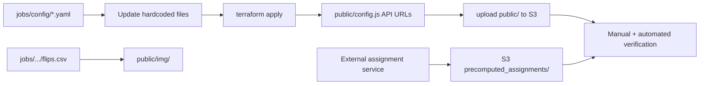

# Setting up a new data collection run

## TL;DR

1. Define a config in `jobs/config` so that we know what configs we wanted to define.
2. Ask Cursor to replace the values in the relevant .js files with the values in the YAML file. Prompt is something like "look at the values in  @jobs/config/mirrorview_scaled_2026_06_18.yaml and list out the files and what values have to be replaced, based on what's in the config."
3. Re-deploy.

We're doing it in this way as the original design of this hardcoded a lot of values and we're working with those existing constraints.

## Actual steps

This runbook describes how to launch a new MirrorView study iteration. Today the job YAML under `jobs/config/` is the **intended** source of truth, but the app still reads values from hardcoded JS/Python/Terraform defaults — you must copy values from the YAML into the files listed below before deploying.

For infrastructure details (Terraform init, import errors, upload tooling), see [AWS_DEPLOYMENT_GUIDE.md](./AWS_DEPLOYMENT_GUIDE.md). For a quick browser smoke test, see [MANUAL_TESTING.md](./MANUAL_TESTING.md).

Reference configs:

| Job | Config file | Terraform vars |
|-----|-------------|----------------|
| Pilot Phase 2 (baseline) | `jobs/config/mirrorview_default_2026_04_24.yaml` | *(none; uses `infra/main.tf` defaults)* |
| Scaled run (June 2026) | `jobs/config/mirrorview_scaled_2026_06_18.yaml` | `jobs/terraform/mirrorview_scaled_2026_06_18.tfvars` |

---

### Overview



Each new run needs:

1. A job config YAML (study identity, design, stimuli, AWS targets).
2. Code/tooling updated to match that YAML.
3. Stimulus catalog staged under `public/img/` (browser fetches from the static site root).
4. Precomputed participant assignments in S3 for the new `study_id` + `study_iteration_id`.
5. Terraform apply (if bucket/Lambda/env changed) and S3 upload of `public/`.
6. End-to-end verification before Prolific traffic.

---

## Step 1 — Create the job config

Create `jobs/config/<job_name>.yaml`. Use an existing file as a template:

- **Same design as pilot, new iteration only** → copy `mirrorview_default_2026_04_24.yaml`.
- **New design (conditions, phases, trial count, catalog)** → copy `mirrorview_scaled_2026_06_18.yaml`.

Minimum sections and constraints:

| YAML section | Must align with |
|--------------|-----------------|
| `study.id`, `study.iteration_id` | Assignment rows in S3; DynamoDB `user_assignments` |
| `study.experiment_version` | `STUDY_SPEC.experimentVersion` in `public/main.js` |
| `design.conditions` | `STUDY_SPEC.conditions` in `main.js` and `lambda-get-post-assignments.mjs`; `DEFAULT_STUDY_CONDITIONS` in external assignment repo |
| `design.posts_per_participant` | Length of `assignedPostIds` in each precomputed assignment row |
| `design.num_trials` | Must equal `trials_per_phase * num_phases` |
| `stimuli.post_catalog_path` | File under `public/` (path relative to site root, e.g. `img/foo.csv`) |
| `stimuli.mirror_text_field` | Column name in the CSV (`claude_mirror` vs `mirrored_text`) |
| `aws.s3_bucket` | Terraform `bucket_name`, upload scripts, save-data Lambda default |

Pick a unique `study.iteration_id` (e.g. `mirrorview_scaled_2026_06_18`). Test participants use `study.test_iteration_prefix` (default `dev-`) prepended to that ID in the assignment Lambda.

---

## Step 2 — Create Terraform vars (optional)

If the run uses a **different S3 bucket** or tags, add `jobs/terraform/<job_name>.tfvars`:

```hcl
aws_region             = "us-east-2"
bucket_name            = "jspsych-mirror-view-4"
assignment_lambda_name = "get_study_assignment"

tags = {
  Job = "mirrorview_scaled_2026_06_18"
}
```

If you reuse the same bucket and only change study identity/design in the frontend, you can skip a new tfvars file and rely on `infra/main.tf` defaults — but you still must redeploy Lambdas if their source or env vars change.

---

## Step 3 — Propagate config into the codebase

Update the following files from your job YAML. A Cursor prompt that works well:

> Look at the values in `@jobs/config/<your_job>.yaml` and update every file that still hardcodes the old run's values.

### Config → file mapping

| YAML path | File(s) | What to set |
|-----------|---------|-------------|
| **AWS** | | |
| `aws.region` | `scripts/upload_to_s3/constants.py` (`AWS_REGION`); Lambda env via Terraform | `us-east-2` |
| `aws.s3_bucket` | `infra/main.tf` (`variable "bucket_name"` default); `scripts/upload_to_s3/constants.py` (`TARGET_BUCKET`); `scripts/export_study_results.py` (`BUCKET_NAME`); `lambda-save-jspsych-data.mjs` (fallback if env unset) | e.g. `jspsych-mirror-view-4` |
| `aws.api.post_assignments_url` | `public/config.js` (`POST_ASSIGNMENTS_URL`) | Set **after** `terraform apply` from Terraform output |
| `aws.api.save_data_url` | `public/config.js` (`SAVE_DATA_URL`) | Set **after** `terraform apply` |
| `aws.lambda.assignment_lambda_name` | `infra/main.tf` / tfvars (`assignment_lambda_name`); Lambda env `ASSIGNMENT_LAMBDA_NAME` | `get_study_assignment` |
| **Study identity** | | |
| `study.id` | `public/config.js` (`STUDY_ID`) | `mirrorview` |
| `study.iteration_id` | `public/config.js` (`STUDY_ITERATION_ID`); analysis scripts if you filter by iteration (e.g. `experiments/basic_summary_stats_2026_04_27/total_attrition.py`) | e.g. `mirrorview_scaled_2026_06_18` |
| `study.experiment_version` | `public/main.js` → `STUDY_SPEC.experimentVersion` | Same as iteration or distinct version string |
| `study.test_iteration_prefix` | `lambda-get-post-assignments.mjs` (via env `TEST_ITERATION_PREFIX` from Terraform) | `dev-` |
| **Design** | | |
| `design.conditions` | `public/main.js` → `STUDY_SPEC.conditions`; `lambda-get-post-assignments.mjs` → `STUDY_SPEC.conditions` | e.g. `['training_assisted']` |
| `design.condition_phase_modes` | `public/main.js` → `STUDY_SPEC.condition_phase_modes` | Keys must match conditions; values `single` / `linked_fate` / `assisted` |
| `design.trials_per_phase` | `STUDY_SPEC.trialsPerPhase` | e.g. `20` |
| `design.num_phases` | `STUDY_SPEC.numPhases` | `1` skips phase break and phase 2 in `main.js` |
| `design.num_trials` | `STUDY_SPEC.numTrials` | Must equal `trials_per_phase * num_phases` |
| `design.posts_per_participant` | `STUDY_SPEC.postsPerParticipant` | Must equal `num_trials` and assignment row length |
| `design.valid_political_parties` | `lambda-get-post-assignments.mjs` → `STUDY_SPEC.validPoliticalParties` | `democrat`, `republican` |
| **Stimuli** | | |
| `stimuli.post_catalog_path` | `public/main.js` → `STUDY_SPEC.postCatalogPath`; `scripts/upload_to_s3/constants.py` (`CRITICAL_S3_KEYS`, `ALLOWED_UPLOAD_KEYS`) | e.g. `img/flips_scaled_2026_06_18.csv` |
| `stimuli.post_id_field` | `STUDY_SPEC.postIdField` | `post_primary_key` |
| `stimuli.post_number_field` | `STUDY_SPEC.postNumberField` | Optional in CSV; `main.js` falls back to post id |
| `stimuli.mirror_text_field` | `STUDY_SPEC.mirrorTextField` | e.g. `mirrored_text` |
| **Prolific** | | |
| `prolific.completion_code` | `public/config.js` (`PROLIFIC_COMPLETION_CODE`) | |
| `prolific.completion_link` | `public/config.js` (`PROLIFIC_COMPLETION_LINK`) | Used in completion screen in `main.js` |
| **Data paths** | | |
| `data.prefix_prolific` | `lambda-save-jspsych-data.mjs` (env `DATA_PREFIX_PROLIFIC` from Terraform) | `data/prolific/` |
| `data.prefix_test` | `lambda-save-jspsych-data.mjs` (env `DATA_PREFIX_TEST`) | `data/test/` |

Also update comments at the top of `public/config.js` and `public/main.js` to point at your new YAML path.

### Docs that should mention the active bucket

- `docs/runbooks/MANUAL_TESTING.md` — example S3 website URL uses `aws.s3_bucket`.

---

## Step 4 — Stage the stimulus catalog

The browser loads the catalog via `fetch(STUDY_SPEC.postCatalogPath)` from the deployed static site, **not** from `jobs/`.

1. Place or generate the CSV under `jobs/<job_name>/` (source of record).
2. Copy it into `public/` at the path named in `stimuli.post_catalog_path`:

   ```bash
   cp jobs/mirrorview_scaled_2026_06_18/flips.csv public/img/flips_scaled_2026_06_18.csv
   ```

3. Confirm columns match `post_id_field`, `original_text_field`, and `mirror_text_field`.
4. Add the S3 key to `CRITICAL_S3_KEYS` and `ALLOWED_UPLOAD_KEYS` in `scripts/upload_to_s3/constants.py` if the filename changed.

Large catalogs (~10k rows) can be gitignored and copied only at deploy time to avoid duplicating data in git.

---

## Step 5 — Precomputed assignments (external service)

The assignment Lambda does not pick posts from the CSV at runtime. It calls `get_study_assignment` in the [study_participant_assignment_interface](https://github.com/METResearchGroup/study_participant_assignment_interface) repo, which reads precomputed rows from S3.

Before live participants:

1. Generate assignments for `study.id` + `study.iteration_id` from your config.
2. Each row must include `assignedPostIds` with length = `design.posts_per_participant`.
3. Conditions in those rows must match `design.conditions`.
4. Upload under `assignment.precomputed_assignments_prefix` (default `precomputed_assignments/`) in the **same bucket** the study uses.
5. For manual testing, also ensure rows exist under the test iteration id: `dev-<study.iteration_id>` (see `TEST_ITERATION_PREFIX`).

Mismatch here produces assignment errors in the browser after consent, even if the frontend deploy is correct.

---

## Step 6 — Deploy infrastructure (Terraform)

From repo root:

```bash
cd infra
terraform init
terraform plan -var-file=../jobs/terraform/<job_name>.tfvars   # omit -var-file if using defaults
terraform apply -var-file=../jobs/terraform/<job_name>.tfvars
```

Capture outputs:

```bash
terraform output bucket_name
terraform output website_endpoint
terraform output post_assignments_url
terraform output save_data_url
```

**When Terraform is required**

| Change | Redeploy Terraform? |
|--------|---------------------|
| `lambda-get-post-assignments.mjs` or `lambda-save-jspsych-data.mjs` | **Yes** |
| `infra/main.tf` (bucket, IAM, API, Lambda env vars) | **Yes** |
| `public/config.js`, `main.js`, CSS, plugins, stimuli CSV | **No** — S3 upload only |
| New `study.iteration_id` only (same bucket/Lambdas) | **No** — if Lambda code/env unchanged |

---

## Step 7 — Set API URLs in `public/config.js`

After apply, paste Terraform outputs (must not be `null` or `TBD`):

```javascript
POST_ASSIGNMENTS_URL: 'https://<api-id>.execute-api.us-east-2.amazonaws.com/prod/get-post-assignments',
SAVE_DATA_URL: 'https://<api-id>.execute-api.us-east-2.amazonaws.com/prod/save-jspsych-data',
```

The upload pipeline validates these URLs against the live `jspsych-scroll-api` before uploading.

Update `aws.api.*` in your job YAML for documentation once URLs are known.

---

## Step 8 — Upload `public/` to S3

From repo root:

```bash
uv python install 3.12
uv sync
bash scripts/upload_to_s3/run_upload.sh
```

This stages `public/`, uploads allowed keys to `TARGET_BUCKET` in `constants.py`, and runs `verify_s3_upload.py`.

Participant-facing URL:

```text
http://<bucket_name>.s3-website.us-east-2.amazonaws.com/?PROLIFIC_PID=<id>
```

---

## Step 9 — Verification

### Automated (upload script)

`verify_s3_upload.py` checks:

- Every key in the latest staging manifest exists in S3.
- Every key in `CRITICAL_S3_KEYS` exists (including `config.js`, `main.js`, and the stimuli CSV).

If verification fails, fix missing files locally and re-run `run_upload.sh`.

### AWS CLI spot checks

```bash
# API matches config.js
aws apigatewayv2 get-apis --region us-east-2 \
  --query "Items[?Name=='jspsych-scroll-api'].ApiEndpoint" --output text

# Lambda env for save-data bucket
aws lambda get-function-configuration --region us-east-2 \
  --function-name jspsych-scroll-save-data \
  --query 'Environment.Variables' --output table

# Stimuli object present
aws s3api head-object --bucket jspsych-mirror-view-4 \
  --key img/flips_scaled_2026_06_18.csv --region us-east-2
```

Replace bucket/key with your job values.

### Manual end-to-end test

1. Open the website URL with a test PID, e.g.  
   `http://jspsych-mirror-view-4.s3-website.us-east-2.amazonaws.com/?PROLIFIC_PID=manual-test-1`
2. Complete consent and pre-surveys (party selection matters for assignment).
3. Confirm **20 trials** (or your `num_trials`) load without console errors.
4. Confirm mirror text appears (validates `mirror_text_field` and CSV path).
5. Finish through post-surveys and completion screen (Prolific link/code from config).
6. Confirm a new object under the test data prefix:

   ```bash
   aws s3 ls s3://jspsych-mirror-view-4/data/test/ --region us-east-2 | tail
   ```

7. Optional: check DynamoDB `user_assignments` for the test prolific id and correct `study_iteration_id`.

See [MANUAL_TESTING.md](./MANUAL_TESTING.md) for the short checklist.

### Pre-launch checklist

- [ ] Job YAML committed with final API URLs (when known)
- [ ] All files in [Step 3 mapping](#step-3--propagate-config-into-the-codebase) updated
- [ ] Stimuli CSV in `public/` and uploaded to S3
- [ ] Precomputed assignments for production and `dev-` test iteration
- [ ] `public/config.js` API URLs set and non-null
- [ ] `run_upload.sh` verification passed
- [ ] Manual full run completed; CSV in `data/test/` or `data/prolific/`
- [ ] Prolific study points at the correct website URL and completion code

---

## Switching between runs

This repo currently supports **one active run at a time** in the hardcoded files. To revert to the pilot:

1. Restore values from `jobs/config/mirrorview_default_2026_04_24.yaml` using the mapping above.
2. Point `TARGET_BUCKET` / Terraform at `jspsych-mirror-view-3` if that stack is still the pilot home.
3. Re-apply Terraform and re-upload `public/` as needed.

Longer term, a build step that generates `public/config.js` and `STUDY_SPEC` from YAML would remove manual copying; until then, treat the YAML as spec and the JS/Python files as the deployed truth.

---

## Quick reference — scaled run (current)

| Item | Value |
|------|-------|
| Config | `jobs/config/mirrorview_scaled_2026_06_18.yaml` |
| Terraform | `terraform apply -var-file=../jobs/terraform/mirrorview_scaled_2026_06_18.tfvars` |
| Bucket | `jspsych-mirror-view-4` |
| Study iteration | `mirrorview_scaled_2026_06_18` |
| Conditions | `training_assisted` only |
| Trials | 20, single phase, `linked_fate` |
| Stimuli | `public/img/flips_scaled_2026_06_18.csv`, mirror column `mirrored_text` |
