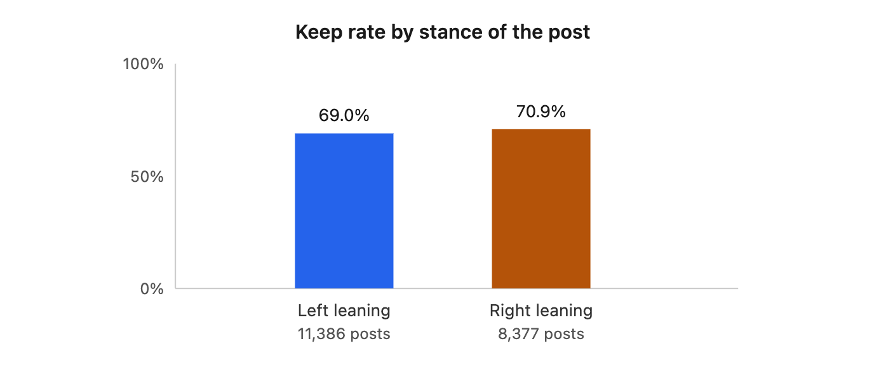
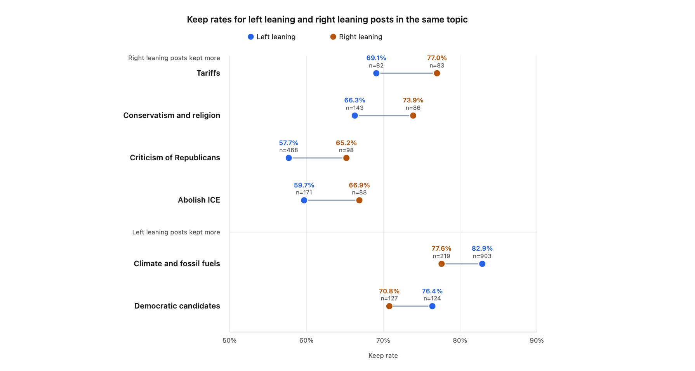
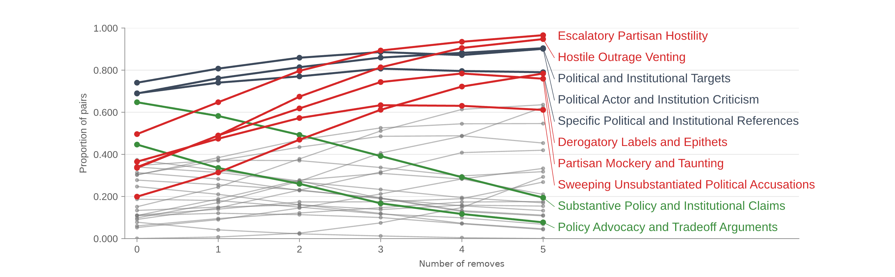
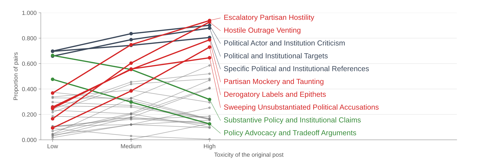
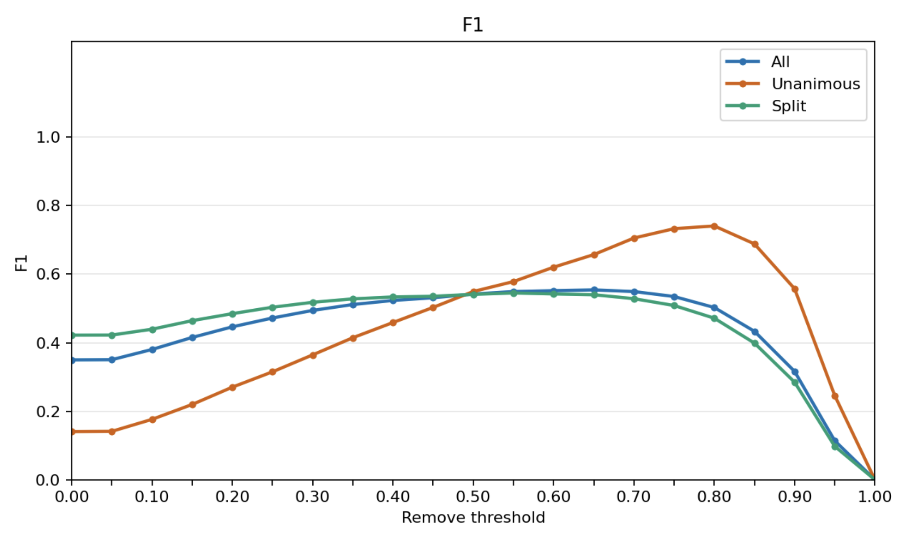
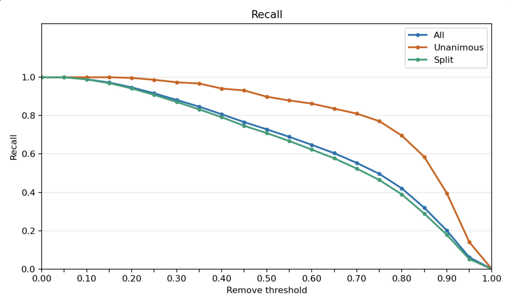
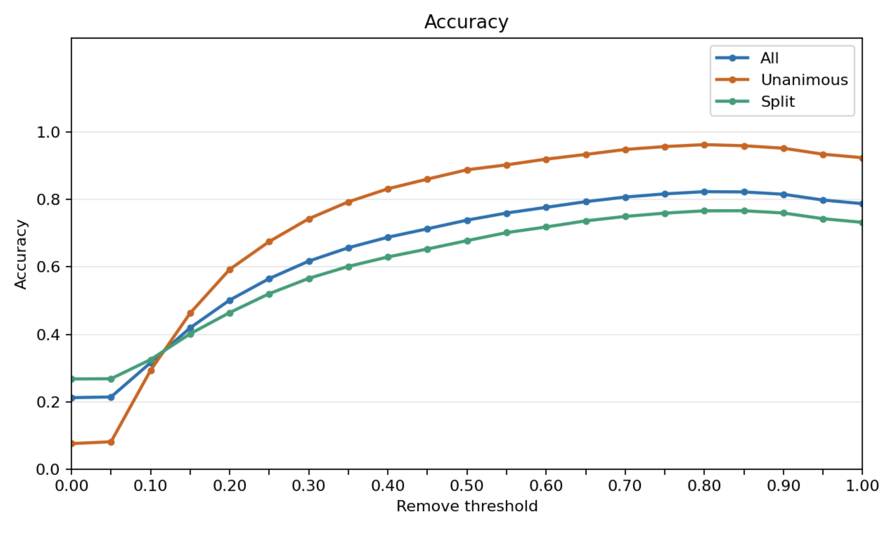
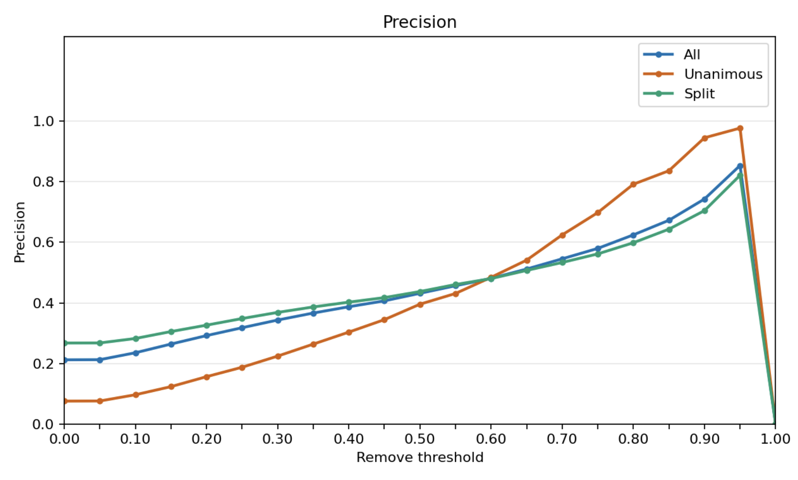

---
geometry:
  - letterpaper
  - landscape
  - margin=0.4in
header-includes:
  - \usepackage{float}
  - \floatplacement{figure}{H}
---

# Study 2 Writeup

## Feature generation key takeaways

We use two approaches for generating featuers:

1. **BERTopic**: Clusters post embeddings and generates topics based on the substance of the text.
2. **LLM-driven feature generation**: generates features based on both the substance of text and the civility of conversation.

The key takeaway across both these methods is that:

- The topic, substance, or political lean of a post are weak predictors of keep/remove behavior
- The civility of conversation (i.e., the toxicity of language) is a strong predictor.

## BERTopic on the original posts

We focus the BERTopic analysis on the original posts. The mirroring operation did change some of the topics from the original post. We try to keep the same stance and political intensity, but there are different topics that are triggers for left-leaning and right-leaning groups. We add a follow-up set of analyses later on reviewing how the mirroring approach changed the topics. We also use all keep/remove decisions per post, rather than taking a majority vote. For convention's sake, we measure the overall keep rate, rather than the remove rate.

We see more well-defined BERTopic results from the larger combined Study 2 dataset than we did in the first run given our larger dataset and the increased number of labels per post.

### Overview

Below is a 2-D visualization of the posts clustered by their key topics. An interactive visualization can be found [at this link](https://bertopic-findings.vercel.app/).


### Which topics most commonly appear?


| Topic                    | Posts | Keep rate |
| ------------------------ | ----- | --------- |
| Climate and fossil fuels | 1,122 | 81.8%     |
| Border and immigration   | 862   | 75.8%     |
| MAGA and institutions    | 851   | 59.1%     |
| Abortion access          | 690   | 75.2%     |
| Trump media and lying    | 636   | 59.3%     |
| Criticism of Democrats   | 598   | 69.3%     |
| Criticism of Republicans | 566   | 59.0%     |
| Biden and Trump blame    | 358   | 67.6%     |
| Billionaires and taxes   | 326   | 76.6%     |
| Abolish ICE              | 259   | 62.1%     |


### Which topics are more common in originally left leaning posts, and which in right leaning posts?

Each post and its mirror are shown, so users see both the left-leaning and right-leaning versions. We analyze, based on the original posts, which topics tend to be more common in left-leaning vs. right-leaning posts.


### Which topics are more common at low, medium, and high toxicity?

Low toxicity posts are more often about climate, abortion, and billionaires and taxes. Climate alone is 20.5% of low toxicity grouped posts and 1.6% of high toxicity grouped posts. High toxicity posts are more often attacks on Trump, MAGA and institutions, and criticism of Republicans. Criticism of Trump's media behavior is 13.9% of high toxicity grouped posts and 1.1% of low toxicity grouped posts. Anti Trump harassment is almost entirely in the high toxicity sample (140 of 144 posts).


| Topic                    | Low         | Medium     | High        |
| ------------------------ | ----------- | ---------- | ----------- |
| Climate and fossil fuels | 20.5% (604) | 8.5% (471) | 1.6% (47)   |
| Abortion access          | 8.2% (240)  | 7.0% (389) | 2.1% (61)   |
| Billionaires and taxes   | 4.8% (141)  | 2.1% (117) | 2.4% (68)   |
| Trump media and lying    | 1.1% (33)   | 3.6% (200) | 13.9% (403) |
| Anti Trump harassment    | 0% (0)      | 0.1% (4)   | 4.8% (140)  |
| MAGA and institutions    | 3.3% (98)   | 7.9% (439) | 10.9% (314) |
| Criticism of Republicans | 2.2% (66)   | 4.9% (272) | 7.9% (228)  |


### Do some topics get removed more often?

Among the 23 topics with at least 100 posts, the keep rate runs from 31.7% to 81.8%. The topics most commonly removed include anti-Trump harassment and anti-fascism messaging, while the topics most commonly kept include climate change and sanctuary cities.


### Which topics did Democratic/Republican raters keep, and which did they remove?

Democratic raters kept 69.4% of 52,864 votes. Republican raters kept 70.0% of 48,970 votes. The topics they were most likely to remove, and the topics they were most likely to keep, are almost the same list. Both groups removed anti Trump harassment most often, at about 32%. Both groups kept climate and fossil fuels most often among large topics, at about 82%.

Where the two groups differ, the gap is generally small. Across 26 topics with at least 200 votes from each group, the typical gap is under 2 points. The largest gaps are:

- Open carry laws: Democratic raters kept 75.8% of 289 votes, and Republican raters kept 68.3% of 249 votes.
- Supreme Court: Republican raters kept Supreme Court posts at 77.6% (308 votes), and Democratic raters kept them at 71.5% (330 votes).


#### Keep/remove behavior for Democrats

Here are the topics Democratic raters were most likely to remove, among topics with at least 200 of their votes.


| Topic                    | Keep rate | Votes |
| ------------------------ | --------- | ----- |
| Anti Trump harassment    | 31.5%     | 444   |
| MAGA and institutions    | 57.6%     | 2,308 |
| Criticism of Republicans | 59.1%     | 1,500 |
| Trump media and lying    | 59.4%     | 1,788 |
| Anti fascism messaging   | 59.7%     | 571   |


Here are the topics Democrat raters were most likely to keep:


| Topic                    | Keep rate | Votes |
| ------------------------ | --------- | ----- |
| Gun policy debate        | 82.4%     | 262   |
| Climate and fossil fuels | 82.2%     | 2,872 |
| Gun laws in schools      | 79.5%     | 410   |
| Sanctuary cities         | 78.6%     | 266   |
| Gun rights               | 77.6%     | 602   |


#### Keep/remove behavior for Republicans

Here are the topics Republican raters were most likely to remove, among topics with at least 200 of their votes.


| Topic                    | Keep rate | Votes |
| ------------------------ | --------- | ----- |
| Anti Trump harassment    | 31.9%     | 282   |
| Anti fascism messaging   | 57.7%     | 478   |
| Criticism of Republicans | 59.1%     | 1,377 |
| Trump media and lying    | 59.2%     | 1,473 |
| MAGA and institutions    | 60.8%     | 2,059 |


Here are the topics Republican raters were most likely to keep:


| Topic                    | Keep rate | Votes |
| ------------------------ | --------- | ----- |
| Climate and fossil fuels | 81.5%     | 2,893 |
| Sanctuary cities         | 80.6%     | 289   |
| Gun policy debate        | 80.2%     | 242   |
| Gun laws in schools      | 79.1%     | 369   |
| Mail and elections       | 78.2%     | 257   |


#### Does the stance of the post affect the keep/remove rate?

The stance of the post barely moves the overall keep rate. Left leaning posts are kept at 69.0% (11,386 posts). Right leaning posts are kept at 70.9% (8,377 posts). Within topics, certain topics present in left-leaning or right-leaning posts are kept more often:





#### Does the toxicity of the post affect the keep/remove rate?

Toxicity moves the keep rate much more than stance does. Low toxicity posts are kept at 84.7% (4,892 posts). Medium toxicity posts are kept at 72.6% (9,888 posts). High toxicity posts are kept at 49.8% (4,983 posts).


This trend is generally true across topics as well:


## LLM-based feature generation

We then use LLMs to perform feature extraction. We follow a [protocol](https://www.lesswrong.com/posts/WAZWA6FPQvH8okouJ/llm-driven-feature-discovery) developed by Google DeepMind on how to use LLMs for automated feature extraction.

### Methods

1. **Setup**: We assign a keep/remove label to each original + mirror combination based on the modal label.
2. **Use an LLM to mine features**: We pass in batches of 10 pairs of posts that were majority keep and 10 pairs of posts that were majority remove. We then ask an LLM to extract features to distinguish posts that were kept and posts that were removed. We do this across a few categories of features (see below).
3. **Embed the feature records and cluster them**: We embed the features and then use K-Means to generate clusters. We do this instead of recursively asking an LLM to generate a feature category given a list of features since we want a sense of "global similarity" across all features. We choose K-Means since HDBSCAN rendered unstable estimates.
4. **Name each cluster**: We take each cluster and pass them to an LLM to generate a human-readable label and description of each feature cluster. This generates a compiled list of feature groups.
5. **Label every post against the features**: We label each post against each feature group. This means that a post can have multiple features, which makes this approach more feature-rich and expressive than BERTopic.

### Categories of features

These are the categories that we gave to the LLM when asking them to mine for features in the original posts:

1. **Surface and lexical**: This category is about how the post is written, not what claim it makes. It covers length, slang, heavy punctuation, all-caps emphasis, profanity, hashtags and account mentions, and a high density of proper names. Examples include emphatic typography, profane derogatory insults, colloquial language and insults, and hashtags and account mentions.
2. **Topic and subject matter**: This category is about the subject of the post. Examples include a policy area (guns, climate, immigration, abortion, elections), a specific event or bill, a geographic scope, a historical analogy, and culture-war salience.
3. **Semantic content**: This category is about the kind of claim the post makes. Examples include causal claims, moral language, a factual claim versus speculation, conspiracy, a claim that a group is being persecuted, a policy prescription, and a cost-benefit argument.
4. **Pragmatics and communicative intent**: This category is about what the post is doing to the reader. Examples include sarcasm, mockery, a call to action, persuasion, venting, hedging, and outrage.
5. **Target and directionality**: This category is about who the post attacks or praises, and which political side it points at. Examples include the type of actor criticized or praised, a left/right cue, us-versus-them framing, and elite-versus-populist framing.
6. **Compositional and syntactic structure**: This category is about the shape of the sentences. Examples include if-then conditionals, contrast with "but" or "however," rhetorical questions, parallel repetition, lists, quoted or attributed speech, and direct address in the second person.


### Discovered categories

After mining features, embedding, and naming each resulting feature cluster, here are the feature categories that were discovered:


| Name                                                 | Definition                                                                                                                                                                                                                     |
| ---------------------------------------------------- | ------------------------------------------------------------------------------------------------------------------------------------------------------------------------------------------------------------------------------ |
| Blanket Demonization of Political Opponents          | Sweeping, unqualified portrayals of an opposing political group as inherently stupid, immoral, corrupt, dangerous, subhuman, or traitorous.                                                                                    |
| Brief Slogan-Like Insult Attacks                     | Pairs feature very short, blunt, insult-led statements or fragments that make a denunciatory claim with little or no supporting elaboration.                                                                                   |
| Broad Partisan Out-Group Targeting                   | The pair targets or refers to ordinary members, supporters, voters, or whole populations defined by broad partisan or ideological identities rather than only specific leaders, institutions, or policies.                     |
| Culture-War Policy Issues                            | Posts focus on contested partisan policy debates over guns, immigration and border enforcement, abortion and reproductive rights, policing, or related rights-based social issues.                                             |
| Culture-War Security and Out-Group Threats           | Posts frame immigration, policing, guns, identity issues, religion, or political unrest as existential threats to public safety, national identity, or social order.                                                           |
| Dense Profanity and Vulgar Insults                   | The pair contains frequent or repeated explicit profanity, obscenity, vulgarity, or derogatory insult terms directed at people or groups.                                                                                      |
| Derogatory Labels and Epithets                       | The post pair uses insulting, demeaning, slur-like, or dehumanizing labels to characterize people or political groups.                                                                                                         |
| Direct Second-Person Hostility                       | Posts directly address an individual or group as "you," "you guys," or similar terms while using insults, taunts, accusations, threats, or hostile commands.                                                                   |
| Electoral Strategy and Political Consequences        | Posts that predict, warn about, or explain how parties, politicians, voters, policies, or messaging will affect electoral outcomes, public support, political behavior, or longer-term political consequences.                 |
| Elite-versus-Public Political Framing                | Frames political or economic conflict as powerful elites, institutions, or wealthy interests opposing ordinary people, workers, voters, or taxpayers.                                                                          |
| Escalatory Partisan Hostility                        | Posts use inflammatory us-versus-them rhetoric, contempt, threats, catastrophe claims, or gloating to intensify hostility toward political opponents rather than argue policy.                                                 |
| Explicit Contrastive Framing                         | The pair uses overt contrast markers or alternative constructions—such as “but,” “instead,” “while,” “rather than,” or “not X, but Y”—to set competing claims, actions, or groups against each other.                          |
| Extended Explanatory Argumentation                   | Posts develop a claim through multiple sentences or paragraphs that provide explanation, reasons, supporting details, examples, or justification rather than relying solely on a brief slogan or assertion.                    |
| Hostile Outrage Venting                              | Posts primarily express anger or outrage through hostile denunciation, contempt, ridicule, insults, or profanity toward a target.                                                                                              |
| Limited Profanity Within Argument                    | The pair uses occasional mild profanity, slang, or insults within broader substantive commentary rather than sustained, standalone, or slur-heavy abuse.                                                                       |
| Opponent Claims Framed for Rebuttal                  | The post quotes, paraphrases, or rhetorically challenges an opposing claim, slogan, or premise and then argues against or undermines it.                                                                                       |
| Partisan Collective Blame                            | Attributes broad social, political, economic, or violent harms to an entire political party, ideology, supporter base, or other large partisan out-group rather than to specific individuals or actions.                       |
| Partisan Mockery and Taunting                        | Posts use sarcasm, ridicule, caricature, mock quotations, or taunting rhetorical questions to demean, humiliate, or belittle political opponents.                                                                              |
| Personal Attacks on Political Figures                | Posts directly target identifiable politicians, public officials, or associated supporters with hostile personal insults, character attacks, or derogatory labels.                                                             |
| Policy Advocacy and Tradeoff Arguments               | Posts advocate, oppose, or critique specific government policies or reforms, often explaining their expected consequences, tradeoffs, implementation, or priorities.                                                           |
| Policy Consequence Warnings and Civic Mobilization   | Posts express concern about governmental, institutional, or policy harms by citing consequences for rights, safety, fairness, or material well-being and often urge accountability, reform, voting, or other political action. |
| Political Actor and Institution Criticism            | Posts criticize political parties, leaders, ideological groups, or institutions for their policies, conduct, competence, corruption, or governing choices.                                                                     |
| Political and Institutional Targets                  | The pair primarily targets political parties, elected officials, ideological factions, government bodies, or related elite institutions and organized interests.                                                               |
| Punitive Blanket Condemnation of Political Opponents | Posts broadly demonize political opponents or their supporter groups and advocate or wish for their punishment, exclusion, removal, or other punitive treatment.                                                               |
| Quoted Slogans and Emphatic Framing                  | Posts use quoted or slogan-like political language, sometimes with capitalization, scare quotes, italics, or exclamation marks, to frame, attribute, critique, or comment on claims.                                           |
| Reasoned Political Policy Persuasion                 | Posts seek to persuade through substantive political or policy arguments, using explanations, justifications, evidence, examples, or rebuttals rather than merely asserting a position.                                        |
| Shouting-Style Emphatic Formatting                   | Posts use conspicuous all-caps, repeated exclamation or other emphatic punctuation, slogans, fragments, repetition, or intensifiers to convey a loud, urgent, confrontational tone.                                            |
| Specific Political and Institutional References      | Posts use concrete names of politicians, parties, agencies, institutions, policies, legal concepts, or issue-specific political terminology rather than only broad political language.                                         |
| Substantive Policy and Institutional Claims          | Posts make concrete factual, causal, or interpretive claims about laws, government actions, institutions, political actors, or their social, economic, and rights-related consequences.                                        |
| Sweeping Unsubstantiated Political Accusations       | Posts make broad, categorical allegations that political opponents or leaders are corrupt, criminal, authoritarian, immoral, dishonest, or otherwise malign without qualifying evidence or nuance.                             |

### Results

We have evidence that suggests that people moderate on the civility of conversation and less on the substance of the conversation.

We find that the probability of a post being removed is correlated to increases in hostile language and negatively linked to material policy arguments. Substance-related references and mentions of political actors remain relatively constant.



Similarly, we find that as toxicity of the post increases, hostile language increases and policy argument decreases, while substance-related references and mentions of political actors remain relatively constant.



## Training a binary classifier

**Work is still ongoing and pending results**

We train a variety of binary classifiers to predict the keep/remove task. We experimented with the following approaches:

1. Zero-shot LLM inference
2. Few-shot LLM inference
3. Few-shot prompt-tuned LLM inference
4. Fine-tuning an open-source LLM

We test across the following models:

- Amazon Nova
- Qwen 3 32B
- OpenAI GPT-5.6 Terra
- Claude Sonnet 5.5

For fine-tuning, we use `Qwen3.8-27B`. We deploy using `vLLM` and we use a quantized deployment.

### Dataset

We evaluate our models across 3 versions of our dataset. We filter for posts with exactly 5 labels, to avoid ties in labels (`n=13,992`):

1. Unanimous posts (`n=4,051`): posts that were unanimously kept or unanimously removed across labelers.
2. Split posts (`n=9,941`): posts that were neither unanimously kept nor unanimously removed across labelers.
3. All posts (`n=13,992`): the total dataset of posts. For these posts, we take the modal label.

### Prompts

#### Zero-shot prompt

We use the same prompt that was shown to study participants, randomly shuffling the order of the original and mirror post:

```markdown
We are developing a new social media platform designed specifically for political discussion. As part of this process, we'd like to understand how people think content on their platform should be moderated. Your task will be to review a series of pairs of real political social media posts, and decide whether both posts in the pair should be allowed or removed from the platform.


The pairs are political mirrors of each other. This means that the mirror text recreates the original message from the opposite political stance. For example:

Original Text:
I'm a bleeding-heart liberal, and I think the issue of abortion is obviously about protecting women's rights!

Mirror Text:
I'm a staunch conservative, and abortion is fully about the sanctity of human life before birth!

Notice that the mirror text changes the core message to match that of the opposite political stance. In other words, the mirror text is not a response to the original text - it replicates the original message as if written from the opposite political stance.


Your job is to decide whether both posts in the pair should be allowed or removed from the platform.

When making your decisions, consider generally whether a post contributes to a healthy environment for political discussion, or whether it would be unhealthy for political discussion. Your goal is to evaluate the messages, using your own judgment.

Post 1: {post_1_text}

Post 2: {post_2_text}

Allow Or Remove?
```

#### Few-shot prompt

We use a similar prompt as the zero-shot version, but we append 5 few-shot examples of post pairs that were kept and 5 few-shot examples of post pairs that were removed. We sampled posts that were either unanimously kept or unanimously removed, and model training and evaluations exclude these few-shot samples.

```markdown
We are developing a new social media platform designed specifically for political discussion. As part of this process, we'd like to understand how people think content on their platform should be moderated. Your task will be to review a series of pairs of real political social media posts, and decide whether both posts in the pair should be allowed or removed from the platform.


The pairs are political mirrors of each other. This means that the mirror text recreates the original message from the opposite political stance. For example:

Original Text:
I'm a bleeding-heart liberal, and I think the issue of abortion is obviously about protecting women's rights!

Mirror Text:
I'm a staunch conservative, and abortion is fully about the sanctity of human life before birth!

Notice that the mirror text changes the core message to match that of the opposite political stance. In other words, the mirror text is not a response to the original text - it replicates the original message as if written from the opposite political stance.


Your job is to decide whether both posts in the pair should be allowed or removed from the platform.

When making your decisions, consider generally whether a post contributes to a healthy environment for political discussion, or whether it would be unhealthy for political discussion. Your goal is to evaluate the messages, using your own judgment.

Post 1: {post_1_text}

Post 2: {post_2_text}

Here are examples of pairs of posts that human annotators remove:

1. Post 1: Conservative Christians are on the side of the capitalist class or billionaires and should be physically fought. #communism #socialism Post 2: Radical leftists are on the side of the globalist elites and government tyrants and should be physically fought. #MAGA #freedom

2. Post 1: Fuck this smug DNC-groomed hypocrite. The day he actually fights for the Second Amendment will be the first day, since he's been kissing up to nothing but coastal elites and radical activists who want to strip law-abiding citizens of their rights entirely (see AOC and her defund-the-police crowd). Post 2: Fuck this entitled GOP raised asshole. The day he's a force in the fight for gun control will be the first day since he kisses up to nothing but entitled white men who have no issue with guns at all (see Bernie and the Nazi).

 
3. Post 1: Woke, DEI, social justice, critical race theory, politically correct, civil rights, restorative justice, reparations... Just use the hard R, this is taking forever Post 2: MAGA, Christian nationalism, originalism, states' rights, traditional values, heritage, America First, constitutional conservatism... Just say white supremacy, this is taking forever

4. Post 1: And why there are far fewer soy-brained libtard town hall meetings to 'splain why Biden's corruption and cognitive decline is good for them . . they don't want to be held accountable, the spineless cowards .. Post 2: And why there are far fewer cuckservative Rethuglicunt town hall meetings to 'splain why #Trump 's fuckery and criminal behavior is good for them . . they don't want to be yelled at, the spineless cowards ..

5. Post 1: Democrats will never be an honest decent party with integrity, generosity, and warmth – it's all about grasping for power and quite a bit about exploiting the vulnerable! Post 2: Republicans will never be an honest decent party with integrity generosity and warmth – it's all about cold hard cash and quite a bit about raping children!


Here are examples of pairs of posts that human annotators keep:

1. Post 1: If everyone who says something to the effect of "gun rights are important for hunters" understood how stupid the average Wisconsinite hunter is - and how drunk they get by 7am with guns in hand - we would not have gun ownership in this country Post 2: If everyone who says something to the effect of "we need stricter gun control" understood how absolutely clueless the average coastal liberal is about firearms - and how they've never touched a gun in their life yet lecture everyone about them - we would not take gun grabbers seriously in this

2. Post 1: For decades the US left told us we shouldn't impose American values on other 
countries — sovereignty matters, they said. But now they're falling all over themselves to copy Europe's socialist failures: crushing taxes, open borders, and state-controlled speech. Post 2: For decades we were told by the US rightwing that we shouldn't look to other countries in how to run things (healthcare, gun safety, and consumer regulations were proposed) but the rightwing is all in in emulating Hungary under Orban. To paraphrase Clinton: "it's the authoritarianism, stupid."

3. Post 1: always under siege Second Amendment. Lloyd Smucker has my Complete and Total Endorsement for Re-Election. Election Day is Tuesday, May 19th. GET OUT AND VOTE FOR LLOYD — HE WILL NEVER LET YOU DOWN! Post 2: They never stop coming for your right to choose. Planned Parenthood PAC has my Complete and Total Endorsement for every candidate fighting to protect reproductive freedom. Election Day is Tuesday, November 5th. GET OUT AND VOTE FOR CHOICE — THESE CANDIDATES WILL NEVER LET YOU DOWN!

4. Post 1: The Secretary of State should be charged with voter suppression by making it harder for working people to cast their ballots in person. Expand mail voting now. Post 2: The Postmaster General of the US should be charged with violation of law by breaking down the mail ballot system. Go vote in person

5. Post 1: I take exception to some of how the definition of "assault weapon" is formed. New York, where I grew up, made significant regulations based on cosmetic attributes. Post 2: I take exception to how the right keeps pretending 'assault weapon' is impossible to define. These weapons are designed to kill people efficiently — acting like it's all just cosmetics is a bad-faith dodge to block any regulation at all.


Allow Or Remove?
```

#### Optimized prompt

We performed automated prompt tuning using DSPy and the GEPA optimization metric.

`DSPy` is a framework for writing a language-model program as typed inputs and outputs, then optimizing that program. Here the program was one predictor. Its inputs were the two post texts. Its outputs were a Boolean remove decision and a remove probability. GEPA is a reflective prompt optimizer. On each iteration it draws a small batch, runs the current program, and reads a written explanation of what the program got wrong. A reflection call then proposes a new instruction. GEPA keeps that proposal only when it strictly improves the batch score. For the DSPy and GEPA optimization, we use `GPT 5.6-Terra`.

We started with our few-shot prompt and iterated. We fixed the few-shot examples and edited the system prompt. The optimized system prompt is as follows:

```markdown
You are reviewing a pair of political mirror posts for a political social media platform. The posts express analogous messages from opposing viewpoints and are not replies. Apply the same standards regardless of ideology, party, candidate, movement, or protected characteristic.

Decide whether the pair supports healthy political discussion.

Allow substantive political speech, including criticism of politicians, parties, policies, institutions, and movements; claims that policies cause harm; and forceful, blunt, or emotional disagreement.

Remove if either post contains:
- Targeted hostile abuse, harassment, threats, calls for harm, dehumanization, or degrading/contemptuous language.
- Sweeping attacks on political groups or their members.
- Obscene, aggressively dismissive, taunting, mocking, or inflammatory language directed at opponents or their views.
- Unsupported assertions or insinuations that a named person committed serious criminal, sexual, or similarly grave misconduct. A bare accusation is not protected political criticism merely because it concerns a public figure.

Distinguish criticism from abuse:
- Allow criticism focused on actions, policies, consequences, public statements, or documented conduct, when not abusively framed.
- Remove language whose main effect is to insult, humiliate, provoke hostility toward, or contemptuously dismiss a political person, group, or viewpoint.
- Do not remove solely for strong political disagreement. Remove only when abusive, threatening, degrading, inflammatory, or gravely accusatory as described above.

Make one binary decision for the pair:
- Allow only if both posts should remain.
- Remove if either post should be removed.

{Few-shot examples}

Return only the decision.

Allow Or Remove?
```

### Baselines

#### Zero-shot baselines

Across all posts:

| Model                   | F1       | Accuracy | Recall   | Precision |
|-------------------------|----------|----------|----------|-----------|
| Amazon Nova Micro       | 0.426029 | 0.550529 | 0.786388 | 0.292152  |
| Qwen 3 32B              | 0.498773 | 0.649800 | **0.821429** | 0.358108  |
| OpenAI GPT-5.6 Terra    | 0.316304 | 0.800100 | 0.217992 | 0.576135  |
| Claude Sonnet 5.5       | 0.223602 | **0.803459** | 0.133423 | **0.689895**  |
| Jev                     | **0.529322** | 0.712621 | 0.761792 | 0.405561  |

Across unanimous posts:

| Model                 | F1       | Accuracy | Recall   | Precision |
|-----------------------|----------|----------|----------|-----------|
| Amazon Nova Micro     | 0.256932 | 0.603061 | 0.902597 | 0.149784  |
| Qwen 3 32B            | 0.395946 | 0.779314 | **0.951299** | 0.250000  |
| OpenAI GPT-5.6 Terra  | 0.478528 | 0.937053 | 0.379870 | 0.646409  |
| Claude Sonnet 5.5     | 0.382134 | **0.938534** | 0.250000 | **0.810526**  |
| Jev                   | **0.493617** | 0.853123 | 0.941558 | 0.334487  |

Across split posts:

| Model                 | F1       | Accuracy | Recall   | Precision |
|-----------------------|----------|----------|----------|-----------|
| Amazon Nova Micro     | 0.467645 | 0.529122 | 0.772932 | 0.335236  |
| Qwen 3 32B            | 0.517117 | 0.597022 | **0.806391** | 0.380589  |
| OpenAI GPT-5.6 Terra  | 0.294281 | 0.744291 | 0.199248 | 0.562633  |
| Claude Sonnet 5.5     | 0.203249 | **0.748416** | 0.119925 | **0.665971**  |
| Jev                   | **0.535016** | 0.655367 | 0.740977 | 0.418649  |

#### Few-shot baselines

Across all posts:

| Model                 |    F1     | Accuracy  |  Recall   | Precision  |
|-----------------------|-----------|-----------|-----------|------------|
| Amazon Nova Micro     | 0.428947  | 0.580253  | 0.743425  | 0.301435   |
| Qwen 3 32B            | 0.463378  | 0.566812  | **0.881996**  | 0.314234   |
| OpenAI GPT-5.6 Terra  | 0.338110  | 0.805176  | 0.234659  | 0.604692   |
| Claude Sonnet 5.5     | 0.330366  | **0.806392**  | 0.225219  | **0.619666**   |
| Jev                   | **0.561910**  | 0.787517  | 0.642616  | 0.499214   |

Across unanimous posts:

| Model                 |    F1     | Accuracy  |  Recall   | Precision  |
|-----------------------|-----------|-----------|-----------|------------|
| Amazon Nova Micro     | 0.274428  | 0.654968  | 0.862745  | 0.163164   |
| Qwen 3 32B            | 0.305225  | 0.668067  | **0.964052**  | 0.181315   |
| OpenAI GPT-5.6 Terra  | 0.526316  | 0.942165  | 0.424837  | 0.691489   |
| Claude Sonnet 5.5     | 0.511931  | **0.944390**  | 0.385621  | **0.761290**   |
| Jev                   | **0.664251**  | 0.931290  | 0.898693  | 0.526820   |

Across split posts:

| Model                 |    F1     | Accuracy  |  Recall   | Precision  |
|-----------------------|-----------|-----------|-----------|------------|
| Amazon Nova Micro     | 0.464521  | 0.549844  | 0.729699  | 0.340706   |
| Qwen 3 32B            | 0.496046  | 0.525601  | **0.872556**  | 0.346521   |
| OpenAI GPT-5.6 Terra  | 0.312448  | 0.749422  | 0.212782  | 0.587747   |
| Claude Sonnet 5.5     | 0.307005  | **0.750226**  | 0.206767  | **0.595883**   |
| Jev                   | **0.547683**  | 0.729001  | 0.613158  | 0.494842   |

## Automated prompt tuning

We used DSPy and GEPA to optimize the original few-shot prompt. We used `GPT 5.6-Terra` to review and rewrite the prompts. We trained and tested the optimization on only unanimous keep/remove labels. The new few-shot prompt improved F1 from 0.68 to 0.84 on the hold-out set.

| Model Version |    F1    | Accuracy |  Recall  | Precision |
|---------------|----------|----------|----------|-----------|
| Original      | 0.680851 | 0.754098 | 0.533333 | 0.941176  |
| Selected      | 0.835821 | 0.819672 | 0.933333 | 0.756757  |

We rerun Jev, Amazon Nova Micro, and Qwen 3 32B on this optimized prompt (GPT-5.6 Terra and Claude Sonnet 5.5 underperform these models and are 10x the price).

Across all posts:

| Model               |    F1       | Accuracy     | Recall       | Precision    |
|---------------------|-------------|--------------|--------------|--------------|
| Amazon Nova Micro   | 0.281617    | **0.803031** | 0.182063     | **0.621404** |
| Qwen 3 32B          | 0.466164    | 0.640738     | **0.739717** | 0.340313     |
| Jev                 | **0.542148**| 0.739043     | 0.728591     | 0.431682     |

Across unanimous posts:

| Model               |    F1         | Accuracy     | Recall         | Precision    |
|---------------------|---------------|--------------|----------------|--------------|
| Amazon Nova Micro   | 0.452489      | **0.940188** | 0.326797       | **0.735294** |
| Qwen 3 32B          | 0.355202      | 0.759516     | 0.875817       | 0.222776     |
| Jev                 | **0.549451**  | 0.888532     | **0.898693**   | 0.395683     |

Across split posts:

| Model               |    F1        | Accuracy     | Recall         | Precision    |
|---------------------|--------------|--------------|----------------|--------------|
| Amazon Nova Micro   | 0.259358     | **0.747209** | 0.165414       | **0.600273** |
| Qwen 3 32B          | 0.487348     | 0.592395     | **0.724060**   | 0.367277     |
| Jev                 | **0.541099** | 0.678201     | 0.709023       | 0.437486     |

## Fine-tuning a classifier

We fine-tuned `Qwen3.5-4B` on the keep/remove task. Training used `Qwen3.5-4B` with LoRA rank 128 and alpha 32, for one epoch at learning rate 2e-4. The sequence limit was 4,096 tokens, in bf16. The per-device batch size was 8. The optimizer was AdamW with a linear schedule, no warmup, weight decay 0, and gradient clipping at 1.0. Gradient checkpointing was on. LoRA dropout was 0. We trained the model on Hugging Face and AWS Sagemaker, using the open-source Hugging Face version of `Qwen3.5-4B`. Training ran on one A100 GPU, using Flash Attention. Inference ran on Sagemaker `ml.g5.xlarge` using Flash Attention, bf16, prefix caching, and vLLM.

We developed three versions of fine-tuned models:

1. **Ablation 1**: A model fine-tuned on only the unanimous labels (`n=4,051`)
2. **Ablation 2**: A model fine-tuned on only the split labels (`n=9,941`)
3. **Ablation 3**: A model fine-tuned on both the unanimous and split labels (`n=13,992`)

We evaluated how each model performed as well on the those same three slices of our dataset:

1. **Dataset 1**: Unanimous labels (`n=4,051`).
2. **Dataset 2**: Split labels (`n=9,941`).
3. **Dataset 3**: Both the unanimous and split labels (`n=13,992`)

Unanimous adapter

| Dataset     | Total Samples| Accuracy | Precision | Recall  |   F1   |
|-------------|--------------|----------|-----------|---------|--------|
| Unanimous   |     4051     |  0.9975  |  0.9686   | 1.0000  | 0.9840 |
| Split       |     9941     |  0.7790  |  0.6483   | 0.3805  | 0.4795 |
| All labels  |    13992     |  0.8423  |  0.7025   | 0.4447  | 0.5447 |

Split adapter

| Dataset     | Total Samples| Accuracy | Precision | Recall  |   F1   |
|-------------|--------------|----------|-----------|---------|--------|
| Unanimous   |     4051     |  0.9657  |  0.7666   | 0.7890  | 0.7776 |
| Split       |     9941     |  0.9439  |  0.8762   | 0.9203  | 0.8977 |
| All labels  |    13992     |  0.9502  |  0.8650   | 0.9067  | 0.8853 |

All-label adapter

| Dataset     | Total Samples| Accuracy | Precision | Recall  |   F1   |
|-------------|--------------|----------|-----------|---------|--------|
| Unanimous   |     4051     |  0.9938  |  0.9521   | 0.9675  | 0.9597 |
| Split       |     9941     |  0.9506  |  0.8880   | 0.9331  | 0.9100 |
| All labels  |    13992     |  0.9631  |  0.8945   | 0.9367  | 0.9151 |

## Training a calibrated classifier

**Work is still ongoing and pending results**

One of the shortcomings of building a binary classifier is that it imposes a discrete label on an inherently uncertain task. In a non-trivial amount of tasks, people themselves were uncertain of what the label should have been. We turn this into the following prediction task:

$p(\text{label}) = p\left(\text{proportion of 5 raters that would,\,\text{on average},\,\text{remove this post}}\right)$

We present several approaches for this:

1. **Few-shot prompt-tuned LLMs that return their own probabilities**: We ask LLMs to report their own probabilities.
2. **Few-shot prompt-tuned calibrated classifier (Jev)**: We prompt-tune Jev using DSPy and GEPA.
3. **An ensemble approach**. (Add more details)
4. **A calibrated classifier**. We can develop a classifier that returns a probability, and we can then set an arbitrary threshold to generate keep/remove decisions. This is inspired by how the Perspective API was built and follows past work on [reinforcement learning with calibration rewards (RLCR)](https://www.alphaxiv.org/abs/2507.16806).

### Prompt-tuning a calibrated classifier

One of the shortcomings of building a binary classifier is that it imposes a discrete label on an inherently uncertain task. In a non-trivial amount of tasks, people themselves were uncertain of what the label should have been. We use the optimized prompt generated by DSPy and GEPA and re-run the Jev classifier.

We see that the classifier's performance on our task is sensitive to the threshold used for classification. Jev, unlike traditional LLM-based classifiers, can return calibrated probabilities (LLMs are notoriously poor at calibrating their own confidence).






### Fine-tuning a calibrated classifier

**Work is still ongoing and pending results**

### Calibrated classifier fine-tuning results

**Work is still ongoing and pending results**
