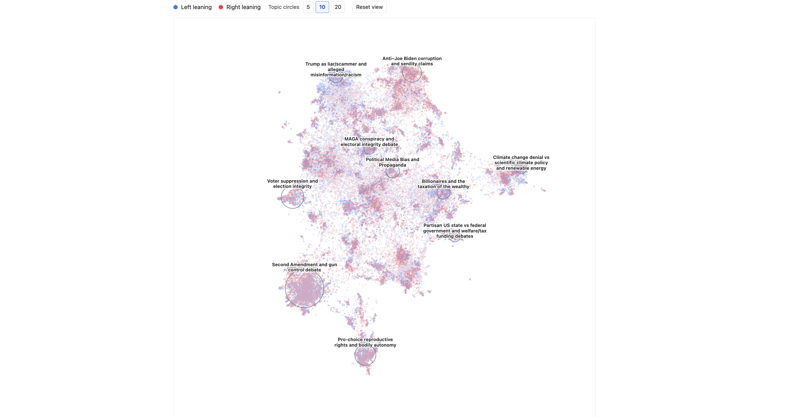
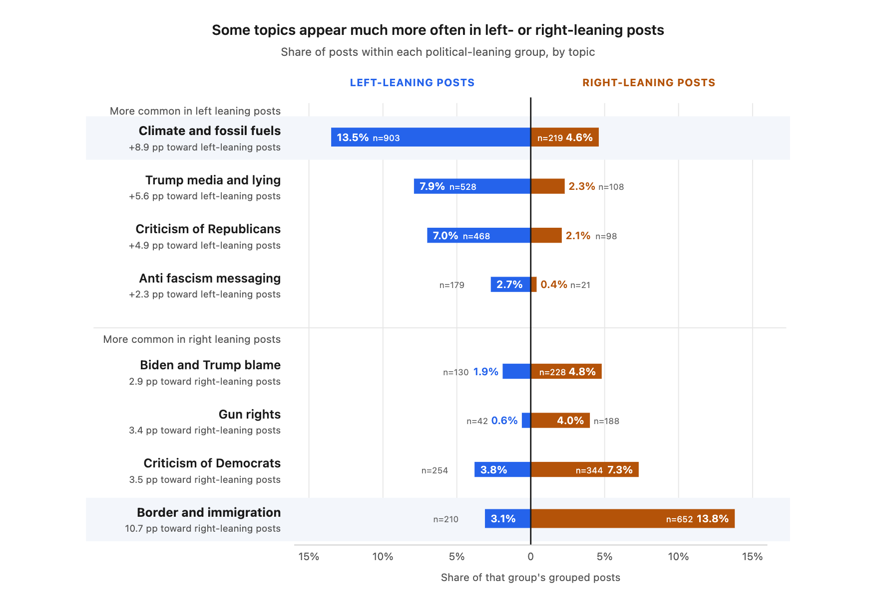
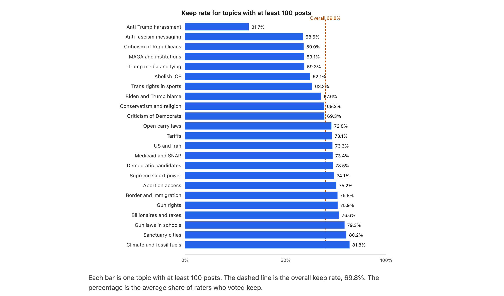
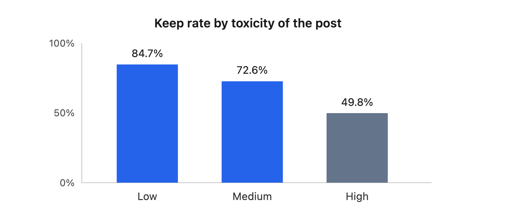
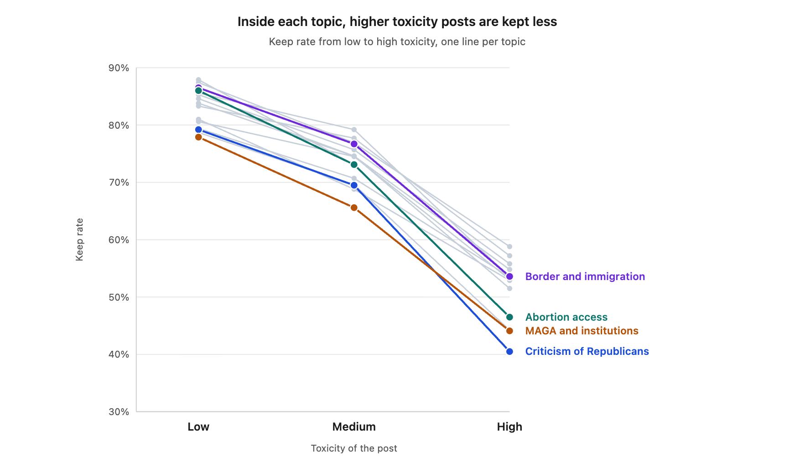

# Study 2 Writeup

## BERTopic on the original posts

We focus the BERTopic analysis on the original posts. The mirroring operation did change some of the topics from the original post. We try to keep the same stance and political intensity, but there are different topics that are triggers for left-leaning and right-leaning groups. We add a follow-up set of analyses later on reviewing how the mirroring approach changed the topics. We also use all keep/remove decisions per post, rather than taking a majority vote. For convention's sake, we measure the overall keep rate, rather than the remove rate.

We see more well-defined BERTopic results from the larger combined Study 2 dataset than we did in the first run given our larger dataset and the increased number of labels per post.

### Overview

Below is a 2-D visualization of the posts clustered by their key topics. An interactive visualization can be found [at this link](https://bertopic-findings.vercel.app/).

### Which topics most commonly appear?

| Topic                    | Posts | Keep rate |
| ------------------------ | ----- | --------- |
| Climate and fossil fuels | 1,122 | 81.8%     |
| Border and immigration   | 862   | 75.8%     |
| MAGA and institutions    | 851   | 59.1%     |
| Abortion access          | 690   | 75.2%     |
| Trump media and lying    | 636   | 59.3%     |
| Criticism of Democrats   | 598   | 69.3%     |
| Criticism of Republicans | 566   | 59.0%     |
| Biden and Trump blame    | 358   | 67.6%     |
| Billionaires and taxes   | 326   | 76.6%     |
| Abolish ICE              | 259   | 62.1%     |

### Which topics are more common in originally left leaning posts, and which in right leaning posts?

Each post and its mirror are shown, so users see both the left-leaning and right-leaning versions. We analyze, based on the original posts, which topics tend to be more common in left-leaning vs. right-leaning posts.

### Which topics are more common at low, medium, and high toxicity?

Low toxicity posts are more often about climate, abortion, and billionaires and taxes. Climate alone is 20.5% of low toxicity grouped posts and 1.6% of high toxicity grouped posts. High toxicity posts are more often attacks on Trump, MAGA and institutions, and criticism of Republicans. Criticism of Trump's media behavior is 13.9% of high toxicity grouped posts and 1.1% of low toxicity grouped posts. Anti Trump harassment is almost entirely in the high toxicity sample (140 of 144 posts).

| Topic                    | Low         | Medium     | High        |
| ------------------------ | ----------- | ---------- | ----------- |
| Climate and fossil fuels | 20.5% (604) | 8.5% (471) | 1.6% (47)   |
| Abortion access          | 8.2% (240)  | 7.0% (389) | 2.1% (61)   |
| Billionaires and taxes   | 4.8% (141)  | 2.1% (117) | 2.4% (68)   |
| Trump media and lying    | 1.1% (33)   | 3.6% (200) | 13.9% (403) |
| Anti Trump harassment    | 0% (0)      | 0.1% (4)   | 4.8% (140)  |
| MAGA and institutions    | 3.3% (98)   | 7.9% (439) | 10.9% (314) |
| Criticism of Republicans | 2.2% (66)   | 4.9% (272) | 7.9% (228)  |

### Do some topics get removed more often?

Among the 23 topics with at least 100 posts, the keep rate runs from 31.7% to 81.8%. The topics most commonly removed include anti-Trump harassment and anti-fascism messaging, while the topics most commonly kept include climate change and sanctuary cities.

### Which topics did Democratic/Republican raters keep, and which did they remove?

Democratic raters kept 69.4% of 52,864 votes. Republican raters kept 70.0% of 48,970 votes. The topics they were most likely to remove, and the topics they were most likely to keep, are almost the same list. Both groups removed anti Trump harassment most often, at about 32%. Both groups kept climate and fossil fuels most often among large topics, at about 82%.

Where the two groups differ, the gap is generally small. Across 26 topics with at least 200 votes from each group, the typical gap is under 2 points. The largest gaps are:

- Open carry laws: Democratic raters kept 75.8% of 289 votes, and Republican raters kept 68.3% of 249 votes.
- Supreme Court: Republican raters kept Supreme Court posts at 77.6% (308 votes), and Democratic raters kept them at 71.5% (330 votes).

#### Keep/remove behavior for Democrats

Here are the topics Democratic raters were most likely to remove, among topics with at least 200 of their votes.

| Topic                    | Keep rate | Votes |
| ------------------------ | --------- | ----- |
| Anti Trump harassment    | 31.5%     | 444   |
| MAGA and institutions    | 57.6%     | 2,308 |
| Criticism of Republicans | 59.1%     | 1,500 |
| Trump media and lying    | 59.4%     | 1,788 |
| Anti fascism messaging   | 59.7%     | 571   |

Here are the topics Democrat raters were most likely to keep:

| Topic                    | Keep rate | Votes |
| ------------------------ | --------- | ----- |
| Gun policy debate        | 82.4%     | 262   |
| Climate and fossil fuels | 82.2%     | 2,872 |
| Gun laws in schools      | 79.5%     | 410   |
| Sanctuary cities         | 78.6%     | 266   |
| Gun rights               | 77.6%     | 602   |

#### Keep/remove behavior for Republicans

Here are the topics Republican raters were most likely to remove, among topics with at least 200 of their votes.

| Topic                    | Keep rate | Votes |
| ------------------------ | --------- | ----- |
| Anti Trump harassment    | 31.9%     | 282   |
| Anti fascism messaging   | 57.7%     | 478   |
| Criticism of Republicans | 59.1%     | 1,377 |
| Trump media and lying    | 59.2%     | 1,473 |
| MAGA and institutions    | 60.8%     | 2,059 |

Here are the topics Republican raters were most likely to keep:

| Topic                    | Keep rate | Votes |
| ------------------------ | --------- | ----- |
| Climate and fossil fuels | 81.5%     | 2,893 |
| Sanctuary cities         | 80.6%     | 289   |
| Gun policy debate        | 80.2%     | 242   |
| Gun laws in schools      | 79.1%     | 369   |
| Mail and elections       | 78.2%     | 257   |

#### Does the stance of the post affect the keep/remove rate?

The stance of the post barely moves the overall keep rate. Left leaning posts are kept at 69.0% (11,386 posts). Right leaning posts are kept at 70.9% (8,377 posts). Inside a topic, the gap is usually a few points. There are a few topics that show a nontrivial gap (see below).

(TODO: Insert visualizations here, once I analyze the 2-d distribution)

#### Does the toxicity of the post affect the keep/remove rate?

Toxicity moves the keep rate much more than stance does. Low toxicity posts are kept at 84.7% (4,892 posts). Medium toxicity posts are kept at 72.6% (9,888 posts). High toxicity posts are kept at 49.8% (4,983 posts).

This trend is generally true across topics as well:

### BERTopic on the original and the mirrored posts

...

## LLM-based feature generation

We then use LLMs to perform feature extraction. We follow a [protocol](https://www.lesswrong.com/posts/WAZWA6FPQvH8okouJ/llm-driven-feature-discovery) developed by Google DeepMind on how to use LLMs for automated feature extraction.

### Methods

1. **Setup**: We assign a keep/remove label to each original + mirror combination based on the modal label.
2. **Use an LLM to mine features**: We pass in batches of 10 pairs of posts that were majority keep and 10 pairs of posts that were majority remove. We then ask an LLM to extract features to distinguish posts that were kept and posts that were removed. We do this across a few categories of features (see below).
3. **Embed the feature records and cluster them**: We embed the features and then use K-Means to generate clusters. We do this instead of recursively asking an LLM to generate a feature category given a list of features since we want a sense of "global similarity" across all features. We choose K-Means since HDBSCAN rendered unstable estimates.
4. **Name each cluster**: We take each cluster and pass them to an LLM to generate a human-readable label and description of each feature cluster. This generates a compiled list of feature groups.
5. **Label every post against the features**: We label each post against each feature group.

### Categories of features

These are the categories that we gave to the LLM when asking them to mine for features in the original posts:

1. **Surface and lexical**: This category is about how the post is written, not what claim it makes. It covers length, slang, heavy punctuation, all-caps emphasis, profanity, hashtags and account mentions, and a high density of proper names. Examples include emphatic typography, profane derogatory insults, colloquial language and insults, and hashtags and account mentions.
2. **Topic and subject matter**: This category is about the subject of the post. Examples include a policy area (guns, climate, immigration, abortion, elections), a specific event or bill, a geographic scope, a historical analogy, and culture-war salience.
3. **Semantic content**: This category is about the kind of claim the post makes. Examples include causal claims, moral language, a factual claim versus speculation, conspiracy, a claim that a group is being persecuted, a policy prescription, and a cost-benefit argument.
4. **Pragmatics and communicative intent**: This category is about what the post is doing to the reader. Examples include sarcasm, mockery, a call to action, persuasion, venting, hedging, and outrage.
5. **Target and directionality**: This category is about who the post attacks or praises, and which political side it points at. Examples include the type of actor criticized or praised, a left/right cue, us-versus-them framing, and elite-versus-populist framing.
6. **Compositional and syntactic structure**: This category is about the shape of the sentences. Examples include if-then conditionals, contrast with "but" or "however," rhetorical questions, parallel repetition, lists, quoted or attributed speech, and direct address in the second person.

### Discovered categories

After mining features, embedding, and naming each resulting feature cluster, here are the feature categories that were discovered:

| Name                                                 | Definition                                                                                                                                                                                                                     |
| ---------------------------------------------------- | ------------------------------------------------------------------------------------------------------------------------------------------------------------------------------------------------------------------------------ |
| Blanket Demonization of Political Opponents          | Sweeping, unqualified portrayals of an opposing political group as inherently stupid, immoral, corrupt, dangerous, subhuman, or traitorous.                                                                                    |
| Brief Slogan-Like Insult Attacks                     | Pairs feature very short, blunt, insult-led statements or fragments that make a denunciatory claim with little or no supporting elaboration.                                                                                   |
| Broad Partisan Out-Group Targeting                   | The pair targets or refers to ordinary members, supporters, voters, or whole populations defined by broad partisan or ideological identities rather than only specific leaders, institutions, or policies.                     |
| Culture-War Policy Issues                            | Posts focus on contested partisan policy debates over guns, immigration and border enforcement, abortion and reproductive rights, policing, or related rights-based social issues.                                             |
| Culture-War Security and Out-Group Threats           | Posts frame immigration, policing, guns, identity issues, religion, or political unrest as existential threats to public safety, national identity, or social order.                                                           |
| Dense Profanity and Vulgar Insults                   | The pair contains frequent or repeated explicit profanity, obscenity, vulgarity, or derogatory insult terms directed at people or groups.                                                                                      |
| Derogatory Labels and Epithets                       | The post pair uses insulting, demeaning, slur-like, or dehumanizing labels to characterize people or political groups.                                                                                                         |
| Direct Second-Person Hostility                       | Posts directly address an individual or group as "you," "you guys," or similar terms while using insults, taunts, accusations, threats, or hostile commands.                                                                   |
| Electoral Strategy and Political Consequences        | Posts that predict, warn about, or explain how parties, politicians, voters, policies, or messaging will affect electoral outcomes, public support, political behavior, or longer-term political consequences.                 |
| Elite-versus-Public Political Framing                | Frames political or economic conflict as powerful elites, institutions, or wealthy interests opposing ordinary people, workers, voters, or taxpayers.                                                                          |
| Escalatory Partisan Hostility                        | Posts use inflammatory us-versus-them rhetoric, contempt, threats, catastrophe claims, or gloating to intensify hostility toward political opponents rather than argue policy.                                                 |
| Explicit Contrastive Framing                         | The pair uses overt contrast markers or alternative constructions—such as “but,” “instead,” “while,” “rather than,” or “not X, but Y”—to set competing claims, actions, or groups against each other.                          |
| Extended Explanatory Argumentation                   | Posts develop a claim through multiple sentences or paragraphs that provide explanation, reasons, supporting details, examples, or justification rather than relying solely on a brief slogan or assertion.                    |
| Hostile Outrage Venting                              | Posts primarily express anger or outrage through hostile denunciation, contempt, ridicule, insults, or profanity toward a target.                                                                                              |
| Limited Profanity Within Argument                    | The pair uses occasional mild profanity, slang, or insults within broader substantive commentary rather than sustained, standalone, or slur-heavy abuse.                                                                       |
| Opponent Claims Framed for Rebuttal                  | The post quotes, paraphrases, or rhetorically challenges an opposing claim, slogan, or premise and then argues against or undermines it.                                                                                       |
| Partisan Collective Blame                            | Attributes broad social, political, economic, or violent harms to an entire political party, ideology, supporter base, or other large partisan out-group rather than to specific individuals or actions.                       |
| Partisan Mockery and Taunting                        | Posts use sarcasm, ridicule, caricature, mock quotations, or taunting rhetorical questions to demean, humiliate, or belittle political opponents.                                                                              |
| Personal Attacks on Political Figures                | Posts directly target identifiable politicians, public officials, or associated supporters with hostile personal insults, character attacks, or derogatory labels.                                                             |
| Policy Advocacy and Tradeoff Arguments               | Posts advocate, oppose, or critique specific government policies or reforms, often explaining their expected consequences, tradeoffs, implementation, or priorities.                                                           |
| Policy Consequence Warnings and Civic Mobilization   | Posts express concern about governmental, institutional, or policy harms by citing consequences for rights, safety, fairness, or material well-being and often urge accountability, reform, voting, or other political action. |
| Political Actor and Institution Criticism            | Posts criticize political parties, leaders, ideological groups, or institutions for their policies, conduct, competence, corruption, or governing choices.                                                                     |
| Political and Institutional Targets                  | The pair primarily targets political parties, elected officials, ideological factions, government bodies, or related elite institutions and organized interests.                                                               |
| Punitive Blanket Condemnation of Political Opponents | Posts broadly demonize political opponents or their supporter groups and advocate or wish for their punishment, exclusion, removal, or other punitive treatment.                                                               |
| Quoted Slogans and Emphatic Framing                  | Posts use quoted or slogan-like political language, sometimes with capitalization, scare quotes, italics, or exclamation marks, to frame, attribute, critique, or comment on claims.                                           |
| Reasoned Political Policy Persuasion                 | Posts seek to persuade through substantive political or policy arguments, using explanations, justifications, evidence, examples, or rebuttals rather than merely asserting a position.                                        |
| Shouting-Style Emphatic Formatting                   | Posts use conspicuous all-caps, repeated exclamation or other emphatic punctuation, slogans, fragments, repetition, or intensifiers to convey a loud, urgent, confrontational tone.                                            |
| Specific Political and Institutional References      | Posts use concrete names of politicians, parties, agencies, institutions, policies, legal concepts, or issue-specific political terminology rather than only broad political language.                                         |
| Substantive Policy and Institutional Claims          | Posts make concrete factual, causal, or interpretive claims about laws, government actions, institutions, political actors, or their social, economic, and rights-related consequences.                                        |
| Sweeping Unsubstantiated Political Accusations       | Posts make broad, categorical allegations that political opponents or leaders are corrupt, criminal, authoritarian, immoral, dishonest, or otherwise malign without qualifying evidence or nuance.                             |

### Results

### Results

... (Insert results here)

## Training a binary classifier

# TODO: when building this, ask the LLM to also return a probability in addition to the label, so that we can use the probabilities in the "## Training a calibrated classifier" section.

We train a variety of binary classifiers to predict the keep/remove task. We experimented with the following approaches:

1. Zero-shot LLM inference
2. Few-shot LLM inference
3. Few-shot prompt-tuned LLM inference
4. Fine-tuning an open-source LLM

We test across the following models:

- Amazon Nova
- Qwen 3.8 27B
- OpenAI GPT-5.6 Terra
- Claude Sonnet 5.5

For fine-tuning, we use `Qwen3.8-27B`. We deploy using `vLLM` and we use a quantized deployment.

## Training a calibrated classifier

One of the shortcomings of building a binary classifier is that it imposes a discrete label on an inherently uncertain task. In a non-trivial amount of tasks, people themselves were uncertain of what the label should have been.

We present several approaches for this:

1. **Few-shot prompt-tuned LLMs that return their own probabilities**: ...
2. **Few-shot prompt-tuned calibrated classifier (Jev)**: ...
3. **An ensemble approach**. (Add more details)
4. **A calibrated classifier**. We can develop a classifier that returns a probability, and we can then set an arbitrary threshold to generate keep/remove decisions. This is inspired by how the Perspective API was built and follows past work on [reinforcement learning with calibration rewards (RLCR)](https://www.alphaxiv.org/abs/2507.16806).

### Prompt-tuning a calibrated classifier

One of the shortcomings of building a binary classifier is that it imposes a discrete label on an inherently uncertain task. In a non-trivial amount of tasks, people themselves were uncertain of what the label should have been. There's not much clarity on this

Jev + DSPy + GEPA.

### Fine-tuning a calibrated classifier

Qwen.

### Calibrated classifier fine-tuning results

...