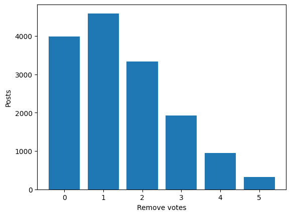
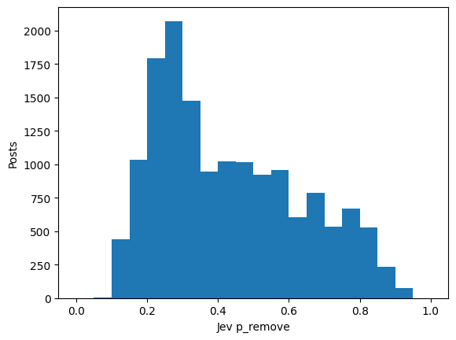
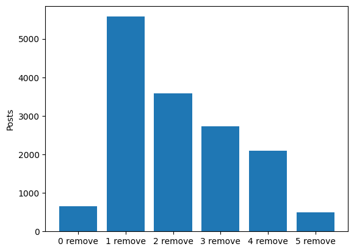
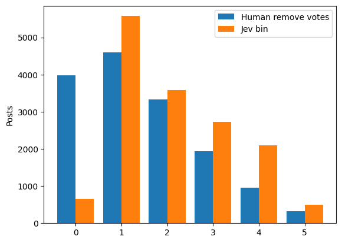
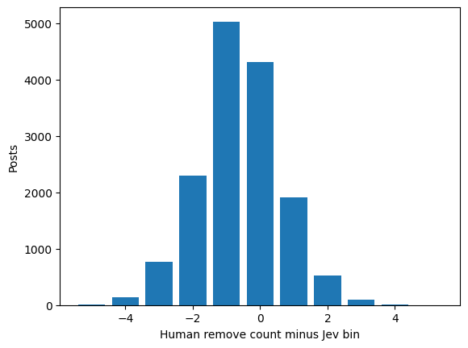

# Jev probabilities and human remove counts

Moderation trials have no skip decision. The human count is the number of remove votes among five labelers.

Jev probabilities are split into 6 equal bins from 0 to 1. Bin 0 matches 0 remove votes, and bin 5 matches 5 remove votes.

The mean difference score, human remove count minus Jev bin, is -0.6147.

## Human remove counts

| n_remove | n_posts |
| --- | --- |
| 0 | 3986 |
| 1 | 4592 |
| 2 | 3332 |
| 3 | 1929 |
| 4 | 950 |
| 5 | 324 |

## Jev probability bins

| jev_bin | n_posts |
| --- | --- |
| 0 | 646 |
| 1 | 5575 |
| 2 | 3578 |
| 3 | 2729 |
| 4 | 2090 |
| 5 | 495 |

## Difference scores

| difference_score | n_posts |
| --- | --- |
| -5 | 6 |
| -4 | 145 |
| -3 | 770 |
| -2 | 2304 |
| -1 | 5033 |
| 0 | 4316 |
| 1 | 1916 |
| 2 | 523 |
| 3 | 91 |
| 4 | 9 |
| 5 | 0 |

## Remove votes by Jev bin

| n_remove | 0 | 1 | 2 | 3 | 4 | 5 |
| --- | --- | --- | --- | --- | --- | --- |
| 0 | 391 | 2271 | 840 | 371 | 107 | 6 |
| 1 | 194 | 2027 | 1244 | 772 | 317 | 38 |
| 2 | 50 | 936 | 908 | 794 | 562 | 82 |
| 3 | 8 | 281 | 425 | 519 | 566 | 130 |
| 4 | 3 | 54 | 132 | 213 | 390 | 158 |
| 5 | 0 | 6 | 29 | 60 | 148 | 81 |

